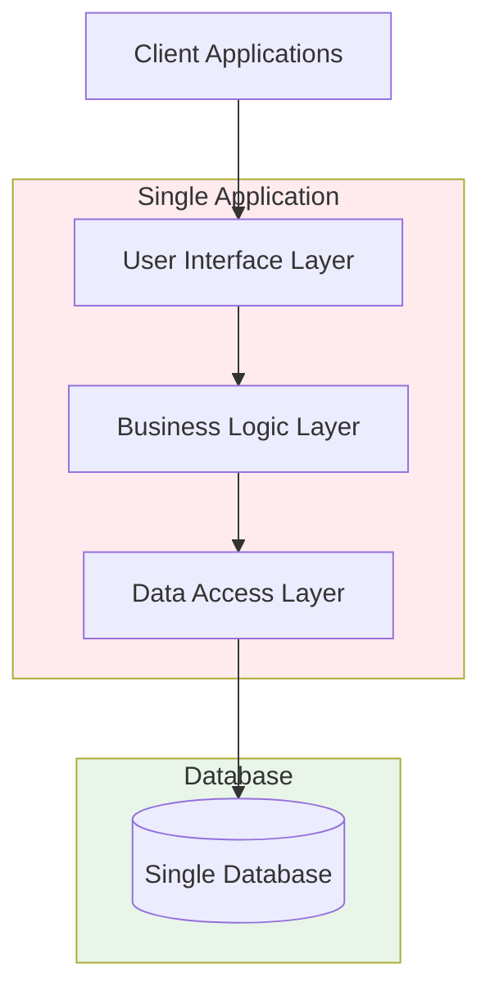
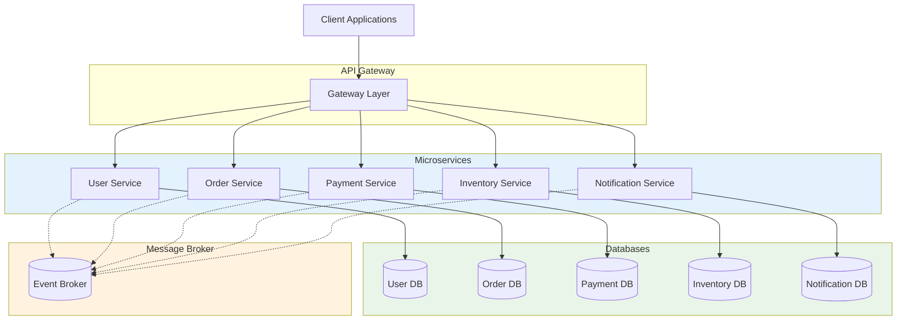
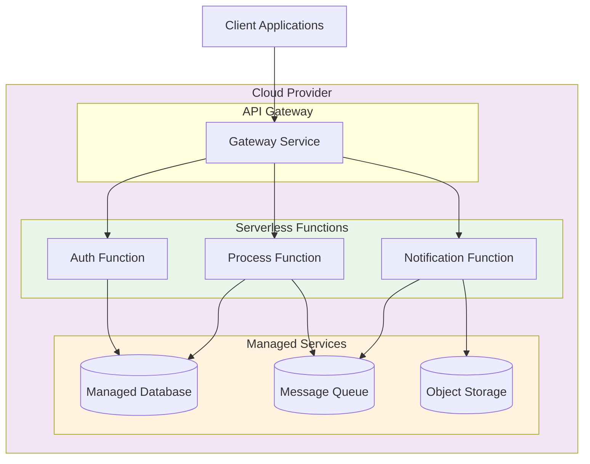
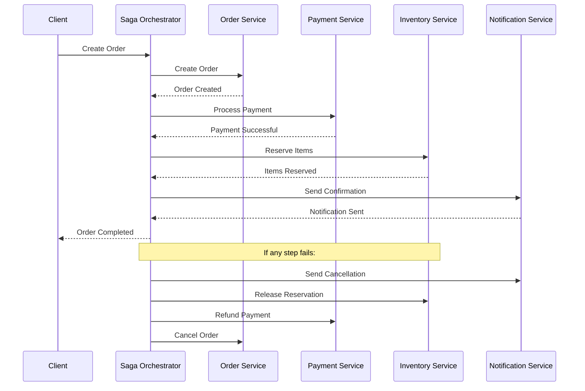
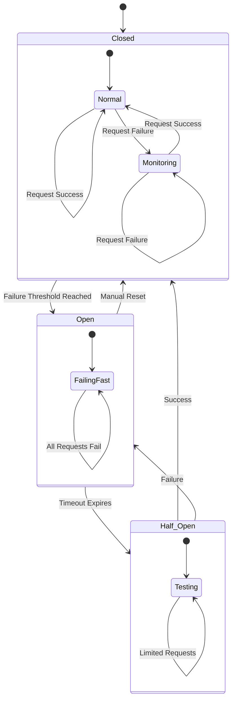
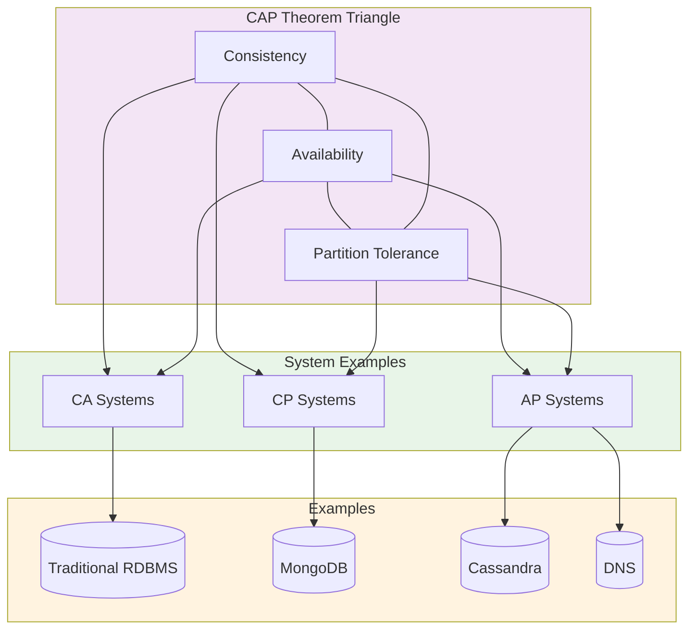
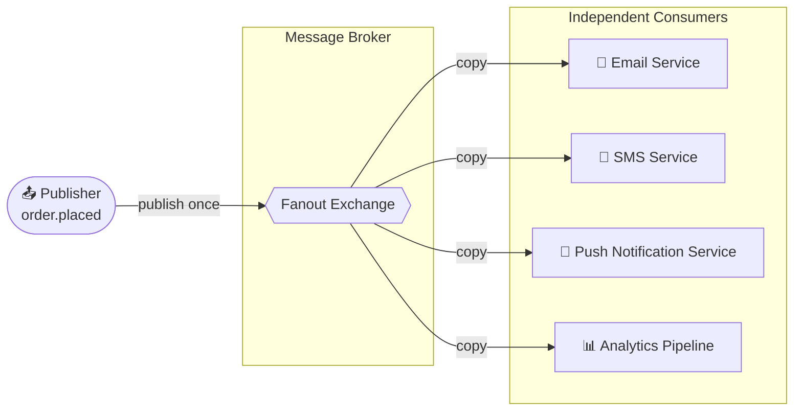
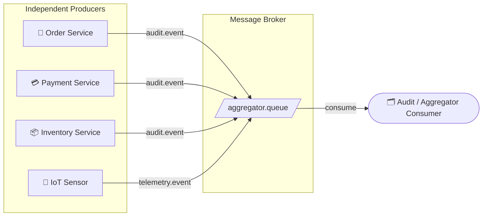

# 🏗️ Architectural Patterns

# Table of Contents
1. [Monolithic Architecture](#monolithic-architecture)
2. [Microservices](#microservices)
3. [Hexagonal Architecture](./hexagonal.md)
4. [Event-Driven Architecture](./event-driven.md)
5. [Serverless](#serverless)
6. [CQRS](#cqrs)
7. [Saga Pattern](#saga-pattern)
8. [Circuit Breaker](#circuit-breaker)
9. [CAP Theorem](#cap-theorem)
10. [Service Discovery](#service-discovery)
11. [API Gateway](#api-gateway)
12. [Data Mesh](./data-mesh.md)
13. [Fan-Out Pattern](#fan-out-pattern)
14. [Fan-In Pattern](#fan-in-pattern)

---

Exploration of system-level architectures:

## Monolithic Architecture
A single-tiered software application in which the user interface and data access code are combined into a single program from a single platform.

### Monolithic Architecture Diagram

## Microservices
An architectural style that structures an application as a collection of services that are highly maintainable and testable, loosely coupled, independently deployable, and organized around business capabilities.

### Microservices Architecture Diagram

## Hexagonal Architecture (Ports and Adapters)
An architectural pattern used in software design. It aims at creating loosely coupled application components that can be easily connected to their software environment by means of ports and adapters.
> [!TIP]
> [Read the full guide on Hexagonal Architecture](./hexagonal.md)

## Event-Driven Architecture
A software architecture paradigm promoting the production, detection, consumption of, and reaction to events.
> [!TIP]
> [Read the full guide on Event-Driven Architecture](./event-driven.md)

## Serverless
A cloud-computing execution model in which the cloud provider allocates machine resources on demand, taking care of the servers on behalf of their customers.

### Serverless Architecture Diagram

## CQRS (Command Query Responsibility Segregation)
An architectural pattern that separates read and update operations for a data store to maximize performance, scalability, and security.
> [!TIP]
> [Read the full guide on CQRS](./cqrs.md)

## Saga Pattern
A failure management pattern that helps establish consistency in distributed applications and coordinates transactions between multiple microservices to maintain data integrity. It uses a sequence of local transactions and compensating transactions for rollback.

### Saga Pattern Diagram

## Circuit Breaker
A design pattern used to detect failures and encapsulate the logic of preventing a failure from constantly recurring.
> [!TIP]
> [Read the full guide on Resilience Patterns (including Circuit Breaker)](../resilience-patterns/README.md)

### Circuit Breaker Pattern Diagram

## CAP Theorem
Also known as Brewer's theorem, it states that a distributed data store can only provide two out of three guarantees:
- **Consistency**: Every read receives the most recent write or an error.
- **Availability**: Every request receives a (non-error) response, without the guarantee that it contains the most recent write.
- **Partition Tolerance**: The system continues to operate despite an arbitrary number of messages being dropped (or delayed) by the network between nodes.

### CAP Theorem Visualization

## Service Discovery
Automatically detecting devices and services on a computer network.
> [!TIP]
> [Read the full guide on Service Discovery](./service-discovery.md)

## API Gateway
A server that acts as the single entry point into a microservices architecture.
> [!TIP]
> [Read the full guide on API Gateway](./api-gateway.md)

## Data Mesh
A decentralized sociotechnical paradigm for data architecture that shifts from a centralized, monolithic data platform to a distributed, domain-oriented approach. It treats data as a product and enables organizations to scale their data initiatives while maintaining agility and ownership.
> [!TIP]
> [Read the full guide on Data Mesh](./data-mesh.md)

## Fan-Out Pattern
A messaging topology where **one publisher sends a single message to an exchange or topic, and that message is delivered to multiple downstream consumers simultaneously** — each receiving their own independent copy. It decouples the producer from the consumers: neither side needs to know about the other.

- **Exchange type used**: Fanout Exchange (RabbitMQ) or a topic with multiple subscriber groups (Kafka).
- **Key property**: Every bound queue/subscriber gets the full message regardless of content.
- **Classic use-cases**:
  - An `order.placed` event triggers Email, SMS, Push Notification, and Analytics pipelines at the same time.
  - A cache invalidation event must reach every application node.
  - A configuration-change event must notify all running service instances.

### Fan-Out Pattern Diagram

### Fan-Out Trade-offs

| Aspect | Detail |
| :--- | :--- |
| ✅ **Decoupling** | Producer is unaware of consumers; adding a new consumer requires zero producer changes. |
| ✅ **Parallelism** | All consumers process the event concurrently, minimizing total latency. |
| ⚠️ **Message amplification** | One message becomes N messages on the broker; monitor queue depth per consumer. |
| ⚠️ **Slow consumers** | A backed-up consumer queue does not affect other queues, but its own processing delay accumulates. |
| ❌ **No selective routing** | Every subscriber gets every message. Use a **Topic Exchange** with routing keys if filtering is needed. |

---

## Fan-In Pattern
A messaging topology where **multiple independent producers all publish to the same destination** (queue, topic, or channel) and **a single consumer aggregates and processes all of them**. It is the logical complement of Fan-Out.

- **Exchange type used**: Direct Exchange or a single shared topic (Kafka).
- **Key property**: All messages converge on one processing point, regardless of their source.
- **Classic use-cases**:
  - Multiple microservices (Orders, Payments, Inventory) all emit audit events that a single Audit Service consumes.
  - Multiple IoT sensors publish telemetry to one stream processor.
  - Several upstream services feed results into one aggregation / reporting pipeline.

### Fan-In Pattern Diagram

### Fan-In Trade-offs

| Aspect | Detail |
| :--- | :--- |
| ✅ **Centralised processing** | One place to apply aggregation, deduplication, or enrichment logic. |
| ✅ **Producer independence** | Producers are fully decoupled from each other and from the consumer. |
| ⚠️ **Single consumer bottleneck** | If the consumer is slow, the queue grows. Scale with competing consumers in the same group. |
| ⚠️ **Message ordering** | Messages from different producers are interleaved; ordering guarantees require partition keys (Kafka) or sequencing logic in the consumer. |
| ❌ **Source attribution** | The consumer must inspect message metadata/headers to determine which producer sent a given message. |
