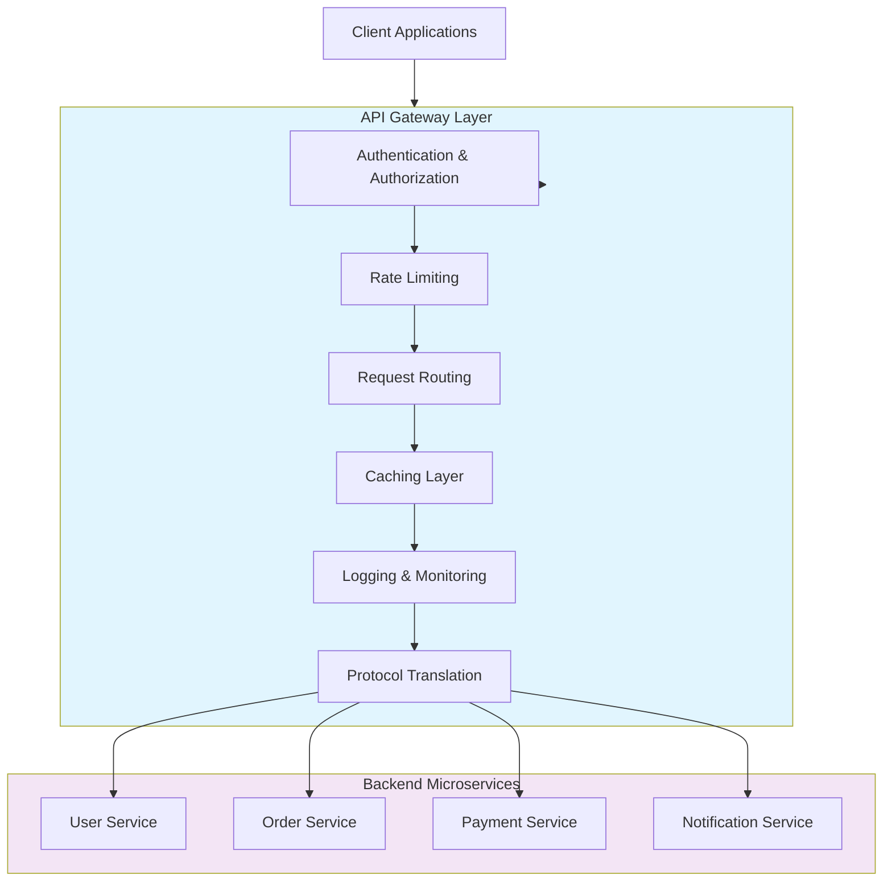

# 🚪 API Gateway

An API Gateway is a server that is the single entry point into the system. It is similar to the Facade pattern from object-oriented design, but for distributed systems.

---

## 🗺️ Table of Contents
1. [Core Responsibilities](#1-core-responsibilities)
2. [Benefits](#2-benefits)
3. [Drawbacks](#3-drawbacks)
4. [Popular Tools](#4-popular-tools)

---

## 1. Core Responsibilities

- **Routing**: Mapping external requests to internal microservices.
- **Aggregation**: Combining results from multiple services into a single response (Fan-out/Fan-in).
- **Authentication & Authorization**: Centralized security checks.
- **Rate Limiting & Throttling**: Protecting backend services from overload.
- **Protocol Translation**: Converting between different protocols (e.g., HTTP to gRPC).
- **Caching**: Storing frequently accessed data to reduce backend load.
- **Logging & Monitoring**: Centralized telemetry.

---

## 2. Benefits
- **Insulates Clients**: Clients don't need to know about all the internal microservices.
- **Simplifies Client Code**: Reduces the number of round-trips for the client.
- **Security**: Provides a single point of attack to secure and monitor.
- **Cross-Cutting Concerns**: Handles logic that would otherwise be duplicated in every service.

---

## 3. Drawbacks
- **Single Point of Failure**: If the gateway goes down, the entire system is inaccessible.
- **Bottleneck**: Can become a performance bottleneck if not scaled properly.
- **Complexity**: Adds another moving part to the infrastructure that needs to be managed.

---

## 4. Popular Tools
- **Cloud-Native**: AWS API Gateway, Azure API Management, Google Cloud Endpoints.
- **Self-Hosted**: Kong, Tyk, KrakenD.
- **Framework-specific**: Spring Cloud Gateway, Ocelot (.NET).

---

## 📊 API Gateway Architecture Diagram

---
[⬅️ Back to Architectural Patterns](./README.md)
