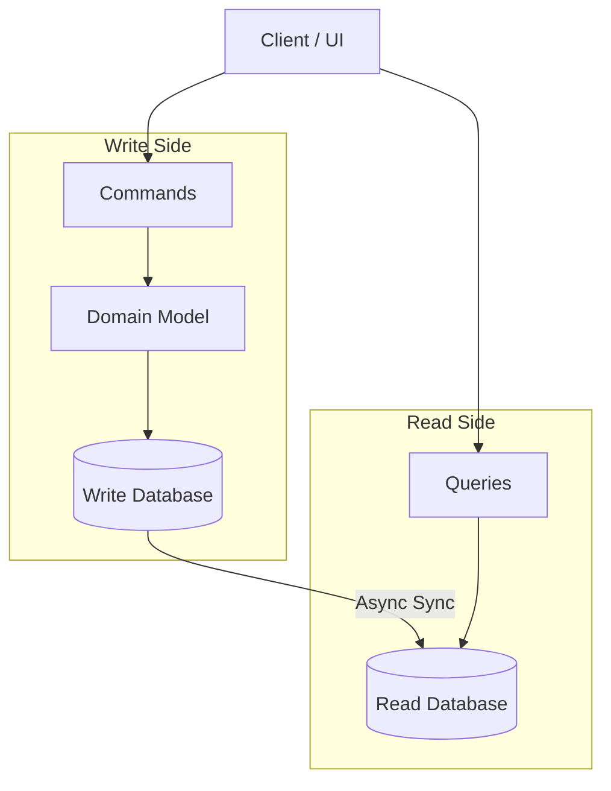

# 🔄 CQRS (Command Query Responsibility Segregation)

CQRS is an architectural pattern that separates the models for reading and writing data. It was first introduced by Greg Young and is based on the Command-Query Separation (CQS) principle devised by Bertrand Meyer.

---

## 🗺️ Table of Contents
1. [The Basic Principle](#1-the-basic-principle)
2. [Why Use CQRS?](#2-why-use-cqrs)
3. [Synchronization Strategies](#3-synchronization-strategies)
4. [Synergy with Event Sourcing](#4-synergy-with-event-sourcing)
5. [Pros and Cons](#5-pros-and-cons)

---

## 1. The Basic Principle
In traditional architectures, the same data model is used to query and update a database. CQRS splits this into two:

- **Commands**: Operations that change the state of the system (Write). They should be task-based (e.g., "Book Hotel Room") rather than data-centric ("Update Room Status").
- **Queries**: Operations that return data but do not change state (Read). They should return Data Transfer Objects (DTOs) optimized for the UI.

---

## 2. Why Use CQRS?
- **Independent Scaling**: Read and write workloads often have very different performance characteristics. CQRS allows you to scale them independently.
- **Optimized Data Schemas**: The read side can use a schema that is optimized for queries (e.g., a denormalized view), while the write side uses a schema optimized for complex business logic (e.g., normalized).
- **Security**: It's easier to ensure that only the right entities can perform state changes.

---

## 3. Synchronization Strategies

### Synchronous (Tight Coupling)
The command side updates the read side immediately within the same transaction or immediately after.
- **Pros**: Strong consistency.
- **Cons**: Performance hit on the write side.

### Asynchronous (Loose Coupling)
The command side publishes an event (e.g., to Kafka) when state changes. A separate process consumes the event and updates the read model.
- **Pros**: High performance, highly decoupled.
- **Cons**: **Eventual Consistency** (there's a delay before the read side reflects the change).

---

## 4. Synergy with Event Sourcing
While not required, CQRS is often used with **Event Sourcing**.
- The write model is an append-only log of events.
- The read model is a "projections" of those events into a queryable format (e.g., a SQL table or an Elasticsearch index).

> [!TIP]
> [Read the full guide on Event Sourcing Patterns](../infrastructure-ops/event-sourcing.md)

---

## 5. Pros and Cons

| Pros | Cons |
| :--- | :--- |
| Highly scalable | Increased system complexity |
| Optimized for performance | Harder to maintain (code duplication) |
| Simpler domain models | Eventual consistency challenges |
| Flexible data models | Learning curve for the team |

---

## 📊 CQRS Architecture Diagram

---
[⬅️ Back to Architectural Patterns](./README.md)
