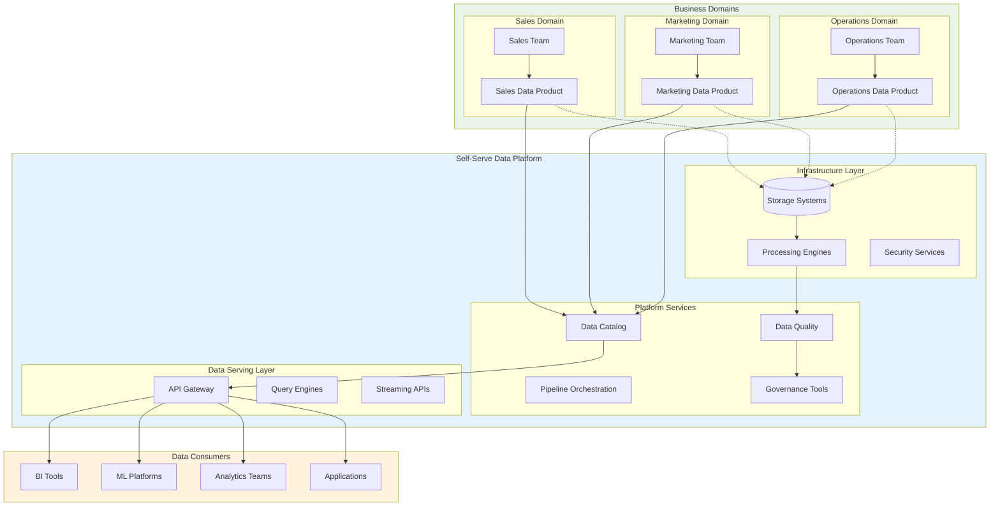
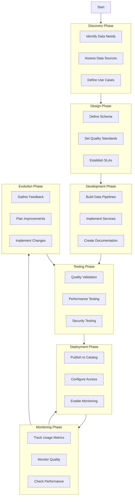

# 🕸️ Data Mesh

Data Mesh is a decentralized sociotechnical paradigm for data architecture that shifts from a centralized, monolithic data platform to a distributed, domain-oriented approach. It treats data as a product and enables organizations to scale their data initiatives while maintaining agility and ownership.

---

## 🗺️ Table of Contents
1. [Core Principles](#1-core-principles)
2. [Architectural Layers](#2-architectural-layers)
3. [Data Products](#3-data-products)
4. [Self-Serve Data Platform](#4-self-serve-data-platform)
5. [Comparison with Traditional Architecture](#5-comparison-with-traditional-architecture)
6. [Implementation Patterns](#6-implementation-patterns)
7. [Best Practices](#7-best-practices)

---

## 1. Core Principles

### **Domain-Oriented Ownership**
Data is owned by the business domains that produce and understand it best. Each domain is responsible for the quality, availability, and governance of its data products.

### **Data as a Product**
Data is treated as a first-class product with clear ownership, discoverability, addressability, trustworthiness, security, and interoperability features.

### **Self-Serve Data Platform**
A centralized platform provides domain teams with the tools and infrastructure to create, manage, and serve their data products without requiring central IT intervention.

### **Federated Computational Governance**
A federated governance model ensures global standards while allowing domain-level autonomy. It automates policy enforcement and provides a framework for interoperability.

---

## 2. Architectural Layers

### **Data Product Layer**
- **Data Products**: Domain-specific data offerings with defined schemas, quality metrics, and service-level agreements
- **Product Owners**: Domain teams responsible for data product lifecycle
- **Data Contracts**: Formal agreements defining data quality, format, and usage terms

### **Infrastructure Layer**
- **Storage**: Distributed storage systems (data lakes, warehouses, lakehouses)
- **Processing**: Stream and batch processing engines
- **Networking**: Service mesh and data transfer protocols
- **Security**: Authentication, authorization, and encryption services

### **Platform Services Layer**
- **Data Catalog**: Metadata management and discovery
- **Data Pipeline Orchestration**: Workflow management and scheduling
- **Quality Monitoring**: Data quality checks and alerting
- **Governance Tools**: Policy enforcement and compliance monitoring

### **Governance Layer**
- **Global Policies**: Organization-wide data standards and regulations
- **Domain Policies**: Domain-specific rules and constraints
- **Compliance Monitoring**: Automated policy enforcement and reporting
- **Audit Trail**: Complete lineage and change tracking

---

## 3. Data Products

### **Characteristics of Data Products**
- **Discoverable**: Easy to find through catalogs and search
- **Addressable**: Unique identifiers and stable endpoints
- **Trustworthy**: Clear quality metrics and SLAs
- **Secure**: Proper access controls and encryption
- **Interoperable**: Standard formats and interfaces

### **Types of Data Products**
- **Reference Data**: Master data and reference datasets
- **Event Streams**: Real-time event feeds and streams
- **Aggregated Data**: Summarized and computed datasets
- **ML Features**: Feature sets for machine learning
- **Analytical Data**: Business intelligence and reporting datasets

### **Data Product Lifecycle**
1. **Discovery**: Identify data needs and sources
2. **Design**: Define schema, quality standards, and SLAs
3. **Development**: Build data pipelines and services
4. **Testing**: Validate quality, performance, and security
5. **Deployment**: Publish to data catalog and make available
6. **Monitoring**: Track usage, quality, and performance
7. **Evolution**: Update and improve based on feedback

---

## 4. Self-Serve Data Platform

### **Platform Capabilities**

#### **Data Ingestion**
- **Batch Ingestion**: Scheduled data imports from various sources
- **Streaming Ingestion**: Real-time data capture from event streams
- **Change Data Capture**: Database change tracking and replication
- **API Integration**: REST/GraphQL data source connectors

#### **Data Processing**
- **ETL/ELT Tools**: Extract, transform, load capabilities
- **Stream Processing**: Real-time data transformation and enrichment
- **Batch Processing**: Large-scale data computation
- **Data Quality**: Validation, cleansing, and enrichment

#### **Data Storage**
- **Data Lake**: Scalable object storage for raw and processed data
- **Data Warehouse**: Optimized analytical storage
- **Lakehouse**: Hybrid approach combining lake and warehouse features
- **Feature Store**: Centralized feature repository for ML

#### **Data Serving**
- **API Gateway**: Unified access point for data products
- **Query Engines**: SQL and NoSQL query capabilities
- **Streaming APIs**: Real-time data access interfaces
- **Caching Layer**: Performance optimization for frequently accessed data

---

## 5. Comparison with Traditional Architecture

| Aspect | Traditional Data Architecture | Data Mesh |
|--------|------------------------------|-----------|
| **Ownership** | Centralized data team | Domain-oriented ownership |
| **Scalability** | Limited by central team capacity | Scales with domain teams |
| **Agility** | Slow, centralized decision making | Fast, domain-driven innovation |
| **Data Quality** | Centralized quality team | Domain-specific quality ownership |
| **Technology** | Monolithic platform | Pluggable, best-of-breed tools |
| **Governance** | Centralized control | Federated governance |
| **Innovation** | Limited by central team constraints | Empowered domain innovation |

---

## 6. Implementation Patterns

### **Organizational Patterns**

#### **Domain Team Structure**
- **Data Product Owners**: Business stakeholders defining requirements
- **Data Engineers**: Building and maintaining data products
- **Data Stewards**: Ensuring quality and compliance
- **Platform Engineers**: Supporting the self-serve platform

#### **Cross-Domain Collaboration**
- **Data Communities**: Practice groups sharing knowledge
- **Guilds**: Cross-functional teams addressing specific challenges
- **Chapters**: Professional development groups
- **Tribes**: Aligned domain teams

### **Technical Patterns**

#### **Data Product Patterns**
- **Source-Aligned Products**: Close to operational systems
- **Aggregated Products**: Combined from multiple sources
- **Consumer-Oriented Products**: Tailored for specific use cases
- **Analytical Products**: Optimized for BI and analytics

#### **Integration Patterns**
- **Event-Driven Integration**: Real-time data synchronization
- **Batch Integration**: Scheduled data transfers
- **API-Based Integration**: Request-response data access
- **Federation**: Virtual data access across domains

---

## 7. Best Practices

### **Organizational Best Practices**
- **Start Small**: Begin with pilot domains and expand gradually
- **Executive Sponsorship**: Ensure leadership support and resources
- **Change Management**: Plan for organizational transformation
- **Training and Enablement**: Invest in team capabilities
- **Metrics and KPIs**: Measure success and identify improvement areas

### **Technical Best Practices**
- **Standardization**: Define common formats and interfaces
- **Automation**: Automate repetitive tasks and governance
- **Monitoring**: Implement comprehensive observability
- **Security**: Design security from the ground up
- **Documentation**: Maintain clear, accessible documentation

### **Data Product Best Practices**
- **Customer-Centric**: Design for data consumers
- **Quality First**: Prioritize data quality and reliability
- **Version Control**: Manage changes and maintain compatibility
- **Performance**: Optimize for query performance and cost
- **Feedback Loops**: Continuously improve based on usage

---

## 📊 Data Mesh Architecture Diagram

---

## 📊 Data Product Lifecycle Diagram

---

## 🚀 Getting Started

### **Phase 1: Foundation**
- Identify pilot domains with clear data needs
- Establish basic platform capabilities
- Define initial governance framework
- Train domain teams

### **Phase 2: Expansion**
- Onboard additional domains
- Enhance platform services
- Refine governance policies
- Scale best practices

### **Phase 3: Optimization**
- Optimize performance and costs
- Advanced analytics and ML capabilities
- Mature governance automation
- Continuous improvement

---

## 📚 Further Reading

- [Data Mesh: Principles and Logical Architecture](https://martinfowler.com/articles/data-mesh-principles.html) by Zhamak Dehghani
- [The Data Mesh Architecture](https://www.datamesh-architecture.com/) - Comprehensive guide and patterns
- [Data Mesh in Practice](https://www.oreilly.com/library/view/data-mesh-in/9781098101812/) - Implementation patterns and case studies

---

[⬅️ Back to Architectural Patterns](./README.md)
