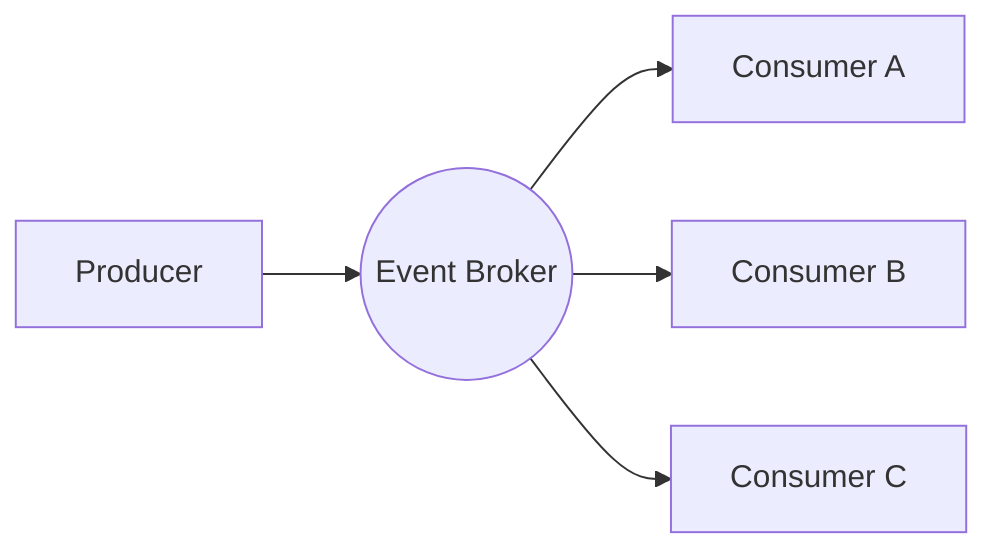

# ⚡ Event-Driven Architecture

A software architecture paradigm promoting the production, detection, consumption of, and reaction to events.

---

## Key Concepts
- **Event**: A significant change in state (e.g., "OrderPlaced", "PaymentProcessed").
- **Producer**: The component that detects and publishes the event.
- **Consumer**: The component that reacts to the event.
- **Event Channel (Broker)**: The infrastructure that carries events from producers to consumers (e.g., Kafka, RabbitMQ).

## Communication Models
1. **Pub/Sub (Publish/Subscribe)**: Producers publish events to a topic, and all subscribers to that topic receive a copy.
2. **Event Streaming**: Events are appended to a log. Consumers can read from any point in the stream and replay events.

## Event Sourcing
Instead of storing just the current state of data in a domain, use an append-only store to record the full series of actions taken on that data. The current state can be reconstructed by replaying the events.
> [!TIP]
> [Read the full guide on Event Sourcing Patterns](../infrastructure-ops/event-sourcing.md)

## Pros and Cons
| Pros | Cons |
| :--- | :--- |
| Extreme scalability | Increased complexity |
| Loose coupling | Eventual consistency |
| High responsiveness | Debugging/Tracing is harder |
| Better fault tolerance | Potential for circular dependencies |

## Flow Diagram

---
[⬅️ Back to Architectural Patterns](./README.md)
