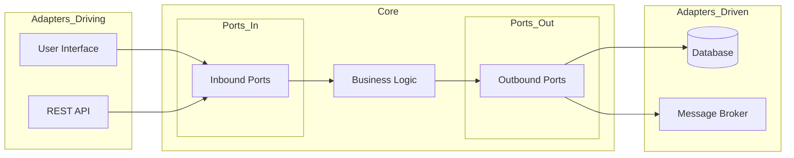

# ⬢ Hexagonal Architecture (Ports and Adapters)

An architectural pattern used in software design. It aims at creating loosely coupled application components that can be easily connected to their software environment by means of ports and adapters.

---

## Core Concepts
- **The Core (Inside)**: Contains the business logic and domain entities. It is unaware of the outside world (UI, DB, APIs).
- **Ports (Interfaces)**: The boundaries of the application. They define *how* external components can interact with the core or *how* the core interacts with the outside.
- **Adapters (Outside)**: Concrete implementations that connect external systems to the ports.

## Driving vs Driven
1. **Driving (Primary) Adapters**: Initiate the interaction with the core (e.g., REST Controllers, CLI, UI). They "drive" the application.
2. **Driven (Secondary) Adapters**: Are called by the core to perform actions (e.g., Database Repositories, Email Services, External APIs). They are "driven" by the application.

## Pros and Cons
| Pros | Cons |
| :--- | :--- |
| Framework Independence | Initial setup is complex |
| High Testability (via Mocks/Stubs) | Increased number of files |
| Easy to swap technologies | More abstractions to manage |
| Focus on Business Value | Overhead for simple applications |

## Architecture Diagram

---
[⬅️ Back to Architectural Patterns](./README.md)
