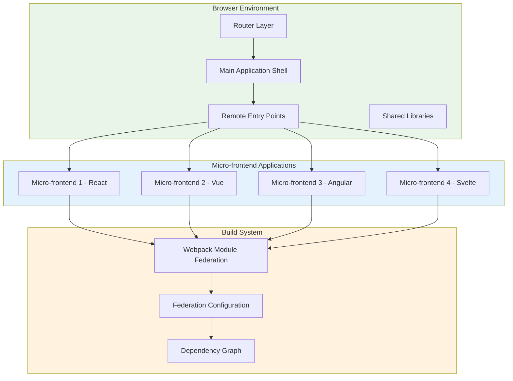
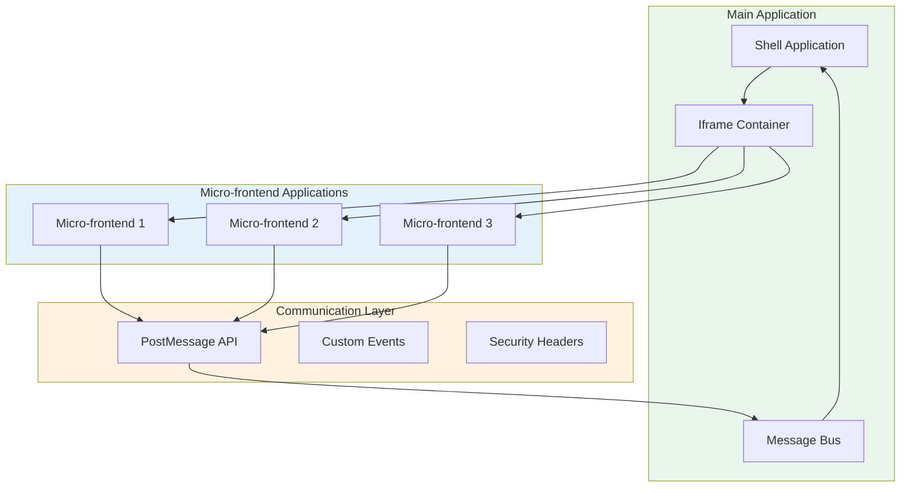
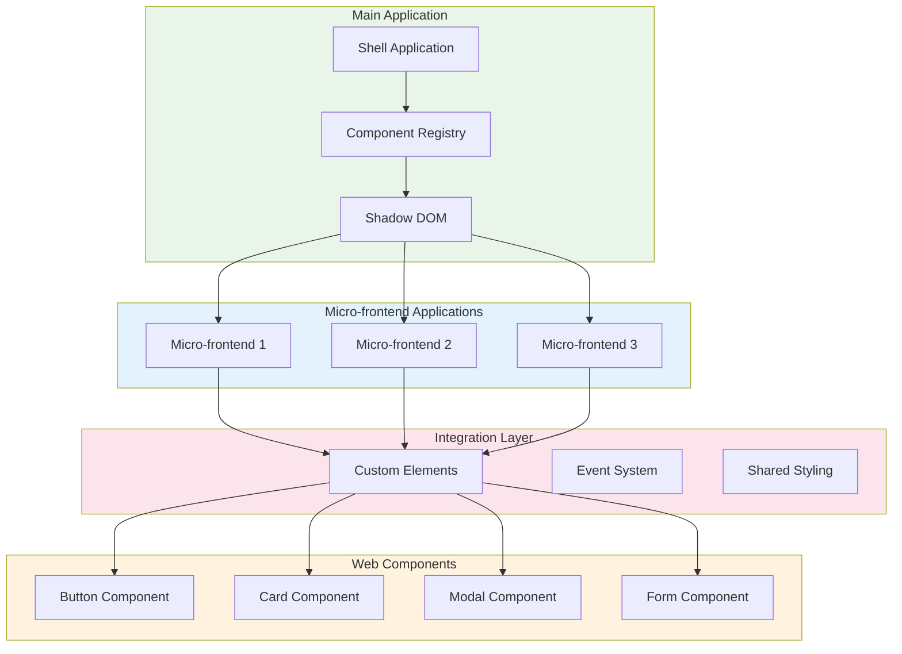

# 🧩 Micro-frontends

A comprehensive guide to micro-frontend architecture patterns, covering Module Federation, Iframe, and Web Components integration strategies for building scalable and maintainable web applications.

---

## 🗺️ Table of Contents
1. [Micro-frontend Overview](#1-micro-frontend-overview)
2. [Module Federation](#2-module-federation)
3. [Iframe Integration](#3-iframe-integration)
4. [Web Components](#4-web-components)
5. [Strategy Comparison](#5-strategy-comparison)
6. [Implementation Patterns](#6-implementation-patterns)
7. [Best Practices](#7-best-practices)

---

## 1. Micro-frontend Overview

### **What are Micro-frontends?**
Micro-frontends is an architectural style where independently deliverable frontend applications are composed into a greater whole. Each micro-frontend is owned by a different team and can be developed, tested, and deployed independently.

### **Key Benefits**
- **Independent Development**: Teams work autonomously
- **Technology Flexibility**: Different frameworks per micro-frontend
- **Scalable Architecture**: Individual deployment and scaling
- **Fault Isolation**: Issues in one micro-frontend don't affect others
- **Incremental Upgrades**: Update parts without full redeployment

### **Common Challenges**
- **Consistency**: Maintaining consistent UX across micro-frontends
- **Performance**: Managing multiple bundles and dependencies
- **Integration**: Complex communication between micro-frontends
- **Routing**: Managing navigation and deep linking
- **State Management**: Sharing state across boundaries

---

## 2. Module Federation

### **Architecture Overview**


### **Module Federation Implementation**

#### **Webpack Module Federation Configuration**
```javascript
// webpack.config.js - Shell Application
const ModuleFederationPlugin = require('@module-federation/webpack').ModuleFederationPlugin;
const { dependencies } = require('./package.json').dependencies;

module.exports = {
  mode: 'development',
  devServer: {
    port: 3000,
  },
  plugins: [
    new ModuleFederationPlugin({
      name: 'shell',
      filename: 'remoteEntry.js',
      exposes: {
        './src/App': './App',
      },
      remotes: {
        userDashboard: 'user_dashboard@http://localhost:3001/remoteEntry.js',
        productCatalog: 'product_catalog@http://localhost:3002/remoteEntry.js',
        adminPanel: 'admin_panel@http://localhost:3003/remoteEntry.js',
        analytics: 'analytics@http://localhost:3004/remoteEntry.js',
      },
      shared: {
        ...dependencies,
        react: { singleton: true, requiredVersion: '^17.0.0' },
        'react-dom': { singleton: true, requiredVersion: '^17.0.0' },
        'react-router-dom': { singleton: true },
      },
    }),
  ],
};
```

#### **Micro-frontend Configuration**
```javascript
// webpack.config.js - User Dashboard
const ModuleFederationPlugin = require('@module-federation/webpack').ModuleFederationPlugin;

module.exports = {
  mode: 'development',
  devServer: {
    port: 3001,
  },
  plugins: [
    new ModuleFederationPlugin({
      name: 'user_dashboard',
      filename: 'remoteEntry.js',
      exposes: {
        './src/Dashboard': './Dashboard',
        './src/UserProfile': './UserProfile',
      },
      shared: {
        react: { singleton: true, requiredVersion: '^17.0.0' },
        'react-dom': { singleton: true, requiredVersion: '^17.0.0' },
        'styled-components': { singleton: true },
      },
    }),
  ],
};
```

#### **Shell Application Integration**
```jsx
// Shell App Component
import React, { Suspense } from 'react';
import { Routes, Route } from 'react-router-dom';

const UserDashboard = React.lazy(() => import('user_dashboard/Dashboard'));
const ProductCatalog = React.lazy(() => import('product_catalog/Catalog'));
const AdminPanel = React.lazy(() => import('admin_panel/Panel'));
const Analytics = React.lazy(() => import('analytics/Dashboard'));

function App() {
  return (
    <div>
      <header>
        <nav>
          <Link to="/dashboard">Dashboard</Link>
          <Link to="/products">Products</Link>
          <Link to="/admin">Admin</Link>
          <Link to="/analytics">Analytics</Link>
        </nav>
      </header>
      
      <main>
        <Suspense fallback={<div>Loading...</div>}>
          <Routes>
            <Route path="/dashboard" element={<UserDashboard />} />
            <Route path="/products" element={<ProductCatalog />} />
            <Route path="/admin" element={<AdminPanel />} />
            <Route path="/analytics" element={<Analytics />} />
          </Routes>
        </Suspense>
      </main>
    </div>
  );
}
```

---

## 3. Iframe Integration

### **Architecture Overview**


### **Iframe Implementation**

#### **Shell Application Setup**
```jsx
// Shell Application Component
import React, { useState, useEffect, useRef } from 'react';

const IframeContainer = ({ url, title, onMessage }) => {
  const iframeRef = useRef(null);
  const [loading, setLoading] = useState(true);

  useEffect(() => {
    const handleMessage = (event) => {
      // Security: Only accept messages from allowed origins
      if (event.origin !== new URL(url).origin) {
        return;
      }
      
      onMessage(event.data);
      setLoading(false);
    };

    window.addEventListener('message', handleMessage);
    
    return () => {
      window.removeEventListener('message', handleMessage);
    };
  }, [url, onMessage]);

  const sendMessage = (message) => {
    if (iframeRef.current && iframeRef.current.contentWindow) {
      iframeRef.current.contentWindow.postMessage(message, new URL(url).origin);
    }
  };

  return (
    <div className="iframe-container">
      <h2>{title}</h2>
      {loading && <div>Loading...</div>}
      <iframe
        ref={iframeRef}
        src={url}
        style={{ width: '100%', height: '100%', border: 'none' }}
        onLoad={() => setLoading(false)}
        sandbox="allow-scripts allow-same-origin allow-forms"
      />
    </div>
  );
};

// Usage in main app
function App() {
  const [message, setMessage] = useState('');

  return (
    <div>
      <IframeContainer
        url="http://localhost:3001"
        title="User Dashboard"
        onMessage={setMessage}
      />
      <div>Received: {message}</div>
    </div>
  );
}
```

#### **Micro-frontend Communication**
```javascript
// Micro-frontend - Post Message Handler
class IframeCommunication {
  constructor() {
    this.targetOrigin = 'http://localhost:3000'; // Shell app origin
  }

  sendMessage(type, data) {
    const message = {
      type,
      data,
      timestamp: Date.now()
    };
    
    window.parent.postMessage(message, this.targetOrigin);
  }

  setupMessageListener() {
    window.addEventListener('message', (event) => {
      // Security: Verify message origin
      if (event.origin !== this.targetOrigin) {
        return;
      }
      
      this.handleMessage(event.data);
    });
  }

  handleMessage(message) {
    switch (message.type) {
      case 'NAVIGATE':
        this.handleNavigation(message.data);
        break;
      case 'UPDATE_USER':
        this.handleUserUpdate(message.data);
        break;
      case 'GET_DATA':
        this.handleDataRequest(message.data);
        break;
      default:
        console.warn('Unknown message type:', message.type);
    }
  }

  handleNavigation(route) {
    // Handle navigation within micro-frontend
    window.history.pushState({}, '', route);
  }

  handleUserUpdate(userData) {
    // Update local state
    this.updateUserData(userData);
  }

  handleDataRequest(request) {
    // Fetch and return requested data
    this.fetchData(request.id).then(data => {
      this.sendMessage('DATA_RESPONSE', { requestId: request.id, data });
    });
  }
}

// Initialize communication
const communication = new IframeCommunication();
communication.setupMessageListener();
```

---

## 4. Web Components

### **Architecture Overview**


### **Web Components Implementation**

#### **Custom Component Definition**
```javascript
// Custom Button Component
class CustomButton extends HTMLElement {
  constructor() {
    super();
    this.attachShadow({ mode: 'open' });
  }

  connectedCallback() {
    this.render();
  }

  render() {
    const button = document.createElement('button');
    button.textContent = this.getAttribute('label') || 'Click me';
    button.style.cssText = `
      background-color: ${this.getAttribute('color') || '#007bff'};
      color: white;
      border: none;
      padding: 8px 16px;
      border-radius: 4px;
      cursor: pointer;
      font-family: inherit;
    `;

    button.addEventListener('click', () => {
      this.dispatchEvent(new CustomEvent('button-click', {
        detail: { value: this.getAttribute('value') }
      }));
    });

    this.shadowRoot.appendChild(button);
  }

  static get observedAttributes() {
    return ['label', 'color', 'value'];
  }

  attributeChangedCallback(name, oldValue, newValue) {
    if (name === 'label') {
      this.shadowRoot.querySelector('button').textContent = newValue;
    }
  }
}

// Register the custom element
customElements.define('custom-button', CustomButton);
```

#### **Micro-frontend Component Usage**
```jsx
// Micro-frontend React Component
import React, { useEffect, useRef } from 'react';

const CustomButtonWrapper = ({ label, color, value, onClick }) => {
  const buttonRef = useRef(null);

  useEffect(() => {
    const button = buttonRef.current;
    if (button) {
      button.addEventListener('button-click', (event) => {
        onClick(event.detail.value);
      });
    }
  }, [onClick]);

  return (
    <custom-button
      ref={buttonRef}
      label={label}
      color={color}
      value={value}
    />
  );
};

// Usage in micro-frontend
function UserDashboard() {
  const handleButtonClick = (value) => {
    console.log('Button clicked with value:', value);
  };

  return (
    <div>
      <h2>User Dashboard</h2>
      <CustomButtonWrapper
        label="Save User"
        color="#28a745"
        value="save"
        onClick={handleButtonClick}
      />
      <CustomButtonWrapper
        label="Cancel"
        color="#dc3545"
        value="cancel"
        onClick={handleButtonClick}
      />
    </div>
  );
}
```

#### **Shell Application Integration**
```javascript
// Shell Application - Component Loader
class ComponentLoader {
  constructor() {
    this.loadedComponents = new Map();
  }

  async loadComponent(componentName, version = 'latest') {
    if (this.loadedComponents.has(componentName)) {
      return this.loadedComponents.get(componentName);
    }

    try {
      const response = await fetch(`/components/${componentName}/${version}/component.js`);
      const componentCode = await response.text();
      
      // Create and register the component
      const script = document.createElement('script');
      script.textContent = componentCode;
      document.head.appendChild(script);
      
      this.loadedComponents.set(componentName, true);
      return true;
    } catch (error) {
      console.error(`Failed to load component ${componentName}:`, error);
      return false;
    }
  }

  async loadAllComponents(components) {
    const loadPromises = components.map(component => 
      this.loadComponent(component.name, component.version)
    );
    
    return Promise.allSettled(loadPromises);
  }
}

// Usage
const loader = new ComponentLoader();
await loader.loadAllComponents([
  { name: 'custom-button', version: '1.2.0' },
  { name: 'user-card', version: '2.0.0' },
  { name: 'data-table', version: '1.5.0' }
]);
```

---

## 5. Strategy Comparison

### **Decision Matrix**
| Strategy | Independence | Performance | Complexity | Best For |
|----------|-------------|------------|-----------|----------|
| **Module Federation** | High | Excellent | Medium | Large teams, different frameworks |
| **Iframe** | Medium | Good | Low | Legacy integration, security boundaries |
| **Web Components** | High | Good | High | Component reuse, design systems |
| **Hybrid** | Medium | Good | High | Complex requirements |

### **Use Case Guidelines**

#### **Choose Module Federation When:**
- Multiple teams with different tech stacks
- Need for runtime dependency sharing
- Complex inter-component communication
- Large-scale applications
- Requirement for independent deployment

#### **Choose Iframe When:**
- Legacy application integration
- Strong security boundaries required
- Simple communication needs
- Third-party integration
- Minimal technical overhead desired

#### **Choose Web Components When:**
- Design system consistency critical
- Component reuse across applications
- Framework-agnostic components needed
- Progressive enhancement strategy
- Multiple target platforms

---

## 6. Implementation Patterns

### **Shared State Management**
```javascript
// Cross-micro-frontend state management
class MicroFrontendState {
  constructor() {
    this.state = new Map();
    this.subscribers = new Set();
  }

  setState(key, value) {
    this.state.set(key, value);
    this.notifySubscribers(key, value);
  }

  getState(key) {
    return this.state.get(key);
  }

  subscribe(key, callback) {
    const subscriber = { key, callback };
    this.subscribers.add(subscriber);
    
    // Return unsubscribe function
    return () => {
      this.subscribers.delete(subscriber);
    };
  }

  notifySubscribers(key, value) {
    this.subscribers.forEach(subscriber => {
      if (subscriber.key === key) {
        subscriber.callback(value);
      }
    });
  }
}

// Usage in shell application
const globalState = new MicroFrontendState();

// Subscribe to user state changes
const unsubscribeUser = globalState.subscribe('user', (userData) => {
  updateNavigation(userData);
  updateHeader(userData);
});

// Update user state from any micro-frontend
globalState.setState('user', { name: 'John', email: 'john@example.com' });
```

### **Routing and Navigation**
```javascript
// Cross-micro-frontend routing
class MicroFrontendRouter {
  constructor() {
    this.routes = new Map();
    this.currentRoute = null;
  }

  registerRoute(pattern, microFrontend) {
    this.routes.set(pattern, microFrontend);
  }

  navigate(path, params = {}) {
    const matchedRoute = this.findMatchingRoute(path);
    
    if (matchedRoute) {
      this.loadMicroFrontend(matchedRoute.microFrontend, {
        path,
        params
      });
      this.currentRoute = matchedRoute;
    }
  }

  findMatchingRoute(path) {
    for (const [pattern, microFrontend] of this.routes) {
      if (this.matchesPattern(path, pattern)) {
        return { pattern, microFrontend };
      }
    }
    return null;
  }

  matchesPattern(path, pattern) {
    // Simple pattern matching (can be enhanced with regex)
    return path.startsWith(pattern.replace('*', ''));
  }

  async loadMicroFrontend(microFrontend, context) {
    // Load the appropriate micro-frontend
    if (microFrontend === 'module-federation') {
      await this.loadModuleFederationApp(microFrontend, context);
    } else if (microFrontend === 'iframe') {
      await this.loadIframeApp(microFrontend, context);
    } else if (microFrontend === 'web-components') {
      await this.loadWebComponentsApp(microFrontend, context);
    }
  }
}
```

### **Error Boundaries and Fallbacks**
```javascript
// Error boundary for micro-frontends
class MicroFrontendErrorBoundary extends React.Component {
  constructor(props) {
    super(props);
    this.state = { hasError: false, error: null };
  }

  static getDerivedStateFromError(error) {
    return { hasError: true, error };
  }

  componentDidCatch(error, errorInfo) {
    this.setState({ error, errorInfo });
    
    // Log error to monitoring service
    this.logError(error, errorInfo);
    
    // Show fallback UI
    this.showFallbackUI();
  }

  logError(error, errorInfo) {
    console.error('Micro-frontend error:', error, errorInfo);
    
    // Send to error tracking service
    fetch('/api/error-tracking', {
      method: 'POST',
      headers: { 'Content-Type': 'application/json' },
      body: JSON.stringify({
        error: error.message,
        stack: error.stack,
        component: this.props.componentName,
        timestamp: new Date().toISOString()
      })
    });
  }

  showFallbackUI() {
    // Show user-friendly error message
    this.setState({
      hasError: true,
      error: {
        message: 'Something went wrong. Please try again.',
        action: 'retry'
      }
    });
  }

  render() {
    if (this.state.hasError) {
      return (
        <div className="error-fallback">
          <h2>Oops! Something went wrong</h2>
          <p>{this.state.error.message}</p>
          <button onClick={() => window.location.reload()}>
            {this.state.error.action}
          </button>
        </div>
      );
    }

    return this.props.children;
  }
}

// Usage
const SafeMicroFrontend = () => (
  <MicroFrontendErrorBoundary componentName="UserDashboard">
    <UserDashboard />
  </MicroFrontendErrorBoundary>
);
```

---

## 7. Best Practices

### **Performance Optimization**
```javascript
// Lazy loading and code splitting
const LazyMicroFrontend = React.lazy(() => 
  import('./micro-frontend').then(module => module.MicroFrontend)
);

// Preload critical components
const preloadComponent = (componentName) => {
  const link = document.createElement('link');
  link.rel = 'prefetch';
  link.href = `/components/${componentName}/component.js`;
  document.head.appendChild(link);
};

// Resource optimization
const optimizeBundle = {
  optimization: {
    splitChunks: 'all',
    chunkIds: 'named',
    runtimeChunk: 'single',
  },
  performance: {
    hints: false,
    maxEntrypointSize: 244000,
    maxAssetSize: 244000,
  }
};
```

### **Security Considerations**
```javascript
// Content Security Policy
const CSP_DIRECTIVES = {
  'default-src': "'self'",
  'script-src': "'self' 'unsafe-inline'",
  'style-src': "'self' 'unsafe-inline'",
  'img-src': "'self' data: https:",
  'connect-src': "'self' https://api.example.com",
  'frame-ancestors': "'self' https://shell.example.com",
};

// Set CSP headers
app.use((req, res, next) => {
  res.setHeader('Content-Security-Policy', Object.entries(CSP_DIRECTIVES)
    .map(([key, value]) => `${key} ${value}`)
    .join('; ')
  );
  next();
});

// Message origin validation
const validateMessageOrigin = (event, allowedOrigins) => {
  return allowedOrigins.includes(event.origin);
};
```

### **Testing Strategies**
```javascript
// Integration testing for micro-frontends
describe('Micro-frontend Integration', () => {
  let shellApp, microFrontend;

  beforeEach(() => {
    // Set up test environment
    shellApp = createTestShellApp();
    microFrontend = createTestMicroFrontend();
  });

  afterEach(() => {
    // Clean up test environment
    shellApp.destroy();
    microFrontend.destroy();
  });

  test('should load micro-frontend in shell', async () => {
    await shellApp.loadMicroFrontend('user-dashboard');
    
    expect(shellApp.getLoadedMicroFrontend('user-dashboard')).toBeTruthy();
    expect(shellApp.isMicroFrontendVisible('user-dashboard')).toBeTruthy();
  });

  test('should handle communication between shell and micro-frontend', async () => {
    const messagePromise = new Promise(resolve => {
      microFrontend.onMessage(resolve);
    });

    await shellApp.loadMicroFrontend('user-dashboard');
    shellApp.sendMessageToMicroFrontend('user-dashboard', { type: 'PING' });

    const message = await messagePromise;
    expect(message.type).toBe('PONG');
  });

  test('should handle micro-frontend errors gracefully', async () => {
    microFrontend.simulateError();
    
    await shellApp.loadMicroFrontend('user-dashboard');
    
    expect(shellApp.getErrorBoundary('user-dashboard')).toBeTruthy();
    expect(shellApp.getFallbackUI('user-dashboard')).toBeDefined();
  });
});
```

### **Monitoring and Observability**
```javascript
// Performance monitoring
class MicroFrontendMonitor {
  constructor() {
    this.metrics = new Map();
  }

  trackLoadTime(microFrontend, loadTime) {
    this.metrics.set(`${microFrontend}-load-time`, loadTime);
    this.sendMetrics({
      metric: 'load-time',
      microFrontend,
      value: loadTime,
      timestamp: Date.now()
    });
  }

  trackError(microFrontend, error) {
    this.metrics.set(`${microFrontend}-error-count`, 
      (this.metrics.get(`${microFrontend}-error-count`) || 0) + 1
    );
    
    this.sendMetrics({
      metric: 'error',
      microFrontend,
      error: error.message,
      stack: error.stack,
      timestamp: Date.now()
    });
  }

  trackUserInteraction(microFrontend, action) {
    this.sendMetrics({
      metric: 'user-interaction',
      microFrontend,
      action,
      timestamp: Date.now()
    });
  }

  sendMetrics(data) {
    // Send to monitoring service
    fetch('/api/metrics', {
      method: 'POST',
      headers: { 'Content-Type': 'application/json' },
      body: JSON.stringify(data)
    });
  }
}
```

---

## 🚀 Getting Started

### **Implementation Roadmap**
1. **Assessment**: Analyze application requirements and team structure
2. **Strategy Selection**: Choose appropriate integration approach
3. **Architecture Design**: Define boundaries and communication patterns
4. **Implementation**: Start with pilot micro-frontend
5. **Testing**: Comprehensive testing strategy
6. **Deployment**: Gradual rollout with monitoring
7. **Optimization**: Performance and security improvements

### **Project Structure Template**
```
micro-frontend-app/
├── shell-app/
│   ├── src/
│   │   ├── components/
│   │   ├── routing/
│   │   └── state/
│   ├── public/
│   └── package.json
├── micro-frontends/
│   ├── user-dashboard/
│   │   ├── src/
│   │   ├── webpack.config.js
│   │   └── package.json
│   ├── product-catalog/
│   └── admin-panel/
├── shared-components/
│   ├── src/
│   │   ├── button/
│   │   ├── card/
│   │   └── form/
│   └── package.json
├── build-tools/
│   ├── webpack.common.js
│   └── deployment/
├── tests/
│   ├── integration/
│   └── e2e/
└── docs/
    ├── architecture.md
    └── deployment.md
```

---

## 📚 Further Reading

- [Module Federation Documentation](https://webpack.js.org/concepts/module-federation/)
- [Micro-frontends Best Practices](https://martinfowler.com/articles/micro-frontends.html)
- [Web Components Standards](https://www.w3.org/TR/webcomponents/)
- [Iframe Security Guide](https://developer.mozilla.org/en-US/docs/Web/HTML/Element/iframe)
- [Progressive Enhancement](https://www.smashingmagazine.com/2016/03/introduction-progressive-enhancement/)

---

[⬅️ Back to Architectural Patterns](./README.md)
