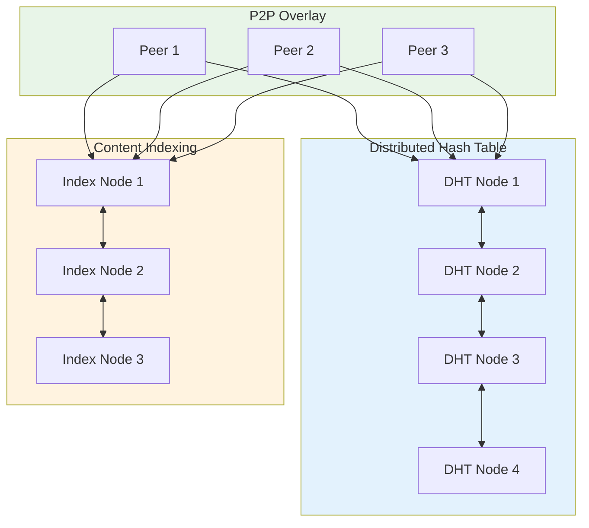
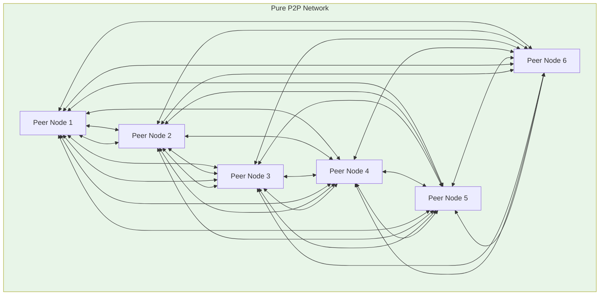
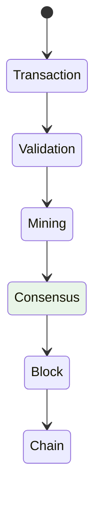

# 🌐 Peer-to-Peer (P2P) Architecture

A comprehensive guide to decentralized architecture patterns, covering P2P networks, distributed consensus mechanisms, and blockchain-based systems for building resilient, scalable applications.

---

## 🗺️ Table of Contents
1. [P2P Overview](#1-p2p-overview)
2. [Network Architectures](#2-network-architectures)
3. [Consensus Mechanisms](#3-consensus-mechanisms)
4. [Blockchain Patterns](#4-blockchain-patterns)
5. [Communication Protocols](#5-communication-protocols)
6. [Implementation Patterns](#6-implementation-patterns)
7. [Best Practices](#7-best-practices)

---

## 1. P2P Overview

### **What is P2P?**
Peer-to-Peer is a distributed application architecture where participants communicate directly with each other without central coordination, forming a decentralized network of equal peers.

### **Key Characteristics**
- **Decentralization**: No single point of control or failure
- **Scalability**: Linear scaling with network growth
- **Resilience**: Automatic failover and redundancy
- **Privacy**: Enhanced user privacy and data control
- **Resource Efficiency**: Utilizes all network participants
- **Fault Tolerance**: Continues operating despite node failures

### **Use Cases**
- **File Sharing**: BitTorrent, IPFS, distributed storage
- **Communication**: Signal, Matrix, decentralized messaging
- **Finance**: Bitcoin, Ethereum, DeFi applications
- **Content Delivery**: Content delivery networks, CDNs
- **IoT**: Smart home devices, sensor networks
- **Social Networks**: Mastodon, diaspora*, blockchain-based social platforms

---

## 2. Network Architectures

### **Structured P2P Architecture**
```mermaid
graph TB
    subgraph Network[Structured P2P Network]
        Node1[Peer Node 1]
        Node2[Peer Node 2]
        Node3[Peer Node 3]
        Node4[Peer Node 4]
        Node5[Peer Node 5]
    end
    
    subgraph Tracker[Centralized Tracker]
        Tracker[Tracker Server]
    end
    
    subgraph Bootstrap[Bootstrap Nodes]
        Bootstrap1[Bootstrap Node 1]
        Bootstrap2[Bootstrap Node 2]
    end
    
    Node1 <--> Node2
    Node1 <--> Node3
    Node1 <--> Node4
    Node1 <--> Node5
    
    Node2 <--> Node1
    Node2 <--> Node3
    Node2 <--> Node4
    Node2 <--> Node5
    
    Node3 <--> Node1
    Node3 <--> Node2
    Node3 <--> Node4
    Node3 <--> Node5
    
    Node4 <--> Node1
    Node4 <--> Node2
    Node4 <--> Node3
    Node4 <--> Node5
    
    Node5 <--> Node1
    Node5 <--> Node2
    Node5 <--> Node3
    Node5 <--> Node4
    
    Node1 --> Tracker
    Node2 --> Tracker
    Node3 --> Tracker
    Node4 --> Tracker
    Node5 --> Tracker
    
    Bootstrap1 --> Node1
    Bootstrap2 --> Node2
    Bootstrap1 --> Node3
    Bootstrap2 --> Node4
    Bootstrap1 --> Node5
    
    style Network fill:#e8f5e8
    style Tracker fill:#fff3e0
    style Bootstrap fill:#fce4ec
```

### **Hybrid P2P Architecture**


### **Pure P2P Architecture**


---

## 3. Consensus Mechanisms

### **Proof of Work (PoW)**


#### **PoW Implementation**
```javascript
class ProofOfWork {
    constructor(difficulty, data) {
        this.difficulty = difficulty;
        this.data = data;
        this.nonce = 0;
    }

    calculateHash() {
        const data = this.data + this.nonce;
        return crypto.createHash('sha256').update(data).digest('hex');
    }

    mine() {
        let hash;
        do {
            this.nonce++;
            hash = this.calculateHash();
        } while (this.isValidHash(hash));
        
        return {
            nonce: this.nonce - 1,
            hash: hash,
            proof: hash
        };
    }

    isValidHash(hash) {
        const targetPrefix = Array(this.difficulty + 1).fill('0');
        return hash.startsWith(targetPrefix);
    }
}

// Usage
const pow = new ProofOfWork(4, "block data");
const result = pow.mine();
console.log(`Valid proof found: nonce=${result.nonce}, hash=${result.hash}`);
```

### **Proof of Stake (PoS)**
```javascript
class ProofOfStake {
    constructor(validators, totalStake) {
        this.validators = new Set(validators);
        this.totalStake = totalStake;
        this.currentValidator = null;
        this.currentBlock = null;
    }

    selectValidator() {
        // Select validator based on stake weight
        const weights = this.validators.map(v => v.stake);
        const totalWeight = weights.reduce((a, b) => a + b, 0);
        let random = Math.random() * totalWeight;
        
        for (const validator of this.validators) {
            random -= validator.stake;
            if (random <= 0) {
                this.currentValidator = validator;
                return validator;
            }
        }
        
        return this.validators[0]; // Fallback
    }

    validateBlock(block) {
        const isValid = this.currentValidator.validate(block);
        return {
            valid: isValid,
            validator: this.currentValidator.address,
            stake: this.currentValidator.stake
        };
    }

    finalizeBlock(block, signatures) {
        // Check if enough signatures for finalization
        const threshold = this.totalStake * 2/3;
        const totalStake = signatures.reduce((sum, sig) => sum + sig.stake, 0);
        
        if (totalStake >= threshold) {
            this.currentBlock = {
                ...block,
                signatures: signatures,
                finalized: true
            };
            return this.currentBlock;
        }
        
        return {
            ...block,
                signatures: signatures,
                finalized: false
        };
    }
}

// Validator implementation
class Validator {
    constructor(address, stake) {
        this.address = address;
        this.stake = stake;
    }

    validate(block) {
        // Simplified validation logic
        return block.previousHash === this.calculateExpectedHash(block);
    }

    calculateExpectedHash(block) {
        // Calculate expected hash based on block data
        return crypto.createHash('sha256')
            .update(block.data + block.previousHash)
            .digest('hex');
    }
}
```

### **Practical Byzantine Fault Tolerance (PBFT)**
```javascript
class PBFTConsensus {
    constructor(nodes, threshold = 3) {
        this.nodes = nodes;
        this.threshold = threshold;
        this.round = 0;
        this.view = 0;
        this.log = [];
    }

    proposeBlock(proposer, block) {
        const proposal = {
            round: this.round,
            view: this.view,
            block: block,
            proposer: proposer,
            signatures: []
        };

        this.broadcastProposal(proposal);
        return proposal;
    }

    vote(proposal, voter) {
        if (this.isValidBlock(proposal.block)) {
            proposal.signatures.push({
                voter: voter,
                signature: this.sign(proposal.block, voter)
            });
        }

        if (proposal.signatures.length >= this.threshold) {
            this.finalizeBlock(proposal);
        }
    }

    finalizeBlock(proposal) {
        this.log.push({
            type: 'BLOCK_FINALIZED',
            round: proposal.round,
            block: proposal.block.hash,
            signatures: proposal.signatures.length
        });
        
        this.round++;
        this.view = (this.view + 1) % this.nodes.length;
    }

    isValidBlock(block) {
        // Simplified validation
        return block.transactions.every(tx => this.validateTransaction(tx));
    }

    validateTransaction(transaction) {
        // Business logic validation
        return transaction.amount > 0 && 
               transaction.signature !== null &&
               this.verifySignature(transaction);
    }

    sign(block, signer) {
        return crypto.createHash('sha256')
            .update(block.toString() + signer.privateKey)
            .digest('hex');
    }
}
```

---

## 4. Blockchain Patterns

### **Blockchain Architecture**
```mermaid
graph TB
    subgraph Network[Blockchain Network]
        Node1[Full Node 1]
        Node2[Full Node 2]
        Node3[Light Node 1]
        Node4[Light Node 2]
    end
    
    subgraph Mempool[Mempool]
        Mempool[Transaction Pool]
    end
    
    subgraph Blockchain[Blockchain]
        Genesis[Genesis Block]
        Block1[Block 1]
        Block2[Block 2]
        BlockN[Block N]
    end
    
    Node1 --> Mempool
    Node2 --> Mempool
    Node3 --> Mempool
    Node4 --> Mempool
    
    Mempool --> Block1
    Block1 --> Block2
    Block2 --> BlockN
    
    style Network fill:#e8f5e8
    style Mempool fill:#fff3e0
    style Blockchain fill:#4caf50
```

### **Distributed Ledger Technology (DLT)**
```javascript
class DLTNode {
    constructor(nodeId, network) {
        this.nodeId = nodeId;
        this.network = network;
        this.ledger = new Map();
        this.peers = new Set();
        this.validator = new DLTValidator();
    }

    async createTransaction(from, to, amount, data) {
        const transaction = {
            id: this.generateTransactionId(),
            from,
            to,
            amount,
            data,
            timestamp: Date.now(),
            signature: null
        };

        // Validate transaction
        if (this.validator.validateTransaction(transaction)) {
            transaction.signature = this.signTransaction(transaction);
            
            // Add to local ledger
            this.ledger.set(transaction.id, transaction);
            
            // Broadcast to network
            this.broadcastTransaction(transaction);
            
            return { success: true, transaction };
        }
        
        return { success: false, error: 'Invalid transaction' };
    }

    generateTransactionId() {
        return `tx_${Date.now()}_${Math.random().toString(36).substr(2, 9)}`;
    }

    signTransaction(transaction) {
        // Simplified signing
        return crypto.createHash('sha256')
            .update(JSON.stringify(transaction) + this.nodeId.privateKey)
            .digest('hex');
    }

    async broadcastTransaction(transaction) {
        for (const peer of this.peers) {
            await this.sendTransaction(peer, transaction);
        }
    }

    async receiveTransaction(transaction) {
        // Validate and add transaction
        if (this.validator.validateTransaction(transaction)) {
            this.ledger.set(transaction.id, transaction);
            await this.processTransaction(transaction);
        }
    }

    async processTransaction(transaction) {
        // Business logic for transaction processing
        console.log(`Processing transaction ${transaction.id}: ${transaction.from} -> ${transaction.to}: ${transaction.amount}`);
        
        // Update account balances
        this.updateBalance(transaction.from, -transaction.amount);
        this.updateBalance(transaction.to, transaction.amount);
    }

    updateBalance(account, amount) {
        const currentBalance = this.ledger.get(account) || 0;
        this.ledger.set(account, currentBalance + amount);
    }
}
```

---

## 5. Communication Protocols

### **gRPC Protocol Implementation**
```protobuf
// p2p.proto
syntax = "proto3";

package p2p;

message PeerInfo {
    string id = 1;
    string address = 2;
    uint32 port = 3;
    repeated string capabilities = 4;
}

message Message {
    string id = 1;
    string type = 2;
    bytes data = 3;
    string sender_id = 4;
    int64 timestamp = 5;
    bytes signature = 6;
}

message FindPeersRequest {
    PeerInfo requester = 1;
}

message FindPeersResponse {
    repeated PeerInfo peers = 1;
}

service P2PService {
    rpc FindPeers(FindPeersRequest) returns (FindPeersResponse);
    rpc SendMessage(Message) returns (Message);
    rpc StreamMessages(stream Message) returns (stream Message);
}
```

```go
// Go gRPC server implementation
package main

import (
    "context"
    "log"
    "net"
    "google.golang.org/grpc"
    pb "path/to/protobuf/p2p"
)

type p2pServer struct {
    pb.UnimplementedP2PServiceServer
    peers map[string]*pb.PeerInfo
    mu    sync.RWMutex
}

func newP2PServer() *p2pServer {
    return &p2pServer{
        peers: make(map[string]*pb.PeerInfo),
    }
}

func (s *p2pServer) FindPeers(ctx context.Context, req *pb.FindPeersRequest) (*pb.FindPeersResponse, error) {
    s.mu.RLock()
    defer s.mu.RUnlock()
    
    var peers []*pb.PeerInfo
    for _, peer := range s.peers {
        peers = append(peers, peer)
    }
    
    return &pb.FindPeersResponse{Peers: peers}, nil
}

func (s *p2pServer) SendMessage(ctx context.Context, req *pb.Message) (*pb.Message, error) {
    log.Printf("Received message from %s: %s", req.SenderId, req.Type)
    
    // Validate and process message
    if err := s.validateMessage(req); err != nil {
        return nil, err
    }
    
    // Broadcast to all peers except sender
    for peerID, peer := range s.peers {
        if peerID != req.SenderId {
            go s.sendToPeer(peer, req)
        }
    }
    
    return &pb.Message{Id: req.Id}, nil
}

func (s *p2pServer) sendToPeer(peer *pb.PeerInfo, req *pb.Message) error {
    conn, err := grpc.Dial(peer.Address, grpc.WithInsecure())
    if err != nil {
        log.Printf("Failed to connect to peer %s: %v", peer.Id, err)
        return err
    }
    defer conn.Close()
    
    client := pb.NewP2PServiceClient(conn)
    _, err = client.SendMessage(context.Background(), req)
    return err
}

func (s *p2pServer) validateMessage(req *pb.Message) error {
    // Implement message validation logic
    if req.Type == "transaction" && len(req.Data) == 0 {
        return fmt.Errorf("transaction data cannot be empty")
    }
    
    return nil
}
```

### **WebRTC Implementation**
```javascript
class WebRTCPeerConnection {
    constructor(roomId, signalingServer) {
        this.roomId = roomId;
        this.signalingServer = signalingServer;
        this.localConnection = null;
        this.remoteConnections = new Map();
        this.messageQueue = [];
    }

    async connect() {
        this.localConnection = await this.createPeerConnection();
        
        // Join room
        const offer = await this.localConnection.createOffer();
        await this.signalingServer.sendOffer(this.roomId, offer);
        
        // Handle signaling
        this.signalingServer.onAnswer(this.roomId, (answer) => {
            await this.localConnection.setRemoteDescription(answer);
        });
        
        this.localConnection.onicecandidate = (candidate) => {
            this.signalingServer.sendIceCandidate(this.roomId, candidate);
        };
    }

    async createPeerConnection() {
        const configuration = {
            iceServers: [
                { urls: 'stun:stun.l.google.com:19302' }
            ]
        };
        
        return new RTCPeerConnection(configuration);
    }

    async sendMessage(message) {
        const dataChannel = this.localConnection.createDataChannel('messages');
        await dataChannel.open();
        
        if (dataChannel.readyState === 'open') {
            dataChannel.send(JSON.stringify(message));
        }
    }

    async receiveMessage() {
        const dataChannel = this.localConnection.createDataChannel('messages');
        
        dataChannel.onmessage = (event) => {
            const message = JSON.parse(event.data);
            this.handleMessage(message);
        };
        
        await dataChannel.open();
    }

    handleMessage(message) {
        console.log('Received message:', message);
        // Process message based on type
        switch (message.type) {
            case 'chat':
                this.displayChatMessage(message);
                break;
            case 'file':
                this.handleFileTransfer(message);
                break;
            case 'transaction':
                this.handleTransaction(message);
                break;
        }
    }
}
```

### **Message Queue Implementation**
```javascript
class P2PMessageQueue {
    constructor(nodeId, network) {
        this.nodeId = nodeId;
        this.network = network;
        this.messageQueue = [];
        this.processing = false;
        this.maxQueueSize = 1000;
    }

    async enqueue(message) {
        if (this.messageQueue.length >= this.maxQueueSize) {
            throw new Error('Message queue is full');
        }
        
        this.messageQueue.push(message);
        this.processQueue();
    }

    async processQueue() {
        if (this.processing || this.messageQueue.length === 0) {
            return;
        }
        
        this.processing = true;
        
        while (this.messageQueue.length > 0) {
            const message = this.messageQueue.shift();
            await this.processMessage(message);
        }
        
        this.processing = false;
    }

    async processMessage(message) {
        try {
            switch (message.type) {
                case 'transaction':
                    await this.processTransaction(message);
                    break;
                case 'block':
                    await this.processBlock(message);
                    break;
                case 'peer_discovery':
                    await this.processPeerDiscovery(message);
                    break;
                default:
                    console.log('Unknown message type:', message.type);
            }
        } catch (error) {
            console.error('Error processing message:', error);
        }
    }

    async processTransaction(transaction) {
        // Validate transaction
        if (!this.validateTransaction(transaction)) {
            throw new Error('Invalid transaction');
        }
        
        // Add to blockchain
        const block = await this.createBlock([transaction]);
        await this.broadcastBlock(block);
    }

    validateTransaction(transaction) {
        // Implement transaction validation logic
        return transaction.signature !== null && 
               transaction.amount > 0 &&
               this.verifySignature(transaction);
    }

    async createBlock(transactions) {
        const block = {
            id: this.generateBlockId(),
            transactions,
            previousHash: await this.getLastBlockHash(),
            timestamp: Date.now(),
            nonce: this.generateNonce(),
            proof: await this.mineBlock(transactions)
        };
        
        return block;
    }
}
```

---

## 6. Implementation Patterns

### **Node Discovery**
```javascript
class P2PNodeDiscovery {
    constructor(bootstrapNodes) {
        this.bootstrapNodes = bootstrapNodes;
        this.activePeers = new Set();
        this.discoveryInterval = 30000; // 30 seconds
    }

    async startDiscovery() {
        // Connect to bootstrap nodes
        for (const bootstrap of this.bootstrapNodes) {
            await this.connectToBootstrap(bootstrap);
        }
        
        // Start periodic discovery
        this.discoveryLoop();
    }

    async connectToBootstrap(bootstrap) {
        try {
            const response = await fetch(`${bootstrap}/peers`);
            const peers = await response.json();
            
            // Add discovered peers
            peers.forEach(peer => {
                this.activePeers.add(peer);
                this.connectToPeer(peer);
            });
        } catch (error) {
            console.error('Failed to connect to bootstrap:', error);
        }
    }

    discoveryLoop() {
        setInterval(async () => {
            // Request peer list from random active peer
            const activePeers = Array.from(this.activePeers);
            if (activePeers.length > 0) {
                const randomPeer = activePeers[Math.floor(Math.random() * activePeers.length)];
                await this.requestPeers(randomPeer);
            }
        }, this.discoveryInterval);
    }

    async requestPeers(peer) {
        try {
            const response = await fetch(`${peer}/peers`);
            const peers = await response.json();
            
            // Update active peers
            peers.forEach(p => {
                if (!this.activePeers.has(p)) {
                    this.activePeers.add(p);
                    this.connectToPeer(p);
                }
            });
        } catch (error) {
            console.error('Failed to request peers from:', peer, error);
        }
    }

    async connectToPeer(peer) {
        try {
            const ws = new WebSocket(`ws://${peer}/p2p`);
            
            ws.onopen = () => {
                console.log(`Connected to peer: ${peer}`);
                this.announcePeer();
            };
            
            ws.onmessage = (event) => {
                this.handlePeerMessage(JSON.parse(event.data));
            };
            
            ws.onclose = () => {
                console.log(`Disconnected from peer: ${peer}`);
                this.activePeers.delete(peer);
            };
        } catch (error) {
            console.error('Failed to connect to peer:', error);
        }
    }

    announcePeer() {
        const announcement = {
            type: 'peer_announcement',
            nodeId: this.nodeId,
            address: this.getPeerAddress(),
            capabilities: ['file_sharing', 'messaging', 'transaction']
        };
        
        // Broadcast to all active peers
        this.broadcastToPeers(announcement);
    }
}
```

### **Data Synchronization**
```javascript
class P2PDataSynchronization {
    constructor(nodeId, dataStore) {
        this.nodeId = nodeId;
        this.dataStore = dataStore;
        this.syncInterval = 60000; // 1 minute
        this.lastSyncTimestamp = 0;
    }

    async startSynchronization() {
        this.syncLoop();
    }

    syncLoop() {
        setInterval(async () => {
            await this.synchronizeWithPeers();
        }, this.syncInterval);
    }

    async synchronizeWithPeers() {
        const localData = await this.dataStore.getAll();
        const localHash = this.calculateDataHash(localData);
        
        // Request hashes from all connected peers
        const peerHashes = await this.requestPeerHashes();
        
        // Identify peers with different data
        const peersToSync = this.identifyPeersToSync(localHash, peerHashes);
        
        // Request full data from peers with different data
        for (const peer of peersToSync) {
            const peerData = await this.requestDataFromPeer(peer);
            if (peerData) {
                await this.mergeData(localData, peerData);
            }
        }
        
        // Broadcast updated data if changed
        if (this.hasDataChanged(localData)) {
            await this.broadcastDataUpdate(localData);
        }
        
        this.lastSyncTimestamp = Date.now();
    }

    async requestPeerHashes() {
        const requests = Array.from(this.activePeers).map(peer => 
            this.sendRequest(peer, { type: 'get_hash' })
        );
        
        const responses = await Promise.all(requests);
        return responses.map((response, index) => ({
            peerId: Array.from(this.activePeers)[index].id,
            hash: response.data
        }));
    }

    identifyPeersToSync(localHash, peerHashes) {
        return peerHashes
            .filter(peer => peer.hash !== localHash)
            .map(peer => peer.peerId);
    }

    async requestDataFromPeer(peerId) {
        const peer = this.activePeers.get(peerId);
        if (!peer) {
            throw new Error(`Peer ${peerId} not found`);
        }
        
        return this.sendRequest(peer, { type: 'get_data' });
    }

    async mergeData(localData, remoteData) {
        // Implement conflict resolution
        const mergedData = this.resolveConflicts(localData, remoteData);
        await this.dataStore.update(mergedData);
    }

    resolveConflicts(localData, remoteData) {
        // Simple last-write-wins strategy
        const merged = { ...remoteData };
        
        // Apply local changes that don't conflict
        for (const [key, value] of Object.entries(localData)) {
            if (!(key in remoteData)) {
                merged[key] = value;
            }
        }
        
        return merged;
    }

    calculateDataHash(data) {
        return crypto.createHash('sha256')
            .update(JSON.stringify(data))
            .digest('hex');
    }

    hasDataChanged(currentData, previousData) {
        return this.calculateDataHash(currentData) !== this.calculateDataHash(previousData);
    }
}
```

---

## 7. Best Practices

### **Security Considerations**
- **Authentication**: Node identity verification and encryption
- **Message Validation**: Input validation and sanitization
- **Rate Limiting**: Prevent network abuse and DoS attacks
- **Network Isolation**: Separate public and private network segments
- **Encryption**: End-to-end encryption for sensitive data
- **Access Control**: Role-based permissions and capabilities

### **Performance Optimization**
- **Connection Pooling**: Reuse network connections efficiently
- **Message Batching**: Group multiple messages for efficiency
- **Compression**: Compress large data transfers
- **Caching**: Cache frequently accessed data
- **Load Balancing**: Distribute load across network nodes

### **Reliability Patterns**
- **Heartbeat Mechanisms**: Monitor node health and connectivity
- **Automatic Reconnection**: Handle network interruptions gracefully
- **Data Redundancy**: Replicate critical data across nodes
- **Fallback Mechanisms**: Alternative communication paths
- **Health Monitoring**: Track network performance and node status

### **Scalability Strategies**
- **Dynamic Peer Discovery**: Automatic network topology adaptation
- **Resource Management**: Efficient CPU and memory usage
- **Network Partitioning**: Handle network splits gracefully
- **Load Distribution**: Balance computational load evenly
- **Horizontal Scaling**: Add nodes to handle increased load
- **Geographic Distribution**: Deploy nodes across multiple regions

---

## 🚀 Getting Started

### **Implementation Roadmap**
1. **Network Design**: Choose appropriate P2P architecture
2. **Protocol Selection**: Implement communication protocols
3. **Consensus Mechanism**: Choose and implement consensus algorithm
4. **Security Implementation**: Add authentication and encryption
5. **Testing Strategy**: Comprehensive testing of P2P functionality
6. **Deployment**: Set up production P2P network
7. **Monitoring**: Implement observability and alerting

### **Quick Start Commands**
```bash
# Initialize P2P project
mkdir p2p-application
cd p2p-application

# Create basic structure
mkdir -p {src,tests,config}
touch src/index.js src/node.js src/network.js
touch tests/network.test.js tests/consensus.test.js
touch config/network.json

# Install dependencies
npm init -y
npm install --save grpc @grpc/grpc-js @grpc/proto-loader ws

# Generate protocol buffers
protoc --js_out=src/ --grpc_opt=generate_package_definition p2p.proto

# Start development server
npm run dev

# Production deployment
docker build -t p2p-node .
docker run -p 8080:8080 p2p-node
```

---

## 📚 Further Reading

- [P2P Architecture Patterns](https://en.wikipedia.org/wiki/Peer-to-peer)
- [Blockchain Technology Guide](https://blockchain-guides.github.io/)
- [Distributed Systems Theory](https://www.cs.cornell.edu/courses/cs6410/2020fa/lectures/)
- [gRPC Documentation](https://grpc.io/docs/)
- [WebRTC API Guide](https://developer.mozilla.org/en-US/docs/Web/API/WebRTC_API/)
- [Distributed Ledger Technology](https://en.wikipedia.org/wiki/Distributed_ledger_technology)

---

[⬅️ Back to Architectural Patterns](./README.md)
