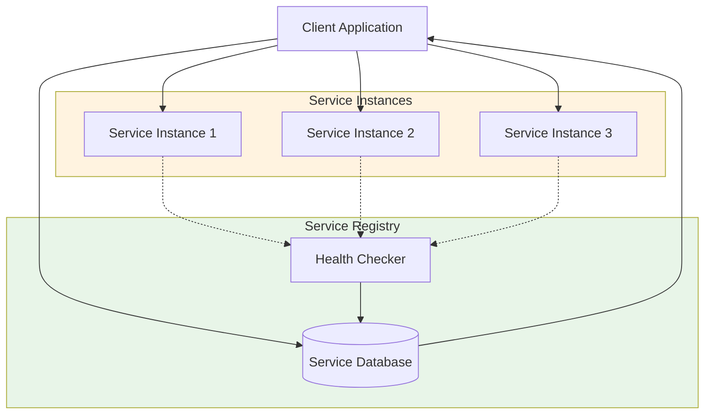
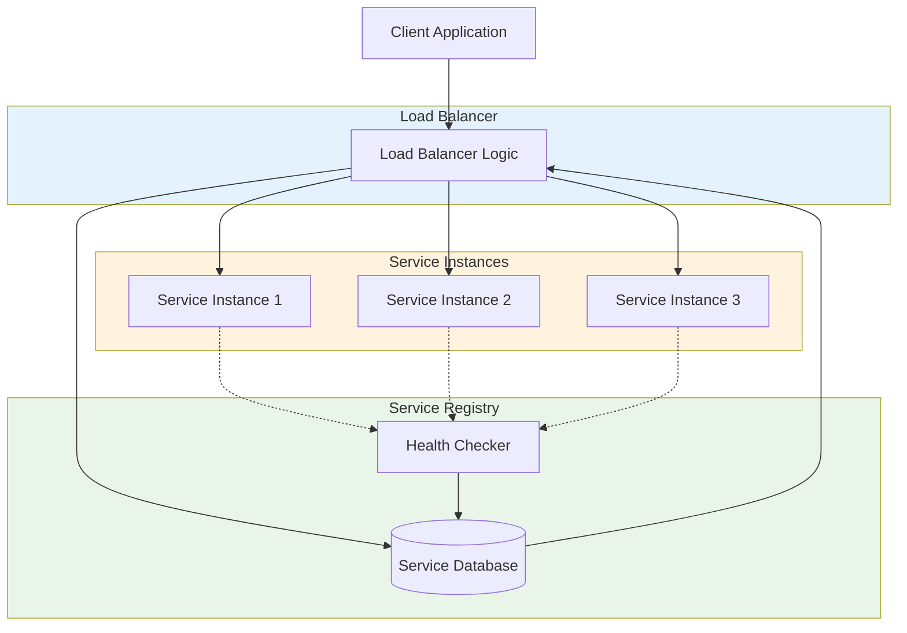

# 🔍 Service Discovery

Service Discovery is the process of automatically detecting devices and services on a computer network. In microservices, it allows services to find each other dynamically without hardcoded IP addresses.

---

## 🗺️ Table of Contents
1. [Why Service Discovery?](#1-why-service-discovery)
2. [Client-Side Discovery](#2-client-side-discovery)
3. [Server-Side Discovery](#3-server-side-discovery)
4. [Service Registry](#4-service-registry)

---

## 1. Why Service Discovery?
In a dynamic cloud environment, service instances change frequently due to auto-scaling, failures, and updates.
- **Dynamic IPs**: Instances are assigned dynamic IP addresses.
- **Decoupling**: Services don't need to know the physical address of their dependencies.
- **Load Balancing**: Works closely with load balancers to distribute traffic.

---

## 2. Client-Side Discovery
The client is responsible for determining the network locations of available service instances and load balancing requests across them.
- **Workflow**: Client queries the Service Registry -> Registry returns list of instances -> Client selects an instance (e.g., Round Robin) -> Client makes the call.
- **Example**: Netflix Ribbon, Eureka Client.

---

## 3. Server-Side Discovery
The client makes a request to a service via a load balancer. The load balancer queries the service registry and routes the request to an available service instance.
- **Workflow**: Client makes request to Load Balancer -> Load Balancer queries Registry -> Registry returns list -> Load Balancer routes to an instance.
- **Example**: AWS ELB, Kubernetes Services, Nginx.

---

## 4. Service Registry
A database containing the network locations of service instances. It must be highly available and up-to-date.
- **Self-Registration**: Service instances register themselves with the registry on startup and send heartbeats.
- **Health Checks**: The registry removes instances that fail to send heartbeats or fail health checks.
- **Examples**: Consul, Etcd, Netflix Eureka, Zookeeper.

---

## 📊 Service Discovery Architecture Diagrams

### Client-Side Discovery

### Server-Side Discovery

---
[⬅️ Back to Architectural Patterns](./README.md)
