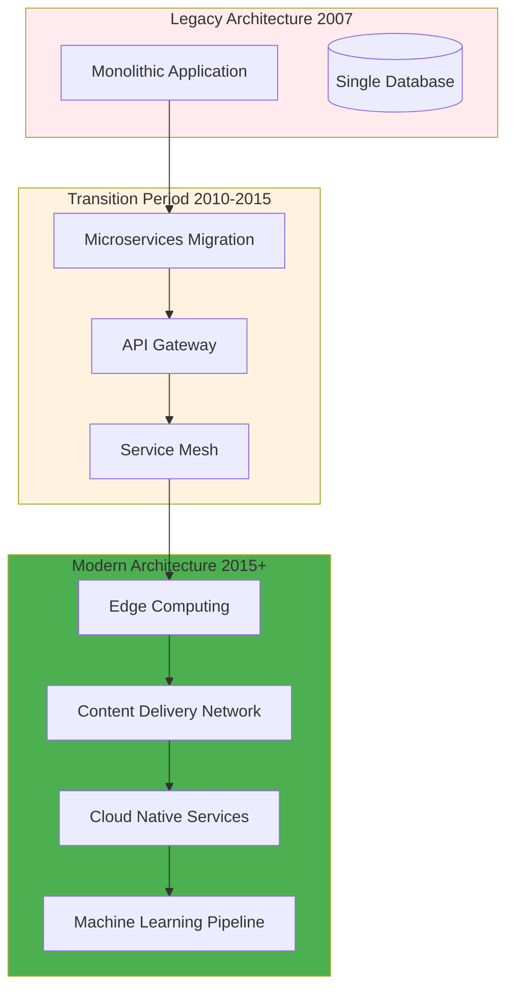
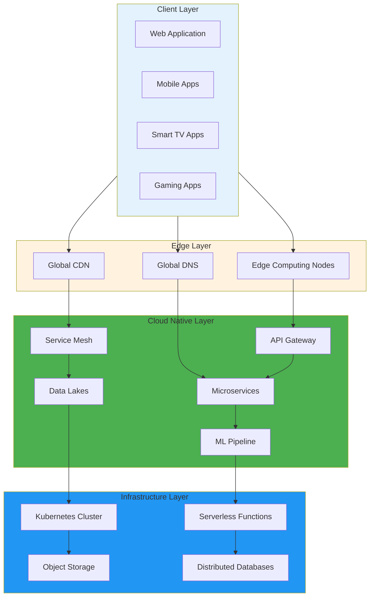
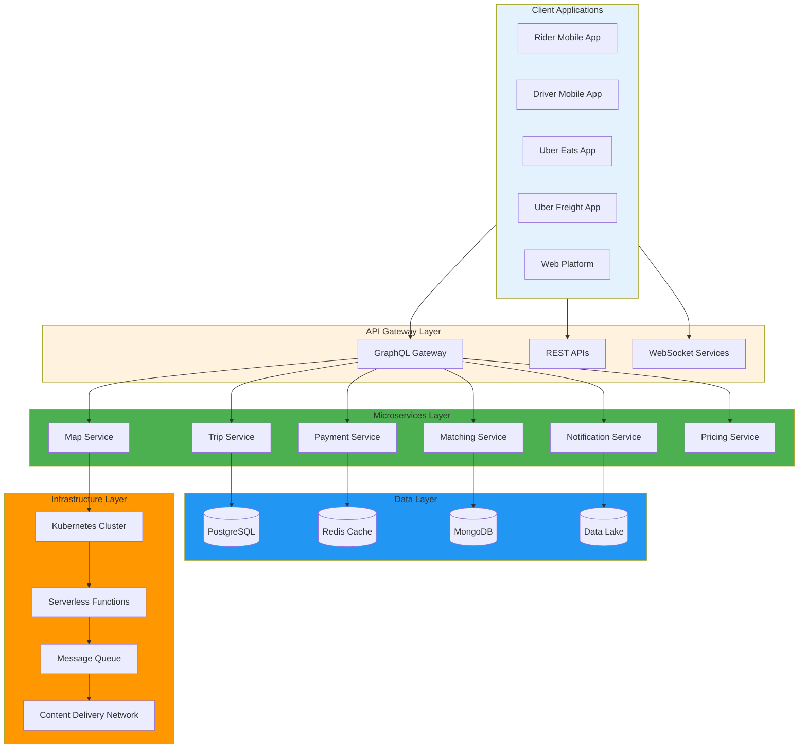
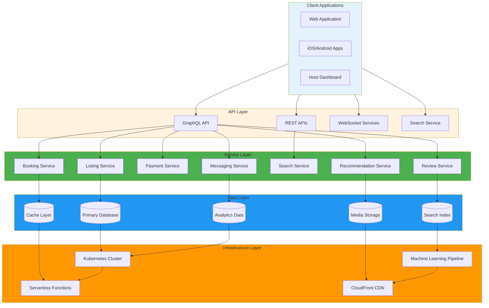
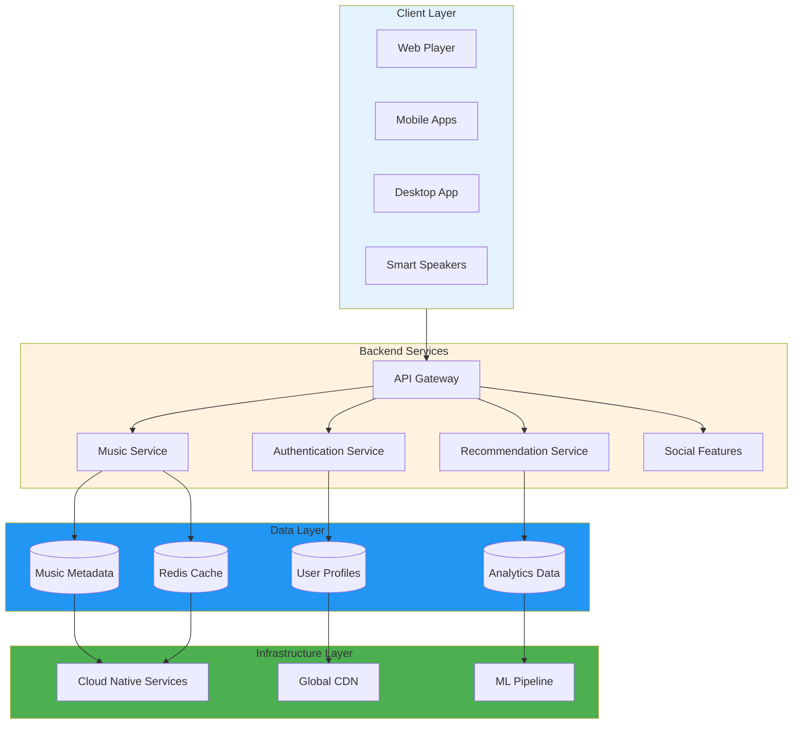
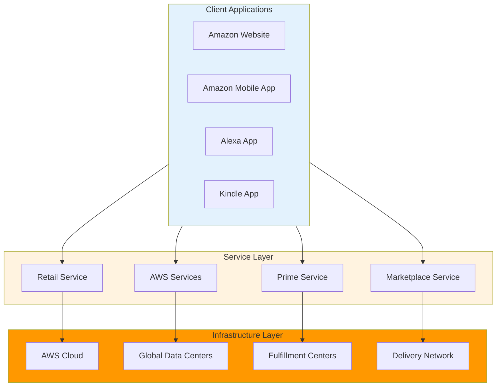
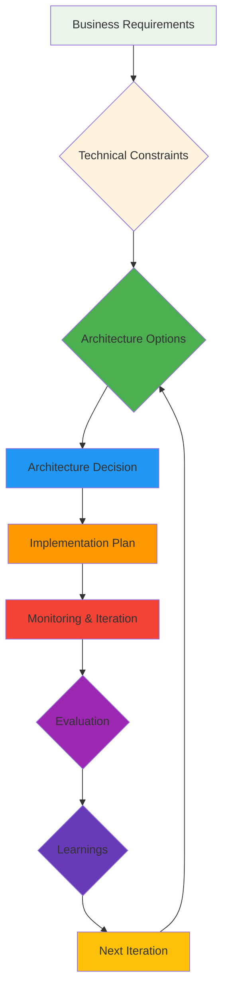

# 📚 Case Studies: Real-World Architecture Examples

A comprehensive collection of real-world architecture case studies from leading technology companies, analyzing their design decisions, challenges, and solutions.

---

## 🗺️ Table of Contents
1. [Netflix Architecture](#1-netflix-architecture)
2. [Uber Architecture](#2-uber-architecture)
3. [Airbnb Architecture](#3-airbnb-architecture)
4. [Additional Case Studies](#4-additional-case-studies)
5. [Lessons Learned](#5-lessons-learned)
6. [Best Practices](#6-best-practices)

---

## 1. Netflix Architecture

### **Company Overview**
Netflix is the world's leading streaming entertainment platform with over 230 million subscribers in 190+ countries, handling massive scale and reliability requirements.

### **Architecture Evolution**


### **Modern Netflix Architecture**


### **Key Components**

#### **Edge Computing**
- **Open Connect**: Open-source edge platform
- **Edge Nodes**: Deployed in ISP networks globally
- **Content Delivery**: Optimized for streaming performance
- **Regional Caching**: Local content caching at edge

#### **Cloud Native Services**
- **Microservices**: 500+ microservices
- **API Gateway**: Zuul-based gateway with rate limiting
- **Service Mesh**: Istio for service-to-service communication
- **Serverless**: AWS Lambda for event-driven processing

#### **Data Architecture**
```yaml
# Netflix data pipeline example
data_lakes:
  raw_data:
    type: "s3"
    location: "s3://netflix-raw-data/"
    format: "json"
    compression: "snappy"
  
  processed_data:
    type: "s3"
    location: "s3://netflix-processed-data/"
    format: "parquet"
    partitioning: "date"
  
  ml_features:
    type: "s3"
    location: "s3://netflix-ml-features/"
    format: "tfrecord"
    
streaming:
  kafka_cluster:
    brokers: ["kafka-1:9092", "kafka-2:9092", "kafka-3:9092"]
    topics: ["user-events", "playback-events", "encoding-events"]
    
processing:
  spark_cluster:
    nodes: 1000
    memory_per_node: "64GB"
    storage: "s3://netflix-processing/"
```

#### **Machine Learning Pipeline**
```python
# Netflix ML recommendation pipeline
class NetflixMLPipeline:
    def __init__(self):
        self.data_lake = DataLakeConnector()
        self.feature_store = FeatureStore()
        self.model_trainer = ModelTrainer()
        self.serving_layer = ModelServingLayer()
    
    def process_user_interactions(self, user_data):
        # Extract features from user interactions
        features = self.feature_store.extract_features(user_data)
        
        # Store in data lake
        self.data_lake.store_user_features(user_data['user_id'], features)
        
        # Update ML models
        self.model_trainer.update_recommendation_model(features)
    
    def generate_recommendations(self, user_id):
        # Get user features
        features = self.data_lake.get_user_features(user_id)
        
        # Generate recommendations using ML models
        recommendations = self.model_trainer.predict(features)
        
        return recommendations
    
    def real_time_personalization(self, user_context):
        # Real-time content personalization
        personalized_content = self.serving_layer.get_personalized_content(
            user_context['user_id'],
            user_context['device_type'],
            user_context['location']
        )
        
        return personalized_content
```

---

## 2. Uber Architecture

### **Company Overview**
Uber operates in 70+ countries with 100+ million monthly active users, providing ride-sharing, food delivery, and freight services through a unified platform.

### **Architecture Overview**


### **Key Architectural Decisions**

#### **Microservices Design**
```yaml
# Uber microservices architecture
services:
  trip_service:
    description: "Handles trip lifecycle and routing"
    technology: "Go + gRPC"
    database: "PostgreSQL"
    scaling: "Horizontal pod autoscaling"
    
  payment_service:
    description: "Processes payments and financial transactions"
    technology: "Node.js + Stripe"
    database: "PostgreSQL"
    scaling: "Horizontal with connection pooling"
    
  matching_service:
    description: "Matches riders with drivers"
    technology: "Python + asyncio"
    database: "Redis + PostgreSQL"
    scaling: "Stateless with Redis caching"
    
  notification_service:
    description: "Sends real-time notifications"
    technology: "Java + WebSocket"
    database: "MongoDB"
    scaling: "Event-driven with Kafka"
    
  map_service:
    description: "Provides mapping and routing"
    technology: "Python + Mapbox"
    database: "PostgreSQL + PostGIS"
    scaling: "Read replicas with geographic distribution"
```

#### **Real-time Matching Algorithm**
```python
# Uber's real-time matching algorithm
class UberMatchingAlgorithm:
    def __init__(self):
        self.redis_client = RedisClient()
        self.postgres_client = PostgreSQLClient()
        self.ml_model = MatchingModel()
    
    async def find_best_match(self, rider_request):
        # Get available drivers
        available_drivers = await self.get_nearby_drivers(
            rider_request['location'],
            rider_request['service_type']
        )
        
        # Score each driver
        scored_drivers = []
        for driver in available_drivers:
            score = await self.calculate_driver_score(driver, rider_request)
            scored_drivers.append({
                'driver': driver,
                'score': score
            })
        
        # Sort by score and return best match
        scored_drivers.sort(key=lambda x: x['score'], reverse=True)
        return scored_drivers[0] if scored_drivers else None
    
    async def calculate_driver_score(self, driver, rider_request):
        # Multiple factors for scoring
        distance_score = self.calculate_distance_score(
            driver['location'], rider_request['location']
        )
        
        rating_score = driver['rating'] * 0.1
        availability_score = self.calculate_availability_score(driver)
        surge_pricing_score = self.calculate_surge_score(driver, rider_request)
        
        # Weighted scoring
        total_score = (
            distance_score * 0.4 +
            rating_score * 0.3 +
            availability_score * 0.2 +
            surge_pricing_score * 0.1
        )
        
        return total_score
    
    async def get_nearby_drivers(self, location, service_type):
        # Geographic search with caching
        cache_key = f"drivers:{location['lat']}:{location['lng']}:{service_type}"
        cached_drivers = await self.redis_client.get(cache_key)
        
        if cached_drivers:
            return cached_drivers
        
        # Query database for nearby drivers
        drivers = await self.postgres_client.query(
            "SELECT * FROM drivers WHERE "
            "ST_DWithin(location, POINT(%s, %s), 5) "
            "AND service_type = %s "
            "AND is_available = true",
            [location['lat'], location['lng'], service_type]
        )
        
        # Cache for 5 minutes
        await self.redis_client.setex(cache_key, 300, drivers)
        return drivers
```

#### **Surge Pricing System**
```python
# Uber's dynamic pricing algorithm
class SurgePricingEngine:
    def __init__(self):
        self.demand_analyzer = DemandAnalyzer()
        self.weather_service = WeatherService()
        self.event_service = EventService()
    
    async def calculate_surge_multiplier(self, location, time_of_day):
        # Get current demand in area
        current_demand = await self.demand_analyzer.get_demand(
            location, time_of_day
        )
        
        # Get weather conditions
        weather = await self.weather_service.get_weather(location)
        
        # Check for nearby events
        events = await self.event_service.get_nearby_events(location)
        
        # Calculate base surge
        base_surge = self.calculate_base_surge(current_demand)
        
        # Apply modifiers
        weather_modifier = self.get_weather_modifier(weather)
        event_modifier = self.get_event_modifier(events)
        
        final_surge = base_surge * weather_modifier * event_modifier
        
        return max(1.0, final_surge)  # Minimum 1.0x normal pricing
    
    def calculate_base_surge(self, demand):
        # Demand-based surge pricing
        if demand < 0.3:
            return 1.0  # No surge
        elif demand < 0.6:
            return 1.2  # Low surge
        elif demand < 0.8:
            return 1.5  # Medium surge
        else:
            return 2.0  # High surge
    
    def get_weather_modifier(self, weather):
        # Weather-based pricing adjustments
        weather_modifiers = {
            'clear': 1.0,
            'rain': 1.1,
            'snow': 1.3,
            'extreme_weather': 1.5
        }
        return weather_modifiers.get(weather['condition'], 1.0)
    
    def get_event_modifier(self, events):
        # Event-based pricing adjustments
        if not events:
            return 1.0
        
        # Check for major events
        major_events = [event for event in events if event['is_major']]
        if major_events:
            return 1.2
        
        return 1.0
```

---

## 3. Airbnb Architecture

### **Company Overview**
Airbnb operates in 220+ countries with 4 million+ hosts and 1 billion+ listings, providing a trusted platform for short-term rentals and experiences.

### **Architecture Overview**


### **Key Architectural Patterns**

#### **GraphQL Federation**
```javascript
// Airbnb's GraphQL federation setup
const { ApolloServer, gql } = require('apollo-server-express');
const { ApolloGateway } = require('@apollo/gateway');

// Listing service schema
const typeDefs = gql`
  type Listing {
    id: ID!
    title: String!
    description: String!
    price: Float!
    location: Location!
    host: User!
    reviews: [Review!]!
  }
  
  type Location {
    latitude: Float!
    longitude: Float!
    address: String!
    city: String!
    country: String!
  }
  
  type Query {
    listing(id: ID!): Listing
    listings(filter: ListingFilter): [Listing!]!
    searchListings(query: String!): [Listing!]!
  }
`;

// Gateway configuration
const gateway = new ApolloGateway({
  supergraphSdl: new ApolloServer({
    typeDefs,
    resolvers: listingResolvers
  }),
  
  services: [
    {
      name: 'listings',
      url: 'https://api.airbnb.com/graphql',
    },
    {
      name: 'bookings',
      url: 'https://bookings.airbnb.com/graphql',
    },
    {
      name: 'payments',
      url: 'https://payments.airbnb.com/graphql',
    },
    {
      name: 'reviews',
      url: 'https://reviews.airbnb.com/graphql',
    }
  ],
  
  // Gateway server
  const server = new ApolloServer({
    gateway,
    plugins: [
      new ApolloServerPluginDrain(),
      new ApolloServerPluginUsageReporting(),
    ],
  });
});
```

#### **Search and Discovery**
```python
# Airbnb's search infrastructure
class AirbnbSearchEngine:
    def __init__(self):
        self.elasticsearch_client = ElasticsearchClient()
        self.redis_client = RedisClient()
        self.ml_ranker = SearchRanker()
    
    async def search_listings(self, query, filters, user_context):
        # Build Elasticsearch query
        es_query = self.build_search_query(query, filters)
        
        # Execute search
        search_results = await self.elasticsearch_client.search(
            index='listings',
            body=es_query
        )
        
        # Apply ML ranking
        ranked_results = self.ml_ranker.rank_results(
            search_results['hits'],
            user_context
        )
        
        # Cache popular searches
        cache_key = f"search:{hash(query)}:{hash(str(filters))}"
        await self.redis_client.setex(cache_key, 3600, ranked_results)
        
        return ranked_results
    
    def build_search_query(self, query, filters):
        # Multi-field search with boosting
        return {
            "query": {
                "multi_match": {
                    "query": query,
                    "fields": ["title^3", "description^2", "amenities"],
                    "type": "best_fields"
                }
            },
            "filter": self.build_filters(filters),
            "sort": [
                {"_score": "desc"},
                {"price": "asc"}
            ],
            "highlight": {
                "fields": ["title", "description"],
                "pre_tags": ["<em>", "<strong>"],
                "post_tags": ["</em>", "</strong>"]
            }
        }
    
    def build_filters(self, filters):
        # Dynamic filter building
        es_filters = {}
        
        if 'price_min' in filters:
            es_filters['range'] = {
                "price": {"gte": filters['price_min']}
            }
        
        if 'location' in filters:
            es_filters['geo_distance'] = {
                "distance": "50km",
                "location": {
                    "lat": filters['location']['lat'],
                    "lon": filters['location']['lng']
                }
            }
        
        if 'amenities' in filters:
            es_filters['terms'] = filters['amenities']
        
        return es_filters
```

#### **Booking and Reservation System**
```javascript
// Airbnb's booking system
class BookingSystem {
    constructor() {
        this.redis = new RedisClient();
        this.postgres = new PostgreSQLClient();
        this.eventBus = new EventBus();
    }
    
    async createBooking(bookingRequest) {
        // Check availability
        const isAvailable = await this.checkAvailability(bookingRequest);
        if (!isAvailable) {
            throw new Error('Property not available for selected dates');
        }
        
        // Create booking reservation
        const reservation = await this.createReservation(bookingRequest);
        
        // Process payment
        const paymentResult = await this.processPayment(bookingRequest.payment);
        if (!paymentResult.success) {
            await this.cancelReservation(reservation.id);
            throw new Error('Payment failed');
        }
        
        // Confirm booking
        const booking = await this.confirmBooking(reservation.id);
        
        // Send notifications
        await this.sendNotifications(booking, {
            host: bookingRequest.hostId,
            guest: bookingRequest.guestId
        });
        
        return booking;
    }
    
    async checkAvailability(bookingRequest) {
        // Check calendar availability
        const conflicts = await this.postgres.query(`
            SELECT * FROM bookings 
            WHERE property_id = $1 
            AND ((start_date <= $2 AND end_date > $2) 
            OR (start_date < $3 AND end_date >= $3))
            AND status = 'confirmed'
        `, [bookingRequest.propertyId, bookingRequest.startDate, bookingRequest.endDate, bookingRequest.startDate, bookingRequest.endDate]);
        
        return conflicts.length === 0;
    }
    
    async createReservation(bookingRequest) {
        const reservation = {
            id: this.generateId(),
            propertyId: bookingRequest.propertyId,
            guestId: bookingRequest.guestId,
            startDate: bookingRequest.startDate,
            endDate: bookingRequest.endDate,
            status: 'pending',
            createdAt: new Date(),
            expiresAt: new Date(Date.now() + 15 * 60 * 1000) // 15 minutes
        };
        
        await this.postgres.insert('reservations', reservation);
        
        // Lock dates in cache
        await this.redis.setex(
            `availability:${bookingRequest.propertyId}`,
            86400, // 24 hours
            JSON.stringify({ unavailable: [bookingRequest.startDate, bookingRequest.endDate] })
        );
        
        return reservation;
    }
    
    async processPayment(paymentInfo) {
        // Integrate with payment processor
        const paymentResult = await this.paymentProcessor.charge(paymentInfo);
        
        if (paymentResult.success) {
            // Update booking status
            await this.postgres.update(
                'reservations',
                { status: 'confirmed', payment_id: paymentResult.id },
                { id: paymentInfo.reservationId }
            );
        }
        
        return paymentResult;
    }
}
```

---

## 4. Additional Case Studies

### **Spotify Architecture**


### **Amazon Architecture**


---

## 5. Lessons Learned

### **Common Patterns Across Companies**

#### **Microservices Adoption**
- **Start Small**: Begin with non-critical services
- **API Gateway**: Essential for microservices management
- **Service Mesh**: Becomes crucial at scale (50+ services)
- **Data Ownership**: Each service owns its data
- **Event-Driven**: Essential for loose coupling

#### **Cloud Native Transformation**
- **Containerization**: Docker for consistency
- **Orchestration**: Kubernetes for scale and management
- **Serverless**: For event-driven workloads
- **Infrastructure as Code**: Terraform/CloudFormation for repeatability

#### **Data Strategy**
- **Polyglot Persistence**: Different databases for different needs
- **Data Lakes**: For analytics and ML
- **Caching Strategy**: Redis/Memcached for performance
- **Event Streaming**: Kafka for real-time data flow
- **Search Infrastructure**: Elasticsearch for complex queries

#### **Performance and Scalability**
- **CDN Integration**: Essential for global performance
- **Edge Computing**: Reduce latency for user experience
- **Auto-scaling**: Handle traffic spikes efficiently
- **Database Sharding**: Scale write operations horizontally
- **Circuit Breakers**: Prevent cascade failures

---

## 6. Best Practices

### **Architecture Decision Framework**


### **Key Decision Criteria**
| Criterion | Questions to Ask | Weight |
|-----------|------------------|-------|
| **Scale** | Expected users/requests per second? | High |
| **Latency** | Maximum acceptable response time? | High |
| **Consistency** | How critical is data consistency? | High |
| **Availability** | Required uptime percentage? | High |
| **Complexity** | Team expertise and timeline? | Medium |
| **Cost** | Budget constraints? | Medium |
| **Maintainability** | Long-term maintenance considerations? | High |

### **Implementation Guidelines**
1. **Start with MVP**: Validate architecture with minimal viable product
2. **Incremental Migration**: Gradually replace legacy systems
3. **Observability First**: Implement monitoring from day one
4. **Security by Design**: Build security into architecture foundation
5. **Performance Testing**: Load test before production deployment
6. **Documentation**: Maintain living architecture documentation
7. **Team Alignment**: Ensure architecture matches team capabilities

---

## 🚀 Getting Started

### **Case Study Analysis Framework**
1. **Company Research**: Understand business model and scale
2. **Architecture Discovery**: Map current and target architectures
3. **Decision Analysis**: Document key architectural decisions
4. **Pattern Identification**: Extract reusable patterns and principles
5. **Implementation Details**: Document specific technologies and configurations
6. **Lessons Learned**: Capture successes and failures
7. **Best Practices**: Derive generalizable guidelines

### **Documentation Template**
```markdown
# [Company Name] Architecture Case Study

## Company Overview
- **Business Model**: [Description]
- **Scale**: [Users, transactions, etc.]
- **Geographic Reach**: [Countries/regions]

## Architecture Evolution
- **Timeline**: [Key architectural changes]
- **Drivers**: [Reasons for changes]
- **Challenges**: [Problems encountered]

## Current Architecture
- **High-Level Diagram**: [Mermaid diagram]
- **Key Components**: [Description of main parts]
- **Technology Stack**: [Technologies used]
- **Data Flow**: [How data moves through system]

## Implementation Details
- **Code Examples**: [Specific implementation patterns]
- **Configuration**: [Key configurations]
- **Deployment**: [How system is deployed]
- **Monitoring**: [Observability setup]

## Lessons Learned
- **Successes**: [What worked well]
- **Failures**: [What didn't work]
- **Surprises**: [Unexpected challenges]
- **Metrics**: [Key performance indicators]

## Best Practices
- **Generalizable Principles**: [Applicable to other contexts]
- **Avoidable Pitfalls**: [Common mistakes to avoid]
- **Recommendations**: [What they'd do differently]

## Further Reading
- [Links to relevant resources]
```

---

## 📚 Further Reading

- [Netflix Tech Blog](https://netflixtechblog.com/)
- [Uber Engineering Blog](https://www.uber.com/blog/engineering/)
- [Airbnb Engineering](https://medium.com/airbnb-engineering/)
- [AWS Architecture Blog](https://aws.amazon.com/architecture/)
- [Spotify Engineering](https://engineering.atspotify.com/)
- [Google Architecture](https://cloud.google.com/architecture/)
- [Microsoft Architecture](https://docs.microsoft.com/en-us/azure/architecture/)

---

[⬅️ Back to Documentation Quality](../README.md)
