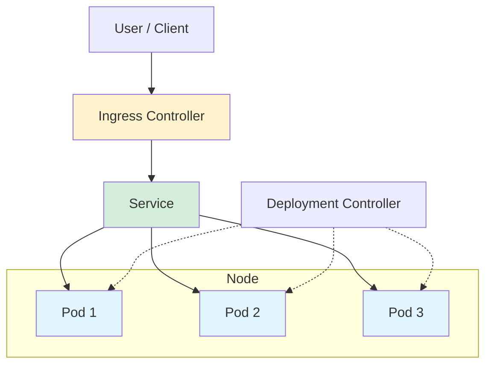

# ☁️ Kubernetes: Cloud-Native Orchestration

Kubernetes (K8s) is an open-source system for automating deployment, scaling, and management of containerized applications.

---

## 🗺️ Table of Contents
1. [Core Units: Pods](#1-core-units-pods)
2. [Controllers: Managing State](#2-controllers-managing-state)
3. [Networking: Services & Ingress](#3-networking-services--ingress)
4. [Configuration: ConfigMaps & Secrets](#4-configuration-configmaps--secrets)
5. [Storage: Volumes & Claims](#5-storage-volumes--claims)

---

## 1. Core Units: Pods
A Pod is the smallest, most basic deployable object in Kubernetes. It represents a single instance of a running process in your cluster.
- **Containers**: A Pod can host one or more containers (usually one).
- **Shared Resources**: Containers in a Pod share the same network IP, port space, and storage volumes.
- **Ephemeral**: Pods are not self-healing; they are meant to be managed by Controllers.

---

## 2. Controllers: Managing State
Controllers are responsible for making the cluster's actual state match the desired state.

### Deployment
The most common controller. It manages **ReplicaSets** and provides declarative updates to Pods.
- **Rolling Updates**: Updates Pods one-by-one to ensure zero downtime.
- **Rollbacks**: Easily revert to a previous version if an update fails.

### StatefulSet
Used for applications that require a stable identity and persistent storage (e.g., Databases like PostgreSQL, Kafka).
- Maintains a sticky identity for each Pod.

### DaemonSet
Ensures that all (or some) Nodes run a copy of a Pod.
- **Use case**: Logging agents (Fluentd), Monitoring agents (Prometheus Node Exporter).

### Job & CronJob
- **Job**: Creates one or more Pods and ensures that a specified number of them successfully terminate.
- **CronJob**: Runs Jobs on a time-based schedule.

---

## 3. Networking: Services & Ingress

### Services
An abstract way to expose an application running on a set of Pods as a network service.

| Service Type | Scope | Use Case |
| :--- | :--- | :--- |
| **ClusterIP** | Internal | Default. Internal communication between services. |
| **NodePort** | External | Exposes the Service on each Node's IP at a static port. |
| **LoadBalancer** | External | Exposes the Service externally using a cloud provider's load balancer. |
| **ExternalName** | External | Maps a Service to a DNS name. |

### Ingress
An API object that manages external access to the services in a cluster, typically HTTP. It provides load balancing, SSL termination, and name-based virtual hosting.

---

## 4. Configuration: ConfigMaps & Secrets
- **ConfigMap**: Stores non-confidential data in key-value pairs (e.g., environment variables, config files).
- **Secret**: Stores sensitive data like passwords, OAuth tokens, and ssh keys, encoded in base64.

---

## 5. Storage: Volumes & Claims
- **PersistentVolume (PV)**: A piece of storage in the cluster that has been provisioned by an administrator.
- **PersistentVolumeClaim (PVC)**: A request for storage by a user.

---

## 📊 Kubernetes Architecture Diagram

