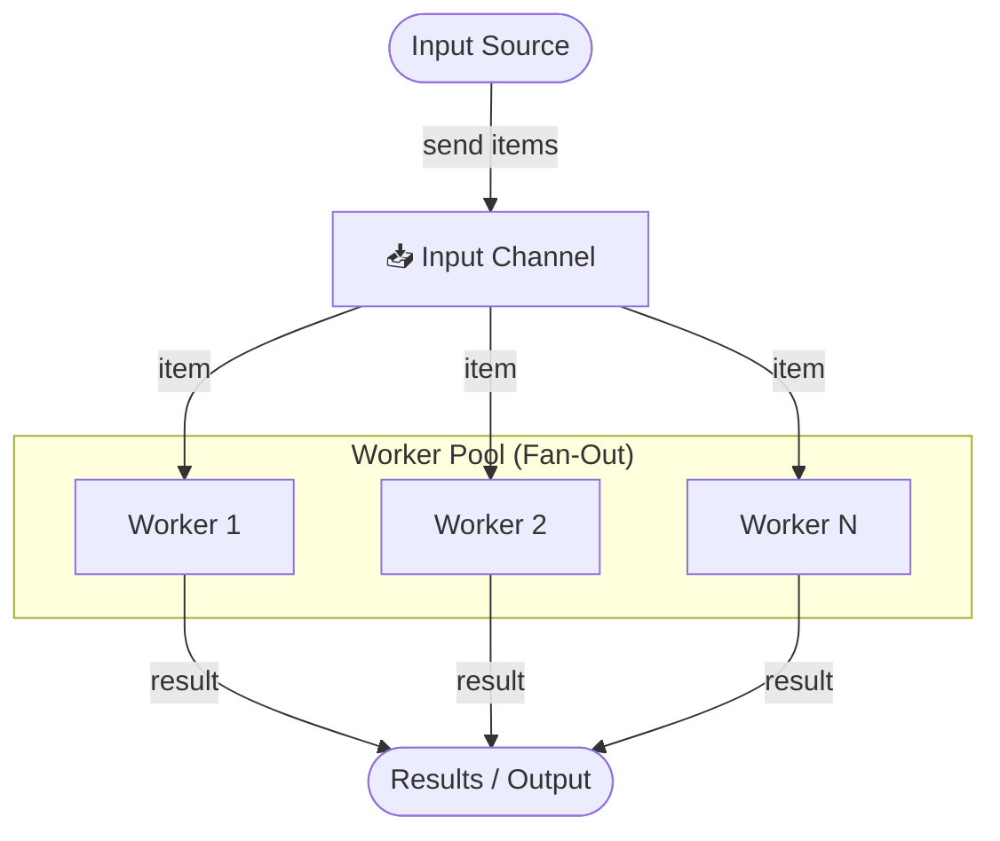
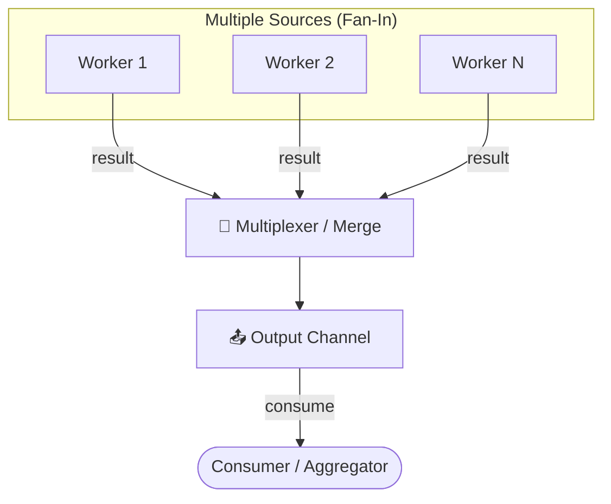
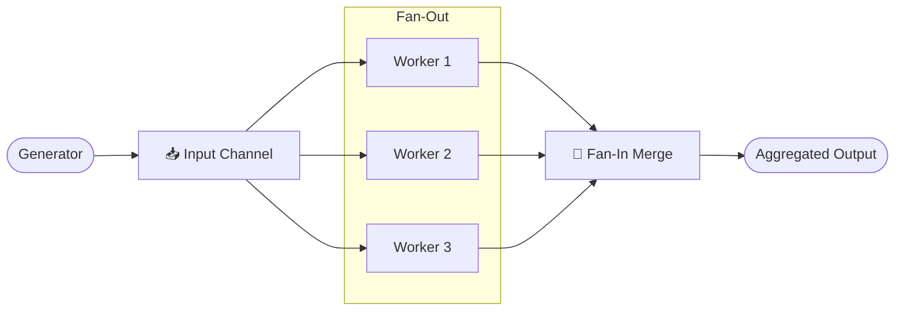

# 🔒 Concurrency & Thread Locks

Concurrency is the ability of different parts or units of a program, algorithm, or problem to be executed out-of-order or in partial order, without affecting the final outcome. Thread locks are synchronization primitives used to manage access to shared resources.

---

## 🗺️ Table of Contents
1. [Mutex (Mutual Exclusion)](#1-mutex-mutual-exclusion)
2. [Read/Write Locks](#2-readwrite-locks)
3. [Optimistic vs Pessimistic Locking](#3-optimistic-vs-pessimistic-locking)
4. [Deadlocks](#4-deadlocks)
5. [Semaphores](#5-semaphores)
6. [Active Object](#6-active-object)
7. [Producer-Consumer](#7-producer-consumer)
8. [Thread Pool](#8-thread-pool)
9. [Future and Promise](#9-future-and-promise)
10. [Fan-Out](#10-fan-out)
11. [Fan-In](#11-fan-in)

---

## 1. Mutex (Mutual Exclusion)
A Mutex is a locking mechanism used to synchronize access to a resource. Only one thread can acquire the mutex at a time.
- **Workflow**: Lock -> Access Resource -> Unlock.
- **Danger**: Forgetting to unlock (use `defer` in Go or `try-finally` in Java).

**Example (Go)**:
```go
import "sync"

type Counter struct {
    mu sync.Mutex
    v  map[string]int
}

func (c *Counter) Inc(key string) {
    c.mu.Lock()
    defer c.mu.Unlock() // Ensure unlock even if it panics
    c.v[key]++
}
```

---

## 2. Read/Write Locks
A more granular lock that allows multiple threads to read a resource simultaneously, but requires exclusive access for writing.
- **Readers**: Multiple concurrent readers allowed if no writer is active.
- **Writers**: Only one writer allowed, and no readers allowed while writing.
- **Best for**: Resources that are read frequently but updated rarely.

**Example (Java)**:
```java
import java.util.concurrent.locks.ReadWriteLock;
import java.util.concurrent.locks.ReentrantReadWriteLock;

public class Cache {
    private final ReadWriteLock lock = new ReentrantReadWriteLock();
    private String data;

    public String readData() {
        lock.readLock().lock();
        try { return data; } 
        finally { lock.readLock().unlock(); }
    }

    public void writeData(String data) {
        lock.writeLock().lock();
        try { this.data = data; } 
        finally { lock.writeLock().unlock(); }
    }
}
```

---

## 3. Optimistic vs Pessimistic Locking

### Pessimistic Locking
Assumes that conflicts will happen. A lock is acquired before the operation starts and released after it finishes.
- **Use case**: High contention, high risk of conflicts.

### Optimistic Locking
Assumes that conflicts are rare. The operation proceeds without a lock, but before committing, it checks if another thread has modified the data (usually via a version number).
- **Use case**: Low contention, web applications, distributed systems.

---

## 4. Deadlocks
A situation where two or more threads are blocked forever, waiting for each other to release locks.

### Necessary Conditions (Coffman Conditions)
1. **Mutual Exclusion**: At least one resource is held in a non-shareable mode.
2. **Hold and Wait**: A thread is holding at least one resource and waiting for another.
3. **No Preemption**: Resources cannot be taken away from a thread.
4. **Circular Wait**: A closed chain of threads exists where each is waiting for a resource held by the next.

### Avoidance Strategies
- **Lock Ordering**: Always acquire locks in the same predefined order.
- **Lock Timeout**: Don't wait indefinitely; release held locks if a new one can't be acquired.

---

## 5. Semaphores
A semaphore maintains a set of permits. Threads "acquire" a permit to access a resource and "release" it when done.
- **Binary Semaphore**: Equivalent to a Mutex (0 or 1).
- **Counting Semaphore**: Allows a fixed number of concurrent accesses (e.g., limiting database connections).

**Example (Python)**:
```python
import threading
import time

# Allow up to 3 threads to access the resource concurrently
semaphore = threading.Semaphore(3)

def access_resource(thread_id):
    print(f"Thread {thread_id} waiting...")
    with semaphore:
        print(f"Thread {thread_id} acquired semaphore.")
        time.sleep(2) # Simulate work
        print(f"Thread {thread_id} releasing semaphore.")
```

### Distributed Semaphores
In a distributed system, a traditional in-memory semaphore doesn't work across multiple server instances. A distributed semaphore uses an external coordinator:

- **Redis-based**: Uses Redis keys and atomic increments/decrements. Often implemented with Lua scripts to ensure atomicity.
- **Zookeeper/Consul-based**: Uses ephemeral nodes. If a client holding a permit crashes, the ephemeral node is deleted, and the permit is automatically released.
- **Leases**: Distributed semaphores must have a timeout (lease) to prevent a permit from being held forever if a consumer fails to release it.

---

## ⚖️ Locking Comparison

| Type | Concurrency Level | Complexity | Best Use Case |
| :--- | :--- | :--- | :--- |
| **Mutex** | Low | Low | Protecting a simple variable. |
| **Read/Write** | Medium | Medium | Shared caches, configurations. |
| **Optimistic** | ✅ High | Medium | Databases, distributed systems. |
| **Semaphore** | Medium | High | Resource pooling, rate limiting. |

---

## 6. Active Object
Decouples method execution from method invocation. It enhances concurrency and simplifies synchronized access to objects that reside in their own threads of control.
- **Mechanism**: A proxy receives method calls and converts them into "method requests" which are stored in a queue. A scheduler then picks requests from the queue and executes them in the active object's thread.

---

## 7. Producer-Consumer
One or more threads (producers) create data and add it to a shared buffer, while one or more other threads (consumers) take the data from the buffer and process it.
- **Synchronization**: Uses a "Bounded Buffer" to ensure producers don't add to a full buffer and consumers don't take from an empty one.

---

## 8. Thread Pool
Maintains a pool of worker threads. Tasks are submitted to a queue and picked up by available threads.
- **Benefit**: Reduces the overhead of thread creation/destruction and prevents the system from being overwhelmed by too many concurrent threads.

**Example (Java)**:
```java
import java.util.concurrent.ExecutorService;
import java.util.concurrent.Executors;

public class ThreadPoolExample {
    public static void main(String[] args) {
        // Create a thread pool with 5 fixed threads
        ExecutorService executor = Executors.newFixedThreadPool(5);
        
        for (int i = 0; i < 10; i++) {
            final int taskId = i;
            executor.submit(() -> {
                System.out.println("Executing task " + taskId + " by " + Thread.currentThread().getName());
            });
        }
        executor.shutdown();
    }
}
```

---

## 9. Future and Promise
Synchronization constructs used to represent the result of an asynchronous operation that may not have completed yet.
- **Promise**: A writable placeholder for the result.
- **Future**: A read-only view of the result, allowing the caller to wait for or check the status of the operation.

---

## 10. Fan-Out
A **pipeline pattern** where one goroutine (or thread) reads from an input source and distributes work across **multiple parallel worker goroutines**, each processing items concurrently. The goal is to maximise CPU utilisation for tasks that are independently parallelisable.

- **When to use**: CPU-bound or I/O-bound tasks where individual items can be processed in any order (e.g., image resizing, HTTP calls, file processing).
- **Key mechanism in Go**: Spawn N goroutines all reading from the same input channel. Since channels are goroutine-safe, the runtime naturally distributes work.

### Fan-Out Diagram


**Example (Go)**:
```go
func fanOut(input <-chan int, workers int) []<-chan int {
    channels := make([]<-chan int, workers)
    for i := 0; i < workers; i++ {
        // Each worker reads from the shared input channel
        channels[i] = process(input)
    }
    return channels
}

func process(input <-chan int) <-chan int {
    out := make(chan int)
    go func() {
        defer close(out)
        for v := range input {
            out <- v * v // simulate work
        }
    }()
    return out
}
```

**Example (Java)**:
```java
import java.util.List;
import java.util.concurrent.*;

public class FanOut {

    /**
     * Distributes a list of items across a fixed thread pool.
     * Each item is processed concurrently by an independent worker.
     */
    public static List<CompletableFuture<Integer>> fanOut(
            List<Integer> items, ExecutorService executor) {

        return items.stream()
                .map(item -> CompletableFuture.supplyAsync(
                        () -> process(item), executor))
                .toList();
    }

    /** Simulates a unit of work (e.g. I/O call, CPU computation). */
    private static int process(int value) {
        return value * value;
    }

    public static void main(String[] args) throws Exception {
        ExecutorService executor = Executors.newFixedThreadPool(4);
        List<Integer> inputs = List.of(1, 2, 3, 4, 5);

        List<CompletableFuture<Integer>> futures = fanOut(inputs, executor);

        // Wait for all workers and collect results
        CompletableFuture.allOf(futures.toArray(new CompletableFuture[0])).join();
        futures.forEach(f -> System.out.println("Result: " + f.join()));

        executor.shutdown();
    }
}
```

---

## 11. Fan-In
A **pipeline pattern** that is the complement of Fan-Out: it **merges multiple input channels into a single output channel**, allowing a downstream stage to consume results from all workers through one unified stream.

- **When to use**: After a Fan-Out stage, to collect and process results in a single place (aggregation, ordering, deduplication).
- **Key mechanism in Go**: Use a `sync.WaitGroup` to monitor all input goroutines and close the output channel only when all sources are exhausted.

### Fan-In Diagram


**Example (Go)**:
```go
import "sync"

func fanIn(channels ...<-chan int) <-chan int {
    merged := make(chan int)
    var wg sync.WaitGroup

    // Forward every value from each input channel into merged
    forward := func(ch <-chan int) {
        defer wg.Done()
        for v := range ch {
            merged <- v
        }
    }

    wg.Add(len(channels))
    for _, ch := range channels {
        go forward(ch)
    }

    // Close merged once all sources are done
    go func() {
        wg.Wait()
        close(merged)
    }()

    return merged
}
```

**Example (Java)**:
```java
import java.util.List;
import java.util.concurrent.*;

public class FanIn {

    /**
     * Merges results from multiple CompletableFutures into a single
     * BlockingQueue, which the aggregator drains sequentially.
     */
    public static <T> BlockingQueue<T> fanIn(
            List<CompletableFuture<T>> futures) {

        BlockingQueue<T> merged = new LinkedBlockingQueue<>();

        // Each future, when done, drops its result into the shared queue
        futures.forEach(f -> f.thenAccept(merged::offer));

        return merged;
    }

    public static void main(String[] args) throws Exception {
        ExecutorService executor = Executors.newFixedThreadPool(3);

        // Simulate three independent producers
        List<CompletableFuture<String>> producers = List.of(
                CompletableFuture.supplyAsync(() -> "Result from Service A", executor),
                CompletableFuture.supplyAsync(() -> "Result from Service B", executor),
                CompletableFuture.supplyAsync(() -> "Result from Service C", executor)
        );

        BlockingQueue<String> aggregated = fanIn(producers);

        // Wait for all producers to finish, then drain the queue
        CompletableFuture.allOf(producers.toArray(new CompletableFuture[0])).join();
        aggregated.forEach(result -> System.out.println("Aggregated: " + result));

        executor.shutdown();
    }
}
```

### Fan-Out → Fan-In Pipeline
Fan-Out and Fan-In are almost always used **together** to form a complete parallel pipeline:


