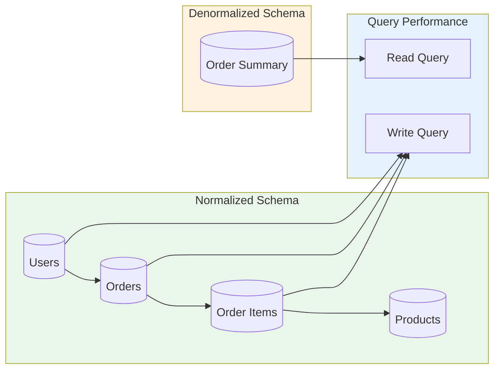
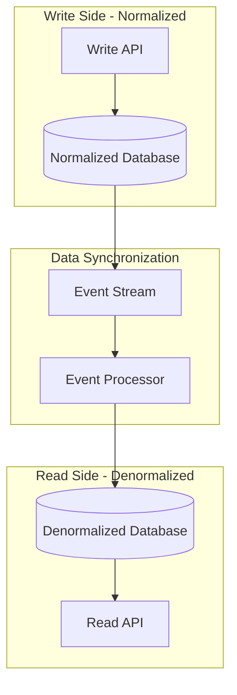

# 🗄️ Database Design: Normalization vs. Denormalization

A comprehensive guide to database design principles, covering normalization theory, denormalization strategies, and when to use each approach for optimal performance and maintainability.

---

## 🗺️ Table of Contents
1. [Database Design Overview](#1-database-design-overview)
2. [Normalization Principles](#2-normalization-principles)
3. [Denormalization Strategies](#3-denormalization-strategies)
4. [Comparison and Trade-offs](#4-comparison-and-trade-offs)
5. [Hybrid Approaches](#5-hybrid-approaches)
6. [Best Practices](#6-best-practices)

---

## 1. Database Design Overview

### **What is Database Design?**
The process of producing a detailed data model of a database. It involves defining tables, fields, relationships, keys, and constraints to ensure data integrity, performance, and scalability.

### **Design Goals**
- **Data Integrity**: Ensure accuracy and consistency
- **Performance**: Optimize query speed and resource usage
- **Scalability**: Support growth and increasing data volumes
- **Maintainability**: Easy to understand and modify
- **Flexibility**: Adapt to changing requirements

### **Key Design Considerations**
| Aspect | Questions to Ask |
|---------|------------------|
| **Data Volume** | How much data will you store? |
| **Query Patterns** | What are the most common queries? |
| **Update Frequency** | How often does data change? |
| **Concurrent Users** | How many users access data simultaneously? |
| **Performance Requirements** | What are the response time expectations? |

---

## 2. Normalization Principles

### **What is Normalization?**
The process of organizing data in a database to reduce data redundancy and improve data integrity. It involves dividing large tables into smaller, well-structured tables and defining relationships between them.

### **Normal Forms**

#### **First Normal Form (1NF)**
- Each table cell contains atomic (indivisible) values
- Each record is unique (primary key)
- No repeating groups

**Example:**
```sql
-- Unnormalized
CREATE TABLE orders (
    order_id INT PRIMARY KEY,
    customer_name VARCHAR(100),
    customer_email VARCHAR(100),
    products TEXT, -- "Product1,Product2,Product3"
    order_date DATE
);

-- 1NF Normalized
CREATE TABLE orders (
    order_id INT PRIMARY KEY,
    customer_name VARCHAR(100),
    customer_email VARCHAR(100),
    order_date DATE
);

CREATE TABLE order_items (
    item_id INT PRIMARY KEY,
    order_id INT,
    product_name VARCHAR(100),
    quantity INT,
    price DECIMAL(10,2),
    FOREIGN KEY (order_id) REFERENCES orders(order_id)
);
```

#### **Second Normal Form (2NF)**
- Must be in 1NF
- All non-key attributes depend on the entire primary key
- No partial dependencies

**Example:**
```sql
-- 1NF but not 2NF
CREATE TABLE order_details (
    order_id INT,
    product_id INT,
    product_name VARCHAR(100),  -- Depends only on product_id
    product_price DECIMAL(10,2), -- Depends only on product_id
    quantity INT,                    -- Depends on both order_id and product_id
    PRIMARY KEY (order_id, product_id)
);

-- 2NF Normalized
CREATE TABLE products (
    product_id INT PRIMARY KEY,
    product_name VARCHAR(100),
    product_price DECIMAL(10,2)
);

CREATE TABLE order_items (
    order_id INT,
    product_id INT,
    quantity INT,
    PRIMARY KEY (order_id, product_id),
    FOREIGN KEY (product_id) REFERENCES products(product_id)
);
```

#### **Third Normal Form (3NF)**
- Must be in 2NF
- No transitive dependencies
- Non-key attributes don't depend on other non-key attributes

**Example:**
```sql
-- 2NF but not 3NF
CREATE TABLE employees (
    employee_id INT PRIMARY KEY,
    department_name VARCHAR(100),  -- Depends on department_id
    department_location VARCHAR(100), -- Depends on department_name
    employee_name VARCHAR(100),
    salary DECIMAL(10,2)
);

-- 3NF Normalized
CREATE TABLE departments (
    department_id INT PRIMARY KEY,
    department_name VARCHAR(100),
    department_location VARCHAR(100)
);

CREATE TABLE employees (
    employee_id INT PRIMARY KEY,
    department_id INT,
    employee_name VARCHAR(100),
    salary DECIMAL(10,2),
    FOREIGN KEY (department_id) REFERENCES departments(department_id)
);
```

### **Normalization Benefits**
- **Reduced Data Redundancy**: Eliminate duplicate data
- **Improved Data Integrity**: Prevent update anomalies
- **Consistent Data**: Single source of truth
- **Easier Maintenance**: Changes in one place
- **Storage Efficiency**: Less storage space required

### **Normalization Challenges**
- **Complex Queries**: More joins required
- **Performance Impact**: Join operations can be slow
- **Development Overhead**: More complex schema
- **Read Performance**: Slower for read-heavy workloads

---

## 3. Denormalization Strategies

### **What is Denormalization?**
The process of intentionally adding redundancy to a database to improve read performance by reducing the number of joins needed for common queries.

### **When to Denormalize**
- **Read-Heavy Workloads**: Frequent read operations
- **Performance Requirements**: Low latency requirements
- **Complex Queries**: Multi-table joins are common
- **Reporting Systems**: Aggregate data for analytics
- **Materialized Views**: Pre-computed results

### **Denormalization Techniques**

#### **Flattening Tables**
Combine related tables to reduce joins.

**Example:**
```sql
-- Normalized (multiple joins required)
SELECT 
    u.user_id, u.name, u.email,
    o.order_id, o.order_date,
    p.product_name, oi.quantity, oi.price
FROM users u
JOIN orders o ON u.user_id = o.user_id
JOIN order_items oi ON o.order_id = oi.order_id
JOIN products p ON oi.product_id = p.product_id;

-- Denormalized (single table)
CREATE TABLE user_order_summary (
    summary_id INT PRIMARY KEY,
    user_id INT,
    user_name VARCHAR(100),
    user_email VARCHAR(100),
    order_id INT,
    order_date DATE,
    product_name VARCHAR(100),
    quantity INT,
    price DECIMAL(10,2)
);
```

#### **Adding Redundant Data**
Store frequently accessed data in multiple places.

**Example:**
```sql
-- Add user info to orders table
ALTER TABLE orders ADD COLUMN user_name VARCHAR(100);
ALTER TABLE orders ADD COLUMN user_email VARCHAR(100);

-- Update with redundant data
UPDATE orders o 
SET user_name = u.name, user_email = u.email
FROM users u 
WHERE o.user_id = u.user_id;
```

#### **Pre-aggregation**
Store computed values to avoid runtime calculations.

**Example:**
```sql
-- Add pre-computed totals
ALTER TABLE orders ADD COLUMN total_amount DECIMAL(10,2);
ALTER TABLE orders ADD COLUMN item_count INT;

-- Update with aggregated values
UPDATE orders o 
SET total_amount = (
    SELECT SUM(oi.quantity * oi.price)
    FROM order_items oi 
    WHERE oi.order_id = o.order_id
),
item_count = (
    SELECT COUNT(*)
    FROM order_items oi 
    WHERE oi.order_id = o.order_id
);
```

#### **Reference Data Duplication**
Duplicate reference data in transaction tables.

**Example:**
```sql
-- Instead of just storing product_id
CREATE TABLE order_items (
    item_id INT PRIMARY KEY,
    order_id INT,
    product_id INT,
    product_name VARCHAR(100),    -- Redundant
    product_price DECIMAL(10,2),  -- Redundant
    quantity INT
);
```

### **Denormalization Benefits**
- **Improved Read Performance**: Fewer joins required
- **Simpler Queries**: Less complex SQL
- **Better Reporting**: Faster aggregate queries
- **Reduced CPU Usage**: Less join processing

### **Denormalization Challenges**
- **Data Redundancy**: Duplicate data storage
- **Update Anomalies**: Risk of inconsistent data
- **Increased Storage**: More disk space required
- **Complex Maintenance**: Updates affect multiple locations

---

## 4. Comparison and Trade-offs

### **Decision Matrix**
| Factor | Normalization | Denormalization |
|---------|----------------|-------------------|
| **Read Performance** | Slower (joins) | Faster (single table) |
| **Write Performance** | Faster (single location) | Slower (multiple updates) |
| **Storage Efficiency** | Better (no redundancy) | Worse (redundant data) |
| **Data Consistency** | Higher (single source) | Lower (multiple copies) |
| **Query Complexity** | Higher (many joins) | Lower (simple selects) |
| **Maintenance** | Easier (one place) | Harder (sync required) |
| **Flexibility** | Higher (structured) | Lower (rigid schema) |

### **Use Case Guidelines**

#### **Use Normalization When:**
- **OLTP Systems**: Online Transaction Processing
- **High Write Volume**: Frequent data modifications
- **Data Integrity Critical**: Financial, medical systems
- **Complex Relationships**: Many-to-many relationships
- **Storage Constraints**: Limited disk space

#### **Use Denormalization When:**
- **Read-Heavy Applications**: Analytics, reporting
- **Performance Critical**: Low latency requirements
- **Simple Access Patterns**: Predominantly read operations
- **Data Warehousing**: Historical analysis
- **Caching Layer**: Pre-computed results

### **Performance Comparison**



---

## 5. Hybrid Approaches

### **Progressive Denormalization**
Start with normalized design and selectively denormalize based on performance requirements.

```sql
-- Core normalized tables
CREATE TABLE users (user_id INT PRIMARY KEY, name VARCHAR(100), email VARCHAR(100));
CREATE TABLE orders (order_id INT PRIMARY KEY, user_id INT, order_date DATE);
CREATE TABLE order_items (item_id INT PRIMARY KEY, order_id INT, product_id INT, quantity INT);

-- Denormalized reporting table
CREATE TABLE order_reports (
    report_id INT PRIMARY KEY,
    user_id INT,
    user_name VARCHAR(100),        -- Redundant for reports
    order_id INT,
    order_date DATE,
    total_items INT,               -- Pre-calculated
    total_amount DECIMAL(10,2)     -- Pre-calculated
);

-- Keep in sync with triggers
CREATE TRIGGER update_order_report
AFTER INSERT OR UPDATE ON order_items
FOR EACH ROW
BEGIN
    UPDATE order_reports 
    SET total_items = (
        SELECT SUM(quantity) 
        FROM order_items 
        WHERE order_id = NEW.order_id
    ),
    total_amount = (
        SELECT SUM(oi.quantity * p.price)
        FROM order_items oi
        JOIN products p ON oi.product_id = p.product_id
        WHERE oi.order_id = NEW.order_id
    )
    WHERE order_id = NEW.order_id;
END;
```

### **Materialized Views**
Pre-computed results stored as tables for complex queries.

```sql
-- Materialized view for user order summary
CREATE MATERIALIZED VIEW user_order_summary AS
SELECT 
    u.user_id,
    u.name,
    u.email,
    COUNT(DISTINCT o.order_id) as order_count,
    SUM(oi.quantity) as total_items,
    SUM(oi.quantity * p.price) as total_spent,
    MAX(o.order_date) as last_order_date
FROM users u
LEFT JOIN orders o ON u.user_id = o.user_id
LEFT JOIN order_items oi ON o.order_id = oi.order_id
LEFT JOIN products p ON oi.product_id = p.product_id
GROUP BY u.user_id, u.name, u.email;

-- Refresh strategy
CREATE OR REPLACE FUNCTION refresh_user_summary()
RETURNS void AS $$
BEGIN
    REFRESH MATERIALIZED VIEW user_order_summary;
END;
$$ LANGUAGE plpgsql;

-- Schedule refresh
SELECT cron.schedule('refresh-user-summary', '0 2 * * *', $$SELECT refresh_user_summary();$$);
```

### **CQRS with Separate Stores**
Use normalized for writes, denormalized for reads.



### **Hybrid Schema Example**
```sql
-- Core normalized entities
CREATE TABLE customers (
    customer_id INT PRIMARY KEY,
    name VARCHAR(100),
    email VARCHAR(100),
    phone VARCHAR(20),
    created_at TIMESTAMP
);

CREATE TABLE addresses (
    address_id INT PRIMARY KEY,
    customer_id INT,
    street VARCHAR(200),
    city VARCHAR(100),
    state VARCHAR(50),
    zip VARCHAR(20),
    is_primary BOOLEAN DEFAULT FALSE,
    FOREIGN KEY (customer_id) REFERENCES customers(customer_id)
);

-- Denormalized customer view for fast lookups
CREATE TABLE customer_view (
    customer_id INT PRIMARY KEY,
    name VARCHAR(100),
    email VARCHAR(100),
    phone VARCHAR(20),
    primary_street VARCHAR(200),
    primary_city VARCHAR(100),
    primary_state VARCHAR(50),
    primary_zip VARCHAR(20),
    created_at TIMESTAMP,
    last_updated TIMESTAMP
);

-- Sync procedure
CREATE OR REPLACE PROCEDURE sync_customer_view()
LANGUAGE plpgsql AS $$
BEGIN
    -- Update primary address in customer view
    UPDATE customer_view cv
    SET 
        primary_street = a.street,
        primary_city = a.city,
        primary_state = a.state,
        primary_zip = a.zip,
        last_updated = NOW()
    FROM addresses a
    WHERE a.customer_id = cv.customer_id 
    AND a.is_primary = TRUE;
    
    -- Insert new customers
    INSERT INTO customer_view (customer_id, name, email, phone, created_at, last_updated)
    SELECT c.customer_id, c.name, c.email, c.phone, c.created_at, NOW()
    FROM customers c
    WHERE NOT EXISTS (
        SELECT 1 FROM customer_view cv WHERE cv.customer_id = c.customer_id
    );
END;
$$;
```

---

## 6. Best Practices

### **Design Principles**

#### **Start Normalized**
- Begin with fully normalized design
- Understand data relationships thoroughly
- Document all dependencies
- Validate with normal forms

#### **Measure Performance**
- Profile actual query patterns
- Identify bottlenecks
- Test with realistic data volumes
- Monitor production performance

#### **Selective Denormalization**
- Only denormalize hot paths
- Keep critical data normalized
- Document denormalization decisions
- Implement data validation

### **Implementation Guidelines**

#### **Data Consistency**
```sql
-- Use constraints to maintain consistency
ALTER TABLE orders ADD CONSTRAINT check_total_amount 
CHECK (total_amount >= 0);

-- Use triggers for complex validation
CREATE TRIGGER validate_order_total
BEFORE INSERT OR UPDATE ON orders
FOR EACH ROW
BEGIN
    IF NEW.total_amount < 0 THEN
        RAISE EXCEPTION 'Invalid total amount';
    END IF;
END;
```

#### **Performance Monitoring**
```sql
-- Create performance monitoring views
CREATE VIEW slow_queries AS
SELECT 
    query,
    calls,
    total_time,
    mean_time,
    rows
FROM pg_stat_statements 
WHERE mean_time > 100  -- queries slower than 100ms
ORDER BY mean_time DESC;

-- Monitor table sizes
SELECT 
    schemaname,
    tablename,
    pg_size_pretty(pg_total_relation_size(schemaname::regclass, tablename::regclass)) as size
FROM pg_tables 
ORDER BY pg_total_relation_size(schemaname::regclass, tablename::regclass) DESC;
```

#### **Data Synchronization**
```sql
-- Audit trail for denormalized data
CREATE TABLE denormalization_audit (
    audit_id SERIAL PRIMARY KEY,
    table_name VARCHAR(100),
    record_id INT,
    operation VARCHAR(10),
    old_values JSONB,
    new_values JSONB,
    changed_at TIMESTAMP DEFAULT NOW(),
    changed_by VARCHAR(100)
);

-- Trigger for tracking changes
CREATE TRIGGER audit_customer_changes
AFTER UPDATE OR DELETE ON customer_view
FOR EACH ROW
BEGIN
    IF TG_OP = 'UPDATE' THEN
        INSERT INTO denormalization_audit 
        (table_name, record_id, operation, old_values, new_values, changed_by)
        VALUES (
            'customer_view', 
            OLD.customer_id, 
            'UPDATE', 
            row_to_json(OLD), 
            row_to_json(NEW),
            current_user
        );
    ELSIF TG_OP = 'DELETE' THEN
        INSERT INTO denormalization_audit 
        (table_name, record_id, operation, old_values, changed_by)
        VALUES (
            'customer_view', 
            OLD.customer_id, 
            'DELETE', 
            row_to_json(OLD),
            current_user
        );
    END IF;
END;
```

### **Migration Strategies**

#### **Gradual Migration**
```sql
-- Step 1: Add denormalized columns
ALTER TABLE orders ADD COLUMN customer_name VARCHAR(100);
ALTER TABLE orders ADD COLUMN customer_email VARCHAR(100);

-- Step 2: Populate with data
UPDATE orders o 
SET customer_name = c.name, customer_email = c.email
FROM customers c 
WHERE o.customer_id = c.customer_id;

-- Step 3: Create indexes for performance
CREATE INDEX idx_orders_customer_name ON orders(customer_name);
CREATE INDEX idx_orders_customer_email ON orders(customer_email);

-- Step 4: Update application to use new columns
-- Step 5: Remove old joins when no longer needed
```

#### **Rollback Planning**
```sql
-- Create rollback procedures
CREATE OR REPLACE PROCEDURE rollback_denormalization()
LANGUAGE plpgsql AS $$
BEGIN
    -- Remove denormalized columns
    ALTER TABLE orders DROP COLUMN IF EXISTS customer_name;
    ALTER TABLE orders DROP COLUMN IF EXISTS customer_email;
    
    -- Drop indexes
    DROP INDEX IF EXISTS idx_orders_customer_name;
    DROP INDEX IF EXISTS idx_orders_customer_email;
    
    -- Log rollback
    INSERT INTO migration_log 
    (action, timestamp, details) 
    VALUES ('rollback_denormalization', NOW(), 'Successfully rolled back denormalization');
END;
$$;
```

---

## 🚀 Getting Started

### **Design Process**
1. **Requirements Analysis**: Understand data access patterns
2. **Normalization**: Create normalized schema
3. **Performance Testing**: Identify bottlenecks
4. **Selective Denormalization**: Optimize hot paths
5. **Implementation**: Apply changes gradually
6. **Monitoring**: Track performance and consistency

### **Tools and Techniques**
- **ER Diagrams**: Visualize relationships
- **Schema Migration Tools**: Automated deployments
- **Performance Profiling**: Query analysis
- **Data Validation**: Consistency checks

---

## 📚 Further Reading

- [Database Normalization](https://en.wikipedia.org/wiki/Database_normalization)
- [Denormalization Patterns](https://www.cs.umd.edu/users/pschneider/book/chapter6.html)
- [SQL Performance Tuning](https://use-the-index-luke.com/)
- [Database Design Principles](https://www.agiledata.org/essays/tdd-database-design.html)

---

[⬅️ Back to Data & Storage](../README.md)
