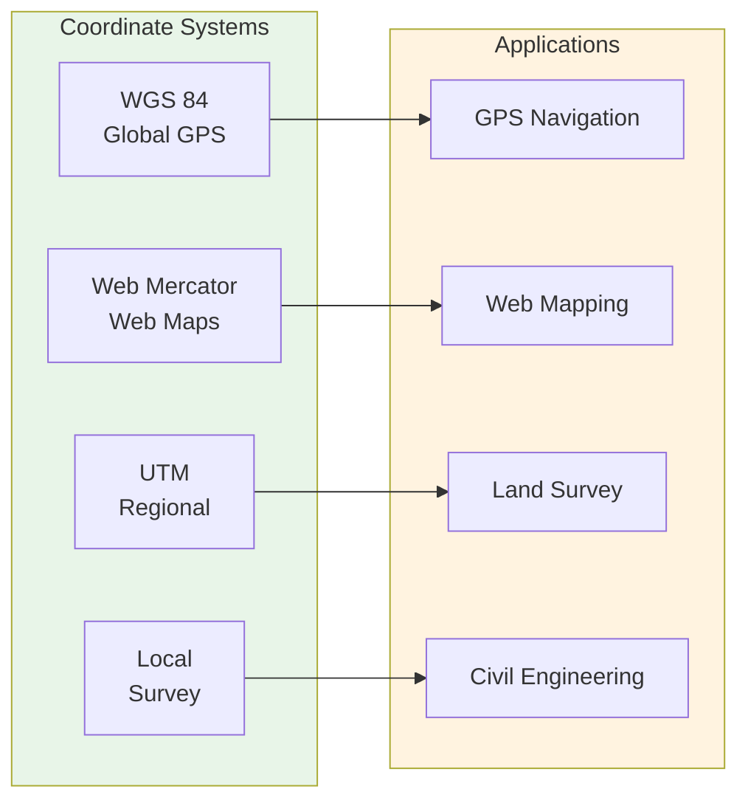
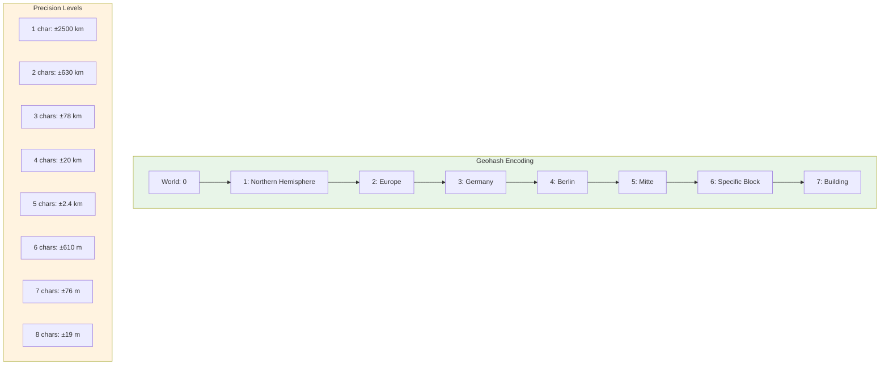
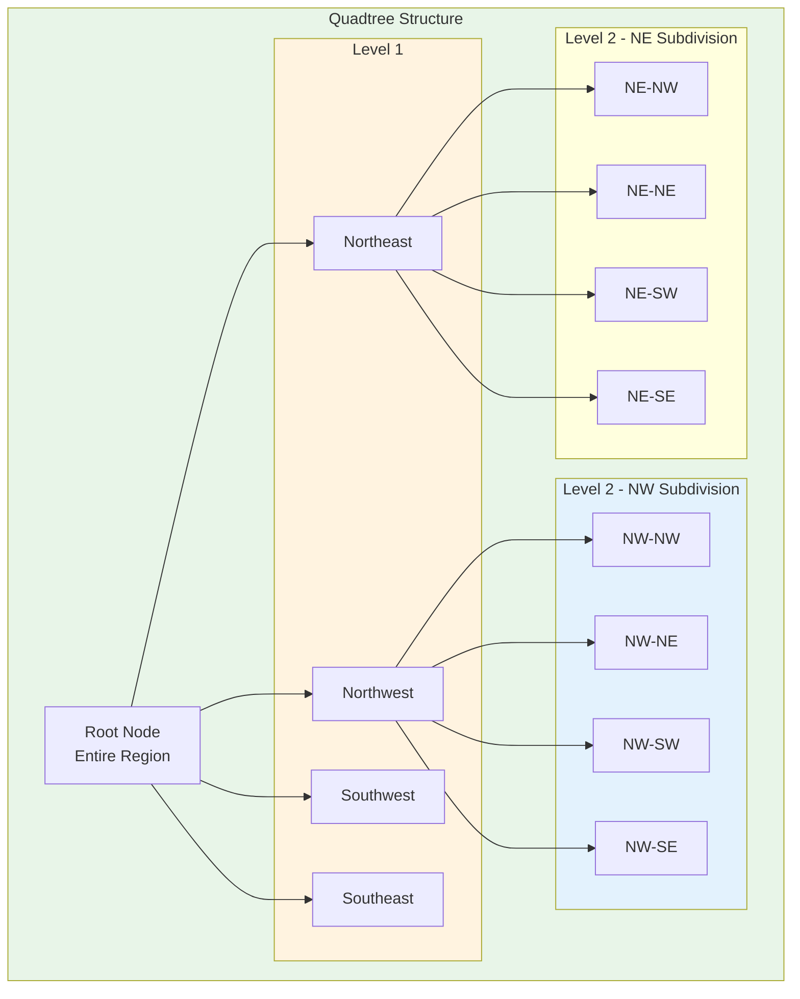
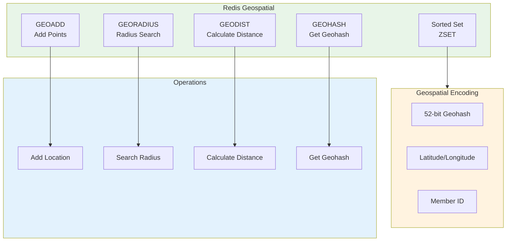
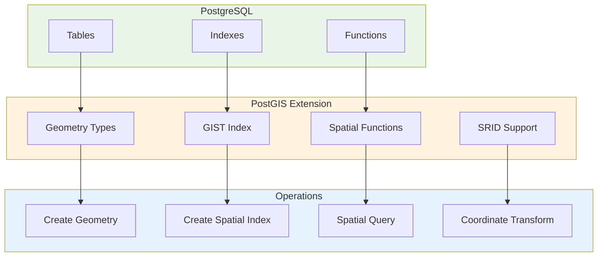
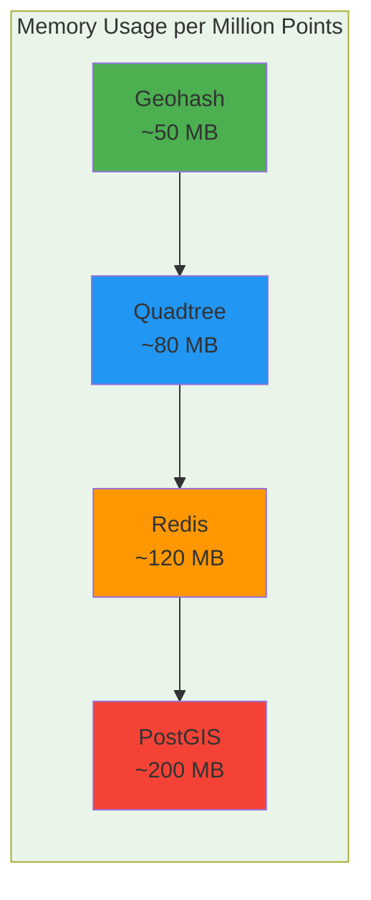

# 🗺️ Geospatial Indexing

A comprehensive guide to geospatial indexing strategies, covering Geohashes, Quadtrees, and implementations in Redis and PostgreSQL/PostGIS for efficient location-based queries.

---

## 🗺️ Table of Contents
1. [Geospatial Data Overview](#1-geospatial-data-overview)
2. [Geohashes](#2-geohashes)
3. [Quadtrees](#3-quadtrees)
4. [Redis Geospatial Indexing](#4-redis-geospatial-indexing)
5. [PostgreSQL/PostGIS Geospatial Indexing](#5-postgresqlpostgis-geospatial-indexing)
6. [Performance Comparison](#6-performance-comparison)
7. [Use Case Selection](#7-use-case-selection)

---

## 1. Geospatial Data Overview

### **What is Geospatial Data?**
Data that represents objects, events, or phenomena with a location on or near the surface of the earth. Common representations include:

- **Points**: Specific locations (latitude, longitude)
- **Lines**: Roads, rivers, boundaries
- **Polygons**: Areas, regions, buildings
- **Multi-geometries**: Complex shapes with multiple components

### **Coordinate Systems**


### **Common Operations**
- **Distance Queries**: Find points within radius
- **Bounding Box Queries**: Find points in rectangular area
- **Nearest Neighbor**: Find closest points
- **Polygon Containment**: Check if point is in polygon
- **Spatial Joins**: Find intersections between geometries

---

## 2. Geohashes

### **What are Geohashes?**
Geohash is a hierarchical spatial data structure that subdivides space into buckets of grid shape, using a base-32 representation. Each character represents a subdivision of the previous character's area.

### **Geohash Structure**


### **Geohash Algorithm**
```
1. Start with latitude range [-90, 90] and longitude range [-180, 180]
2. For each bit in the geohash:
   - If bit position is even: bisect latitude range
   - If bit position is odd: bisect longitude range
   - Choose 0 for lower half, 1 for upper half
3. Convert binary string to base-32 characters
4. Characters: 0123456789bcdefghjkmnpqrstuvwxyz
```

### **Geohash Properties**

| Property | Description |
|----------|-------------|
| **Hierarchical** | Prefixes represent larger areas |
| **Spatial Proximity** | Similar geohashes are geographically close |
| **Edge Cases** | Points near boundaries may have different geohashes |
| **Precision** | More characters = higher precision |
| **Base-32** | Compact string representation |

### **Geohash Implementation**

#### **Python Example**
```python
import geohash

# Encode coordinates to geohash
lat, lon = 52.5200, 13.4050  # Berlin
geohash_code = geohash.encode(lat, lon, precision=7)
print(f"Geohash: {geohash_code}")  # u33dbfc

# Decode geohash to coordinates
decoded_lat, decoded_lon = geohash.decode(geohash_code)
print(f"Decoded: {decoded_lat}, {decoded_lon}")

# Get neighboring geohashes (8 neighbors)
neighbors = geohash.neighbors(geohash_code)
print(f"Neighbors: {neighbors}")

# Calculate geohash bounding box
bounds = geohash.bounds(geohash_code)
print(f"Bounds: {bounds}")
```

#### **JavaScript Example**
```javascript
const Geohash = require('latlon-geohash');

// Encode coordinates to geohash
const lat = 52.5200;
const lon = 13.4050;
const geohash = Geohash.encode(lat, lon, 7);
console.log(`Geohash: ${geohash}`);  // u33dbfc

// Decode geohash to coordinates
const decoded = Geohash.decode(geohash);
console.log(`Decoded: ${decoded.lat}, ${decoded.lon}`);

// Get neighboring geohashes
const neighbors = Geohash.neighbors(geohash);
console.log(`Neighbors: ${neighbors}`);

// Calculate bounding box
const bounds = Geohash.bounds(geohash);
console.log(`Bounds: ${bounds}`);
```

### **Geohash Use Cases**

#### **Location-Based Search**
```python
# Find nearby points using geohash prefix matching
def find_nearby_points(target_lat, target_lon, radius_km, points):
    target_geohash = geohash.encode(target_lat, target_lon, precision=7)
    target_prefix = target_geohash[:5]  # Use prefix for broader search
    
    nearby_points = []
    for point in points:
        point_geohash = geohash.encode(point['lat'], point['lon'], precision=7)
        if point_geohash.startswith(target_prefix):
            distance = calculate_distance(target_lat, target_lon, point['lat'], point['lon'])
            if distance <= radius_km:
                nearby_points.append(point)
    
    return nearby_points
```

#### **Geospatial Clustering**
```python
# Cluster points using geohash precision
def cluster_points_by_geohash(points, precision=5):
    clusters = {}
    for point in points:
        geohash_code = geohash.encode(point['lat'], point['lon'], precision)
        if geohash_code not in clusters:
            clusters[geohash_code] = []
        clusters[geohash_code].append(point)
    return clusters
```

---

## 3. Quadtrees

### **What are Quadtrees?**
A quadtree is a tree data structure in which each internal node has exactly four children. Quadtrees are most often used to partition a two-dimensional space by recursively subdividing it into four quadrants or regions.

### **Quadtree Structure**


### **Quadtree Algorithm**
```
1. Start with root node representing entire region
2. If node contains more points than capacity:
   - Subdivide into 4 quadrants (NW, NE, SW, SE)
   - Distribute points to appropriate quadrants
   - Recursively apply to each quadrant
3. Stop when nodes have <= capacity points or max depth reached
```

### **Quadtree Implementation**

#### **Python Example**
```python
class QuadTreeNode:
    def __init__(self, bounds, capacity=4, depth=0, max_depth=10):
        self.bounds = bounds  # (min_x, min_y, max_x, max_y)
        self.capacity = capacity
        self.depth = depth
        self.max_depth = max_depth
        self.points = []
        self.divided = False
        self.children = None
    
    def insert(self, point):
        if not self._contains(point):
            return False
        
        if len(self.points) < self.capacity or self.depth >= self.max_depth:
            self.points.append(point)
            return True
        
        if not self.divided:
            self._subdivide()
        
        return self._insert_to_children(point)
    
    def _contains(self, point):
        x, y = point
        min_x, min_y, max_x, max_y = self.bounds
        return min_x <= x <= max_x and min_y <= y <= max_y
    
    def _subdivide(self):
        min_x, min_y, max_x, max_y = self.bounds
        mid_x = (min_x + max_x) / 2
        mid_y = (min_y + max_y) / 2
        
        self.children = [
            QuadTreeNode((min_x, mid_y, mid_x, max_y), self.capacity, self.depth + 1, self.max_depth),  # NW
            QuadTreeNode((mid_x, mid_y, max_x, max_y), self.capacity, self.depth + 1, self.max_depth),  # NE
            QuadTreeNode((min_x, min_y, mid_x, mid_y), self.capacity, self.depth + 1, self.max_depth),  # SW
            QuadTreeNode((mid_x, min_y, max_x, mid_y), self.capacity, self.depth + 1, self.max_depth),  # SE
        ]
        self.divided = True
        
        # Redistribute existing points
        for point in self.points:
            self._insert_to_children(point)
        self.points = []
    
    def _insert_to_children(self, point):
        for child in self.children:
            if child.insert(point):
                return True
        return False
    
    def query_range(self, range_bounds):
        points = []
        
        if not self._intersects(range_bounds):
            return points
        
        for point in self.points:
            if self._point_in_range(point, range_bounds):
                points.append(point)
        
        if self.divided:
            for child in self.children:
                points.extend(child.query_range(range_bounds))
        
        return points
    
    def _intersects(self, range_bounds):
        min_x, min_y, max_x, max_y = self.bounds
        r_min_x, r_min_y, r_max_x, r_max_y = range_bounds
        return not (max_x < r_min_x or min_x > r_max_x or max_y < r_min_y or min_y > r_max_y)
    
    def _point_in_range(self, point, range_bounds):
        x, y = point
        r_min_x, r_min_y, r_max_x, r_max_y = range_bounds
        return r_min_x <= x <= r_max_x and r_min_y <= y <= r_max_y

# Usage
bounds = (-180, -90, 180, 90)  # World bounds
quadtree = QuadTreeNode(bounds, capacity=4)

# Insert points
points = [(52.5200, 13.4050), (40.7128, -74.0060), (35.6762, 139.6503)]
for point in points:
    quadtree.insert(point)

# Query range
range_bounds = (10, 50, 15, 55)  # Berlin area
results = quadtree.query_range(range_bounds)
```

### **Quadtree Properties**

| Property | Description |
|----------|-------------|
| **Hierarchical** | Recursive subdivision of space |
| **Adaptive** | Only subdivides where needed |
| **Balanced** | Depth depends on point distribution |
| **Efficient** | Fast range queries and nearest neighbor |
| **Memory** | Memory usage proportional to point density |

### **Quadtree Use Cases**

#### **Spatial Indexing**
```python
# Build spatial index for fast queries
def build_spatial_index(points, bounds, capacity=10):
    quadtree = QuadTreeNode(bounds, capacity=capacity)
    for point in points:
        quadtree.insert(point)
    return quadtree

# Query points in bounding box
def query_points_in_box(quadtree, min_x, min_y, max_x, max_y):
    range_bounds = (min_x, min_y, max_x, max_y)
    return quadtree.query_range(range_bounds)
```

#### **Collision Detection**
```python
# Find potential collisions using quadtree
def find_collisions(quadtree, object_bounds):
    # Query quadtree for objects in same region
    nearby_objects = quadtree.query_range(object_bounds)
    
    collisions = []
    for obj in nearby_objects:
        if check_collision(object_bounds, obj):
            collisions.append(obj)
    
    return collisions
```

---

## 4. Redis Geospatial Indexing

### **Redis Geospatial Commands**
Redis provides built-in geospatial commands using sorted sets with geospatial encoding.

### **Redis Geospatial Architecture**


### **Redis Geospatial Commands**

#### **GEOADD - Add Locations**
```redis
# Add locations to a geospatial index
GEOADD locations 13.4050 52.5200 "Berlin"
GEOADD locations -74.0060 40.7128 "New York"
GEOADD locations 139.6503 35.6762 "Tokyo"
GEOADD locations -0.1278 51.5074 "London"
```

#### **GEODIST - Calculate Distance**
```redis
# Calculate distance between two locations
GEODIST locations Berlin London km
# Result: 933.88 km

GEODIST locations Berlin New York mi
# Result: 3965.12 mi
```

#### **GEORADIUS - Radius Search**
```redis
# Find locations within radius
GEORADIUS locations 13.4050 52.5200 1000 km
# Returns: London

# With distance and coordinates
GEORADIUS locations 13.4050 52.5200 1000 km WITHDIST WITHCOORD

# Count only
GEORADIUS locations 13.4050 52.5200 1000 km COUNT 10

# Sort by distance
GEORADIUS locations 13.4050 52.5200 1000 km ASC
```

#### **GEOHASH - Get Geohash**
```redis
# Get geohash for a location
GEOHASH locations Berlin
# Result: "u33dbfc"
```

#### **GEOPOS - Get Coordinates**
```redis
# Get coordinates for a location
GEOPOS locations Berlin
# Result: 1) "13.4050000000000000" 2) "52.5200000000000000"
```

### **Redis Geospatial Implementation**

#### **Python Example**
```python
import redis

# Connect to Redis
r = redis.Redis(host='localhost', port=6379, db=0)

# Add locations
r.geoadd('locations', 13.4050, 52.5200, 'Berlin')
r.geoadd('locations', -74.0060, 40.7128, 'New York')
r.geoadd('locations', 139.6503, 35.6762, 'Tokyo')
r.geoadd('locations', -0.1278, 51.5074, 'London')

# Calculate distance
distance = r.geodist('locations', 'Berlin', 'London', unit='km')
print(f"Distance Berlin-London: {distance} km")

# Radius search
nearby = r.georadius('locations', 13.4050, 52.5200, 1000, unit='km', withdist=True)
print(f"Nearby locations: {nearby}")

# Get geohash
geohash = r.geohash('locations', 'Berlin')
print(f"Berlin geohash: {geohash}")

# Get coordinates
coordinates = r.geopos('locations', 'Berlin')
print(f"Berlin coordinates: {coordinates}")
```

#### **Node.js Example**
```javascript
const redis = require('redis');
const client = redis.createClient();

async function geospatialOperations() {
    await client.connect();
    
    // Add locations
    await client.geoAdd('locations', {
        member: 'Berlin',
        longitude: 13.4050,
        latitude: 52.5200
    });
    
    await client.geoAdd('locations', {
        member: 'New York',
        longitude: -74.0060,
        latitude: 40.7128
    });
    
    // Calculate distance
    const distance = await client.geoDist('locations', 'Berlin', 'London', 'km');
    console.log(`Distance Berlin-London: ${distance} km`);
    
    // Radius search
    const nearby = await client.geoRadius('locations', {
        longitude: 13.4050,
        latitude: 52.5200,
        radius: 1000,
        unit: 'km',
        withCoordinates: true,
        withDistance: true
    });
    console.log(`Nearby locations: ${nearby}`);
    
    await client.disconnect();
}

geospatialOperations();
```

### **Redis Geospatial Use Cases**

#### **Location-Based Services**
```python
# Find nearby businesses
def find_nearby_businesses(user_lat, user_lon, radius_km):
    nearby = r.georadius(
        'businesses',
        user_lon, user_lat,
        radius_km, unit='km',
        withdist=True, withcoord=True
    )
    
    return [
        {
            'name': member,
            'distance': dist,
            'coordinates': coord
        }
        for member, dist, coord in nearby
    ]
```

#### **Geofencing**
```python
# Check if user is within geofence
def check_geofence(user_id, fence_id):
    user_location = r.geopos('users', user_id)
    fence_center = r.geopos('fences', fence_id)
    fence_radius = r.hget('fence_radii', fence_id)
    
    distance = r.geodist(
        'users', user_id,
        'fences', fence_id,
        unit='m'
    )
    
    return float(distance) <= float(fence_radius)
```

---

## 5. PostgreSQL/PostGIS Geospatial Indexing

### **PostGIS Overview**
PostGIS is a spatial database extender for PostgreSQL. It adds support for geographic objects, allowing location queries to be run in SQL.

### **PostGIS Architecture**


### **PostGIS Installation**
```sql
-- Enable PostGIS extension
CREATE EXTENSION IF NOT EXISTS postgis;
CREATE EXTENSION IF NOT EXISTS postgis_topology;

-- Verify installation
SELECT PostGIS_Version();
```

### **PostGIS Geometry Types**

#### **Point**
```sql
-- Create a point
SELECT ST_MakePoint(13.4050, 52.5200) as point;

-- Create point with SRID (WGS 84)
SELECT ST_SetSRID(ST_MakePoint(13.4050, 52.5200), 4326) as point;

-- Create point from text
SELECT ST_GeomFromText('POINT(13.4050 52.5200)', 4326) as point;
```

#### **LineString**
```sql
-- Create a linestring
SELECT ST_MakeLine(
    ST_MakePoint(13.4050, 52.5200),
    ST_MakePoint(-0.1278, 51.5074)
) as line;

-- Create linestring from text
SELECT ST_GeomFromText('LINESTRING(13.4050 52.5200, -0.1278 51.5074)', 4326) as line;
```

#### **Polygon**
```sql
-- Create a polygon
SELECT ST_MakePolygon(
    ST_MakeLine(
        ARRAY[
            ST_MakePoint(13.4050, 52.5200),
            ST_MakePoint(13.4050, 52.5300),
            ST_MakePoint(13.4150, 52.5300),
            ST_MakePoint(13.4150, 52.5200),
            ST_MakePoint(13.4050, 52.5200)
        ]
    )
) as polygon;

-- Create polygon from text
SELECT ST_GeomFromText('POLYGON((13.4050 52.5200, 13.4050 52.5300, 13.4150 52.5300, 13.4150 52.5200, 13.4050 52.5200))', 4326) as polygon;
```

### **PostGIS Spatial Indexing**

#### **GIST Index**
```sql
-- Create table with geometry column
CREATE TABLE locations (
    id SERIAL PRIMARY KEY,
    name VARCHAR(100),
    geom GEOMETRY(Point, 4326)
);

-- Create GIST spatial index
CREATE INDEX idx_locations_geom ON locations USING GIST (geom);

-- Insert points
INSERT INTO locations (name, geom) VALUES
    ('Berlin', ST_SetSRID(ST_MakePoint(13.4050, 52.5200), 4326)),
    ('New York', ST_SetSRID(ST_MakePoint(-74.0060, 40.7128), 4326)),
    ('Tokyo', ST_SetSRID(ST_MakePoint(139.6503, 35.6762), 4326)),
    ('London', ST_SetSRID(ST_MakePoint(-0.1278, 51.5074), 4326));
```

#### **BRIN Index for Large Datasets**
```sql
-- BRIN index for very large datasets
CREATE INDEX idx_locations_geom_brin ON locations USING BRIN (geom);

-- Useful for data that is naturally ordered (e.g., by time or region)
```

### **PostGIS Spatial Queries**

#### **Distance Queries**
```sql
-- Find locations within radius
SELECT name, 
       ST_Distance(
           geom, 
           ST_SetSRID(ST_MakePoint(13.4050, 52.5200), 4326)
       ) as distance
FROM locations
WHERE ST_DWithin(
    geom,
    ST_SetSRID(ST_MakePoint(13.4050, 52.5200), 4326),
    1000000  -- 1000 km in meters
)
ORDER BY distance;
```

#### **Bounding Box Queries**
```sql
-- Find locations in bounding box
SELECT name, geom
FROM locations
WHERE ST_Within(
    geom,
    ST_MakeEnvelope(
        13.0, 52.0,  -- min_x, min_y
        14.0, 53.0,  -- max_x, max_y
        4326
    )
);
```

#### **Nearest Neighbor**
```sql
-- Find nearest locations
SELECT name, 
       ST_Distance(
           geom, 
           ST_SetSRID(ST_MakePoint(13.4050, 52.5200), 4326)
       ) as distance
FROM locations
ORDER BY geom <-> ST_SetSRID(ST_MakePoint(13.4050, 52.5200), 4326)
LIMIT 5;
```

#### **Polygon Containment**
```sql
-- Check if point is in polygon
SELECT ST_Contains(
    ST_MakePolygon(
        ST_MakeLine(
            ARRAY[
                ST_MakePoint(13.4050, 52.5200),
                ST_MakePoint(13.4050, 52.5300),
                ST_MakePoint(13.4150, 52.5300),
                ST_MakePoint(13.4150, 52.5200),
                ST_MakePoint(13.4050, 52.5200)
            ]
        )
    ),
    ST_SetSRID(ST_MakePoint(13.4100, 52.5250), 4326)
) as is_contained;
```

### **PostGIS Advanced Operations**

#### **Coordinate Transformation**
```sql
-- Transform between coordinate systems
SELECT ST_Transform(
    ST_SetSRID(ST_MakePoint(13.4050, 52.5200), 4326),  -- WGS 84
    3857  -- Web Mercator
) as web_mercator;
```

#### **Buffer Operations**
```sql
-- Create buffer around point
SELECT ST_Buffer(
    ST_SetSRID(ST_MakePoint(13.4050, 52.5200), 4326),
    0.01  -- degrees
) as buffer;
```

#### **Spatial Joins**
```sql
-- Find intersections between layers
SELECT a.name, b.name
FROM areas a, points b
WHERE ST_Intersects(a.geom, b.geom);
```

### **PostGIS Performance Optimization**

#### **Index Maintenance**
```sql
-- Analyze table statistics
ANALYZE locations;

-- Reindex spatial index
REINDEX INDEX idx_locations_geom;

-- Cluster table by spatial index
CLUSTER locations USING idx_locations_geom;
```

#### **Query Optimization**
```sql
-- Use EXPLAIN ANALYZE for query planning
EXPLAIN ANALYZE
SELECT name FROM locations
WHERE ST_DWithin(
    geom,
    ST_SetSRID(ST_MakePoint(13.4050, 52.5200), 4326),
    1000000
);

-- Use && operator for bounding box check first
SELECT name
FROM locations
WHERE geom && ST_MakeEnvelope(13.0, 52.0, 14.0, 53.0, 4326)
  AND ST_Within(geom, ST_MakeEnvelope(13.0, 52.0, 14.0, 53.0, 4326));
```

---

## 6. Performance Comparison

### **Index Type Comparison**

| Feature | Geohash | Quadtree | Redis | PostGIS |
|---------|---------|----------|-------|---------|
| **Implementation Complexity** | Low | Medium | Low | Medium |
| **Memory Usage** | Low | Medium | Low | High |
| **Query Speed** | Fast | Fast | Fast | Variable |
| **Precision Control** | Yes | Yes | Limited | Yes |
| **Complex Queries** | Limited | Limited | Limited | Extensive |
| **Data Types** | Points | Points | Points | All Geometry |
| **Coordinate Systems** | WGS 84 | Any | WGS 84 | Any SRID |
| **Scalability** | Good | Good | Excellent | Good |
| **Persistence** | Application | Application | Redis | Database |

### **Query Performance**

| Query Type | Geohash | Quadtree | Redis | PostGIS |
|------------|---------|----------|-------|---------|
| **Point Search** | O(1) | O(log n) | O(log n) | O(log n) |
| **Radius Search** | O(k) | O(k) | O(log n + k) | O(log n + k) |
| **Nearest Neighbor** | O(n) | O(log n) | O(log n) | O(log n) |
| **Bounding Box** | O(k) | O(k) | O(log n + k) | O(log n + k) |
| **Polygon Query** | Limited | Limited | No | O(log n + k) |

*Where k is the number of results, n is the total number of points*

### **Memory Usage Comparison**



---

## 7. Use Case Selection

### **Decision Matrix**

| Use Case | Recommended Solution | Rationale |
|----------|---------------------|-----------|
| **Simple Location Search** | Redis Geospatial | Fast, easy to implement, built-in commands |
| **Complex Spatial Queries** | PostGIS | Extensive spatial functions, SQL integration |
| **Real-time Location Tracking** | Redis Geospatial | High performance, in-memory operations |
| **Geographic Analysis** | PostGIS | Advanced spatial operations, coordinate transformations |
| **Mobile App Backend** | Redis Geospatial | Low latency, simple API |
| **GIS Applications** | PostGIS | Full GIS support, extensive spatial functions |
| **High-Throughput Services** | Redis Geospatial | Optimized for speed, clustering support |
| **Data Warehousing** | PostGIS | Persistent storage, complex queries |
| **Custom Spatial Index** | Quadtree | Flexible, customizable implementation |
| **Geohash-based Features** | Geohash | Simple string-based indexing |

### **Implementation Guidelines**

#### **When to Use Redis Geospatial**
- Real-time location-based services
- High-throughput location queries
- Simple proximity searches
- Mobile app backends
- Ride-sharing applications
- Social networking features

#### **When to Use PostGIS**
- Complex spatial analysis
- Geographic information systems
- Data warehousing with spatial data
- Applications requiring coordinate transformations
- Complex polygon operations
- Spatial joins and aggregations

#### **When to Use Custom Implementations**
- Specific performance requirements
- Custom spatial algorithms
- Integration with existing systems
- Educational purposes
- Research and development

---

## 🚀 Getting Started

### **Redis Geospatial Quick Start**
```bash
# Install Redis
sudo apt-get install redis-server

# Start Redis
redis-server

# Test geospatial commands
redis-cli
> GEOADD locations 13.4050 52.5200 "Berlin"
> GEORADIUS locations 13.4050 52.5200 1000 km
```

### **PostGIS Quick Start**
```bash
# Install PostGIS
sudo apt-get install postgresql-14-postgis-3

# Create database with PostGIS
createdb geospatial_db
psql -d geospatial_db -c "CREATE EXTENSION postgis;"

# Test spatial queries
psql -d geospatial_db
> SELECT PostGIS_Version();
```

---

## 📚 Further Reading

- [Redis Geospatial Documentation](https://redis.io/commands/geospatial/)
- [PostGIS Documentation](https://postgis.net/documentation/)
- [Geohash Wikipedia](https://en.wikipedia.org/wiki/Geohash)
- [Quadtree Wikipedia](https://en.wikipedia.org/wiki/Quadtree)
- [Spatial Database Best Practices](https://www.postgis.net/workshops/postgis-intro/)

---

[⬅️ Back to Data & Storage](../README.md)
