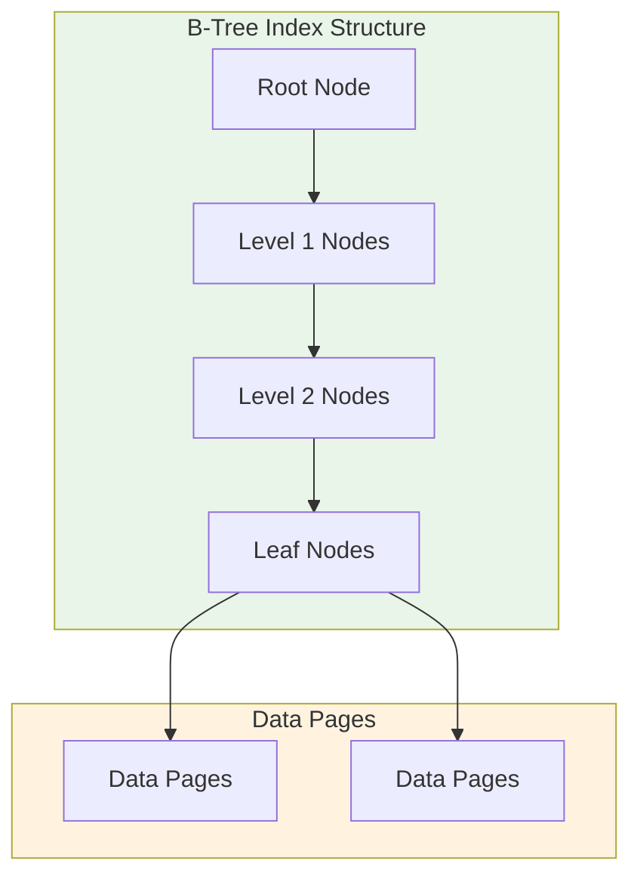
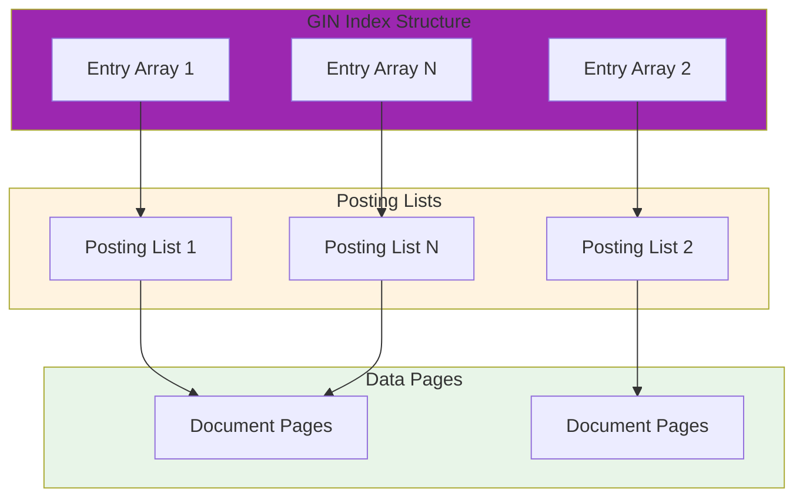
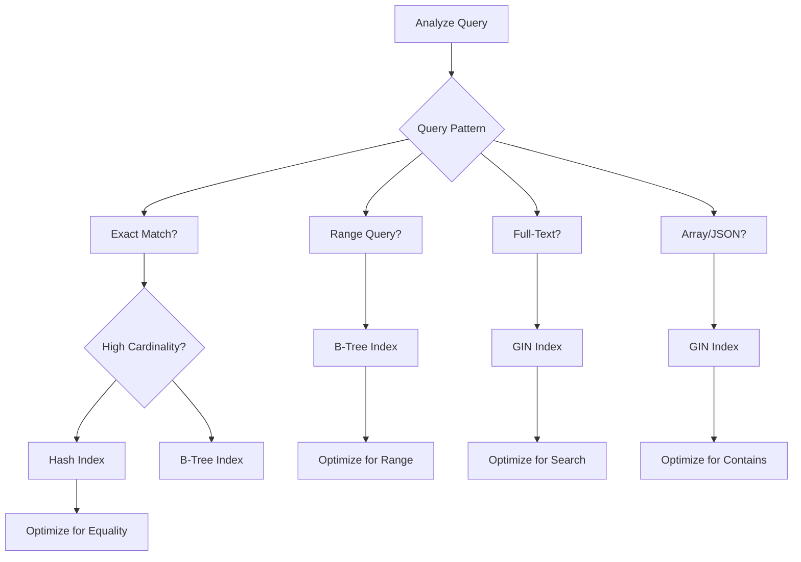

# 🔍 Indexing Strategies (B-Tree, Hash, GIN)

A comprehensive guide to database indexing strategies, covering B-Tree, Hash, and GIN indexes for optimal query performance across different data types and access patterns.

---

## 🗺️ Table of Contents
1. [Indexing Overview](#1-indexing-overview)
2. [B-Tree Indexing](#2-b-tree-indexing)
3. [Hash Indexing](#3-hash-indexing)
4. [GIN Indexing](#4-gin-indexing)
5. [Index Selection Strategies](#5-index-selection-strategies)
6. [Performance Optimization](#6-performance-optimization)

---

## 1. Indexing Overview

### **What is Database Indexing?**
Data structures that improve the speed of data retrieval operations on database tables at the cost of additional writes and storage space.

### **Index Benefits**
- **Faster Queries**: Dramatically reduce query execution time
- **Sorted Access**: Enable efficient range queries
- **Unique Constraints**: Enforce data uniqueness
- **Join Optimization**: Speed up table joins
- **Ordering**: Avoid expensive sorting operations

### **Index Trade-offs**
| Benefit | Cost |
|----------|-------|
| **Query Performance** | Slower writes, more storage |
| **Read Speed** | Increased maintenance overhead |
| **Range Queries** | Complex index management |
| **Memory Usage** | Higher RAM consumption |

---

## 2. B-Tree Indexing

### **B-Tree Structure**


### **B-Tree Characteristics**
- **Balanced Tree**: All leaf nodes at same depth
- **Sorted Order**: Values stored in sorted order
- **Range Queries**: Efficient for range scans
- **Prefix Matching**: Good for LIKE 'prefix%' queries
- **Size**: Grows logarithmically with data volume

### **B-Tree Use Cases**

#### **Primary Key Indexes**
```sql
-- Single column B-Tree
CREATE TABLE users (
    user_id INT PRIMARY KEY,           -- Clustered B-Tree
    username VARCHAR(50) UNIQUE,       -- Non-clustered B-Tree
    email VARCHAR(100) UNIQUE,
    created_at TIMESTAMP
);

-- Composite B-Tree
CREATE TABLE order_items (
    order_id INT,
    product_id INT,
    quantity INT,
    PRIMARY KEY (order_id, product_id)  -- Composite B-Tree
);
```

#### **Secondary Indexes**
```sql
-- Single column index
CREATE INDEX idx_users_email ON users(email);
CREATE INDEX idx_users_created_at ON users(created_at);

-- Composite index for query optimization
CREATE INDEX idx_order_items_product_qty ON order_items(product_id, quantity);

-- Partial index for specific conditions
CREATE INDEX idx_active_users ON users(username) WHERE status = 'active';

-- Functional index (PostgreSQL)
CREATE INDEX idx_users_lower_email ON users(LOWER(email));
```

#### **Covering Indexes**
```sql
-- Index covers the entire query
CREATE INDEX idx_orders_customer_date_amount 
ON orders(customer_id, order_date, amount);

-- Query uses only index columns
SELECT customer_id, order_date, amount 
FROM orders 
WHERE customer_id = 12345 
  AND order_date >= '2023-01-01';

-- Include additional columns for covering
CREATE INDEX idx_order_items_covering 
ON order_items(order_id, product_id) INCLUDE (quantity, price);
```

### **B-Tree Performance**
```sql
-- Analyze index usage
EXPLAIN ANALYZE 
SELECT * FROM users WHERE email = 'user@example.com';

-- Monitor index statistics
SELECT 
    schemaname,
    tablename,
    indexname,
    idx_scan,
    idx_tup_read,
    idx_tup_fetch
FROM pg_stat_user_indexes 
WHERE schemaname = 'public';
```

---

## 3. Hash Indexing

### **Hash Index Structure**
```mermaid
graph TB
    subgraph HashIndex[Hash Index Structure]
        Bucket1[Bucket 1]
        Bucket2[Bucket 2]
        Bucket3[Bucket 3]
        BucketN[Bucket N]
    end
    
    subgraph HashFunction[Hash Function]
        Function[Hash(key) → Bucket]
    end
    
    subgraph Data[Data Storage]
        Data1[Data Block 1]
        Data2[Data Block 2]
        Data3[Data Block N]
    end
    
    Function --> Bucket1
    Function --> Bucket2
    Function --> Bucket3
    Function --> BucketN
    
    Bucket1 --> Data1
    Bucket2 --> Data2
    Bucket3 --> Data3
    
    style HashIndex fill:#e3f2fd
    style HashFunction fill:#fff3e0
    style Data fill:#fce4ec
```

### **Hash Index Characteristics**
- **Direct Access**: O(1) average lookup time
- **Unordered**: No inherent sorting
- **Collision Handling**: Multiple keys per bucket
- **Memory Efficient**: Predictable memory usage
- **Fixed Size**: Number of buckets determined at creation

### **Hash Index Use Cases**

#### **Equality Queries**
```sql
-- Hash index for exact matches
CREATE INDEX idx_users_username_hash ON users USING HASH(username);

-- Memory-optimized hash table (PostgreSQL)
CREATE TABLE user_lookup (
    user_id INT PRIMARY KEY,
    username VARCHAR(50) UNIQUE,
    email VARCHAR(100)
) USING hash;

-- Perfect hash for known key distribution
CREATE TABLE user_partitions (
    user_id INT,
    username VARCHAR(50),
    email VARCHAR(100),
    PRIMARY KEY (user_id)
) PARTITION BY HASH(user_id);
```

#### **In-Memory Hash Tables**
```sql
-- Temporary hash table for joins
CREATE TEMPORARY TABLE user_stats (
    user_id INT PRIMARY KEY,
    order_count INT,
    total_amount DECIMAL(10,2)
) USING hash;

-- Populate and use for fast lookups
INSERT INTO user_stats (user_id, order_count, total_amount)
SELECT user_id, COUNT(*), SUM(amount)
FROM orders 
GROUP BY user_id;

-- Fast hash-based lookups
SELECT us.username, us.order_count, us.total_amount
FROM users u
JOIN user_stats us ON u.user_id = us.user_id;
```

#### **Bitmap Hash Indexes**
```sql
-- Bitmap for low-cardinality columns
CREATE BITMAP INDEX idx_users_status ON users(status);
CREATE BITMAP INDEX idx_users_type ON users(user_type);

-- Efficient for multiple conditions
SELECT COUNT(*) 
FROM users 
WHERE status = 'active' 
  AND user_type = 'premium';
```

### **Hash Index Performance**
```sql
-- Monitor hash bucket distribution
SELECT 
    indexname,
    bucket_count,
    empty_buckets,
    avg_bucket_size
FROM pg_stat_hash_indexes;

-- Check for hash collisions
SELECT 
    hash_index_name,
    collision_count,
    avg_chain_length
FROM dba_hash_statistics;
```

---

## 4. GIN Indexing

### **GIN Index Structure**


### **GIN Index Characteristics**
- **Inverted Index**: Maps values to document locations
- **Array Support**: Optimized for multi-value columns
- **Slow Writes**: Updates are expensive
- **Fast Searches**: Excellent for containment queries
- **Compressed Storage**: Efficient for large datasets

### **GIN Index Use Cases**

#### **Full-Text Search**
```sql
-- GIN index for text search
CREATE INDEX idx_documents_content 
ON documents 
USING GIN(to_tsvector('english', content));

-- Full-text search queries
SELECT title, content 
FROM documents 
WHERE to_tsvector('english', content) @@ to_tsquery('english', 'search terms');

-- Phrase search with ranking
SELECT title, content, 
       ts_rank(to_tsvector('english', content), to_tsquery('english', 'phrase'))
FROM documents 
WHERE to_tsvector('english', content) @@ to_tsquery('english', 'phrase')
ORDER BY ts_rank DESC;
```

#### **Array Indexes**
```sql
-- GIN index for array columns
CREATE TABLE products (
    product_id INT PRIMARY KEY,
    name VARCHAR(100),
    tags TEXT[],                    -- Array of tags
    categories TEXT[]               -- Array of categories
);

CREATE INDEX idx_products_tags_gin ON products USING GIN(tags);
CREATE INDEX idx_products_categories_gin ON products USING GIN(categories);

-- Array containment queries
SELECT * FROM products WHERE tags @> ARRAY['electronics', 'mobile'];
SELECT * FROM products WHERE categories && ARRAY['books', 'electronics'];

-- Array overlap queries
SELECT * FROM products WHERE tags && ARRAY['sale', 'popular'];
```

#### **JSON Indexes**
```sql
-- GIN index for JSON data
CREATE TABLE events (
    event_id INT PRIMARY KEY,
    event_data JSONB,
    timestamp TIMESTAMP
);

CREATE INDEX idx_events_data_gin ON events USING GIN(event_data);

-- JSON containment queries
SELECT * FROM events 
WHERE event_data @> '{"user": {"id": 123, "type": "premium"}}';

-- JSON existence queries
SELECT * FROM events 
WHERE event_data ? 'user' 
  AND event_data->'user' ?>> 'type';

-- JSON path queries
SELECT event_data->'user'->>'name' as user_name
FROM events 
WHERE event_data->'user'->>'id' = 123;
```

#### **Composite GIN Indexes**
```sql
-- Multiple GIN indexes on same table
CREATE INDEX idx_documents_content_gin ON documents USING GIN(to_tsvector('english', content));
CREATE INDEX idx_documents_tags_gin ON documents USING GIN(tags);
CREATE INDEX idx_documents_categories_gin ON documents USING GIN(categories);

-- Query optimization with multiple GIN indexes
SELECT d.title, d.content
FROM documents d
WHERE to_tsvector('english', d.content) @@ to_tsquery('english', 'search')
  AND d.tags @> ARRAY['important', 'featured'];
```

---

## 5. Index Selection Strategies

### **Query Pattern Analysis**
```sql
-- Analyze query patterns
SELECT 
    query,
    calls,
    total_time,
    rows,
    index_usage
FROM pg_stat_statements 
WHERE query LIKE '%users%'
ORDER BY total_time DESC;

-- Identify missing indexes
SELECT schemaname, tablename, attname, n_distinct, correlation
FROM pg_stats_correlation 
WHERE correlation > 0.9;
```

### **Index Decision Matrix**
| Query Type | Best Index | When to Use |
|-------------|--------------|--------------|
| **Exact Match** | Hash | Equality predicates, high cardinality |
| **Range Query** | B-Tree | BETWEEN, >, <, ORDER BY |
| **Full-Text** | GIN | Text search, document content |
| **Array Contains** | GIN | Array columns, JSON data |
| **Multi-Column** | Composite B-Tree | Multiple WHERE conditions |
| **Prefix Search** | B-Tree | LIKE 'prefix%' patterns |

### **Index Selection Algorithm**


### **Multi-Column Index Strategy**
```sql
-- Leading column selectivity analysis
SELECT 
    attname,
    n_distinct,
    most_common_vals,
    correlation
FROM pg_stats_ext
WHERE tablename = 'orders';

-- Optimal column order for composite index
-- High selectivity first, then frequently used
CREATE INDEX idx_orders_optimal 
ON orders(status, customer_id, order_date);

-- Index covering for common query patterns
CREATE INDEX idx_orders_covering 
ON orders(customer_id, status) INCLUDE (order_date, amount);
```

---

## 6. Performance Optimization

### **Index Maintenance**

#### **Statistics Updates**
```sql
-- Update table statistics
ANALYZE users;
ANALYZE orders;

-- Update specific index statistics
ANALYZE users (idx_users_email);

-- Automatic statistics (PostgreSQL)
ALTER SYSTEM SET autovacuum_analyze_scale_factor = 0.1;
```

#### **Index Rebuilding**
```sql
-- Rebuild fragmented indexes
REINDEX INDEX idx_users_email;
REINDEX TABLE users;

-- Concurrent index rebuild (PostgreSQL)
REINDEX CONCURRENTLY idx_users_email;

-- Index fragmentation analysis
SELECT 
    schemaname,
    tablename,
    indexname,
    pg_size_pretty(pg_relation_size(indexrelid)) as index_size,
    pg_stat_get_tuples(indexrelid) as tuples,
    pg_stat_get_dead_tuples(indexrelid) as dead_tuples
FROM pg_stat_user_indexes;
```

#### **Partitioned Indexes**
```sql
-- Partitioned table with local indexes
CREATE TABLE orders_partitioned (
    order_id INT,
    customer_id INT,
    order_date DATE,
    amount DECIMAL(10,2),
    status VARCHAR(20)
) PARTITION BY RANGE (order_date);

-- Create partitions with optimized indexes
CREATE TABLE orders_2023_q1 PARTITION OF orders_partitioned
FOR VALUES FROM ('2023-01-01') TO ('2023-04-01');

CREATE INDEX idx_orders_2023_q1_customer 
ON orders_2023_q1(customer_id, order_date);

CREATE INDEX idx_orders_2023_q1_status 
ON orders_2023_q1(status, order_date);
```

### **Query Optimization**

#### **Index Hints**
```sql
-- Force index usage (MySQL)
SELECT * FROM orders USE INDEX (idx_orders_customer_date)
WHERE customer_id = 12345;

-- Index hints (SQL Server)
SELECT * FROM orders WITH (INDEX(idx_orders_customer_date))
WHERE customer_id = 12345;
```

#### **Covering Index Optimization**
```sql
-- Identify index-only scans
EXPLAIN (ANALYZE, BUFFERS)
SELECT customer_id, order_date, amount
FROM orders 
WHERE customer_id = 12345;

-- Optimize for index-only scans
CREATE INDEX idx_orders_covering_optimal 
ON orders(customer_id, order_date) INCLUDE (amount, status);
```

#### **Partial Indexes**
```sql
-- Index for specific query patterns
CREATE INDEX idx_active_users_email ON users(email) WHERE status = 'active';
CREATE INDEX idx_recent_orders ON orders(order_date) WHERE order_date >= CURRENT_DATE - INTERVAL '30 days';

-- Functional partial indexes
CREATE INDEX idx_users_email_active ON users(LOWER(email)) WHERE status = 'active';
```

### **Monitoring and Tuning**

#### **Index Usage Monitoring**
```sql
-- Unused indexes
SELECT 
    schemaname,
    tablename,
    indexname,
    idx_scan,
    idx_tup_read,
    idx_tup_fetch
FROM pg_stat_user_indexes 
WHERE idx_scan = 0;

-- Index efficiency metrics
SELECT 
    indexrelname,
    idx_tup_read,
    idx_tup_fetch,
    CASE 
        WHEN idx_tup_read > 0 
        THEN ROUND((idx_tup_fetch::FLOAT / idx_tup_read::FLOAT) * 100, 2)
        ELSE 0 
    END as efficiency_percent
FROM pg_stat_user_indexes;
```

#### **Performance Metrics**
```sql
-- Index size vs. table size
SELECT 
    schemaname,
    tablename,
    pg_size_pretty(pg_total_relation_size(tablename)) as table_size,
    pg_size_pretty(pg_indexes_size(tablename)) as indexes_size,
    ROUND(
        (pg_indexes_size(tablename)::FLOAT / 
         pg_total_relation_size(tablename)::FLOAT) * 100, 2
    ) as index_percentage
FROM pg_tables 
WHERE schemaname = 'public';

-- Query performance by index type
SELECT 
    CASE 
        WHEN indexdef LIKE '%USING HASH%' THEN 'Hash'
        WHEN indexdef LIKE '%USING GIN%' THEN 'GIN'
        WHEN indexdef LIKE '%USING BTREE%' THEN 'B-Tree'
        ELSE 'Other'
    END as index_type,
    COUNT(*) as table_count,
    AVG(avg_exec_time) as avg_time
FROM pg_stat_statements 
GROUP BY index_type;
```

---

## 🚀 Getting Started

### **Index Planning Process**
1. **Query Analysis**: Identify slow queries and access patterns
2. **Column Analysis**: Determine selectivity and cardinality
3. **Index Selection**: Choose appropriate index type
4. **Implementation**: Create indexes with proper configuration
5. **Monitoring**: Track index usage and performance
6. **Optimization**: Refine based on observed patterns

### **Index Creation Best Practices**
- **Start Small**: Create indexes incrementally
- **Monitor Impact**: Measure before and after performance
- **Test Thoroughly**: Validate with realistic data volumes
- **Document Decisions**: Record why each index was created
- **Regular Maintenance**: Schedule index rebuilds and statistics updates

---

## 📚 Further Reading

- [PostgreSQL Indexing](https://www.postgresql.org/docs/current/indexes.html)
- [MySQL Index Optimization](https://dev.mysql.com/doc/refman/8.0/en/optimization.html)
- [Database Performance Tuning](https://use-the-index-luke.com/)
- [Index Design Patterns](https://www.cs.umd.edu/users/pschneider/book/chapter5.html)

---

[⬅️ Back to Data & Storage](../README.md)
