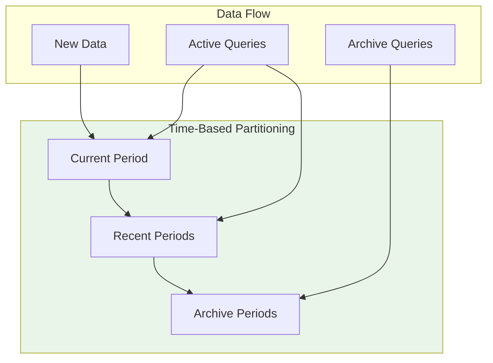
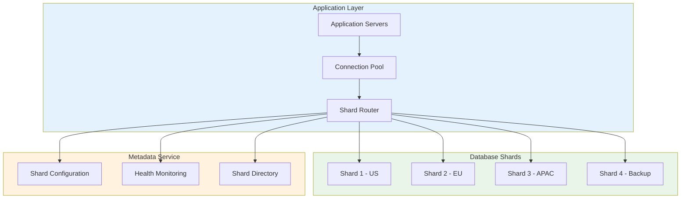
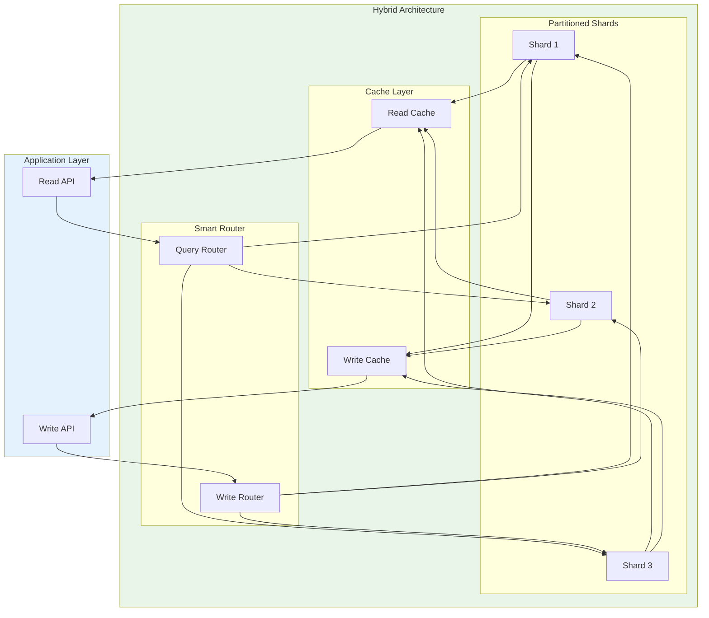
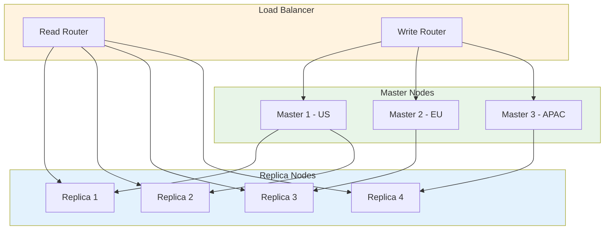
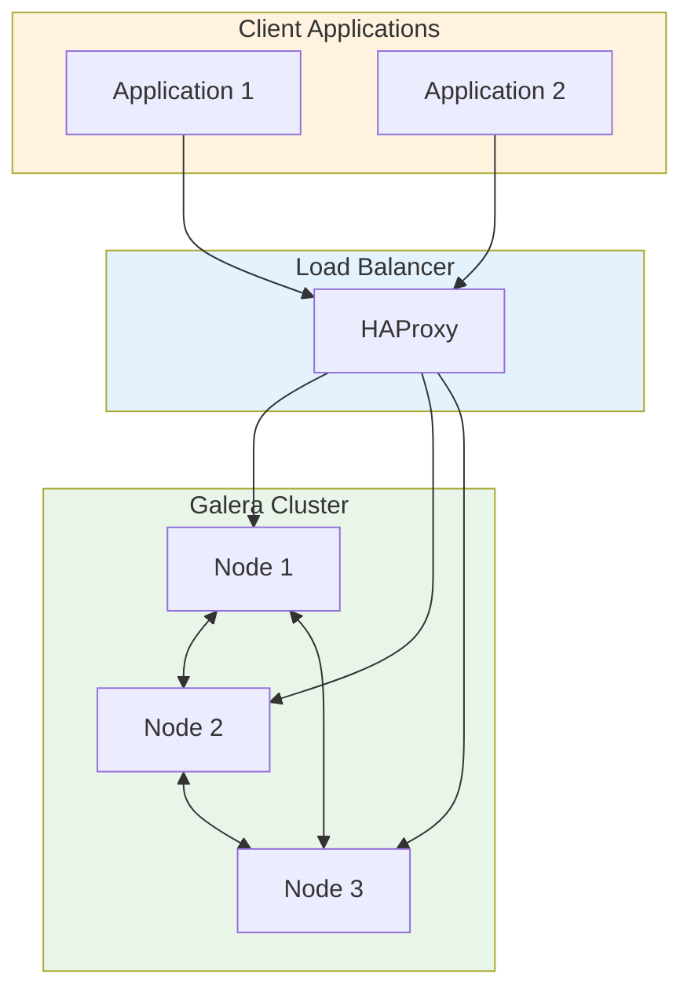
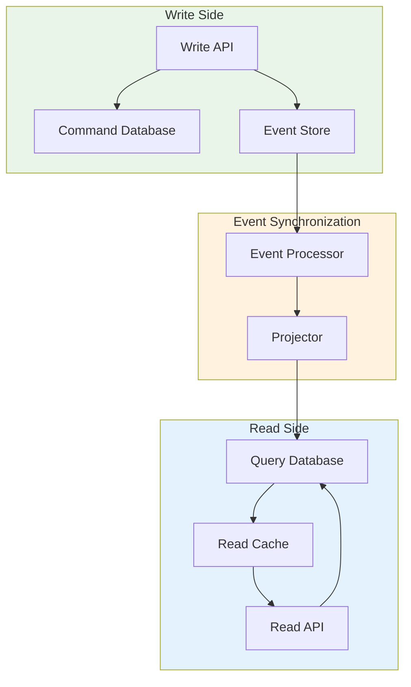

# 🗂️ Partitioning and Sharding

A comprehensive guide to database scaling strategies through partitioning and sharding, covering when to use each approach and implementation patterns for large-scale data systems.

---

## 🗺️ Table of Contents
1. [Scaling Overview](#1-scaling-overview)
2. [Database Partitioning](#2-database-partitioning)
3. [Database Sharding](#3-database-sharding)
4. [Partitioning vs Sharding](#4-partitioning-vs-sharding)
5. [Distributed Database Patterns](#5-distributed-database-patterns)
6. [Best Practices](#6-best-practices)

---

## 1. Scaling Overview

### **Why Scale Databases?**
As data volumes and user loads increase, single database instances become insufficient due to:
- **Storage Limits**: Maximum disk space capacity
- **Performance Bottlenecks**: CPU, memory, I/O saturation
- **Geographic Distribution**: Need for low-latency global access
- **High Availability**: Avoiding single points of failure
- **Maintenance Windows**: Reducing downtime for updates

### **Scaling Strategies**
| Strategy | Scale Type | Complexity | When to Use |
|----------|-----------|-----------|-------------|
| **Vertical Scaling** | Single instance | Low | Moderate growth |
| **Horizontal Scaling** | Multiple instances | Medium | High availability |
| **Partitioning** | Single instance | Medium | Large single tables |
| **Sharding** | Multiple instances | High | Massive data volume |

---

## 2. Database Partitioning

### **What is Partitioning?**
Dividing a large table into smaller, more manageable pieces called partitions while maintaining a single logical table.

### **Partitioning Benefits**
- **Query Performance**: Scan only relevant partitions
- **Maintenance Efficiency**: Operate on individual partitions
- **Parallel Processing**: Enable concurrent operations
- **Storage Management**: Archive old data easily
- **Load Distribution**: Spread I/O across multiple devices

### **Partitioning Types**

#### **Range Partitioning**
```sql
-- Range partitioning by date
CREATE TABLE orders (
    order_id INT,
    customer_id INT,
    order_date DATE,
    amount DECIMAL(10,2),
    status VARCHAR(20)
) PARTITION BY RANGE (order_date);

-- Create partitions
CREATE TABLE orders_2023_q1 PARTITION OF orders
    FOR VALUES FROM ('2023-01-01') TO ('2023-03-31');

CREATE TABLE orders_2023_q2 PARTITION OF orders
    FOR VALUES FROM ('2023-04-01') TO ('2023-06-30');

CREATE TABLE orders_2023_q3 PARTITION OF orders
    FOR VALUES FROM ('2023-07-01') TO ('2023-09-30');

CREATE TABLE orders_2023_q4 PARTITION OF orders
    FOR VALUES FROM ('2023-10-01') TO ('2023-12-31');
```

#### **List Partitioning**
```sql
-- List partitioning by categories
CREATE TABLE products (
    product_id INT,
    name VARCHAR(100),
    category VARCHAR(50),
    price DECIMAL(10,2)
) PARTITION BY LIST (category);

-- Create partitions for each category
CREATE TABLE products_electronics PARTITION OF products
    FOR VALUES IN ('electronics', 'computers', 'mobile');

CREATE TABLE products_clothing PARTITION OF products
    FOR VALUES IN ('clothing', 'shoes', 'accessories');

CREATE TABLE products_books PARTITION OF products
    FOR VALUES IN ('books', 'magazines', 'digital');

CREATE TABLE products_other PARTITION OF products
    DEFAULT;
```

#### **Hash Partitioning**
```sql
-- Hash partitioning for even distribution
CREATE TABLE user_events (
    event_id BIGINT,
    user_id INT,
    event_type VARCHAR(50),
    event_data JSONB,
    created_at TIMESTAMP
) PARTITION BY HASH (user_id);

-- Create hash partitions
CREATE TABLE user_events_part0 PARTITION OF user
    FOR VALUES WITH (MODULUS 4, REMAINDER 0);

CREATE TABLE user_events_part1 PARTITION OF user
    FOR VALUES WITH (MODULUS 4, REMAINDER 1);

CREATE TABLE user_events_part2 PARTITION OF user
    FOR VALUES WITH (MODULUS 4, REMAINDER 2);

CREATE TABLE user_events_part3 PARTITION OF user
    FOR VALUES WITH (MODULUS 4, REMAINDER 3);
```

#### **Composite Partitioning**
```sql
-- Composite partitioning (PostgreSQL)
CREATE TABLE logs (
    log_id BIGINT,
    log_date DATE,
    region VARCHAR(20),
    log_level VARCHAR(10),
    message TEXT
) PARTITION BY RANGE (log_date) SUBPARTITION BY LIST (region);

-- Create subpartitions
CREATE TABLE logs_2023_west PARTITION OF logs
    FOR VALUES FROM ('2023-01-01') TO ('2023-12-31')
    PARTITION BY LIST (region);

CREATE TABLE logs_2023_west_us PARTITION OF logs_2023_west
    FOR VALUES IN ('us-west-1', 'us-west-2');

CREATE TABLE logs_2023_west_eu PARTITION OF logs_2023_west
    FOR VALUES IN ('eu-west-1', 'eu-west-2');
```

### **Partitioning Strategies**

#### **Time-Based Partitioning**


#### **Geographic Partitioning**
```sql
-- Geographic partitioning by region
CREATE TABLE customer_data (
    customer_id INT,
    region_code VARCHAR(10),
    data JSONB,
    updated_at TIMESTAMP
) PARTITION BY LIST (region_code);

-- Regional partitions
CREATE TABLE customers_na PARTITION OF customer_data
    FOR VALUES IN ('US-CA', 'US-NY', 'US-TX');

CREATE TABLE customers_eu PARTITION OF customer_data
    FOR VALUES IN ('EU-UK', 'EU-DE', 'EU-FR');

CREATE TABLE customers_apac PARTITION OF customer_data
    FOR VALUES IN ('AP-JP', 'AP-SG', 'AP-AU');
```

---

## 3. Database Sharding

### **What is Sharding?**
Horizontal partitioning of data across multiple independent database instances, each containing a subset of the total data.

### **Sharding Architecture**


### **Sharding Strategies**

#### **Range-Based Sharding**
```sql
-- Shard key determines data placement
-- Shard 0: user_id 0-1000000
-- Shard 1: user_id 1000001-2000000
-- Shard 2: user_id 2000001-3000000
-- Shard 3: user_id 3000001-4000000

CREATE TABLE users (
    user_id INT PRIMARY KEY,
    username VARCHAR(50),
    email VARCHAR(100),
    created_at TIMESTAMP
);

-- Application logic for shard routing
function getShardConnection(userId) {
    const shardSize = 1000000;
    const shardIndex = Math.floor(userId / shardSize);
    return connections[shardIndex];
}
```

#### **Hash-Based Sharding**
```javascript
// Consistent hash sharding
class ConsistentHashRouter {
    constructor(shards, replicas = 150) {
        this.ring = new ConsistentHashRing();
        this.shards = shards;
        this.replicas = replicas;
        
        // Add each shard to ring with replicas
        for (const shard of shards) {
            for (let i = 0; i < replicas; i++) {
                const key = `${shard.id}:replica:${i}`;
                this.ring.add(key, shard);
            }
        }
    }
    
    getShard(key) {
        const hash = this.hash(key);
        return this.ring.getNode(hash);
    }
    
    hash(key) {
        // Use a good hash function (SHA-256)
        return crypto.createHash('sha256').update(key).digest('hex');
    }
}

// Usage
const router = new ConsistentHashRouter([
    { id: 'shard-0', connection: db0 },
    { id: 'shard-1', connection: db1 },
    { id: 'shard-2', connection: db2 },
    { id: 'shard-3', connection: db3 }
]);

const shard = router.getShard('user12345');
const connection = shard.connection;
```

#### **Directory-Based Sharding**
```sql
-- Directory-based lookup table
CREATE TABLE shard_directory (
    shard_id INT PRIMARY KEY,
    shard_name VARCHAR(50),
    host VARCHAR(100),
    port INT,
    database_name VARCHAR(50),
    min_key VARCHAR(100),
    max_key VARCHAR(100),
    status VARCHAR(20) DEFAULT 'active'
);

-- Populate shard directory
INSERT INTO shard_directory VALUES 
(1, 'user-shard-0', 'db0.example.com', 5432, 'users', 'user-000000', 'user-099999', 'active'),
(2, 'user-shard-1', 'db1.example.com', 5432, 'users', 'user-100000', 'user-199999', 'active'),
(3, 'user-shard-2', 'db2.example.com', 5432, 'users', 'user-200000', 'user-299999', 'active');

-- Application shard lookup
function getShardConnection(key) {
    const query = 'SELECT host, port, database_name FROM shard_directory WHERE min_key <= $1 AND max_key >= $1 AND status = active';
    return executeQuery(query, [key]);
}
```

### **Cross-Shard Queries**

#### **Distributed Query Pattern**
```javascript
class DistributedQuery {
    constructor(shardConnections) {
        this.shards = shardConnections;
    }
    
    async queryUsers(criteria) {
        const promises = this.shards.map(shard => 
            this.queryShard(shard, criteria)
        );
        
        const results = await Promise.all(promises);
        return this.mergeResults(results);
    }
    
    async queryShard(shard, criteria) {
        const connection = await this.getConnection(shard);
        const query = this.buildQuery(criteria);
        return connection.query(query);
    }
    
    mergeResults(results) {
        // Combine and sort results
        return results.flat().sort((a, b) => a.id - b.id);
    }
    
    async aggregateUsers(field) {
        const promises = this.shards.map(shard => 
            this.aggregateShard(shard, field)
        );
        
        const results = await Promise.all(promises);
        return this.combineAggregates(results);
    }
}
```

#### **Two-Phase Commit**
```javascript
class TwoPhaseCommit {
    constructor(shardConnections) {
        this.shards = shardConnections;
        this.transactionId = this.generateTransactionId();
    }
    
    async executeDistributedTransaction(operations) {
        try {
            // Phase 1: Prepare
            const preparePromises = operations.map(op => 
                this.prepareShard(op.shardId, op.operation, this.transactionId)
            );
            await Promise.all(preparePromises);
            
            // Phase 2: Commit
            const commitPromises = operations.map(op => 
                this.commitShard(op.shardId, this.transactionId)
            );
            await Promise.all(commitPromises);
            
            return { success: true, transactionId: this.transactionId };
        } catch (error) {
            // Rollback all shards
            const rollbackPromises = operations.map(op => 
                this.rollbackShard(op.shardId, this.transactionId)
            );
            await Promise.all(rollbackPromises);
            
            throw error;
        }
    }
    
    async prepareShard(shardId, operation, transactionId) {
        const shard = this.shards[shardId];
        await shard.prepare(transactionId, operation);
    }
    
    async commitShard(shardId, transactionId) {
        const shard = this.shards[shardId];
        await shard.commit(transactionId);
    }
    
    async rollbackShard(shardId, transactionId) {
        const shard = this.shards[shardId];
        await shard.rollback(transactionId);
    }
}
```

---

## 4. Partitioning vs Sharding

### **Comparison Matrix**
| Aspect | Partitioning | Sharding |
|---------|--------------|----------|
| **Scale Type** | Vertical (single instance) | Horizontal (multiple instances) |
| **Complexity** | Medium | High |
| **Consistency** | Strong (ACID) | Eventual (distributed) |
| **Network** | No network overhead | Network latency critical |
| **Failure Impact** | Single instance failure | Partial system failure |
| **Maintenance** | Single point of maintenance | Distributed maintenance |
| **Cost** | Lower infrastructure cost | Higher infrastructure cost |

### **When to Use Partitioning**
- **Large Single Tables**: Tables with millions of rows
- **Time-Series Data**: Log data, historical records
- **Geographic Distribution**: Regional data access patterns
- **Archive Requirements**: Need to archive old data
- **Query Performance**: Range-based queries common

### **When to Use Sharding**
- **Massive Data Volume**: Terabytes of data
- **High Write Volume**: Thousands of writes per second
- **Geographic Distribution**: Global user base
- **Independent Scaling**: Different scaling needs per shard
- **Complex Queries**: Cross-shard joins required

### **Hybrid Approach**


---

## 5. Distributed Database Patterns

### **Multi-Master Replication**


### **Master-Slave Configuration**
```sql
-- Master configuration (MySQL)
server-id = 1
log-bin = mysql-bin
binlog-format = ROW
sync-binlog = 1

-- Slave configuration
server-id = 2
relay-log = mysql-relay-bin
read-only = 1
replicate-do-db = mydatabase
```

### **Galera Cluster**


### **CQRS with Separate Stores**


---

## 6. Best Practices

### **Shard Key Selection**
```javascript
// Good shard key characteristics
class ShardKeyAnalyzer {
    analyzeDistribution(column) {
        // Check for uniform distribution
        const distribution = this.getDistribution(column);
        const variance = this.calculateVariance(distribution);
        
        // Check for hot spots
        const hotspots = this.identifyHotspots(column);
        
        return {
            uniformDistribution: variance < 0.1,
            noHotspots: hotspots.length === 0,
            recommended: variance < 0.1 && hotspots.length === 0
        };
    }
    
    getDistribution(column) {
        // Analyze key distribution across shards
        const samples = this.sampleKeys(column, 10000);
        return this.calculateDistribution(samples);
    }
    
    identifyHotspots(column) {
        // Identify keys that appear frequently
        const frequency = this.calculateFrequency(column);
        return frequency.filter(item => item.count > threshold);
    }
}

// Bad shard keys to avoid
const badShardKeys = [
    'sequential_timestamps',  // Creates hot shards
    'geographically_clustered', // Uneven distribution
    'low_cardinality',       // Poor distribution
    'frequently_changing'      // Rebalancing issues
];
```

### **Rebalancing Strategy**
```javascript
class ShardRebalancer {
    constructor(shards) {
        this.shards = shards;
        this.rebalanceThreshold = 0.2; // 20% size difference
    }
    
    checkRebalancing() {
        const sizes = this.shards.map(shard => this.getShardSize(shard));
        const avgSize = sizes.reduce((a, b) => a + b) / sizes.length;
        
        const imbalancedShards = sizes.filter(size => 
            Math.abs(size - avgSize) / avgSize > this.rebalanceThreshold
        );
        
        return imbalancedShards.length > 0;
    }
    
    async rebalance() {
        const plan = this.createRebalancePlan();
        
        // Execute rebalancing with minimal downtime
        for (const step of plan) {
            await this.executeRebalanceStep(step);
            await this.verifyDataIntegrity(step);
        }
    }
    
    createRebalancePlan() {
        // Create step-by-step rebalancing plan
        return {
            steps: [
                { type: 'prepare', shards: [1, 2] },
                { type: 'migrate', from: 1, to: 3, count: 1000 },
                { type: 'verify', shards: [1, 2, 3] },
                { type: 'cleanup', shards: [1] }
            ]
        };
    }
}
```

### **Monitoring and Observability**
```sql
-- Shard health monitoring
CREATE TABLE shard_health (
    shard_id INT PRIMARY KEY,
    host VARCHAR(100),
    port INT,
    database_name VARCHAR(50),
    status VARCHAR(20),
    last_check TIMESTAMP,
    response_time_ms INT,
    error_rate DECIMAL(5,2),
    data_volume_gb DECIMAL(10,2)
);

-- Cross-shard query performance
CREATE TABLE cross_shard_queries (
    query_id SERIAL PRIMARY KEY,
    query_text TEXT,
    shards_queried INT[],
    execution_time_ms INT,
    result_count INT,
    timestamp TIMESTAMP
);

-- Shard size monitoring
SELECT 
    shard_id,
    pg_size_pretty(pg_database_size(database_name)) as size_gb,
    pg_stat_get_tuples_live(database_name) as row_count,
    pg_stat_get_dead_tuples(database_name) as dead_rows
FROM shard_health;
```

### **Data Consistency Patterns**
```javascript
// Eventually consistent operations
class EventuallyConsistentOperations {
    constructor(shards) {
        this.shards = shards;
        this.vectorClock = new VectorClock();
    }
    
    async write(key, value) {
        const timestamp = this.vectorClock.increment();
        const operation = {
            type: 'write',
            key: key,
            value: value,
            timestamp: timestamp,
            nodeId: this.nodeId
        };
        
        // Write to primary shard
        const primaryShard = this.getPrimaryShard(key);
        await primaryShard.write(operation);
        
        // Propagate to replicas
        const replicas = this.getReplicaShards(key);
        await Promise.all(
            replicas.map(replica => replica.write(operation))
        );
    }
    
    async read(key) {
        const results = [];
        
        // Read from all replicas and resolve conflicts
        const shards = this.getAllShards(key);
        for (const shard of shards) {
            const result = await shard.read(key);
            results.push(result);
        }
        
        return this.resolveConflicts(results);
    }
    
    resolveConflicts(results) {
        // Use vector clocks to resolve conflicts
        return results.reduce((latest, current) => 
            current.timestamp > latest.timestamp ? current : latest
        );
    }
}
```

### **Failure Handling**
```javascript
class ShardFailureHandler {
    constructor(shards) {
        this.shards = shards;
        this.circuitBreakers = new Map();
    }
    
    async executeWithFallback(shardId, operation) {
        const circuitBreaker = this.getCircuitBreaker(shardId);
        
        if (circuitBreaker.isOpen()) {
            return this.executeFallbackOperation(operation);
        }
        
        try {
            const result = await this.executeOnShard(shardId, operation);
            circuitBreaker.recordSuccess();
            return result;
        } catch (error) {
            circuitBreaker.recordFailure();
            
            if (circuitBreaker.isOpen()) {
                return this.executeFallbackOperation(operation);
            }
            
            throw error;
        }
    }
    
    async executeFallbackOperation(operation) {
        // Fallback strategies
        switch (operation.type) {
            case 'read':
                return this.readFromCache(operation.key);
            case 'write':
                return this.queueForRetry(operation);
            default:
                throw new Error('Operation failed and no fallback available');
        }
    }
}
```

---

## 🚀 Getting Started

### **Implementation Roadmap**
1. **Assessment**: Analyze data volume and query patterns
2. **Strategy Selection**: Choose partitioning vs. sharding
3. **Design**: Define shard keys and partition schemes
4. **Implementation**: Start with pilot, then expand
5. **Monitoring**: Implement comprehensive observability
6. **Optimization**: Tune based on real-world usage

### **Migration Strategy**
```javascript
// Gradual migration from monolith to sharded
class ShardMigration {
    async migrate() {
        // Phase 1: Setup sharded infrastructure
        await this.setupShards();
        
        // Phase 2: Enable dual-write
        await this.enableDualWrite();
        
        // Phase 3: Migrate historical data
        await this.migrateHistoricalData();
        
        // Phase 4: Switch to read-from-shards
        await this.switchToShardReads();
        
        // Phase 5: Decommission monolith
        await this.decommissionMonolith();
    }
    
    async enableDualWrite() {
        // Write to both monolith and shards
        const writeOperations = await this.getPendingWrites();
        
        for (const op of writeOperations) {
            await Promise.all([
                this.writeToMonolith(op),
                this.writeToShards(op)
            ]);
        }
    }
}
```

---

## 📚 Further Reading

- [Database Partitioning](https://www.postgresql.org/docs/current/partitioning.html)
- [Database Sharding Patterns](https://www.citusdata.com/blog/citus-distributed-postgres-sharding)
- [Consistent Hashing](http://www.tom-e-white.com/2007/11/consistent-hashing.html)
- [Distributed Database Design](https://dl.acm.org/doi/10.1145/258922.258922.258923)
- [CQRS Pattern](https://martinfowler.com/eaaDev/CQRS.html)

---

[⬅️ Back to Data & Storage](../README.md)
