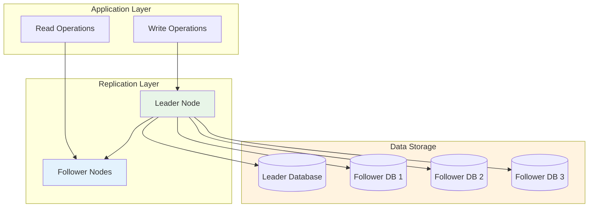
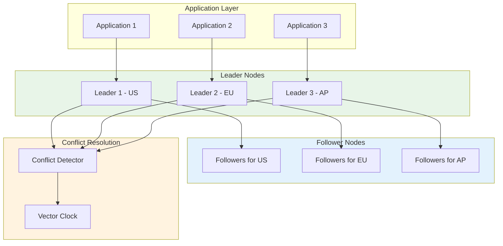
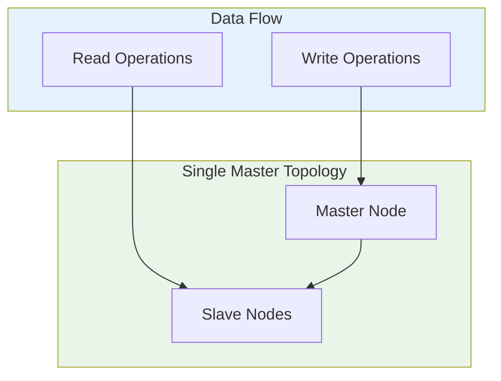
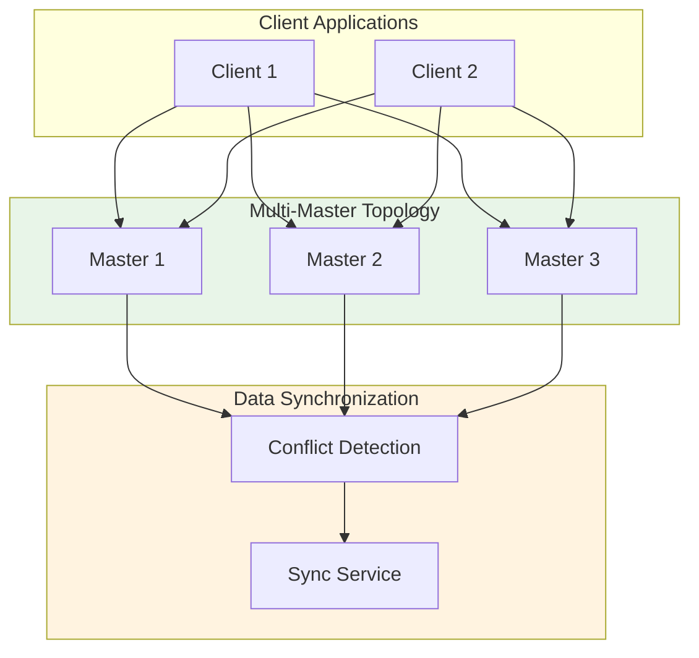
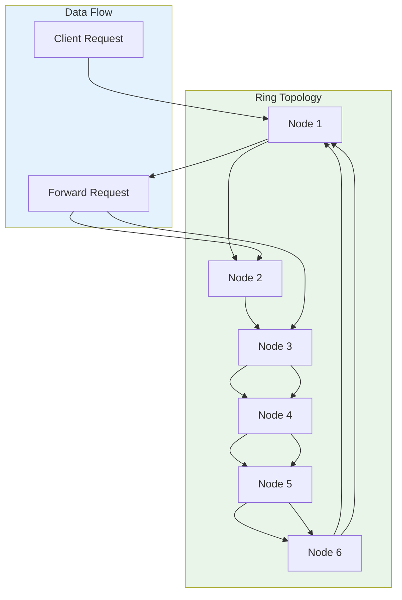
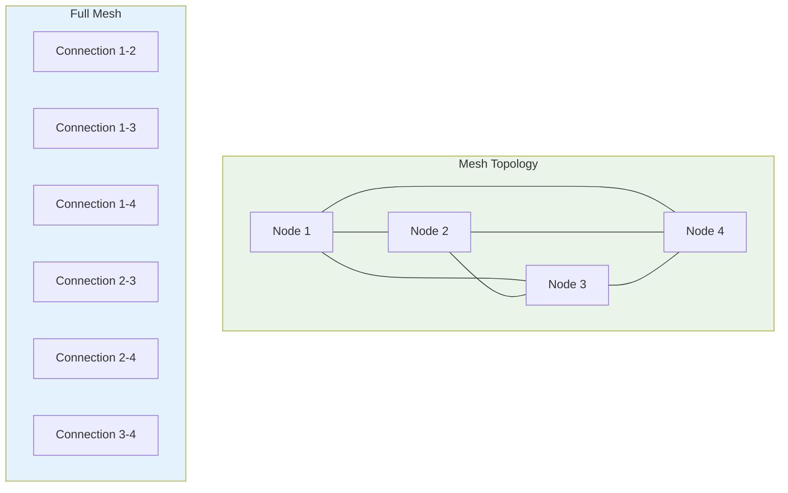
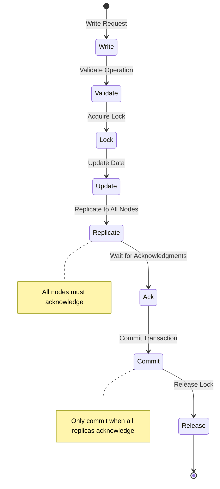
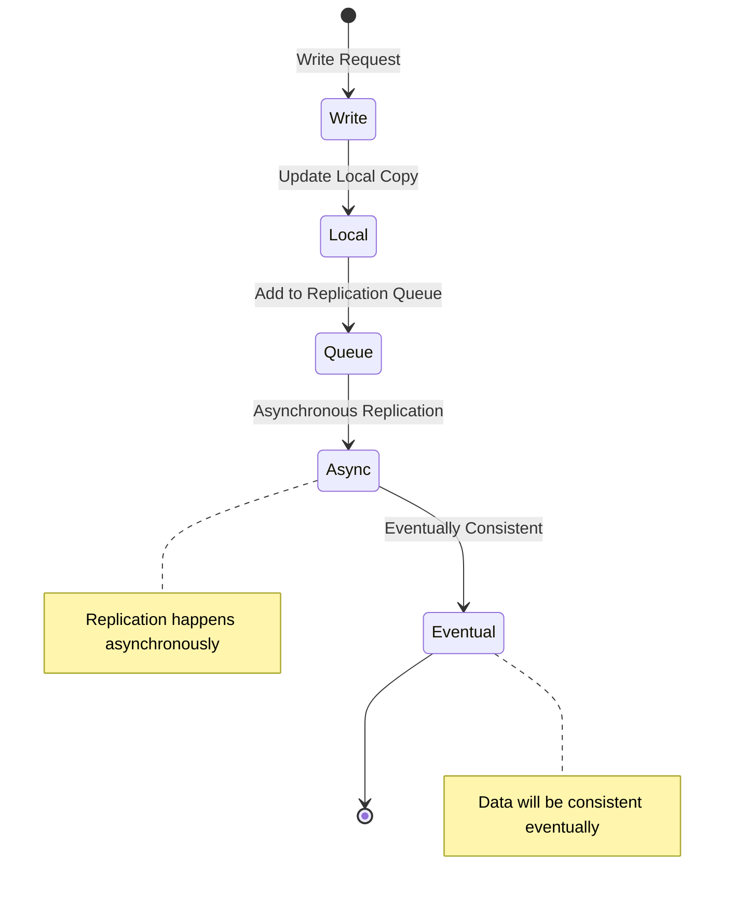

# 🔄 Replication (Leader-Follower, Multi-Leader)

A comprehensive guide to database replication strategies, covering leader-follower and multi-leader architectures for high availability, fault tolerance, and scalability.

---

## 🗺️ Table of Contents
1. [Replication Overview](#1-replication-overview)
2. [Leader-Follower Replication](#2-leader-follower-replication)
3. [Multi-Leader Replication](#3-multi-leader-replication)
4. [Replication Topologies](#4-replication-topologies)
5. [Consistency Models](#5-consistency-models)
6. [Conflict Resolution](#6-conflict-resolution)
7. [Best Practices](#7-best-practices)

---

## 1. Replication Overview

### **What is Database Replication?**
The process of copying and maintaining database objects in multiple database instances to ensure data consistency, high availability, and fault tolerance.

### **Replication Benefits**
- **High Availability**: No single point of failure
- **Load Distribution**: Spread read operations across replicas
- **Geographic Distribution**: Low-latency access globally
- **Disaster Recovery**: Backup data in different locations
- **Performance Optimization**: Read queries served from nearest replica

### **Replication Trade-offs**
| Benefit | Cost |
|----------|-------|
| **Availability** | Increased complexity |
| **Performance** | Eventual consistency |
| **Scalability** | Higher infrastructure cost |
| **Data Safety** | Replication lag |
| **Maintenance** | More moving parts |

---

## 2. Leader-Follower Replication

### **Leader-Follower Architecture**


### **Leader-Follower Characteristics**
- **Single Source**: One leader accepts all writes
- **Asynchronous**: Replication lag between leader and followers
- **Read Scaling**: Multiple followers for read distribution
- **Failover**: Promote follower to leader if needed

### **Leader-Follower Implementation**

#### **MySQL Master-Slave**
```sql
-- Master configuration
server-id = 1
log-bin = mysql-bin
binlog-format = ROW
sync-binlog = 1
gtid-mode = ON

-- Slave configuration
server-id = 2
relay-log = mysql-relay-bin
read-only = 1
replicate-do-db = mydatabase
replicate-do-table = users,orders,products

-- Start replication on slave
CHANGE MASTER TO
    MASTER_HOST = 'master.example.com',
    MASTER_USER = 'replication_user',
    MASTER_PASSWORD = 'secure_password',
    MASTER_PORT = 3306,
    MASTER_LOG_FILE = 'mysql-bin.000001',
    MASTER_LOG_POS = 154;
```

#### **PostgreSQL Streaming Replication**
```sql
-- Primary server setup
postgresql.conf:
wal_level = replica
max_wal_senders = 3
max_replication_slots = 5
archive_mode = on
archive_command = 'cp %p /var/lib/postgresql/archive/%f'

-- Create replication slot
SELECT pg_create_physical_replication_slot('replication_slot');

-- Replica server setup
postgresql.conf:
hot_standby = on
primary_conninfo = 'host=primary.example.com port=5432 user=replicator password=secure_password'
restore_command = 'cp /var/lib/postgresql/archive/%f %p'
standby_mode = on
```

#### **MongoDB Replica Set**
```javascript
// Replica set configuration
{
  _id: "my-replica-set",
  members: [
    {
      _id: 0,
      host: "mongodb1.example.com",
      port: 27017,
      priority: 1
    },
    {
      _id: 1,
      host: "mongodb2.example.com",
      port: 27017,
      priority: 2
    },
    {
      _id: 2,
      host: "mongodb3.example.com",
      port: 27017,
      priority: 3,
      arbiterOnly: true
    }
  ],
  settings: {
    getLastErrorModes: { w: "majority", wtimeout: 5000 }
  }
}
```

---

## 3. Multi-Leader Replication

### **Multi-Leader Architecture**


### **Multi-Leader Characteristics**
- **Multiple Write Sources**: Different leaders accept writes
- **Conflict Resolution**: Handle concurrent writes to same data
- **Geo-Distribution**: Leaders in different geographic regions
- **Complex Consistency**: Advanced consistency models required

### **Multi-Leader Implementation**

#### **Cassandra Ring Architecture**
```java
// Consistent hashing for data distribution
public class CassandraRouter {
    private final List<TokenRange> tokenRanges;
    private final Map<InetAddress, TokenRange> nodeMap;
    
    public CassandraRouter(List<InetAddress> nodes) {
        this.tokenRanges = initializeTokenRanges();
        this.nodeMap = createNodeMap(nodes);
    }
    
    public InetAddress getReplica(String key) {
        Token token = hash(key);
        for (TokenRange range : tokenRanges) {
            if (range.contains(token)) {
                return range.getReplica();
            }
        }
        throw new RuntimeException("No replica found");
    }
    
    public void write(String key, Object value) {
        InetAddress replica = getReplica(key);
        // Write to local replica
        writeToNode(replica, key, value);
        
        // Asynchronously replicate to other replicas
        List<InetAddress> replicas = getAdditionalReplicas(key, 3);
        for (InetAddress node : replicas) {
            replicateAsync(node, key, value);
        }
    }
}
```

#### **Couchbase Multi-Leader**
```javascript
// Multi-leader configuration
{
  "clusterName": "my-cluster",
  "dataDir": "/opt/couchbase/var/lib/couchbase",
  "indexerSettings": {
    "indexerThreads": 0,
    "logLevel": "info",
    "maxVBucketCount": 1024
  },
  "nodes": [
    {
      "hostname": "node1.example.com",
      "services": ["data", "index", "query", "fts"],
      "roles": "data"
    },
    {
      "hostname": "node2.example.com",
      "services": ["data", "index", "query"],
      "roles": "data"
    },
    {
      "hostname": "node3.example.com",
      "services": ["data", "index", "query"],
      "roles": "data"
    }
  ],
  "buckets": [
    {
      "name": "users",
      "replicaIndex": 1,
      "ramQuotaMB": 256,
      "threadsNumber": 3
    }
  ]
}
```

---

## 4. Replication Topologies

### **Single-Master Replication**


### **Multi-Master Replication**


### **Ring Topology**


### **Mesh Topology**


---

## 5. Consistency Models

### **Strong Consistency**


### **Eventual Consistency**


### **Consistency Comparison**
| Model | Latency | Complexity | Use Case |
|--------|----------|-----------|----------|
| **Strong** | High | High | Financial systems |
| **Eventual** | Low | Medium | Social media, caching |
| **Weak** | Very Low | Low | DNS, distributed caches |

---

## 6. Conflict Resolution

### **Last Writer Wins**
```javascript
class LastWriterWins {
    resolve(conflicts) {
        return conflicts.reduce((latest, current) => 
            current.timestamp > latest.timestamp ? current : latest
        );
    }
}
```

### **First Writer Wins**
```javascript
class FirstWriterWins {
    resolve(conflicts) {
        return conflicts.reduce((earliest, current) => 
            current.timestamp < earliest.timestamp ? current : earliest
        );
    }
}
```

### **Merge Resolution**
```javascript
class MergeResolution {
    resolve(conflicts) {
        let merged = conflicts[0].data;
        
        for (let i = 1; i < conflicts.length; i++) {
            merged = this.mergeData(merged, conflicts[i].data);
        }
        
        return {
            resolved: true,
            data: merged,
            conflicts: []
        };
    }
    
    mergeData(existing, incoming) {
        // Custom merge logic based on data type
        if (typeof existing === 'object' && typeof incoming === 'object') {
            return { ...existing, ...incoming };
        }
        return incoming;
    }
}
```

### **Vector Clocks**
```javascript
class VectorClock {
    constructor() {
        this.clock = new Map();
    }
    
    update(nodeId) {
        const currentTime = this.clock.get(nodeId) || 0;
        this.clock.set(nodeId, currentTime + 1);
        
        return {
            nodeId: nodeId,
            timestamp: currentTime + 1
        };
    }
    
    compare(clock1, clock2) {
        if (clock1.nodeId === clock2.nodeId) {
            return clock1.timestamp - clock2.timestamp;
        }
        
        // Different nodes - compare timestamps
        return clock1.timestamp - clock2.timestamp;
    }
    
    resolveConflicts(events) {
        return events.sort((a, b) => {
            const timeA = this.clock.get(a.nodeId) || 0;
            const timeB = this.clock.get(b.nodeId) || 0;
            return timeA - timeB;
        });
    }
}
```

---

## 7. Best Practices

### **Replication Monitoring**
```sql
-- MySQL replication monitoring
SHOW SLAVE STATUS;
SHOW MASTER STATUS;

-- PostgreSQL replication monitoring
SELECT * FROM pg_stat_replication;
SELECT * FROM pg_replication_slots;

-- Replication lag monitoring
SELECT 
    pg_last_xact_receive_timestamp,
    pg_last_xact_replay_timestamp,
    pg_last_xact_apply_timestamp
FROM pg_stat_replication;
```

### **Failover Strategies**
```javascript
// Automatic failover detection
class FailoverDetector {
    constructor(replicas) {
        this.replicas = replicas;
        this.healthChecks = new Map();
    }
    
    async checkHealth() {
        const results = await Promise.all(
            this.replicas.map(replica => this.pingReplica(replica))
        );
        
        const healthy = results.filter(result => result.isHealthy);
        const unhealthy = results.filter(result => !result.isHealthy);
        
        if (unhealthy.length > 0 && healthy.length > 0) {
            await this.initiateFailover(healthy, unhealthy);
        }
    }
    
    async initiateFailover(healthy, unhealthy) {
        // Promote healthy replica to leader
        await this.promoteToLeader(healthy[0]);
        
        // Update application configuration
        await this.updateReplicaConfig(healthy[0]);
        
        // Notify monitoring systems
        await this.sendAlert('Failover completed', {
            newLeader: healthy[0].id,
            failedNodes: unhealthy.map(n => n.id)
        });
    }
}
```

### **Data Consistency Validation**
```sql
-- Consistency check procedure
CREATE OR REPLACE FUNCTION check_data_consistency()
RETURNS TABLE(
    table_name TEXT,
    inconsistent_records BIGINT,
    total_records BIGINT
) AS $$
BEGIN
    -- Check users table consistency
    RETURN QUERY
    SELECT 
        'users' as table_name,
        COUNT(*) - COUNT(DISTINCT user_id) as inconsistent_records,
        COUNT(*) as total_records
    FROM users;
END;
$$ LANGUAGE plpgsql;

-- Run consistency checks
SELECT * FROM check_data_consistency();
```

### **Performance Optimization**
```sql
-- Optimize replication for high-throughput
-- MySQL
SET GLOBAL sync_binlog = ON;
SET GLOBAL innodb_flush_log_at_trx_commit = 2;
SET GLOBAL innodb_flush_method = O_DIRECT;

-- PostgreSQL
ALTER SYSTEM SET wal_level = replica;
ALTER SYSTEM SET max_wal_senders = 10;
ALTER SYSTEM SET wal_compression = on;
```

### **Security Considerations**
```bash
# Secure replication configuration
# Use SSL/TLS for replication connections
# Configure firewall rules for replication ports
# Use dedicated replication users with limited privileges
# Implement authentication for replication endpoints

# Example secure replication setup
CHANGE MASTER TO
    MASTER_HOST = 'master.example.com',
    MASTER_USER = 'replicator',
    MASTER_PASSWORD = 'secure_password',
    MASTER_SSL = 1,
    MASTER_SSL_CA = '/path/to/ca-cert.pem',
    MASTER_SSL_CERT = '/path/to/client-cert.pem',
    MASTER_SSL_KEY = '/path/to/client-key.pem';
```

---

## 🚀 Getting Started

### **Implementation Roadmap**
1. **Assessment**: Analyze availability and performance requirements
2. **Topology Selection**: Choose appropriate replication architecture
3. **Configuration**: Set up leader-follower or multi-leader
4. **Testing**: Validate failover and consistency
5. **Monitoring**: Implement comprehensive monitoring
6. **Optimization**: Tune performance based on usage patterns

### **Configuration Templates**
```yaml
# docker-compose.yml for leader-follower setup
version: '3.8'

services:
  master:
    image: mysql:8.0
    environment:
      MYSQL_ROOT_PASSWORD: secure_password
    command: >
      --server-id=1
      --log-bin=mysql-bin
      --binlog-format=ROW
      --sync-binlog=1
    volumes:
      - master_data:/var/lib/mysql
    ports:
      - "3306:3306"

  slave:
    image: mysql:8.0
    environment:
      MYSQL_ROOT_PASSWORD: secure_password
    command: >
      --server-id=2
      --relay-log=mysql-relay-bin
      --read-only=1
    volumes:
      - slave_data:/var/lib/mysql
    ports:
      - "3307:3306"
    depends_on:
      - master
```

---

## 📚 Further Reading

- [MySQL Replication](https://dev.mysql.com/doc/refman/8.0/en/replication.html)
- [PostgreSQL Replication](https://www.postgresql.org/docs/current/logical-replication.html)
- [MongoDB Replication](https://docs.mongodb.com/manual/replication/)
- [CAP Theorem](https://en.wikipedia.org/wiki/CAP_theorem)
- [Distributed Systems](https://www.amazon.com/distributed-systems-book/)

---

[⬅️ Back to Data & Storage](../README.md)
