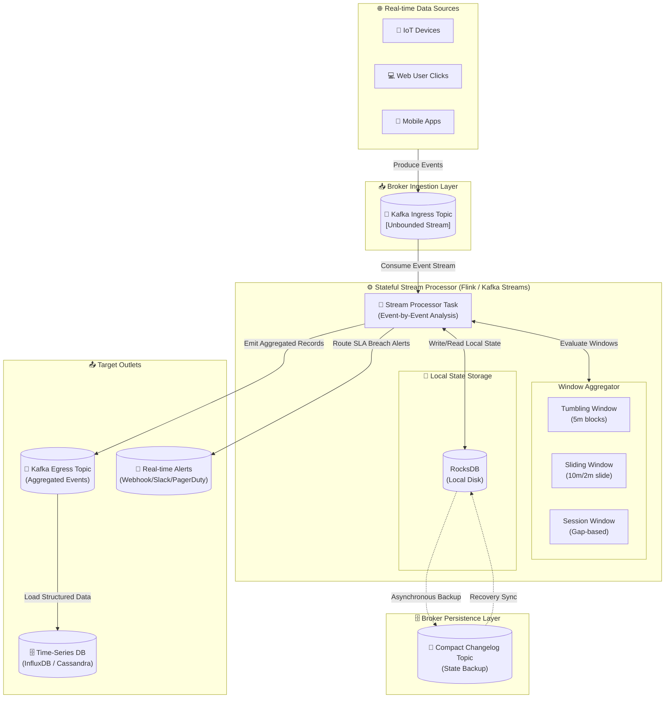

# 🌊 Data Streaming & Processing

In modern system design, data is generated continuously by millions of sources (IoT sensors, user clicks, transactional databases, and log streams). Traditional **batch processing** (which processes static data at scheduled intervals) is insufficient for business use cases requiring immediate insights. 

**Stream processing** is the paradigm of continuously ingesting, analyzing, and acting upon unbounded, real-time data streams as they occur.

---

## 🗺️ Table of Contents
1. [Batch vs. Stream Processing](#1-batch-vs-stream-processing)
2. [Streaming Foundations & Core Concepts](#2-streaming-foundations--core-concepts)
   - [Time Semantics](#time-semantics)
   - [Handling Late Data with Watermarks](#handling-late-data-with-watermarks)
   - [Windowing Strategies](#windowing-strategies)
3. [Stream Processing Frameworks](#3-stream-processing-frameworks)
   - [Kafka Streams](#kafka-streams)
   - [Apache Flink](#apache-flink)
4. [Framework Alternatives](#4-framework-alternatives)
   - [Apache Spark Streaming](#apache-spark-streaming)
   - [Apache Samza](#apache-samza)
5. [Framework Comparison Matrix](#5-framework-comparison-matrix)
6. [Streaming Architecture Topology](#6-streaming-architecture-topology)
7. [📖 Deep Dive: Apache Spark & Hadoop](./spark-hadoop.md)

---

## 1. Batch vs. Stream Processing

Understanding the architectural trade-offs between static batch runs and continuous stream pipelines is critical for system design:

| Characteristic | Batch Processing (e.g., Hadoop, Snowflake) | Stream Processing (e.g., Flink, Kafka Streams) |
| :--- | :--- | :--- |
| **Data Scope** | Bounded, finite datasets collected over time. | Unbounded, infinite continuous streams of events. |
| **Processing Model** | Pull-based. Processes data in blocks on a schedule (e.g., nightly). | Push-based. Processes events immediately as they arrive. |
| **Latency** | High (Minutes, hours, or days). | Low (Sub-second, milliseconds). |
| **Throughput** | Maximum. Optimized for massive parallel scans over cold data. | High, but prioritized for instant event ingestion and routing. |
| **State Complexity** | Simple. Transactions are processed in distinct runs. | Complex. Must manage continuous local and distributed state over time. |

---

## 2. Streaming Foundations & Core Concepts

To build resilient, accurate streaming systems, architects must navigate three primary challenges: time variations, out-of-order delivery, and aggregation boundaries.

### Time Semantics

In a distributed system, network latency and system failures cause delays between when an event occurs and when it is actually processed. We define three distinct types of time:

1. **Event Time**: The timestamp when the event actually occurred on the producer device (e.g., a user clicking a button). This is the most accurate metric for business logic but the hardest to handle due to potential network delays.
2. **Ingestion Time**: The timestamp when the event was received and appended to the message broker log (e.g., arriving in Kafka).
3. **Processing Time**: The local timestamp of the stream processing server executing the event. While simple to implement (requires no time tracking), it is highly unstable because message broker backlogs or GC pauses will distort aggregation results.

```
[ Producer ] ═══════════════════> [ Message Broker ] ═══════════════════> [ Stream Processor ]
     │                                    │                                      │
     ▼                                    ▼                                      ▼
1. Event Time                      2. Ingestion Time                     3. Processing Time
(App generated timestamp)          (Appended to Kafka Topic)             (Local CPU timestamp)
```

---

### Handling Late Data with Watermarks

Because events can arrive out of order (due to mobile device disconnections or network routing differences), streaming frameworks need a mechanism to know when they can stop waiting for late events and finalize calculations. This is solved using **Watermarks**.

- **Watermark**: A monotonically increasing timestamp ($W$) emitted into the event stream that acts as a progress metric. A watermark of $W = 12:05:00$ declares: *"We assert that all events with an Event Time $t \le 12:05:00$ have already been processed."*
- **Processing Late Data**: When an event arrives with an Event Time $t$ that is less than the current Watermark ($t < W$), it is officially categorized as **late data**. Frameworks handle this in three ways:
  1. **Drop it**: Discard the late event completely.
  2. **Allowed Lateness**: Update the previous window's computation dynamically within a designated grace period.
  3. **Side Output (Dead Letter Queue)**: Route late events to a dedicated channel for manual reconciliation or separate backfill processing.

---

### Windowing Strategies

Because stream processing is continuous, aggregates (e.g., sums, averages) cannot run over the entire infinite stream. Instead, we segment the stream into finite blocks called **Windows** based on time or count:

#### 1. Tumbling Windows
Fixed-size, contiguous, and non-overlapping time intervals.
- **Example**: A 5-minute tumbling window gathers events from `12:00` to `12:05`, clears the state, and opens a new window from `12:05` to `12:10`.
- **Use Case**: Calculating total page visits or transaction counts per hour.

```
|[  Window 1  ]|[  Window 2  ]|[  Window 3  ]|
0   -   5 min  5   -  10 min  10  -  15 min
```

#### 2. Sliding Windows
Fixed-size, overlapping time intervals defined by a *duration* and a *slide interval*.
- **Example**: A 10-minute window that slides every 2 minutes. The first window tracks `12:00-12:10`, the second tracks `12:02-12:12`, and so on.
- **Use Case**: Real-time service monitoring (e.g., alert if error rate exceeds 5% in the last 10 minutes, evaluated every 60 seconds).

```
[       Window 1       ]
    [       Window 2       ]
        [       Window 3       ]
0   2   4   6   8   10  12  14 min
```

#### 3. Session Windows
Dynamic, gap-based windows defined by periods of inactivity (inactivity gaps). They do not have fixed start/end times.
- **Example**: A session window with an inactivity gap of 15 minutes. It keeps collecting events as long as the user keeps interacting, but closes once 15 minutes of silence pass.
- **Use Case**: Analyzing website user sessions to track cohesive user behavior journeys.

```
● ● ● ●  [Session 1]  ════(15m gap)════  ● ●  [Session 2]  ════(15m gap)════  ● ● ●
```

---

## 3. Stream Processing Frameworks

### Kafka Streams

**Kafka Streams** is a lightweight, client-side library for building applications and microservices, where the input and output data are stored in Apache Kafka clusters.

#### Architectural Tenets:
- **No Dedicated Clusters**: Unlike other big-data systems, Kafka Streams is not a framework that runs on a custom compute cluster. It is a standard Java library. You package it inside a standard microservice and run it inside your own application JVM (e.g., Docker, Kubernetes, Spring Boot).
- **Embedded RocksDB State Stores**: Stateful operations (like joins and windowed aggregations) store their partition-level state in an embedded, high-performance C++ database called **RocksDB** residing on the local disk of each service instance.
- **Resilience via Changelogs**: Local RocksDB state is continuously backed up asynchronously to a dedicated, compacted Kafka topic called a **Changelog Topic**. If a container crashes, a new instance spins up, reads the changelog topic, and rebuilds its local RocksDB state, achieving fault tolerance.

#### KStream & KTable Dualism:
- **KStream (Stream of Events)**: An abstraction of an insert-only event stream. Each record is an independent event (e.g., *"Item X purchased"*, *"Item Y purchased"*).
- **KTable (Stream of Updates)**: An abstraction of a changelog stream (upserts). Each record represents an update to a state key. It acts like a database table (e.g., *"User 1 location is now Room A"*, *"User 1 location is now Room B"*).
- **Relationship**: A stream can be aggregated into a table, and a table can be written out to a stream.

---

### Apache Flink

**Apache Flink** is a highly powerful, distributed compute engine designed for stateful stream processing over bounded and unbounded datasets.

#### Architectural Tenets:
- **Dedicated Compute Infrastructure**: Flink requires a dedicated execution cluster composed of a **JobManager** (master node coordinating resource allocation and task execution) and multiple **TaskManager** worker nodes.
- **True Event-Driven Engine**: Unlike systems that process streams in small batches, Flink evaluates events individually, providing ultra-low (sub-millisecond) processing latencies.
- **State Management & Chandy-Lamport Snapshots**: Flink features highly robust, distributed state management. It utilizes the **Chandy-Lamport algorithm** to create asynchronous, consistent, distributed state snapshots (called **Checkpoints**).
  - **Checkpoints**: Automatically triggered periodically to save task state to persistent storage (like S3 or HDFS) to ensure fault tolerance.
  - **Savepoints**: Manually triggered snapshots, allowing developers to pause a stream, update application code/schema, redeploy, and resume execution from the exact same state timestamp without losing data.
- **Exactly-Once Guarantees**: By combining checkpoints with transactional message sinks (e.g., Two-Phase Commit sinks in Kafka), Flink guarantees that every single event affects application state exactly once, even in the event of worker node failures.

---

## 4. Framework Alternatives

### Apache Spark Streaming

**Apache Spark Streaming** (specifically Structured Streaming) is an extension of the primary Apache Spark API that enables scalable, high-throughput, fault-tolerant real-time stream processing.

- **Micro-Batching Architecture**: Unlike native event-driven streaming (Flink/Kafka Streams), Spark Streaming groups incoming events over a short time window (e.g., 50ms-200ms) and processes each group as a tiny, parallel batch.
- **Trade-offs**:
  - 🔴 **Latency**: Higher latency compared to Flink (typically 10-100ms vs. Flink's sub-millisecond level).
  - 🟢 **Throughput**: Unmatched throughput when executing complex multi-stage computations or aggregations.
  - 🟢 **Unification**: Uses the identical SQL-based DataFrame/Dataset API as Spark Batch, making it exceptionally easy to write a single codebase that handles both real-time streaming and massive offline batch workloads.

> 📖 **For a comprehensive deep-dive** into Spark's internals (RDDs, DAG execution, shuffle optimization, Catalyst optimizer) and the full Hadoop ecosystem (HDFS, MapReduce, YARN), see the companion document: [**Apache Spark & Hadoop Deep Dive**](./spark-hadoop.md).

---

### Apache Samza

**Apache Samza** is a stateful stream processing framework developed by LinkedIn, designed specifically to operate alongside Apache Kafka and Apache Hadoop YARN.

- **Architecture**: It is partitioned by design. Every stream partition is assigned to an individual Samza container task. Like Kafka Streams, it relies on local RocksDB databases for fast local state retrieval, backed by Kafka changelogs.
- **Evaluation**: Historically, Samza was highly dependent on YARN for resource management, making it heavyweight and rigid. While it now supports standalone deployments, it has largely been surpassed in generic cloud-native architectures by Flink (for large-scale distributed analytics) and Kafka Streams (for lightweight microservices).

---

## 5. Framework Comparison Matrix

The table below summarizes the key architectural distinctions between the primary stream processing frameworks:

| Feature | Apache Flink | Kafka Streams | Apache Spark Streaming | Apache Samza |
| :--- | :--- | :--- | :--- | :--- |
| **Execution Model** | Native (Event-at-a-time) | Native (Event-at-a-time) | Micro-batch (Structured) | Native (Event-at-a-time) |
| **Primary Deployment** | Dedicated Cluster (Job/TaskManager) | Embedded Library (Any JVM/K8s container) | Dedicated Cluster (Spark Driver/Executors) | Cluster (YARN/Mesos) or Standalone JVM |
| **Latency Profile** | 🟢 Extremely Low (Sub-millisecond) | 🟢 Extremely Low (Sub-millisecond) | 🟡 Low (10ms - 100ms) | 🟢 Extremely Low (Sub-millisecond) |
| **State Management** | Distributed (Checkpoints to S3/HDFS) | Local RocksDB + Kafka compact changelogs | Checkpointed RDDs to distributed storage | Local RocksDB + Kafka compact changelogs |
| **Exactly-Once Support** | Yes (via Checkpoints & 2PC Sinks) | Yes (via Kafka transaction coordinator) | Yes (via structured streaming checkpoints) | Yes (via transactional Kafka integration) |
| **Batch/Stream Unity** | High (Flink Table API handles both) | None (Tightly coupled to live Kafka streams) | Maximum (Unified DataFrame API) | Low (Primarily streaming only) |
| **Best Fit Case** | Large-scale, ultra-low latency complex event processing & analytics. | Decentralized Java microservices built around a Kafka-centric architecture. | High-throughput analytics integrated with Machine Learning and Batch jobs. | Large-scale stateful streaming pipeline tightly bound to YARN/Kafka. |

---

## 6. Streaming Architecture Topology

The flowchart below demonstrates a standard enterprise-grade stateful stream processing topology. Stream processors (like Flink or Kafka Streams) ingest events from Kafka topics, perform windowed aggregations utilizing local state stores, sync state to compaction topics for fault-tolerance, and emit results back to sinks.


