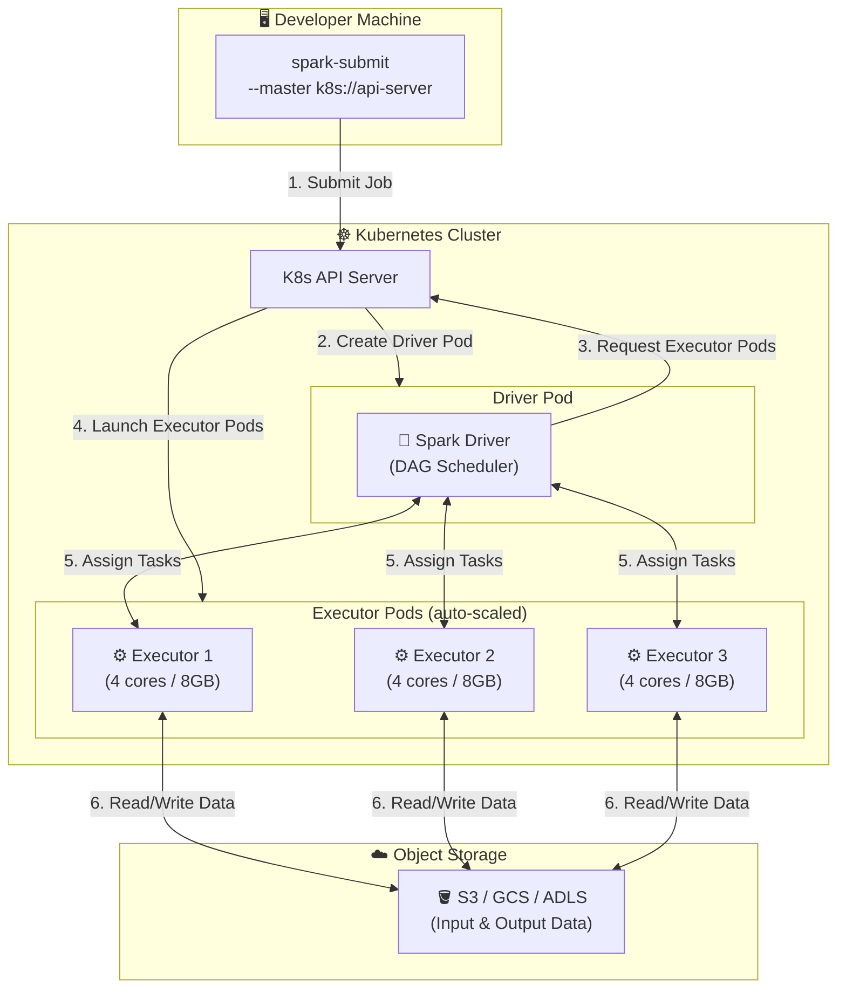
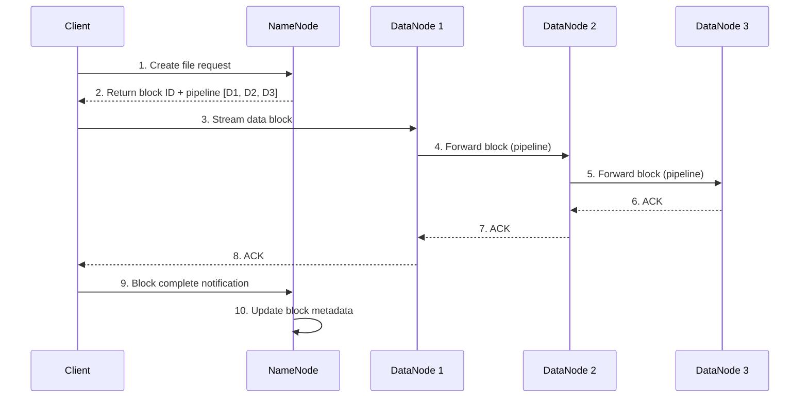
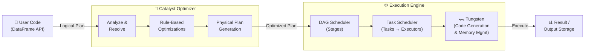

# 🔥 Apache Spark & 🐘 Hadoop: Deep Dive

---

## 🗺️ Table of Contents

1. [The Big Picture: Hadoop Ecosystem](#1-the-big-picture-hadoop-ecosystem)
2. [Apache Hadoop](#2-apache-hadoop)
   - [HDFS (Hadoop Distributed File System)](#hdfs-hadoop-distributed-file-system)
   - [MapReduce](#mapreduce)
   - [YARN (Resource Negotiator)](#yarn-yet-another-resource-negotiator)
3. [Apache Spark](#3-apache-spark)
   - [Core Architecture](#spark-core-architecture)
   - [RDDs, DataFrames & Datasets](#rdds-dataframes--datasets)
   - [Spark Execution Model](#spark-execution-model)
   - [Spark Modules](#spark-modules)
4. [Spark vs. Hadoop MapReduce](#4-spark-vs-hadoop-mapreduce)
5. [Spark Internals: Shuffles & Stages](#5-spark-internals-shuffles--stages)
6. [Deployment Modes](#6-deployment-modes)
7. [Architecture Diagrams](#7-architecture-diagrams)

---

## 1. The Big Picture: Hadoop Ecosystem

Hadoop is not a single tool — it is an **ecosystem** of components for distributed storage and processing of massive datasets.

```
┌─────────────────────────────────────────────────────────┐
│                   HADOOP ECOSYSTEM                       │
│                                                         │
│  ┌──────────┐  ┌──────────┐  ┌──────────┐  ┌────────┐  │
│  │   Hive   │  │   Pig    │  │  Spark   │  │  HBase │  │
│  │ (SQL QL) │  │(Scripting│  │(In-Memory│  │(NoSQL) │  │
│  │          │  │)         │  │Computing)│  │        │  │
│  └────┬─────┘  └────┬─────┘  └────┬─────┘  └───┬────┘  │
│       │             │             │             │        │
│  ┌────▼─────────────▼─────────────▼─────────────▼────┐  │
│  │               YARN (Resource Management)          │  │
│  └────────────────────────┬──────────────────────────┘  │
│                           │                             │
│  ┌────────────────────────▼──────────────────────────┐  │
│  │           HDFS (Distributed Storage)              │  │
│  └───────────────────────────────────────────────────┘  │
└─────────────────────────────────────────────────────────┘
```

---

## 2. Apache Hadoop

Hadoop solves a fundamental problem: **how do you store and process petabytes of data reliably across thousands of commodity machines?**

### HDFS (Hadoop Distributed File System)

HDFS is a distributed, fault-tolerant file system inspired by the Google File System (GFS) paper (2003). It is designed for **write-once, read-many** workloads on large files.

#### Key Design Principles

| Principle | Detail |
| :--- | :--- |
| **Block-Based Storage** | Files are split into large fixed-size blocks (default: **128 MB**). Each block is stored independently across nodes. |
| **Replication** | Every block is replicated to **3 nodes** by default (configurable). If one node fails, data is still available. |
| **Rack Awareness** | The NameNode is aware of rack topology. It places one replica on the local rack and one on a remote rack, balancing fault-tolerance with network efficiency. |
| **Sequential Access** | Optimized for streaming large files, not random reads. HDFS sacrifices low latency for maximum throughput. |

#### HDFS Architecture: NameNode & DataNodes

```
                ┌─────────────────────┐
                │      NameNode       │
                │  (Master Metadata)  │
                │  - File → Block map │
                │  - Block → Node map │
                │  - Namespace tree   │
                └──────────┬──────────┘
                           │  Heartbeat & Block Reports
          ┌────────────────┼────────────────┐
          ▼                ▼                ▼
  ┌──────────────┐ ┌──────────────┐ ┌──────────────┐
  │  DataNode 1  │ │  DataNode 2  │ │  DataNode 3  │
  │  [Blk A]     │ │  [Blk A]     │ │  [Blk B]     │
  │  [Blk B]     │ │  [Blk C]     │ │  [Blk C]     │
  └──────────────┘ └──────────────┘ └──────────────┘
```

- **NameNode**: Single master that stores all filesystem metadata (inode table, block locations). It is the **single point of failure** — mitigated by Secondary NameNode or HA with ZooKeeper standby.
- **DataNodes**: Worker nodes that store actual block data and report their status to the NameNode via periodic heartbeats.

#### HDFS Read/Write Flow

**Write Path:**
1. Client asks NameNode to create a file.
2. NameNode assigns a block ID and selects 3 DataNodes (pipeline).
3. Client streams data to DataNode 1, which forwards to DataNode 2, which forwards to DataNode 3.
4. Acknowledgements flow back along the pipeline.
5. NameNode records the block-to-node mapping upon completion.

**Read Path:**
1. Client asks NameNode: *"Where is file X?"*
2. NameNode returns block list + preferred DataNode addresses.
3. Client reads directly from the nearest DataNode (rack-aware).

---

### MapReduce

MapReduce is Hadoop's original batch computation engine. It implements a two-phase computation model inspired by functional programming.

#### Programming Model

```
Input Data
    │
    ▼
┌────────┐      Key-Value Pairs        ┌──────────┐
│  MAP   │ ──────────────────────────▶ │ SHUFFLE  │
│(Split) │  ("word", 1), ("word", 1)   │  & SORT  │
└────────┘                             └────┬─────┘
                                           │  Grouped by Key
                                           ▼
                                      ┌──────────┐      Output
                                      │  REDUCE  │ ──▶ Files
                                      │ (Merge)  │      HDFS
                                      └──────────┘
```

#### Word Count Example

```
Input:  "hello world hello"

MAP Phase (per line):
  Mapper 1 → ("hello", 1), ("world", 1), ("hello", 1)

SHUFFLE & SORT:
  Group by key → ("hello", [1, 1]), ("world", [1])

REDUCE Phase:
  Reducer 1 → ("hello", 2)
  Reducer 2 → ("world", 1)

Output (written to HDFS):
  hello  2
  world  1
```

#### MapReduce Limitations

This is why Spark was created:

| Limitation | Description |
| :--- | :--- |
| **Disk I/O Between Stages** | Every Map and Reduce stage writes output to HDFS. Multi-stage jobs (e.g., 10-step ML pipeline) cause enormous I/O overhead. |
| **No In-Memory Iteration** | Machine learning algorithms require iterating over the same dataset hundreds of times. Each iteration in MR means a full HDFS read. |
| **High Latency** | Job startup, task scheduling, and disk writes add overhead. A simple job takes minutes. |
| **Rigid Two-Phase Model** | Complex algorithms must be awkwardly decomposed into Map → Reduce chains. |

---

### YARN (Yet Another Resource Negotiator)

YARN (introduced in Hadoop 2.x) decoupled resource management from the computation model, making Hadoop a general-purpose cluster OS.

```
┌─────────────────────────────────────────┐
│          ResourceManager (Master)        │
│   ┌─────────────────┐ ┌───────────────┐  │
│   │    Scheduler    │ │  App Manager  │  │
│   └─────────────────┘ └───────────────┘  │
└──────────────┬──────────────────────────┘
               │ Allocate containers
    ┌──────────┼──────────┐
    ▼          ▼          ▼
┌────────┐ ┌────────┐ ┌────────┐
│  Node  │ │  Node  │ │  Node  │
│Manager │ │Manager │ │Manager │
│        │ │        │ │        │
│[App    │ │[App    │ │[App    │
│ Master]│ │ Task]  │ │ Task]  │
└────────┘ └────────┘ └────────┘
```

- **ResourceManager**: Global master that tracks cluster resources and schedules applications.
- **NodeManager**: Per-machine agent reporting resource availability (CPU, RAM) and launching containers.
- **ApplicationMaster**: Per-application process that negotiates resources from the ResourceManager and coordinates task execution.
- **Container**: An allocated slice of resources (e.g., 4 cores, 8 GB RAM) on a specific node.

YARN allows **Spark, Flink, MapReduce, and others** to all run on the same Hadoop cluster, sharing resources dynamically.

---

## 3. Apache Spark

Apache Spark (2009, UC Berkeley AMPLab) was built to address MapReduce's core limitation: **in-memory computation**. It keeps intermediate data in RAM instead of writing to disk between stages, making iterative algorithms 10–100x faster.

### Spark Core Architecture

```
┌───────────────────────────────────────────────────────────┐
│                    Spark Application                       │
│                                                           │
│  ┌─────────────────────────────────────────────────────┐  │
│  │               Driver Program (JVM)                  │  │
│  │  ┌────────────────────┐  ┌────────────────────────┐ │  │
│  │  │   SparkContext /   │  │    DAG Scheduler        │ │  │
│  │  │   SparkSession     │  │  (Stages → Tasks)       │ │  │
│  │  └────────────────────┘  └────────────────────────┘ │  │
│  └────────────────────────────┬────────────────────────┘  │
│                               │ Task assignment            │
│             ┌─────────────────┼─────────────────┐         │
│             ▼                 ▼                 ▼         │
│  ┌──────────────────┐ ┌──────────────┐ ┌──────────────┐  │
│  │    Executor 1    │ │  Executor 2  │ │  Executor 3  │  │
│  │ ┌────┐ ┌──────┐  │ │ ┌────────┐  │ │ ┌────────┐  │  │
│  │ │Task│ │Cache │  │ │ │  Task  │  │ │ │  Task  │  │  │
│  │ └────┘ └──────┘  │ │ └────────┘  │ │ └────────┘  │  │
│  └──────────────────┘ └──────────────┘ └──────────────┘  │
└───────────────────────────────────────────────────────────┘
```

| Component | Role |
| :--- | :--- |
| **Driver** | The main JVM process running your Spark application code. It creates the `SparkSession`, builds the DAG of operations, and schedules tasks on executors. |
| **SparkSession** | The unified entry point (Spark 2.x+) replacing the old `SparkContext`. Provides access to SQL, DataFrames, and streaming. |
| **DAG Scheduler** | Translates the logical execution plan (transformations) into a physical plan of **Stages** and **Tasks**, optimized to minimize data shuffles. |
| **Task Scheduler** | Assigns individual Tasks to Executor slots, respecting data locality preferences. |
| **Executor** | A long-lived JVM worker process on a cluster node. It runs Tasks and caches RDD/DataFrame partitions in memory. |
| **Cluster Manager** | External resource provider (YARN, Kubernetes, Mesos, or Spark Standalone) that allocates Executors. |

---

### RDDs, DataFrames & Datasets

Spark provides three levels of abstraction for working with distributed data:

#### 1. RDD (Resilient Distributed Dataset)

The foundational, low-level API. An RDD is an **immutable, partitioned collection of records** that can be operated on in parallel.

- **Resilient**: Fault-tolerant via **lineage graph** — if a partition is lost, Spark re-computes it from its parent RDD using the recorded transformation chain.
- **Distributed**: Partitions are spread across Executor JVMs.
- **Lazy**: Transformations (`map`, `filter`, `flatMap`) define the lineage but do NOT execute until an **action** (`count`, `collect`, `save`) is triggered.

```python
# RDD Example
sc = SparkContext()
rdd = sc.textFile("hdfs://data/logs")        # Transformation (lazy)
errors = rdd.filter(lambda l: "ERROR" in l)  # Transformation (lazy)
count = errors.count()                        # Action → triggers execution
```

#### 2. DataFrame

A higher-level abstraction with a **schema** (named, typed columns), similar to a relational database table or Pandas DataFrame. Backed by the **Catalyst optimizer** and **Tungsten execution engine** for automatic query optimization and code generation.

- Preferred for structured/semi-structured data (JSON, Parquet, CSV).
- Enables SQL queries directly.

```python
# DataFrame Example
spark = SparkSession.builder.getOrCreate()
df = spark.read.parquet("hdfs://data/sales")
df.filter(df["amount"] > 1000) \
  .groupBy("region") \
  .agg({"amount": "sum"}) \
  .show()
```

#### 3. Dataset (Scala/Java only)

Combines DataFrame's optimization with RDD's compile-time type safety. Not available in Python (PySpark uses DataFrames exclusively).

#### API Evolution & Performance

```
RDD           →  DataFrame   →  Dataset
(2014)           (2015)         (2016)

Low-level        Schema-aware   Type-safe
No optimizer     Catalyst opt.  Catalyst opt.
Full control     Best perf.     Best perf.
                 for Python     for Scala/Java
```

---

### Spark Execution Model

Understanding how Spark translates your code into actual computation is critical:

#### Transformations vs. Actions

| Type | Description | Examples |
| :--- | :--- | :--- |
| **Narrow Transformation** | Each output partition depends on exactly ONE input partition. No shuffle needed. | `map`, `filter`, `flatMap`, `union` |
| **Wide Transformation** | Each output partition depends on MULTIPLE input partitions. Triggers a **shuffle**. | `groupByKey`, `reduceByKey`, `join`, `distinct` |
| **Action** | Triggers the execution of all pending transformations. Returns a result to the driver or writes to storage. | `count`, `collect`, `save`, `show` |

#### Lazy Evaluation & DAG

When you write Spark code, nothing executes. Spark builds a **Directed Acyclic Graph (DAG)** of transformations. When an action fires, the DAG Scheduler:
1. Analyzes the DAG.
2. Cuts the graph at **shuffle boundaries** to define **Stages**.
3. Pipelines narrow transformations within a Stage.
4. Submits Tasks (one per partition) to Executors.

```
textFile() → filter() → map()  ──[SHUFFLE]──  reduceByKey() → collect()
│                                             │
└─────────────── Stage 1 ────────────────────┘└──── Stage 2 ────┘
  (Narrow: pipelined, no disk write)         (After shuffle boundary)
```

---

### Spark Modules

Spark ships with a unified set of high-level libraries:

#### Spark SQL

Allows running ANSI SQL queries against DataFrames and external data sources. Uses the **Catalyst** optimizer to produce an optimized physical plan.

```sql
-- Spark SQL
SELECT region, SUM(amount) as total
FROM sales
WHERE year = 2025
GROUP BY region
ORDER BY total DESC
```

#### Spark Structured Streaming

Extends the DataFrame API to streaming data. Spark treats a live stream as an **unbounded table** that continuously grows. Micro-batches are processed on a configurable trigger interval.

```python
stream = spark.readStream \
    .format("kafka") \
    .option("subscribe", "orders") \
    .load()

stream.groupBy("product_id") \
      .count() \
      .writeStream \
      .outputMode("update") \
      .format("console") \
      .start()
```

#### Spark MLlib

Scalable machine learning library with algorithms that work natively on distributed DataFrames:

| Category | Algorithms |
| :--- | :--- |
| **Classification** | Logistic Regression, Random Forest, Gradient Boosted Trees |
| **Clustering** | K-Means, Bisecting K-Means, LDA |
| **Regression** | Linear, Decision Tree, Isotonic |
| **Recommendation** | ALS (Collaborative Filtering) |
| **Feature Eng.** | TF-IDF, Word2Vec, StandardScaler, PCA |

#### Spark GraphX

Distributed graph computation using a property graph model. Supports algorithms like PageRank, Connected Components, and Triangle Counting.

---

## 4. Spark vs. Hadoop MapReduce

| Characteristic | Hadoop MapReduce | Apache Spark |
| :--- | :--- | :--- |
| **Processing Speed** | Slow (disk I/O between every stage) | 10–100x faster (in-memory DAG) |
| **Computation Model** | Rigid Map → Shuffle → Reduce | Flexible DAG of any operations |
| **Iterative Algorithms** | Very poor (each iteration = full HDFS read) | Excellent (cache dataset in RAM) |
| **Ease of Use** | Verbose Java boilerplate | Concise Python/Scala/Java/R APIs |
| **Streaming** | Near-real-time via Apache Storm integration | Built-in Structured Streaming |
| **SQL Support** | Apache Hive (slow, disk-based) | Spark SQL (fast, in-memory) |
| **ML Pipelines** | Apache Mahout (limited) | MLlib (comprehensive, native) |
| **Fault Tolerance** | HDFS replication | RDD Lineage + Checkpointing |
| **Storage Dependency** | Tightly coupled to HDFS | Storage-agnostic (S3, HDFS, GCS) |
| **Best Use Case** | Simple, infrequent batch ETL at massive scale | Complex analytics, ML, iterative batch, streaming |

> **When to still use MapReduce**: If you have a simple ETL job on a Hadoop cluster and cost/stability is the primary concern, MapReduce remains viable. It has a much smaller memory footprint and is inherently more stable for single-pass jobs where Spark's optimizations don't apply.

---

## 5. Spark Internals: Shuffles & Stages

The **shuffle** is the most expensive operation in Spark. Understanding it is key to writing performant Spark jobs.

### What Happens During a Shuffle

When a wide transformation (e.g., `groupByKey`) is triggered, Spark must redistribute data so that all records with the same key end up on the same executor:

```
Stage 1 (Map Side)          │  Stage 2 (Reduce Side)
                             │
Executor 1 Partition A       │
  Key: "US" → [10, 20]  ───►─┤──► Executor 3 (handles "US")
  Key: "EU" → [5]       ────►┼──► Executor 4 (handles "EU")
                             │
Executor 2 Partition B       │
  Key: "US" → [30]      ───►─┤──► Executor 3 (handles "US")
  Key: "EU" → [15, 8]   ────►┼──► Executor 4 (handles "EU")
                             │
                  [SHUFFLE WRITE] → [Network Transfer] → [SHUFFLE READ]
```

1. **Shuffle Write**: Map-side tasks write their output partitioned by key to local disk (not HDFS).
2. **Network Transfer**: Reduce-side tasks fetch their partitions from all map-side executors.
3. **Shuffle Read**: Reduce-side tasks merge and process the received data.

### Avoiding Shuffles: Key Optimizations

| Technique | Description |
| :--- | :--- |
| **`reduceByKey` vs `groupByKey`** | `reduceByKey` performs a **partial aggregation on the map side** before shuffling, drastically reducing data transferred. Prefer it over `groupByKey`. |
| **Broadcast Join** | When joining a large table with a **small table** (< few hundred MB), broadcast the small table to every executor. Eliminates the shuffle entirely. |
| **Partitioning by Key** | Pre-partition an RDD/DataFrame by join key before repeated joins. Subsequent joins on the same key skip the shuffle. |
| **Coalesce vs Repartition** | `coalesce(n)` reduces partitions without a full shuffle. `repartition(n)` does a full shuffle to evenly redistribute data. |

---

## 6. Deployment Modes

Spark can run in several modes depending on your infrastructure:

| Mode | Description | Best For |
| :--- | :--- | :--- |
| **Local** | Single JVM process. Driver and Executors run in the same process. `local[*]` uses all CPU cores. | Development and testing. |
| **Spark Standalone** | Spark's built-in cluster manager with a Master and Worker nodes. | Simple dedicated Spark clusters. |
| **YARN** | Runs on a Hadoop cluster. YARN manages containers. Two sub-modes: `yarn-client` (driver on local) and `yarn-cluster` (driver on cluster). | Enterprise Hadoop environments. |
| **Kubernetes** | Spark submits pods to a K8s cluster. Each executor is a Pod. Native since Spark 2.3. | Cloud-native, containerized deployments. |
| **Mesos** | Apache Mesos as the resource manager. Now largely deprecated in favor of K8s. | Legacy environments. |

### YARN Cluster Mode Flow

```
spark-submit --master yarn --deploy-mode cluster job.jar

Client Machine
    │  1. Upload app JAR to HDFS
    │  2. Submit app to ResourceManager
    ▼
ResourceManager
    │  3. Launch ApplicationMaster container on a NodeManager
    ▼
ApplicationMaster (Spark Driver)
    │  4. Request Executor containers from ResourceManager
    │  5. Receive container allocations
    ▼
NodeManagers (Executors)
    │  6. Run Spark Tasks
    └─ 7. Report results to Driver (ApplicationMaster)
```

---

## 7. Architecture Diagrams

### Spark on Kubernetes



### Hadoop HDFS Write Pipeline



### Spark Job Lifecycle


