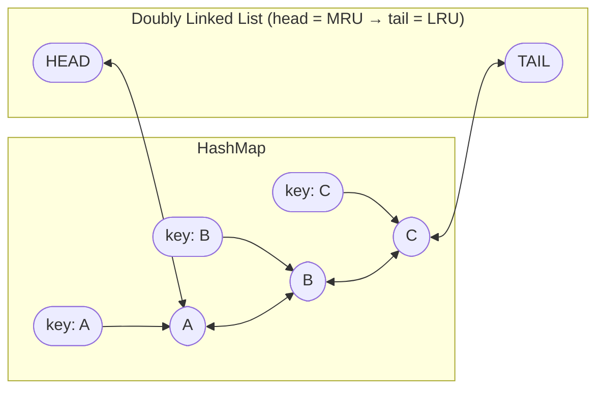
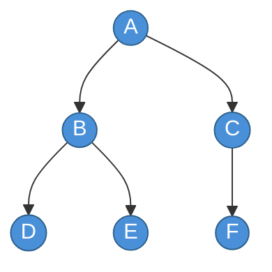
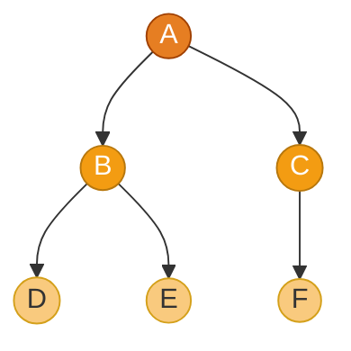
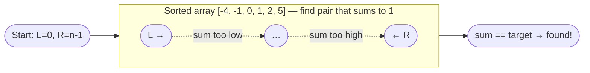
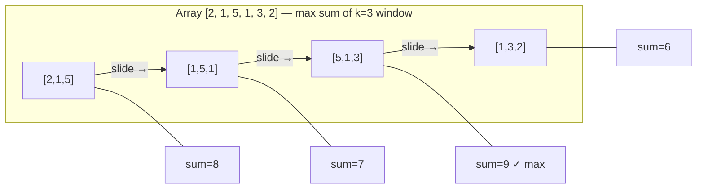
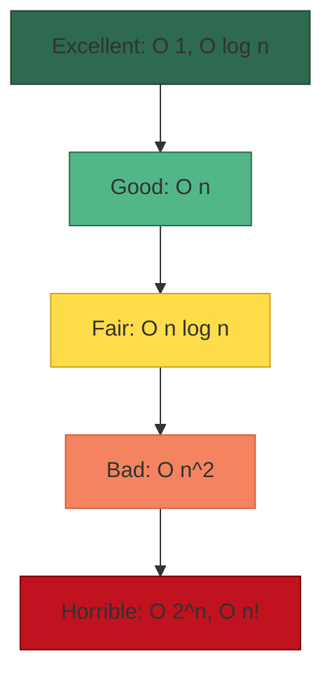

# 🧬 Data Structures & Algorithms (DSA)

Data structures are ways of organizing and storing data so that they can be accessed and worked with efficiently. Algorithms are the steps or rules followed in calculations or other problem-solving operations.

---

## 🗺️ Table of Contents
1. [Big O Notation](#1-big-o-notation)
2. [Core Data Structures](#2-core-data-structures)
3. [Core Algorithms](#3-core-algorithms)
   - [LRU Cache — HashMap + Doubly Linked List](#lru-cache--hashmap--doubly-linked-list)
   - [Two Pointers](#two-pointers)
   - [Sliding Window](#sliding-window)
4. [Interval Algorithms](#4-interval-algorithms)
5. [Problem Solving Strategies](#5-problem-solving-strategies)
6. [Web Resources & Visualizers](#6-web-resources--visualizers)

---

## 1. Big O Notation
Big O notation is used to describe the efficiency of an algorithm in terms of time and space complexity as the input size grows.

| Complexity | Name | Example |
| :--- | :--- | :--- |
| **O(1)** | Constant | Accessing an array element by index. |
| **O(log n)** | Logarithmic | Binary search. |
| **O(n)** | Linear | Linear search. |
| **O(n log n)** | Linearithmic | Merge sort, Quick sort. |
| **O(n²)** | Quadratic | Bubble sort, Nested loops. |
| **O(2ⁿ)** | Exponential | Recursive Fibonacci. |

---

## 2. Core Data Structures

### Linear Data Structures
- **Arrays**: Fixed-size, contiguous memory, O(1) access.
- **Linked Lists**: Dynamic size, non-contiguous, O(n) access.
- **Stacks**: LIFO (Last In, First Out).
- **Queues**: FIFO (First In, First Out).
- **Hash Tables**: Key-value pairs, O(1) average access/insert.

### Non-Linear Data Structures
- **Trees**: Hierarchical structure (Binary Tree, BST, AVL, B-Tree).
- **Graphs**: Nodes and edges (Directed/Undirected, Weighted/Unweighted).
- **Heaps**: Specialized tree-based structure (Min-Heap, Max-Heap).

### LRU Cache — HashMap + Doubly Linked List

An **LRU (Least Recently Used) Cache** is one of the most important "classic combination" data structures in systems design. It combines:

- A **HashMap** → O(1) key lookup to any node
- A **Doubly Linked List** → O(1) insertion and removal anywhere (head = most recent, tail = least recent)

Together they achieve **O(1) get and put** with a fixed capacity — evicting the least-recently-used item when full.

**Real-world use:** CPU/memory caches, CDN edge caches, database query result caches, DNS resolver caches, browser history.



| Operation | Time | Space | How |
| :--- | :--- | :--- | :--- |
| **get(key)** | O(1) | — | HashMap lookup → move node to head |
| **put(key, val)** | O(1) | O(capacity) | HashMap insert → add node to head; evict tail if over capacity |
| **evict LRU** | O(1) | — | Remove node just before TAIL sentinel; delete its key from HashMap |

<details>
<summary>☕ Java — LRU Cache (HashMap + custom Doubly Linked List)</summary>

```java
import java.util.HashMap;
import java.util.Map;

/**
 * LRU Cache with O(1) get and put.
 *
 * Design:
 *  - HashMap<key, Node>  → instant access to any cache node
 *  - Doubly Linked List  → O(1) move-to-front (mark as recently used)
 *                          and O(1) eviction from the tail (least recently used)
 *  - Two sentinel nodes (head / tail) eliminate null-checks on boundary ops.
 */
public class LRUCache {

    // ---------- Node ----------
    private static class Node {
        int key, val;
        Node prev, next;

        Node(int key, int val) {
            this.key = key;
            this.val = val;
        }
    }

    // ---------- Fields ----------
    private final int capacity;
    private final Map<Integer, Node> map = new HashMap<>();

    // Sentinel head (MRU side) and tail (LRU side) — never hold real data
    private final Node head = new Node(0, 0);
    private final Node tail = new Node(0, 0);

    // ---------- Constructor ----------
    public LRUCache(int capacity) {
        this.capacity = capacity;
        head.next = tail;
        tail.prev = head;
    }

    // ---------- Public API ----------

    /**
     * Returns the value for key, or -1 if not present.
     * Moves the accessed node to the front (marks it as most recently used).
     */
    public int get(int key) {
        Node node = map.get(key);
        if (node == null) return -1;
        moveToFront(node);          // Mark as recently used
        return node.val;
    }

    /**
     * Inserts or updates key→value.
     * If at capacity, evicts the least recently used entry first.
     */
    public void put(int key, int value) {
        Node node = map.get(key);

        if (node != null) {         // Key already exists — update value
            node.val = value;
            moveToFront(node);
        } else {                    // New key
            if (map.size() == capacity) {
                evictLRU();         // Remove least recently used before inserting
            }
            Node newNode = new Node(key, value);
            map.put(key, newNode);
            addToFront(newNode);
        }
    }

    // ---------- Private helpers ----------

    /** Detaches a node from its current position and re-inserts it right after head. */
    private void moveToFront(Node node) {
        remove(node);
        addToFront(node);
    }

    /** Inserts a node immediately after the head sentinel. */
    private void addToFront(Node node) {
        node.prev = head;
        node.next = head.next;
        head.next.prev = node;
        head.next = node;
    }

    /** Unlinks a node from the doubly linked list. */
    private void remove(Node node) {
        node.prev.next = node.next;
        node.next.prev = node.prev;
    }

    /** Removes the node just before the tail sentinel (the LRU entry). */
    private void evictLRU() {
        Node lru = tail.prev;       // Node before TAIL = least recently used
        remove(lru);
        map.remove(lru.key);
    }

    // ---------- Demo ----------
    public static void main(String[] args) {
        LRUCache cache = new LRUCache(3); // Capacity: 3 entries

        cache.put(1, 10);   // Cache: [1]
        cache.put(2, 20);   // Cache: [2, 1]
        cache.put(3, 30);   // Cache: [3, 2, 1]

        System.out.println(cache.get(1));  // 10  → Cache: [1, 3, 2]  (1 moved to front)

        cache.put(4, 40);   // Capacity full: evict LRU (key=2) → Cache: [4, 1, 3]

        System.out.println(cache.get(2));  // -1  (key 2 was evicted)
        System.out.println(cache.get(3));  // 30  → Cache: [3, 4, 1]
        System.out.println(cache.get(4));  // 40  → Cache: [4, 3, 1]
    }
}
```

</details>

> [!TIP]
> **Java shortcut**: `java.util.LinkedHashMap` with `accessOrder = true` and an overridden `removeEldestEntry()` gives you an LRU cache in ~5 lines. The manual implementation above is used in **interviews** and **systems design** to demonstrate that you understand the underlying O(1) mechanics. See the [LinkedHashMap Javadoc](https://docs.oracle.com/en/java/javase/21/docs/api/java.base/java/util/LinkedHashMap.html).

> [!NOTE]
> For **thread-safe** LRU caches in production (e.g., shared across request threads), wrap operations in `synchronized` blocks or use `java.util.concurrent.ConcurrentHashMap` + an `AtomicReference` head/tail approach, or reach for [Caffeine](https://github.com/ben-manes/caffeine) which implements a high-performance W-TinyLFU policy. See the [ConcurrentHashMap Javadoc](https://docs.oracle.com/en/java/javase/21/docs/api/java.base/java/util/concurrent/ConcurrentHashMap.html).

---

## 2.1 Java Collections Framework (JDK Implementations)

Every abstract data structure in this section has a concrete implementation in `java.util` (or `java.util.concurrent`). The table below maps them with their key methods and behavior.

### Core Collection Classes

| Data Structure | JDK Class | Underlying Mechanism | Key Methods |
| :--- | :--- | :--- | :--- |
| Dynamic Array | [`java.util.ArrayList`](https://docs.oracle.com/en/java/javase/21/docs/api/java.base/java/util/ArrayList.html) | `Object[]` resizeable array | `add(e)` — appends to end<br>`add(i, e)` — inserts at index<br>`get(i)` — gets by index<br>`set(i, e)` — updates at index<br>`remove(i)` — removes by index |
| Linked List | [`java.util.LinkedList`](https://docs.oracle.com/en/java/javase/21/docs/api/java.base/java/util/LinkedList.html) | Doubly-linked list | `addFirst(e)` — prepends<br>`addLast(e)` — appends<br>`get(i)` — gets by index<br>`set(i, e)` — updates at index<br>`removeFirst()` — removes head<br>`remove(i)` — removes by index |
| Stack (LIFO) | [`java.util.ArrayDeque`](https://docs.oracle.com/en/java/javase/21/docs/api/java.base/java/util/ArrayDeque.html) — **preferred** | Circular array | `push(e)` — pushes to front<br>`pop()` — pops from front<br>`peek()` — views top |
| Stack (LIFO) | [`java.util.Stack`](https://docs.oracle.com/en/java/javase/21/docs/api/java.base/java/util/Stack.html) — legacy | Extends `Vector` (synchronized, slower) | `push(e)` — pushes to top<br>`pop()` — pops from top<br>`peek()` — views top |
| Queue (FIFO) | [`java.util.ArrayDeque`](https://docs.oracle.com/en/java/javase/21/docs/api/java.base/java/util/ArrayDeque.html) — **preferred** | Circular array | `offer(e)` — enqueues at tail<br>`poll()` — dequeues from head<br>`peek()` — views head |
| Queue (FIFO) | [`java.util.Queue`](https://docs.oracle.com/en/java/javase/21/docs/api/java.base/java/util/Queue.html) interface / [`java.util.LinkedList`](https://docs.oracle.com/en/java/javase/21/docs/api/java.base/java/util/LinkedList.html) | Doubly-linked list | `offer(e)` — enqueues at tail<br>`poll()` — dequeues from head<br>`peek()` — views head |
| Priority Queue | [`java.util.PriorityQueue`](https://docs.oracle.com/en/java/javase/21/docs/api/java.base/java/util/PriorityQueue.html) | Binary heap (min-heap) | `offer(e)` — inserts by priority<br>`poll()` — extracts smallest<br>`peek()` — views smallest |
| Hash Table | [`java.util.HashMap`](https://docs.oracle.com/en/java/javase/21/docs/api/java.base/java/util/HashMap.html) | Bucket array → tree on collisions (JEP 180) | `put(k, v)` — stores or updates key→value<br>`get(k)` — retrieves by key<br>`containsKey(k)` — checks key existence<br>`remove(k)` — removes by key |
| Hash + Order | [`java.util.LinkedHashMap`](https://docs.oracle.com/en/java/javase/21/docs/api/java.base/java/util/LinkedHashMap.html) | HashMap + doubly-linked list | `put(k, v)` — stores or updates key→value (ordered)<br>`get(k)` — retrieves by key<br>`remove(k)` — removes by key<br>`removeEldestEntry()` — LRU eviction control |
| Sorted Map | [`java.util.TreeMap`](https://docs.oracle.com/en/java/javase/21/docs/api/java.base/java/util/TreeMap.html) | Red-Black tree | `put(k, v)` — stores or updates sorted by key<br>`get(k)` — retrieves by key<br>`firstKey()` / `lastKey()` — smallest/largest<br>`subMap(k1, k2)` — key range view<br>`remove(k)` — removes by key |
| Hash Set | [`java.util.HashSet`](https://docs.oracle.com/en/java/javase/21/docs/api/java.base/java/util/HashSet.html) | Backed by `HashMap` | `add(e)` — adds element<br>`contains(e)` — checks existence<br>`remove(e)` — removes element |
| Sorted Set | [`java.util.TreeSet`](https://docs.oracle.com/en/java/javase/21/docs/api/java.base/java/util/TreeSet.html) | Backed by `TreeMap` (Red-Black tree) | `add(e)` — adds sorted<br>`first()` / `last()` — smallest/largest<br>`subSet(e1, e2)` — element range view<br>`remove(e)` — removes element |
| Thread-safe Map | [`java.util.concurrent.ConcurrentHashMap`](https://docs.oracle.com/en/java/javase/21/docs/api/java.base/java/util/concurrent/ConcurrentHashMap.html) | Segmented buckets + tree bins | `put(k, v)` — stores or updates (thread-safe)<br>`get(k)` — retrieves by key (thread-safe)<br>`remove(k)` — removes by key (thread-safe)<br>`computeIfAbsent(k, fn)` — atomic init |
| Enum Map | [`java.util.EnumMap`](https://docs.oracle.com/en/java/javase/21/docs/api/java.base/java/util/EnumMap.html) | Array indexed by `ordinal()` | `put(k, v)` — stores or updates (O(1), no hashing)<br>`get(k)` — retrieves by key (O(1))<br>`remove(k)` — removes by key |
| Bit Array | [`java.util.BitSet`](https://docs.oracle.com/en/java/javase/21/docs/api/java.base/java/util/BitSet.html) | `long[]` packed | `set(i)` — sets bit i<br>`get(i)` — gets bit i<br>`clear(i)` — clears bit i<br>`and/or/xor(other)` — bitwise ops |

> [!NOTE]
> `java.util.Stack` is a legacy class that extends `Vector` — every method is synchronized, which adds unnecessary overhead in single-threaded code. `java.util.ArrayDeque` is the modern **preferred** replacement for both LIFO and FIFO: faster, more memory-efficient, and backed by a circular array. `java.util.LinkedList` is an alternative for FIFO when you also need indexed access, but `ArrayDeque` has less per-element overhead.

> [!TIP]
> Despite the name, `java.util.ArrayDeque` works for **both** FIFO (`offer`/`poll`) and LIFO (`push`/`pop`). It is backed by a **circular array** — more cache-friendly and memory-efficient than `java.util.LinkedList`.

### Utility Methods — [`java.util.Collections`](https://docs.oracle.com/en/java/javase/21/docs/api/java.base/java/util/Collections.html)

| Method | Description | Example Input | Output |
| :--- | :--- | :--- | :--- |
| `java.util.Collections.sort(list)` | sorts a list (TimSort). Accepts an optional `Comparator` for custom ordering | `sort(list, Comparator.reverseOrder())` // list = `[3, 1, 4, 1, 5]` | `[5, 4, 3, 1, 1]` |
| `java.util.Collections.binarySearch(list, k)` | binary search O(log n); list must be sorted | `[1, 3, 5, 7, 9]`, `k=5` | returns index `2` |
| `java.util.Collections.reverse(list)` | reverses element order | `[A, B, C]` | `[C, B, A]` |
| `java.util.Collections.shuffle(list)` | randomly permutes elements | `[1, 2, 3, 4, 5]` | e.g. `[3, 5, 1, 4, 2]` |
| `java.util.Collections.synchronizedMap(m)` | wraps a Map for thread-safe access | any `HashMap` | thread-safe view |
| `java.util.Collections.unmodifiableList(l)` | wraps a List as read-only | any `ArrayList` | unmodifiable view; throws on mutation |

---

## 3. Core Algorithms

### Sorting
- **Bubble/Selection/Insertion Sort**: O(n²) - Simple but inefficient for large data.
- **Merge Sort**: O(n log n) - Divide and conquer, stable.
- **Quick Sort**: O(n log n) average - In-place, very fast.

### Searching
- **Linear Search**: O(n) - Sequential check.
- **Binary Search**: O(log n) - Search in a sorted array by dividing it in half.

### Traversal (Trees/Graphs)

Graph and tree traversal algorithms systematically visit every node. The two fundamental strategies differ in the **order** nodes are discovered and the **data structure** used internally.

---

#### BFS — Breadth-First Search

BFS visits nodes **level by level**, radiating outward from the source. It uses a **Queue (FIFO)** to track the next nodes to visit.

**Key properties**
- Guarantees the **shortest path** (fewest edges) in an unweighted graph.
- Explores neighbours before children → good for "closest first" problems.
- Space complexity is O(w) where *w* is the maximum width of the graph/tree.



> **BFS visit order on the tree above:** A → B → C → D → E → F

<details>
<summary>☕ Java — BFS on a Graph (Adjacency List)</summary>

```java
import java.util.*;

public class BFS {

    // Undirected graph represented as an adjacency list
    private final Map<Integer, List<Integer>> graph = new HashMap<>();

    public void addEdge(int u, int v) {
        graph.computeIfAbsent(u, k -> new ArrayList<>()).add(v);
        graph.computeIfAbsent(v, k -> new ArrayList<>()).add(u);
    }

    /**
     * Performs BFS from the given source node.
     * Returns nodes in the order they were visited.
     */
    public List<Integer> bfs(int source) {
        List<Integer> visitOrder = new ArrayList<>();
        Set<Integer> visited = new HashSet<>();
        Queue<Integer> queue = new LinkedList<>();

        visited.add(source);
        queue.offer(source);

        while (!queue.isEmpty()) {
            int node = queue.poll();          // Dequeue front
            visitOrder.add(node);

            for (int neighbour : graph.getOrDefault(node, Collections.emptyList())) {
                if (!visited.contains(neighbour)) {
                    visited.add(neighbour);
                    queue.offer(neighbour);   // Enqueue unvisited neighbours
                }
            }
        }
        return visitOrder;
    }

    // --- Demo ---
    public static void main(String[] args) {
        BFS g = new BFS();
        g.addEdge(0, 1);
        g.addEdge(0, 2);
        g.addEdge(1, 3);
        g.addEdge(1, 4);
        g.addEdge(2, 5);

        System.out.println("BFS from node 0: " + g.bfs(0));
        // Output: BFS from node 0: [0, 1, 2, 3, 4, 5]
    }
}
```

</details>

<details>
<summary>☕ Java — BFS Level-Order Traversal on a Binary Tree</summary>

```java
import java.util.*;

public class BinaryTreeBFS {

    static class TreeNode {
        int val;
        TreeNode left, right;
        TreeNode(int val) { this.val = val; }
    }

    /**
     * Returns each level of the tree as a separate list.
     * Classic pattern used in LeetCode "level order traversal" problems.
     */
    public List<List<Integer>> levelOrder(TreeNode root) {
        List<List<Integer>> result = new ArrayList<>();
        if (root == null) return result;

        Queue<TreeNode> queue = new LinkedList<>();
        queue.offer(root);

        while (!queue.isEmpty()) {
            int levelSize = queue.size();          // Nodes at current level
            List<Integer> level = new ArrayList<>();

            for (int i = 0; i < levelSize; i++) {
                TreeNode node = queue.poll();
                level.add(node.val);

                if (node.left  != null) queue.offer(node.left);
                if (node.right != null) queue.offer(node.right);
            }
            result.add(level);
        }
        return result;
    }
}
```

</details>

---

#### DFS — Depth-First Search

DFS dives as deep as possible along a branch before backtracking. It can be implemented **recursively** (using the call stack) or **iteratively** (using an explicit Stack).

**Key properties**
- Memory-efficient when graph depth << breadth (O(h) space where *h* is depth).
- Natural fit for **cycle detection**, **topological sort**, **connected components**, and **maze solving**.
- Three orderings for binary trees: **Pre-order** (root → left → right), **In-order** (left → root → right), **Post-order** (left → right → root).



> **DFS pre-order visit order on the tree above:** A → B → D → E → C → F

<details>
<summary>☕ Java — DFS on a Graph (Recursive)</summary>

```java
import java.util.*;

public class DFSRecursive {

    private final Map<Integer, List<Integer>> graph = new HashMap<>();

    public void addEdge(int u, int v) {
        graph.computeIfAbsent(u, k -> new ArrayList<>()).add(v);
        graph.computeIfAbsent(v, k -> new ArrayList<>()).add(u);
    }

    /**
     * Recursive DFS — explores each branch fully before backtracking.
     */
    public List<Integer> dfs(int source) {
        List<Integer> visitOrder = new ArrayList<>();
        Set<Integer> visited = new HashSet<>();
        dfsHelper(source, visited, visitOrder);
        return visitOrder;
    }

    private void dfsHelper(int node, Set<Integer> visited, List<Integer> visitOrder) {
        visited.add(node);
        visitOrder.add(node);

        for (int neighbour : graph.getOrDefault(node, Collections.emptyList())) {
            if (!visited.contains(neighbour)) {
                dfsHelper(neighbour, visited, visitOrder);
            }
        }
    }

    // --- Demo ---
    public static void main(String[] args) {
        DFSRecursive g = new DFSRecursive();
        g.addEdge(0, 1);
        g.addEdge(0, 2);
        g.addEdge(1, 3);
        g.addEdge(1, 4);
        g.addEdge(2, 5);

        System.out.println("DFS from node 0: " + g.dfs(0));
        // Output: DFS from node 0: [0, 1, 3, 4, 2, 5]
    }
}
```

</details>

<details>
<summary>☕ Java — DFS on a Graph (Iterative with explicit Stack)</summary>

```java
import java.util.*;

public class DFSIterative {

    private final Map<Integer, List<Integer>> graph = new HashMap<>();

    public void addEdge(int u, int v) {
        graph.computeIfAbsent(u, k -> new ArrayList<>()).add(v);
        graph.computeIfAbsent(v, k -> new ArrayList<>()).add(u);
    }

    /**
     * Iterative DFS using an explicit Deque (stack).
     * Avoids StackOverflowError on very deep graphs.
     */
    public List<Integer> dfs(int source) {
        List<Integer> visitOrder = new ArrayList<>();
        Set<Integer> visited = new HashSet<>();
        Deque<Integer> stack = new ArrayDeque<>();

        stack.push(source);

        while (!stack.isEmpty()) {
            int node = stack.pop();

            if (visited.contains(node)) continue; // Skip already-visited nodes
            visited.add(node);
            visitOrder.add(node);

            // Push neighbours in reverse order to preserve left-to-right visit order
            List<Integer> neighbours = graph.getOrDefault(node, Collections.emptyList());
            for (int i = neighbours.size() - 1; i >= 0; i--) {
                if (!visited.contains(neighbours.get(i))) {
                    stack.push(neighbours.get(i));
                }
            }
        }
        return visitOrder;
    }
}
```

</details>

<details>
<summary>☕ Java — DFS Tree Traversals (Pre / In / Post-order)</summary>

```java
public class BinaryTreeDFS {

    static class TreeNode {
        int val;
        TreeNode left, right;
        TreeNode(int val) { this.val = val; }
    }

    /** Pre-order: root → left → right */
    public void preOrder(TreeNode node) {
        if (node == null) return;
        System.out.print(node.val + " ");
        preOrder(node.left);
        preOrder(node.right);
    }

    /** In-order: left → root → right  (yields sorted output for a BST) */
    public void inOrder(TreeNode node) {
        if (node == null) return;
        inOrder(node.left);
        System.out.print(node.val + " ");
        inOrder(node.right);
    }

    /** Post-order: left → right → root  (useful for deleting a tree) */
    public void postOrder(TreeNode node) {
        if (node == null) return;
        postOrder(node.left);
        postOrder(node.right);
        System.out.print(node.val + " ");
    }

    // --- Demo ---
    public static void main(String[] args) {
        /*
         * Build tree:
         *        1
         *       / \
         *      2   3
         *     / \
         *    4   5
         */
        TreeNode root = new TreeNode(1);
        root.left  = new TreeNode(2);
        root.right = new TreeNode(3);
        root.left.left  = new TreeNode(4);
        root.left.right = new TreeNode(5);

        BinaryTreeDFS t = new BinaryTreeDFS();
        System.out.print("Pre-order:  "); t.preOrder(root);   // 1 2 4 5 3
        System.out.print("\nIn-order:   "); t.inOrder(root);    // 4 2 5 1 3
        System.out.print("\nPost-order: "); t.postOrder(root);  // 4 5 2 3 1
    }
}
```

</details>

---

#### BFS vs DFS — Comparison

| | **BFS** | **DFS** |
| :--- | :--- | :--- |
| **Data Structure** | Queue (FIFO) | Stack / Recursion |
| **Time Complexity** | O(V + E) | O(V + E) |
| **Space Complexity** | O(w) — max width | O(h) — max depth |
| **Shortest Path** | ✅ Yes (unweighted) | ❌ No |
| **Memory Usage** | High for wide graphs | High for deep graphs |
| **Best For** | Shortest path, level-order, nearest neighbour | Cycle detection, topological sort, connected components, maze solving |
| **Implementation** | Iterative (Queue) | Recursive or Iterative (Stack) |

> [!TIP]
> A quick mental model: imagine dropping a stone in water — **BFS** spreads out in **rings** (levels), while **DFS** follows a **single thread** all the way to the end before pulling back.

---

### Two Pointers

The **Two Pointers** pattern uses two indices that move through a data structure — usually an array or linked list — to solve problems in **O(n) time with O(1) extra space**, replacing the O(n²) brute-force nested-loop approach.

**When to reach for it:** finding a pair/triplet that sums to a target, checking palindromes, removing duplicates in-place, partitioning an array.



| Variant | Move rule | Typical use case |
| :--- | :--- | :--- |
| **Opposite ends** | L++ if sum too small, R-- if too large | Two-sum on sorted array, palindrome check |
| **Same direction (fast/slow)** | Slow advances on valid element, fast scans ahead | Remove duplicates in-place, detect linked list cycle |
| **Partition** | Swap misplaced elements across a pivot | Dutch national flag / quicksort partition |

<details>
<summary>☕ Java — Two Sum on Sorted Array (Opposite-Ends)</summary>

```java
/**
 * Given a sorted array and a target, return the indices (1-based) of the
 * two numbers that add up to the target.
 *
 * Time: O(n)  |  Space: O(1)
 */
public class TwoSumSorted {

    public int[] twoSum(int[] numbers, int target) {
        int left  = 0;
        int right = numbers.length - 1;

        while (left < right) {
            int sum = numbers[left] + numbers[right];

            if (sum == target) {
                return new int[]{left + 1, right + 1};  // 1-based
            } else if (sum < target) {
                left++;   // Need a larger sum → advance left pointer
            } else {
                right--;  // Need a smaller sum → retreat right pointer
            }
        }
        return new int[]{};  // No solution
    }

    public static void main(String[] args) {
        TwoSumSorted ts = new TwoSumSorted();
        // numbers = [2, 7, 11, 15], target = 9  →  [1, 2]
        int[] result = ts.twoSum(new int[]{2, 7, 11, 15}, 9);
        System.out.println(result[0] + ", " + result[1]);  // 1, 2
    }
}
```

</details>

<details>
<summary>☕ Java — Remove Duplicates In-Place (Same-Direction / Fast-Slow)</summary>

```java
/**
 * Removes duplicates from a sorted array in-place.
 * Returns the new length; the first k elements of the array are unique.
 *
 * Time: O(n)  |  Space: O(1)  — no extra array allocated
 */
public class RemoveDuplicates {

    public int removeDuplicates(int[] nums) {
        if (nums.length == 0) return 0;

        int slow = 0;  // Points to the last confirmed unique element

        for (int fast = 1; fast < nums.length; fast++) {
            if (nums[fast] != nums[slow]) {  // New unique value found
                slow++;
                nums[slow] = nums[fast];     // Overwrite next slot in-place
            }
            // If duplicate: fast keeps moving, slow stays
        }
        return slow + 1;  // Length = index + 1
    }

    public static void main(String[] args) {
        RemoveDuplicates rd = new RemoveDuplicates();
        int[] nums = {1, 1, 2, 3, 3, 4};
        int k = rd.removeDuplicates(nums);
        System.out.println("Unique count: " + k);           // 4
        System.out.print("Array prefix: ");
        for (int i = 0; i < k; i++) System.out.print(nums[i] + " ");  // 1 2 3 4
    }
}
```

</details>

<details>
<summary>☕ Java — Three Sum (Sort + Two Pointers)</summary>

```java
import java.util.*;

/**
 * Find all unique triplets in the array that sum to zero.
 *
 * Strategy: Sort, then for each element fix it as the first value
 * and use two pointers on the remaining subarray.
 *
 * Time: O(n²)  |  Space: O(1) excluding output
 */
public class ThreeSum {

    public List<List<Integer>> threeSum(int[] nums) {
        Arrays.sort(nums);
        List<List<Integer>> result = new ArrayList<>();

        for (int i = 0; i < nums.length - 2; i++) {
            if (i > 0 && nums[i] == nums[i - 1]) continue;  // Skip duplicate anchors

            int left  = i + 1;
            int right = nums.length - 1;

            while (left < right) {
                int sum = nums[i] + nums[left] + nums[right];

                if (sum == 0) {
                    result.add(Arrays.asList(nums[i], nums[left], nums[right]));
                    while (left < right && nums[left]  == nums[left  + 1]) left++;   // Skip dupes
                    while (left < right && nums[right] == nums[right - 1]) right--;  // Skip dupes
                    left++;
                    right--;
                } else if (sum < 0) {
                    left++;
                } else {
                    right--;
                }
            }
        }
        return result;
    }

    public static void main(String[] args) {
        ThreeSum ts = new ThreeSum();
        System.out.println(ts.threeSum(new int[]{-1, 0, 1, 2, -1, -4}));
        // [[-1, -1, 2], [-1, 0, 1]]
    }
}
```

</details>

---

### Sliding Window

The **Sliding Window** pattern maintains a contiguous subarray (or substring) that expands and contracts as it slides across the input, computing an aggregate in **O(n) time with O(1) or O(k) space** instead of the O(n²) brute-force recomputation.

**When to reach for it:** longest/shortest subarray meeting a condition, maximum/minimum sum of size-k window, longest substring without repeating characters, minimum window substring.



| Variant | Window size | Typical use case |
| :--- | :--- | :--- |
| **Fixed-size** | Constant k | Max/min/avg sum of k elements, k-length subarray |
| **Variable-size (expand/shrink)** | Grows until invalid, then shrinks | Longest substring without repeating chars, min subarray with sum ≥ target |

<details>
<summary>☕ Java — Maximum Sum Subarray of Size k (Fixed Window)</summary>

```java
/**
 * Find the maximum sum of any contiguous subarray of exactly size k.
 *
 * Brute force: O(n²) — recompute sum from scratch for every window.
 * Sliding window: O(n) — add incoming element, subtract outgoing element.
 *
 * Time: O(n)  |  Space: O(1)
 */
public class MaxSumSubarrayK {

    public int maxSum(int[] nums, int k) {
        if (nums.length < k) throw new IllegalArgumentException("Array smaller than k");

        // Build the first window
        int windowSum = 0;
        for (int i = 0; i < k; i++) windowSum += nums[i];

        int maxSum = windowSum;

        // Slide: subtract the element leaving the left, add the element entering the right
        for (int right = k; right < nums.length; right++) {
            windowSum += nums[right] - nums[right - k];
            maxSum = Math.max(maxSum, windowSum);
        }
        return maxSum;
    }

    public static void main(String[] args) {
        MaxSumSubarrayK ms = new MaxSumSubarrayK();
        System.out.println(ms.maxSum(new int[]{2, 1, 5, 1, 3, 2}, 3));  // 9  ([5,1,3])
        System.out.println(ms.maxSum(new int[]{2, 3, 4, 1, 5}, 2));     // 7  ([3,4])
    }
}
```

</details>

<details>
<summary>☕ Java — Longest Substring Without Repeating Characters (Variable Window)</summary>

```java
import java.util.HashMap;
import java.util.Map;

/**
 * Find the length of the longest substring with all unique characters.
 *
 * Strategy: expand right pointer; when a duplicate is found, shrink
 * the window by jumping the left pointer past the previous occurrence.
 *
 * Time: O(n)  |  Space: O(min(n, Σ)) where Σ = charset size
 */
public class LongestUniqueSubstring {

    public int lengthOfLongestSubstring(String s) {
        Map<Character, Integer> lastSeen = new HashMap<>(); // char → last seen index
        int maxLen = 0;
        int left   = 0;

        for (int right = 0; right < s.length(); right++) {
            char c = s.charAt(right);

            // If char was seen inside the current window, shrink window from left
            if (lastSeen.containsKey(c) && lastSeen.get(c) >= left) {
                left = lastSeen.get(c) + 1;
            }

            lastSeen.put(c, right);
            maxLen = Math.max(maxLen, right - left + 1);
        }
        return maxLen;
    }

    public static void main(String[] args) {
        LongestUniqueSubstring lu = new LongestUniqueSubstring();
        System.out.println(lu.lengthOfLongestSubstring("abcabcbb")); // 3 ("abc")
        System.out.println(lu.lengthOfLongestSubstring("bbbbb"));    // 1 ("b")
        System.out.println(lu.lengthOfLongestSubstring("pwwkew"));   // 3 ("wke")
    }
}
```

</details>

<details>
<summary>☕ Java — Minimum Size Subarray with Sum ≥ Target (Variable Window)</summary>

```java
/**
 * Find the minimum length of a contiguous subarray whose sum ≥ target.
 * Returns 0 if no such subarray exists.
 *
 * Time: O(n)  |  Space: O(1)
 */
public class MinSubarrayLen {

    public int minSubArrayLen(int target, int[] nums) {
        int left    = 0;
        int sum     = 0;
        int minLen  = Integer.MAX_VALUE;

        for (int right = 0; right < nums.length; right++) {
            sum += nums[right];                     // Expand window to the right

            while (sum >= target) {                 // Window is valid — try to shrink
                minLen = Math.min(minLen, right - left + 1);
                sum -= nums[left++];                // Contract from the left
            }
        }
        return minLen == Integer.MAX_VALUE ? 0 : minLen;
    }

    public static void main(String[] args) {
        MinSubarrayLen ms = new MinSubarrayLen();
        System.out.println(ms.minSubArrayLen(7, new int[]{2,3,1,2,4,3})); // 2  ([4,3])
        System.out.println(ms.minSubArrayLen(4, new int[]{1,4,4}));        // 1  ([4])
        System.out.println(ms.minSubArrayLen(11, new int[]{1,1,1,1,1}));   // 0  (impossible)
    }
}
```

</details>

---

#### Two Pointers vs Sliding Window — Comparison

| | **Two Pointers** | **Sliding Window** |
| :--- | :--- | :--- |
| **Core idea** | Two indices moving toward or past each other | A subarray that expands/contracts as one unit |
| **Input requirement** | Often sorted (opposite-ends variant) | Unsorted OK for variable window |
| **Time** | O(n) or O(n²) with outer loop | O(n) |
| **Space** | O(1) | O(1) fixed / O(k) variable |
| **Finds** | Pairs/triplets matching a condition | Optimal contiguous subarray/substring |
| **Classic problems** | Two-sum, palindrome, remove duplicates, three-sum | Max-sum-k, longest unique substring, min-window |

> [!TIP]
> Both patterns are **in-place** and allocation-free for the core logic. They are the go-to patterns when an interviewer says *"can you do it without extra memory?"*

---

## 4. Interval Algorithms

Interval algorithms operate on **ranges** — pairs of a start and an end value. They appear constantly in real-world business logic: booking systems that must not double-book a room, price-tier engines that merge overlapping promotions, calendar apps that calculate free/busy slots, and data pipelines that reconcile time-windowed results.

All three core operations below share the same prerequisite: **sort intervals by their start value** before processing.

---

### Key Concepts

```mermaid
gantt
    title Interval overlap scenarios
    dateFormat X
    axisFormat %s

    section A overlaps B
    A :a1, 1, 5
    B :a2, 3, 8

    section C contains D
    C :b1, 1, 10
    D :b2, 3, 6

    section E and F are disjoint
    E :c1, 1, 4
    F :c2, 6, 9
```



Two intervals **[a, b]** and **[c, d]** overlap when `a <= d && c <= b`. Their union spans `[min(a,c), max(b,d)]` and their intersection spans `[max(a,c), min(b,d)]`.

---

### Merge Overlapping Intervals

Given a list of intervals, collapse all overlapping ones into the minimal set of non-overlapping intervals.

**Real-world use:** merging overlapping hotel bookings, consolidating scheduled maintenance windows, normalising price bands.

- Sort by start → O(n log n)
- Single linear scan → O(n)
- Total: **O(n log n) time, O(n) space**

<details>
<summary>☕ Java — Merge Overlapping Intervals</summary>

```java
import java.util.*;

public class MergeIntervals {

    /**
     * Merges all overlapping intervals.
     *
     * Input:  [[1,3],[2,6],[8,10],[15,18]]
     * Output: [[1,6],[8,10],[15,18]]
     *
     * Real-world: consolidate overlapping meeting slots, booking windows, date ranges.
     */
    public int[][] merge(int[][] intervals) {
        if (intervals.length <= 1) return intervals;

        // 1. Sort by start time
        Arrays.sort(intervals, (a, b) -> Integer.compare(a[0], b[0]));

        List<int[]> merged = new ArrayList<>();
        int[] current = intervals[0];

        // 2. Walk through; extend current or start a new interval
        for (int i = 1; i < intervals.length; i++) {
            int[] next = intervals[i];

            if (next[0] <= current[1]) {              // Overlapping or touching
                current[1] = Math.max(current[1], next[1]);  // Extend end
            } else {                                  // Gap found
                merged.add(current);
                current = next;
            }
        }
        merged.add(current);
        return merged.toArray(new int[0][]);
    }

    // --- Demo ---
    public static void main(String[] args) {
        MergeIntervals mi = new MergeIntervals();

        // Booking slots (days): [Jan 1-3], [Jan 2-6], [Jan 8-10], [Jan 15-18]
        int[][] slots    = {{1,3},{2,6},{8,10},{15,18}};
        int[][] result   = mi.merge(slots);

        System.out.println("Merged intervals:");
        for (int[] r : result) {
            System.out.println("  [" + r[0] + ", " + r[1] + "]");
        }
        // [1, 6]   <- Jan 1-3 and Jan 2-6 merged
        // [8, 10]
        // [15, 18]
    }
}
```

</details>

---

### Insert Interval

Given a sorted, non-overlapping list of intervals and a new interval, insert it in the correct position and merge any resulting overlaps.

**Real-world use:** adding a new appointment to an existing calendar, inserting a price promotion into a sorted price schedule, adding an event to a timeline.

- Single linear scan: **O(n) time, O(n) space**

<details>
<summary>☕ Java — Insert Interval into a Sorted List</summary>

```java
import java.util.*;

public class InsertInterval {

    /**
     * Inserts a new interval and merges overlaps.
     *
     * Input:  intervals = [[1,3],[6,9]], newInterval = [2,5]
     * Output: [[1,5],[6,9]]
     *
     * Real-world: add a meeting to a calendar, insert a sale period into a price schedule.
     */
    public int[][] insert(int[][] intervals, int[] newInterval) {
        List<int[]> result = new ArrayList<>();
        int i = 0;
        int n = intervals.length;

        // 1. Add all intervals that end BEFORE newInterval starts (no overlap)
        while (i < n && intervals[i][1] < newInterval[0]) {
            result.add(intervals[i++]);
        }

        // 2. Merge all intervals that overlap with newInterval
        while (i < n && intervals[i][0] <= newInterval[1]) {
            newInterval[0] = Math.min(newInterval[0], intervals[i][0]);
            newInterval[1] = Math.max(newInterval[1], intervals[i][1]);
            i++;
        }
        result.add(newInterval);   // Add the (potentially expanded) new interval

        // 3. Add remaining intervals that start AFTER newInterval ends
        while (i < n) {
            result.add(intervals[i++]);
        }

        return result.toArray(new int[0][]);
    }

    // --- Demo ---
    public static void main(String[] args) {
        InsertInterval ii = new InsertInterval();

        // Existing calendar: [1-3], [6-9]
        // Insert meeting: [2-5]
        int[][] calendar    = {{1,3},{6,9}};
        int[]   newMeeting  = {2, 5};
        int[][] updated     = ii.insert(calendar, newMeeting);

        System.out.println("Updated calendar:");
        for (int[] r : updated) {
            System.out.println("  [" + r[0] + ", " + r[1] + "]");
        }
        // [1, 5]  <- [1-3] and [2-5] merged
        // [6, 9]
    }
}
```

</details>

---

### Interval Intersection (Find Overlapping Pairs)

Given two lists of sorted, non-overlapping intervals (e.g., two people's free slots), find all intervals where they overlap.

**Real-world use:** finding common availability between two calendars, detecting conflicting price ranges between two suppliers, computing overlapping active sessions in an analytics pipeline.

- Two-pointer approach: **O(m + n) time, O(k) space** where k = number of intersections

<details>
<summary>☕ Java — Interval List Intersection (Two Pointers)</summary>

```java
import java.util.*;

public class IntervalIntersection {

    /**
     * Returns all intersecting sub-intervals from two sorted interval lists.
     *
     * A = [[0,2],[5,10],[13,23],[24,25]]
     * B = [[1,5],[8,12],[15,24],[25,26]]
     * Result: [[1,2],[5,5],[8,10],[15,23],[24,24],[25,25]]
     *
     * Real-world: common free slots between two calendars, price range overlaps.
     */
    public int[][] intervalIntersection(int[][] A, int[][] B) {
        List<int[]> result = new ArrayList<>();
        int i = 0, j = 0;

        while (i < A.length && j < B.length) {
            // Find overlap start and end
            int start = Math.max(A[i][0], B[j][0]);
            int end   = Math.min(A[i][1], B[j][1]);

            if (start <= end) {               // A valid intersection exists
                result.add(new int[]{start, end});
            }

            // Advance the pointer whose interval ends first
            if (A[i][1] < B[j][1]) {
                i++;
            } else {
                j++;
            }
        }
        return result.toArray(new int[0][]);
    }

    // --- Demo ---
    public static void main(String[] args) {
        IntervalIntersection ii = new IntervalIntersection();

        // Alice's free slots (hours):  [0-2], [5-10], [13-23], [24-25]
        // Bob's   free slots (hours):  [1-5], [8-12], [15-24], [25-26]
        int[][] alice = {{0,2},{5,10},{13,23},{24,25}};
        int[][] bob   = {{1,5},{8,12},{15,24},{25,26}};

        int[][] common = ii.intervalIntersection(alice, bob);

        System.out.println("Common free slots:");
        for (int[] slot : common) {
            System.out.println("  [" + slot[0] + ", " + slot[1] + "]");
        }
        // [1, 2], [5, 5], [8, 10], [15, 23], [24, 24], [25, 25]
    }
}
```

</details>

---

### Interval Algorithms — Comparison

| Operation | Strategy | Time | Space | Use Case |
| :--- | :--- | :--- | :--- | :--- |
| **Merge** | Sort + linear scan | O(n log n) | O(n) | Consolidate bookings, merge promotions |
| **Insert** | Linear scan + merge | O(n) | O(n) | Add event to calendar, insert price tier |
| **Intersection** | Two pointers | O(m + n) | O(k) | Find common availability, detect conflicts |

> [!NOTE]
> All three algorithms rely on sorted intervals. If your input is already sorted (e.g. records from a DB ordered by `start_date`), the sort step is free and **Merge** and **Intersection** become pure O(n) / O(m+n) operations.

> [!TIP]
> **Date ranges in Java**: replace `int` with `LocalDate` and use `ChronoUnit.DAYS.between()` or `!date.isBefore(start) && !date.isAfter(end)` for overlap checks. The algorithmic structure is identical.

---

## 5. Problem Solving Strategies
- **Brute Force**: Trying all possible solutions.
- **Divide and Conquer**: Breaking a problem into smaller subproblems.
- **Dynamic Programming**: Storing results of subproblems to avoid redundant work (Memoization).
- **Greedy Algorithms**: Making the locally optimal choice at each step.
- **Backtracking**: Building a solution piece by piece and removing those that fail.

---

## 📊 Sorting Efficiency Comparison

### Algorithm Complexity Table

| Algorithm | Best Case | Average Case | Worst Case | Space Complexity | Stable |
| :--- | :--- | :--- | :--- | :--- | :--- |
| **Quicksort** | O(n log n) | O(n log n) | O(n²) | O(log n) | No |
| **Mergesort** | O(n log n) | O(n log n) | O(n log n) | O(n) | Yes |
| **Heapsort** | O(n log n) | O(n log n) | O(n log n) | O(1) | No |
| **Bubble Sort** | O(n) | O(n²) | O(n²) | O(1) | Yes |
| **Insertion Sort** | O(n) | O(n²) | O(n²) | O(1) | Yes |
| **Selection Sort** | O(n²) | O(n²) | O(n²) | O(1) | No |

### Big O Performance Zones



---

## 6. Web Resources & Visualizers
### Interactive Visualizers
- **[VisuAlgo](https://visualgo.net/)**: Visualising data structures and algorithms through interactive animation.
- **[Data Structure Visualizations (USF)](https://www.cs.usfca.edu/~galles/visualization/Algorithms.html)**: Excellent interactive animations for trees, graphs, and sorting algorithms.
- **[Algorithm Visualizer](https://algorithm-visualizer.org/)**: An interactive online platform that visualizes algorithms directly from source code.

### Reference Implementations & Practice
- **[GeeksforGeeks DSA](https://www.geeksforgeeks.org/data-structures/)**: Comprehensive tutorials and reference implementations in C++, Java, Python, and more.
- **[LeetCode Explore](https://leetcode.com/explore/)**: Platform for practicing data structures and algorithms with interactive learning cards.

### Language-Specific GitHub Repositories
- **☕ Java**:
  - **[TheAlgorithms/Java](https://github.com/TheAlgorithms/Java)**: One of the largest open-source collections of algorithms implemented in Java.
  - **[williamfiset/Algorithms](https://github.com/williamfiset/Algorithms)**: High-quality, well-tested Java implementations of complex data structures and algorithms by a former Google engineer.
- **🐹 Go (Golang)**:
  - **[TheAlgorithms/Go](https://github.com/TheAlgorithms/Go)**: Community-driven collection of algorithms and data structures implemented in Go.
  - **[halfrost/LeetCode-Go](https://github.com/halfrost/LeetCode-Go)**: Extremely comprehensive repository of LeetCode solutions and data structures written in Go.
