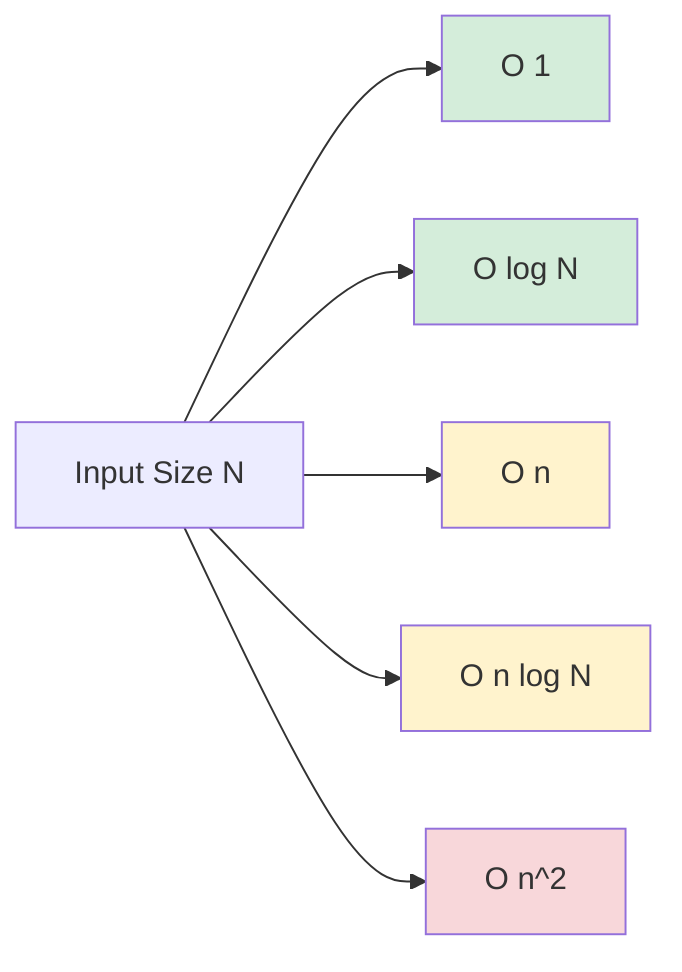

# 🧬 Data Structures & Algorithms (DSA)

Data structures are ways of organizing and storing data so that they can be accessed and worked with efficiently. Algorithms are the steps or rules followed in calculations or other problem-solving operations.

---

## 🗺️ Table of Contents
1. [Big O Notation](#1-big-o-notation)
2. [Core Data Structures](#2-core-data-structures)
3. [Core Algorithms](#3-core-algorithms)
4. [Problem Solving Strategies](#4-problem-solving-strategies)

---

## 1. Big O Notation
Big O notation is used to describe the efficiency of an algorithm in terms of time and space complexity as the input size grows.

| Complexity | Name | Example |
| :--- | :--- | :--- |
| **O(1)** | Constant | Accessing an array element by index. |
| **O(log n)** | Logarithmic | Binary search. |
| **O(n)** | Linear | Linear search. |
| **O(n log n)** | Linearithmic | Merge sort, Quick sort. |
| **O(n²)** | Quadratic | Bubble sort, Nested loops. |
| **O(2ⁿ)** | Exponential | Recursive Fibonacci. |

---

## 2. Core Data Structures

### Linear Data Structures
- **Arrays**: Fixed-size, contiguous memory, O(1) access.
- **Linked Lists**: Dynamic size, non-contiguous, O(n) access.
- **Stacks**: LIFO (Last In, First Out).
- **Queues**: FIFO (First In, First Out).
- **Hash Tables**: Key-value pairs, O(1) average access/insert.

### Non-Linear Data Structures
- **Trees**: Hierarchical structure (Binary Tree, BST, AVL, B-Tree).
- **Graphs**: Nodes and edges (Directed/Undirected, Weighted/Unweighted).
- **Heaps**: Specialized tree-based structure (Min-Heap, Max-Heap).

---

## 3. Core Algorithms

### Sorting
- **Bubble/Selection/Insertion Sort**: O(n²) - Simple but inefficient for large data.
- **Merge Sort**: O(n log n) - Divide and conquer, stable.
- **Quick Sort**: O(n log n) average - In-place, very fast.

### Searching
- **Linear Search**: O(n) - Sequential check.
- **Binary Search**: O(log n) - Search in a sorted array by dividing it in half.

### Traversal (Trees/Graphs)
- **BFS (Breadth-First Search)**: Explores all nodes at the present depth before moving deeper.
- **DFS (Depth-First Search)**: Explores as far as possible along each branch before backtracking.

---

## 4. Problem Solving Strategies
- **Brute Force**: Trying all possible solutions.
- **Divide and Conquer**: Breaking a problem into smaller subproblems.
- **Dynamic Programming**: Storing results of subproblems to avoid redundant work (Memoization).
- **Greedy Algorithms**: Making the locally optimal choice at each step.
- **Backtracking**: Building a solution piece by piece and removing those that fail.

---

## 📊 Sorting Efficiency Comparison

