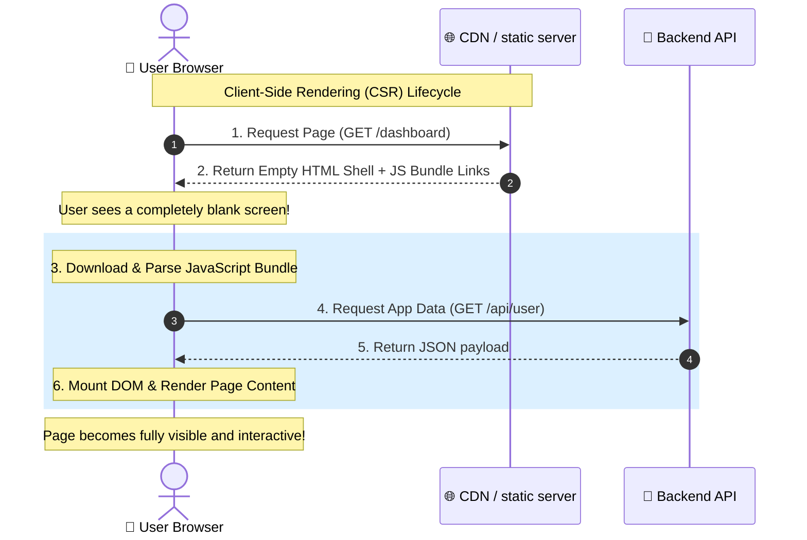
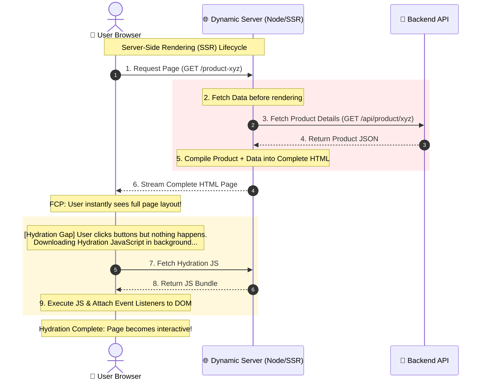
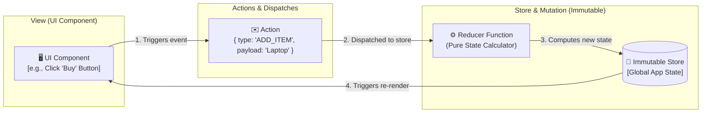
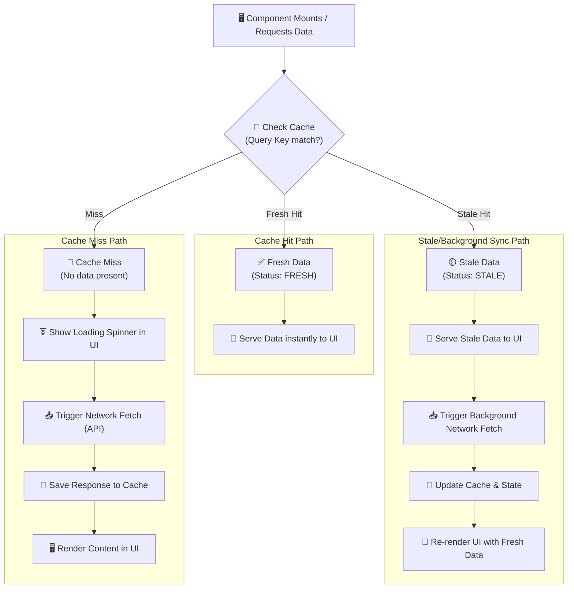

# 🖥️ Frontend Architecture

Modern web frontends are fully fledged client-side applications running on distributed, heterogeneous user devices. To build scalable, high-performing, and resilient web applications, frontend architects must master **Rendering Strategies** (how and where HTML markup and data are combined) and **State Management Patterns** (how application data is stored, synchronized, and distributed).

---

## 🗺️ Table of Contents
1. [Rendering Strategies](#1-rendering-strategies)
   - [Client-Side Rendering (CSR)](#client-side-rendering-csr)
   - [Server-Side Rendering (SSR)](#server-side-rendering-ssr)
   - [Static Site Generation (SSG)](#static-site-generation-ssg)
   - [Incremental Static Regeneration (ISR)](#incremental-static-regeneration-isr)
2. [Rendering Performance Matrix](#2-rendering-performance-matrix)
3. [CSR vs. SSR Execution Lifecycles](#3-csr-vs-ssr-execution-lifecycles)
4. [State Management Patterns](#4-state-management-patterns)
   - [Local State](#local-state)
   - [Global State Patterns](#global-state-patterns)
   - [Server State (Remote Cache)](#server-state-remote-cache)
5. [Flux Unidirectional Data Flow](#5-flux-unidirectional-data-flow)
6. [Server Cache Query Lifecycle](#6-server-cache-query-lifecycle)

---

## 1. Rendering Strategies

Deciding where to render HTML—on the user's browser, on the server dynamically, or pre-built at compile time—directly affects performance, SEO capability, and operational costs.

### Client-Side Rendering (CSR)

In a CSR architecture, the server delivers a nearly empty shell HTML file along with a JavaScript script bundle. The browser downloads the JS, boots up the framework engine (React, Angular, Vue), executes API calls to fetch data, and builds the DOM directly inside the client's browser.

- **Use Case**: Rich dashboards, internal SaaS tooling, interactive canvas editors, or post-login user accounts where search engine crawlers do not need indexation.
- **Pros**:
  - 🟢 **Instant Transitions**: Once the application has loaded, page switches are virtually instantaneous because no new HTML pages need fetching.
  - 🟢 **Decoupled Server**: Low server workload—servers just serve static JS/CSS assets, which can be entirely cached on a CDN.
- **Cons**:
  - 🔴 **Slow Initial Load**: The user sees a blank screen (first contentful paint is delayed) while massive JS bundles download and execute.
  - 🔴 **SEO Challenges**: Search engine bots that cannot execute JS reliably will index a blank page.

---

### Server-Side Rendering (SSR)

With SSR, every user request to the server triggers a dynamic page build. The server intercepts the request, runs database or API fetches, compiles the data into HTML, and streams the finished page back to the browser. The browser instantly displays the visual HTML, and then downloads a companion JS bundle to **hydrate** the page (attaching JS event listeners to make static HTML interactive).

- **Use Case**: E-commerce catalog pages, public marketing blogs, or social networks where content changes rapidly and SEO indexation is mandatory.
- **Pros**:
  - 🟢 **Excellent SEO**: Crawlers receive pre-rendered HTML immediately.
  - 🟢 **Fast Initial Load**: Users see content rapidly (FCP) because they don't have to wait for client-side JS to execute.
- **Cons**:
  - 🔴 **Server Overhead**: High server CPU loads since every page request requires dynamic server-side rendering.
  - 🔴 **Hydration Gap**: Users can see the content but cannot click buttons or interact with menus until the hydration JS executes (interactive lock).

---

### Static Site Generation (SSG)

SSG compiles all application pages into static HTML, JS, and CSS files **at build-time** (when building the project for deployment). These static files are uploaded directly to a CDN for instant edge-delivery.

- **Use Case**: Documentation portals, marketing homepages, static blogs, or portfolios where data changes infrequently.
- **Pros**:
  - 🟢 **Lightning Speed**: Edge CDN delivery yields sub-100ms TTFB (Time to First Byte).
  - 🟢 **Operational Zero-Ops**: Minimal host overhead, immune to high-traffic database connection exhaustion.
- **Cons**:
  - 🔴 **Build Bottlenecks**: A site with 10,000 products will require hours to compile at build time.
  - 🔴 **Stale Data**: Updating a spelling error requires rebuilding and redeploying the entire project.

---

### Incremental Static Regeneration (ISR)

ISR is a hybrid strategy designed to bring the speed of SSG to massive sites. Pages are initially generated at build-time. However, when a request is made for a stale page, the CDN serves the cached static page instantly, while initiating a background rebuild of that single page. Once compiled, the edge cache is refreshed.

- **Use Case**: Large e-commerce catalogs or news sites containing millions of pages.
- **Pros**:
  - 🟢 **Fast & Scalable**: Retains CDN delivery speeds while allowing millions of dynamic pages to exist without rebuild bottlenecks.
  - 🟢 **Self-Healing State**: Background generation ensures data remains fresh without global deployment runs.
- **Cons**:
  - 🔴 **Stale-While-Revalidate**: The very first user to request a modified page will still see old, stale data.

---

## 2. Rendering Performance Matrix

Architects should evaluate rendering choices using core performance indicators:

| Strategy | TTFB | FCP | LCP | TTI | SEO Profile | Server Load | Data Freshness |
| :--- | :--- | :--- | :--- | :--- | :--- | :--- | :--- |
| **CSR** | 🟢 Fast (Static CDN) | 🔴 Slow (Blank screen) | 🔴 Slow (JS dependant) | 🔴 Slow (Hydration/boot) | 🔴 Poor | 🟢 Low (Client-side) | 🟢 Real-time (API calls) |
| **SSR** | 🔴 Slow (Server compile) | 🟢 Fast (Visual HTML) | 🟢 Fast (Visual HTML) | 🟡 Medium (Hydration gap) | 🟢 Excellent | 🔴 High (On-demand CPU) | 🟢 Real-time (On-request) |
| **SSG** | 🟢 Extremely Fast (CDN) | 🟢 Extremely Fast (CDN) | 🟢 Extremely Fast (CDN) | 🟢 Extremely Fast | 🟢 Excellent | 🟢 Extremely Low | 🔴 Stale (Build bound) |
| **ISR** | 🟢 Extremely Fast (CDN) | 🟢 Extremely Fast (CDN) | 🟢 Extremely Fast (CDN) | 🟢 Extremely Fast | 🟢 Excellent | 🟡 Low-Medium (Background) | 🟡 Near Real-time (Lazy) |

---

## 3. CSR vs. SSR Execution Lifecycles

The sequence diagrams below illustrate the differing client-server lifecycles between CSR and SSR, highlighting the "Hydration Gap" where the user can see elements but cannot interact with them.

---

## 4. State Management Patterns

As client applications grew in size, the "Prop Drilling" bottleneck (passing data down through dozens of nested component parameters) created major architectural challenges. Modern apps categorize state into three distinct layers:

---

### Local State

State strictly bound to a single UI component and its immediate children. It represents localized user configurations.
- **Examples**: Toggling a modal sidebar (`isOpen`), tracking form input strings (`username`), or storing local active tab indices.
- **Architectural Practice**: Keep it localized. Avoid lifting state up globally unless it is genuinely needed by multiple distant sub-trees.

---

### Global State Patterns

State shared across non-adjacent component trees (e.g., shopping cart status, user authentication details, active app themes). Global state architectures follow three distinct philosophies:

#### 1. Unidirectional Flux Pattern (Redux, Redux Toolkit)
- **Concept**: A single, immutable global **Store** acts as the source of truth. The UI (View) cannot modify state directly. To change state, the UI must dispatch an **Action** containing a payload. The action is routed to a pure function called a **Reducer**, which computes a brand-new state object, triggering a re-render.
- **Pros**: Highly predictable, exceptional debugging tooling (Time-Travel debugging), clean separation of concerns.
- **Cons**: High boilerplate overhead; can feel overly verbose for small applications.

#### 2. Atomic Store Pattern (Zustand, Recoil)
- **Concept**: Decomposes global state into independent, lightweight state objects called **Atoms** or **Store Slices**. Components selectively subscribe only to the specific slices of state they require, preventing unnecessary global re-renders.
- **Pros**: Minimal boilerplate, lightweight, reactive, and highly intuitive.
- **Cons**: Less centralized enforcement; developers must structure slice interactions manually to prevent dependency loops.

#### 3. Observable State Pattern (MobX)
- **Concept**: Built on fine-grained reactivity using ES6 Proxies. State variables are marked as observable. When a component reads an observable during rendering, it is automatically registered as a dependency. The UI can mutate state directly, and the framework automatically re-renders only the dependent observers.
- **Pros**: Zero boilerplate, very natural JS coding style, outstanding automatic performance optimizations.
- **Cons**: Magic updates make tracing complex state flows harder to debug in large-scale teams.

---

### Server State (Remote Cache)

Server State represents asynchronous data fetched from a remote server. Historically, developers stored API results inside global stores (Redux/Zustand), leading to massive boilerplate. In modern frontends, Server State is treated as a **local cache** of remote database states, characterized by unique operational requirements:

- **Deduplication**: Merging concurrent identical API requests into a single network call.
- **Cache Expiration & Invalidation**: Defining how long data remains "fresh" (e.g., stale-while-revalidate patterns).
- **Background Syncing**: Silently fetching updated data when the window regains focus or when the user goes back online.
- **Optimistic Updates**: Instantly updating the UI to assume a network request will succeed (e.g., clicking a "like" button instantly lights it up while the API call completes in the background, rolling it back if the API fails).
- **Tools**: **TanStack Query (React Query)**, **SWR**, or **RTK Query**.

---

## 5. Flux Unidirectional Data Flow

The diagram below visualizes the classic Flux unidirectional loop, ensuring that data changes follow a single, highly predictable path throughout the application life:

---

## 6. Server Cache Query Lifecycle

The flowchart below demonstrates the execution path when a component requests Server State utilizing a modern cache client (like React Query), illustrating how network requests are bypassed completely for cached hits.

