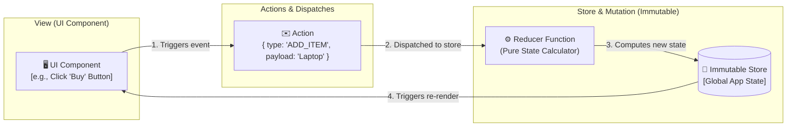
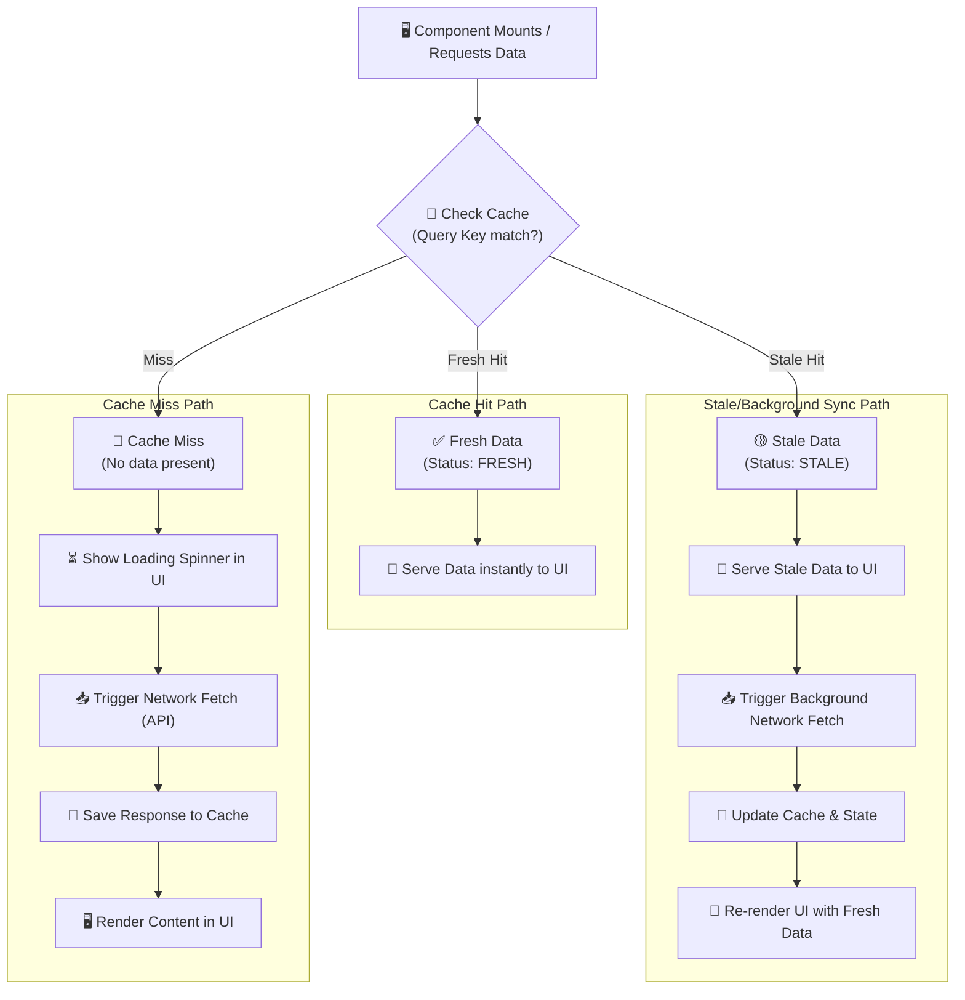

# 🖥️ Frontend Architecture

Modern web frontends are fully fledged client-side applications running on distributed, heterogeneous user devices. To build scalable, high-performing, and resilient web applications, frontend architects must master **Rendering Strategies** (how and where HTML markup and data are combined) and **State Management Patterns** (how application data is stored, synchronized, and distributed).

---

## 🗺️ Table of Contents
1. [Rendering Strategies](./rendering-strategies.md) — CSR, SSR, SSG, ISR with performance matrix and lifecycle diagrams
2. [State Management Patterns](./state-management-patterns.md) — Local, Global (Flux, Atomic, Observable), Server State
3. [Micro-frontends](./micro-frontends/README.md) — Module Federation, Iframe, Web Components
4. [Modern/Web Patterns](./modern-web-patterns.md) — Module, Mixin, Provider
5. [Bundlers & Build](./bundlers-and-build.md) — Vite, Webpack, esbuild, Turbopack
6. [Meta-Frameworks](./meta-frameworks.md) — Next.js, Nuxt, Remix, SvelteKit
7. [CSS Architecture](./css-architecture.md) — Tailwind, CSS Modules, CSS-in-JS, Design Tokens
8. [Design Systems](./design-systems.md) — Component Composition, Storybook
9. [PWA & Offline](./pwa-offline.md) — Service Workers, Cache API, IndexedDB
10. [Web Components](./web-components.md) — Custom Elements, Shadow DOM
11. [Core Web Vitals & Performance](./core-web-vitals.md) — LCP, CLS, INP, lazy loading
12. [SPA vs MPA](./spa-vs-mpa.md) — Trade-off matrix
13. [API Client Architecture](./api-client-architecture.md) — Apollo, tRPC, RTK Query, Axios
14. [FE Testing](./fe-testing.md) — Vitest, Playwright, Cypress
15. [FE Monorepo](./fe-monorepo.md) — Nx, Turborepo, pnpm workspaces
16. [Accessibility (a11y)](./accessibility.md) — WCAG, ARIA
17. [WebAssembly](./webassembly.md) — Wasm in the browser

---

## Rendering Strategies

Covered in **[Rendering Strategies](./rendering-strategies.md)** — CSR, SSR, SSG, ISR with performance matrix and sequence diagrams.

---

## 4. State Management Patterns

As client applications grew in size, the "Prop Drilling" bottleneck (passing data down through dozens of nested component parameters) created major architectural challenges. Modern apps categorize state into three distinct layers:

---

### Local State

State strictly bound to a single UI component and its immediate children. It represents localized user configurations.
- **Examples**: Toggling a modal sidebar (`isOpen`), tracking form input strings (`username`), or storing local active tab indices.
- **Architectural Practice**: Keep it localized. Avoid lifting state up globally unless it is genuinely needed by multiple distant sub-trees.

---

### Global State Patterns

State shared across non-adjacent component trees (e.g., shopping cart status, user authentication details, active app themes). Global state architectures follow three distinct philosophies:

#### 1. Unidirectional Flux Pattern (Redux, Redux Toolkit)
- **Concept**: A single, immutable global **Store** acts as the source of truth. The UI (View) cannot modify state directly. To change state, the UI must dispatch an **Action** containing a payload. The action is routed to a pure function called a **Reducer**, which computes a brand-new state object, triggering a re-render.
- **Pros**: Highly predictable, exceptional debugging tooling (Time-Travel debugging), clean separation of concerns.
- **Cons**: High boilerplate overhead; can feel overly verbose for small applications.

#### 2. Atomic Store Pattern (Zustand, Recoil)
- **Concept**: Decomposes global state into independent, lightweight state objects called **Atoms** or **Store Slices**. Components selectively subscribe only to the specific slices of state they require, preventing unnecessary global re-renders.
- **Pros**: Minimal boilerplate, lightweight, reactive, and highly intuitive.
- **Cons**: Less centralized enforcement; developers must structure slice interactions manually to prevent dependency loops.

#### 3. Observable State Pattern (MobX)
- **Concept**: Built on fine-grained reactivity using ES6 Proxies. State variables are marked as observable. When a component reads an observable during rendering, it is automatically registered as a dependency. The UI can mutate state directly, and the framework automatically re-renders only the dependent observers.
- **Pros**: Zero boilerplate, very natural JS coding style, outstanding automatic performance optimizations.
- **Cons**: Magic updates make tracing complex state flows harder to debug in large-scale teams.

---

### Server State (Remote Cache)

Server State represents asynchronous data fetched from a remote server. Historically, developers stored API results inside global stores (Redux/Zustand), leading to massive boilerplate. In modern frontends, Server State is treated as a **local cache** of remote database states, characterized by unique operational requirements:

- **Deduplication**: Merging concurrent identical API requests into a single network call.
- **Cache Expiration & Invalidation**: Defining how long data remains "fresh" (e.g., stale-while-revalidate patterns).
- **Background Syncing**: Silently fetching updated data when the window regains focus or when the user goes back online.
- **Optimistic Updates**: Instantly updating the UI to assume a network request will succeed (e.g., clicking a "like" button instantly lights it up while the API call completes in the background, rolling it back if the API fails).
- **Tools**: **TanStack Query (React Query)**, **SWR**, or **RTK Query**.

---

## 5. Flux Unidirectional Data Flow

The diagram below visualizes the classic Flux unidirectional loop, ensuring that data changes follow a single, highly predictable path throughout the application life:

```mermaid
flowchart LR
    subgraph UI_LAYER["View (UI Component)"]
        View["🖥️ UI Component\n[e.g., Click 'Buy' Button]"]
    end
    
    subgraph ACTION_LAYER["Actions & Dispatches"]
        Action["✉️ Action\n{ type: 'ADD_ITEM', payload: 'Laptop' }"]
    end
    
    subgraph STORE_LAYER["Store & Mutation (Immutable)"]
        Reducer["⚙️ Reducer Function\n(Pure State Calculator)"]
        Store[("💾 Immutable Store\n[Global App State]")]
    end

    View -->|"1. Triggers event"| Action
    Action -->|"2. Dispatched to store"| Reducer
    Reducer -->|"3. Computes new state"| Store
    Store -->|"4. Triggers re-render"| View
```

---

## 6. Server Cache Query Lifecycle

The flowchart below demonstrates the execution path when a component requests Server State utilizing a modern cache client (like React Query), illustrating how network requests are bypassed completely for cached hits.

```mermaid
flowchart TD
    Comp["🖥️ Component Mounts / Requests Data"]
    Cache{"💾 Check Cache\n(Query Key match?)"}
    
    subgraph HIT_PATH["Cache Hit Path"]
        StateData["✅ Fresh Data\n(Status: FRESH)"]
        ServeClient["🏃 Serve Data instantly to UI"]
    end
    
    subgraph STALE_PATH["Stale/Background Sync Path"]
        StaleData["🟡 Stale Data\n(Status: STALE)"]
        ServeStale["🏃 Serve Stale Data to UI"]
        BgFetch["📥 Trigger Background Network Fetch"]
        UpdateCache["💾 Update Cache & State"]
        ReRender["🔄 Re-render UI with Fresh Data"]
    end
    
    subgraph MISS_PATH["Cache Miss Path"]
        NoData["🔴 Cache Miss\n(No data present)"]
        ShowLoading["⏳ Show Loading Spinner in UI"]
        NetFetch["📥 Trigger Network Fetch (API)"]
        SaveCache["💾 Save Response to Cache"]
        RenderContent["🖥️ Render Content in UI"]
    end

    Comp --> Cache
    
    Cache -->|Fresh Hit| StateData
    StateData --> ServeClient
    
    Cache -->|Stale Hit| StaleData
    StaleData --> ServeStale
    ServeStale --> BgFetch
    BgFetch --> UpdateCache
    UpdateCache --> ReRender
    
    Cache -->|Miss| NoData
    NoData --> ShowLoading
    ShowLoading --> NetFetch
    NetFetch --> SaveCache
    SaveCache --> RenderContent
```
