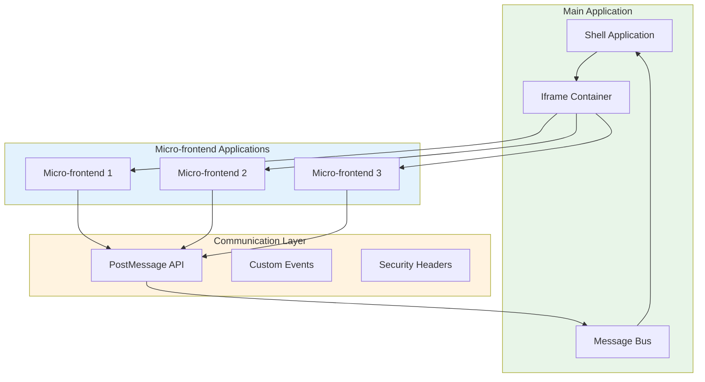

# Iframe Integration

## Architecture Overview



## Iframe Implementation

### Shell Application Setup

```jsx
// Shell Application Component
import React, { useState, useEffect, useRef } from 'react';

const IframeContainer = ({ url, title, onMessage }) => {
  const iframeRef = useRef(null);
  const [loading, setLoading] = useState(true);

  useEffect(() => {
    const handleMessage = (event) => {
      // Security: Only accept messages from allowed origins
      if (event.origin !== new URL(url).origin) {
        return;
      }
      
      onMessage(event.data);
      setLoading(false);
    };

    window.addEventListener('message', handleMessage);
    
    return () => {
      window.removeEventListener('message', handleMessage);
    };
  }, [url, onMessage]);

  const sendMessage = (message) => {
    if (iframeRef.current && iframeRef.current.contentWindow) {
      iframeRef.current.contentWindow.postMessage(message, new URL(url).origin);
    }
  };

  return (
    <div className="iframe-container">
      <h2>{title}</h2>
      {loading && <div>Loading...</div>}
      <iframe
        ref={iframeRef}
        src={url}
        style={{ width: '100%', height: '100%', border: 'none' }}
        onLoad={() => setLoading(false)}
        sandbox="allow-scripts allow-same-origin allow-forms"
      />
    </div>
  );
};

// Usage in main app
function App() {
  const [message, setMessage] = useState('');

  return (
    <div>
      <IframeContainer
        url="http://localhost:3001"
        title="User Dashboard"
        onMessage={setMessage}
      />
      <div>Received: {message}</div>
    </div>
  );
}
```

### Micro-frontend Communication

```javascript
// Micro-frontend - Post Message Handler
class IframeCommunication {
  constructor() {
    this.targetOrigin = 'http://localhost:3000'; // Shell app origin
  }

  sendMessage(type, data) {
    const message = {
      type,
      data,
      timestamp: Date.now()
    };
    
    window.parent.postMessage(message, this.targetOrigin);
  }

  setupMessageListener() {
    window.addEventListener('message', (event) => {
      // Security: Verify message origin
      if (event.origin !== this.targetOrigin) {
        return;
      }
      
      this.handleMessage(event.data);
    });
  }

  handleMessage(message) {
    switch (message.type) {
      case 'NAVIGATE':
        this.handleNavigation(message.data);
        break;
      case 'UPDATE_USER':
        this.handleUserUpdate(message.data);
        break;
      case 'GET_DATA':
        this.handleDataRequest(message.data);
        break;
      default:
        console.warn('Unknown message type:', message.type);
    }
  }

  handleNavigation(route) {
    // Handle navigation within micro-frontend
    window.history.pushState({}, '', route);
  }

  handleUserUpdate(userData) {
    // Update local state
    this.updateUserData(userData);
  }

  handleDataRequest(request) {
    // Fetch and return requested data
    this.fetchData(request.id).then(data => {
      this.sendMessage('DATA_RESPONSE', { requestId: request.id, data });
    });
  }
}

// Initialize communication
const communication = new IframeCommunication();
communication.setupMessageListener();
```

---

[⬅️ Back to Micro-frontends](./README.md)
