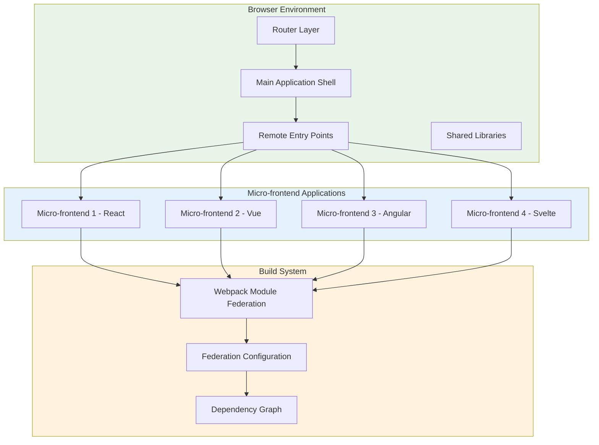

# Module Federation

## Architecture Overview



## Module Federation Implementation

### Webpack Module Federation Configuration

```javascript
// webpack.config.js - Shell Application
const ModuleFederationPlugin = require('@module-federation/webpack').ModuleFederationPlugin;
const { dependencies } = require('./package.json').dependencies;

module.exports = {
  mode: 'development',
  devServer: {
    port: 3000,
  },
  plugins: [
    new ModuleFederationPlugin({
      name: 'shell',
      filename: 'remoteEntry.js',
      exposes: {
        './src/App': './App',
      },
      remotes: {
        userDashboard: 'user_dashboard@http://localhost:3001/remoteEntry.js',
        productCatalog: 'product_catalog@http://localhost:3002/remoteEntry.js',
        adminPanel: 'admin_panel@http://localhost:3003/remoteEntry.js',
        analytics: 'analytics@http://localhost:3004/remoteEntry.js',
      },
      shared: {
        ...dependencies,
        react: { singleton: true, requiredVersion: '^17.0.0' },
        'react-dom': { singleton: true, requiredVersion: '^17.0.0' },
        'react-router-dom': { singleton: true },
      },
    }),
  ],
};
```

### Micro-frontend Configuration

```javascript
// webpack.config.js - User Dashboard
const ModuleFederationPlugin = require('@module-federation/webpack').ModuleFederationPlugin;

module.exports = {
  mode: 'development',
  devServer: {
    port: 3001,
  },
  plugins: [
    new ModuleFederationPlugin({
      name: 'user_dashboard',
      filename: 'remoteEntry.js',
      exposes: {
        './src/Dashboard': './Dashboard',
        './src/UserProfile': './UserProfile',
      },
      shared: {
        react: { singleton: true, requiredVersion: '^17.0.0' },
        'react-dom': { singleton: true, requiredVersion: '^17.0.0' },
        'styled-components': { singleton: true },
      },
    }),
  ],
};
```

### Shell Application Integration

```jsx
// Shell App Component
import React, { Suspense } from 'react';
import { Routes, Route } from 'react-router-dom';

const UserDashboard = React.lazy(() => import('user_dashboard/Dashboard'));
const ProductCatalog = React.lazy(() => import('product_catalog/Catalog'));
const AdminPanel = React.lazy(() => import('admin_panel/Panel'));
const Analytics = React.lazy(() => import('analytics/Dashboard'));

function App() {
  return (
    <div>
      <header>
        <nav>
          <Link to="/dashboard">Dashboard</Link>
          <Link to="/products">Products</Link>
          <Link to="/admin">Admin</Link>
          <Link to="/analytics">Analytics</Link>
        </nav>
      </header>
      
      <main>
        <Suspense fallback={<div>Loading...</div>}>
          <Routes>
            <Route path="/dashboard" element={<UserDashboard />} />
            <Route path="/products" element={<ProductCatalog />} />
            <Route path="/admin" element={<AdminPanel />} />
            <Route path="/analytics" element={<Analytics />} />
          </Routes>
        </Suspense>
      </main>
    </div>
  );
}
```

---

[⬅️ Back to Micro-frontends](./README.md)
