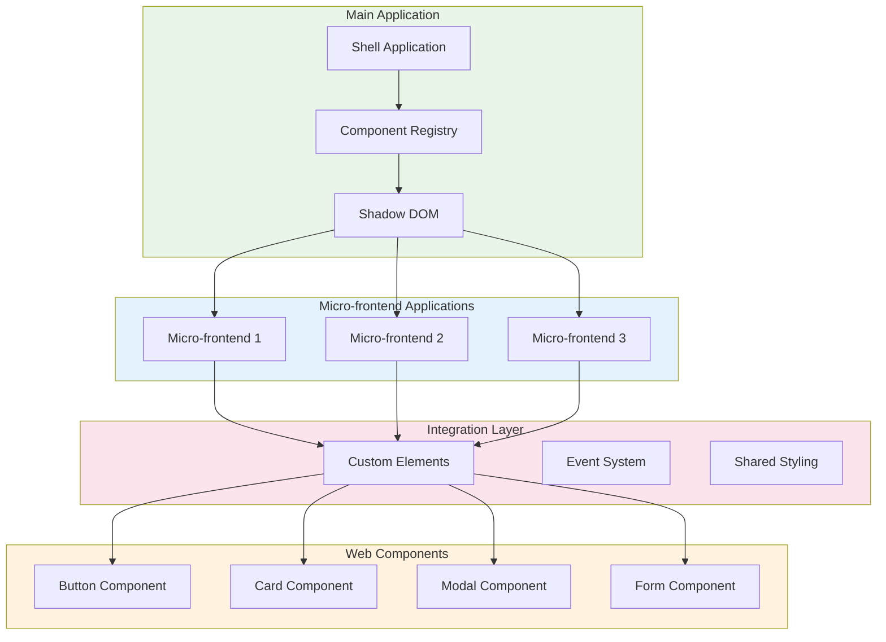

# Web Components (Micro-frontends)

## Architecture Overview



## Web Components Implementation

### Custom Component Definition

```javascript
// Custom Button Component
class CustomButton extends HTMLElement {
  constructor() {
    super();
    this.attachShadow({ mode: 'open' });
  }

  connectedCallback() {
    this.render();
  }

  render() {
    const button = document.createElement('button');
    button.textContent = this.getAttribute('label') || 'Click me';
    button.style.cssText = `
      background-color: ${this.getAttribute('color') || '#007bff'};
      color: white;
      border: none;
      padding: 8px 16px;
      border-radius: 4px;
      cursor: pointer;
      font-family: inherit;
    `;

    button.addEventListener('click', () => {
      this.dispatchEvent(new CustomEvent('button-click', {
        detail: { value: this.getAttribute('value') }
      }));
    });

    this.shadowRoot.appendChild(button);
  }

  static get observedAttributes() {
    return ['label', 'color', 'value'];
  }

  attributeChangedCallback(name, oldValue, newValue) {
    if (name === 'label') {
      this.shadowRoot.querySelector('button').textContent = newValue;
    }
  }
}

// Register the custom element
customElements.define('custom-button', CustomButton);
```

### Micro-frontend Component Usage

```jsx
// Micro-frontend React Component
import React, { useEffect, useRef } from 'react';

const CustomButtonWrapper = ({ label, color, value, onClick }) => {
  const buttonRef = useRef(null);

  useEffect(() => {
    const button = buttonRef.current;
    if (button) {
      button.addEventListener('button-click', (event) => {
        onClick(event.detail.value);
      });
    }
  }, [onClick]);

  return (
    <custom-button
      ref={buttonRef}
      label={label}
      color={color}
      value={value}
    />
  );
};

// Usage in micro-frontend
function UserDashboard() {
  const handleButtonClick = (value) => {
    console.log('Button clicked with value:', value);
  };

  return (
    <div>
      <h2>User Dashboard</h2>
      <CustomButtonWrapper
        label="Save User"
        color="#28a745"
        value="save"
        onClick={handleButtonClick}
      />
      <CustomButtonWrapper
        label="Cancel"
        color="#dc3545"
        value="cancel"
        onClick={handleButtonClick}
      />
    </div>
  );
}
```

### Shell Application Integration

```javascript
// Shell Application - Component Loader
class ComponentLoader {
  constructor() {
    this.loadedComponents = new Map();
  }

  async loadComponent(componentName, version = 'latest') {
    if (this.loadedComponents.has(componentName)) {
      return this.loadedComponents.get(componentName);
    }

    try {
      const response = await fetch(`/components/${componentName}/${version}/component.js`);
      const componentCode = await response.text();
      
      // Create and register the component
      const script = document.createElement('script');
      script.textContent = componentCode;
      document.head.appendChild(script);
      
      this.loadedComponents.set(componentName, true);
      return true;
    } catch (error) {
      console.error(`Failed to load component ${componentName}:`, error);
      return false;
    }
  }

  async loadAllComponents(components) {
    const loadPromises = components.map(component => 
      this.loadComponent(component.name, component.version)
    );
    
    return Promise.allSettled(loadPromises);
  }
}

// Usage
const loader = new ComponentLoader();
await loader.loadAllComponents([
  { name: 'custom-button', version: '1.2.0' },
  { name: 'user-card', version: '2.0.0' },
  { name: 'data-table', version: '1.5.0' }
]);
```

---

[⬅️ Back to Micro-frontends](./README.md)
