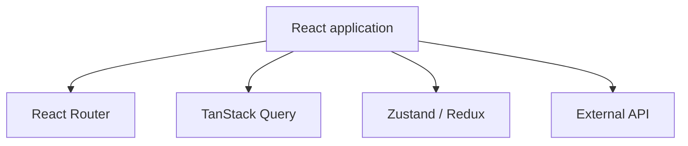
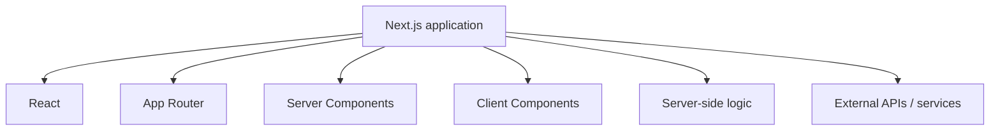
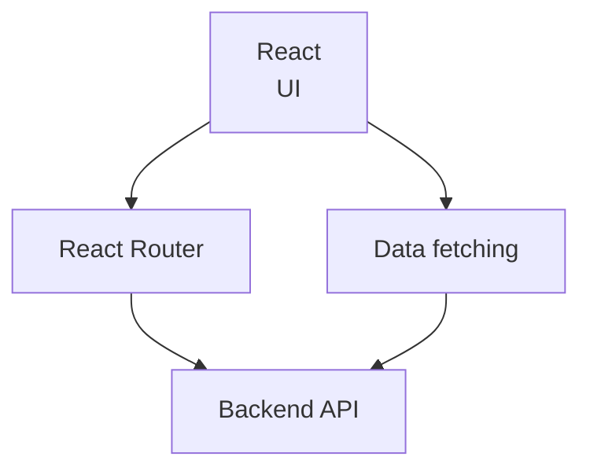
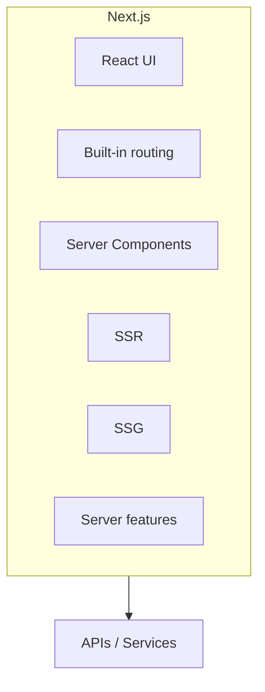
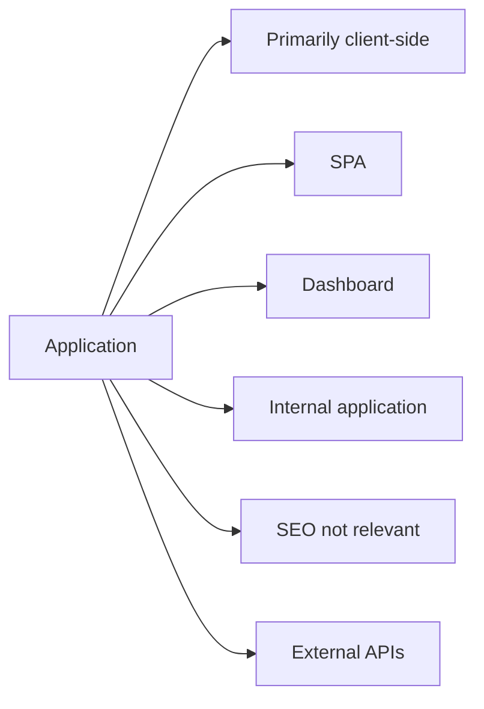
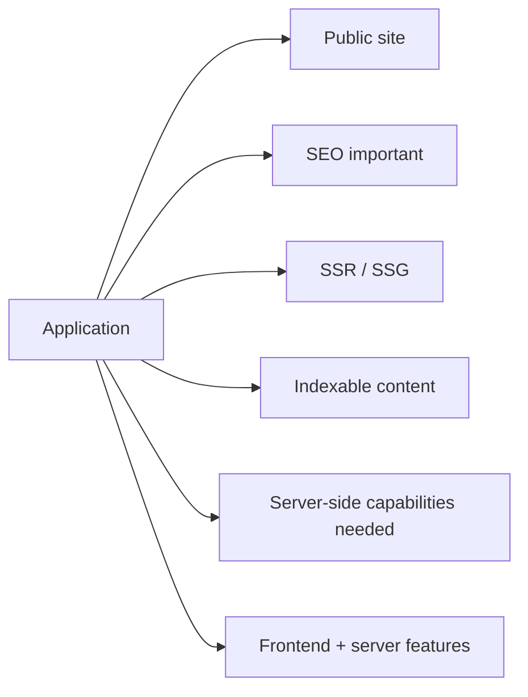

# ⚛️ React.js vs Next.js

React.js is a JavaScript library focused primarily on building user interfaces.

Next.js is a framework built on top of React that adds capabilities for building complete web applications, such as built-in routing, server-side rendering, static site generation, and server-side functionality.

The choice between React.js on its own and React.js + Next.js depends mainly on the application's needs, the architecture you want, and the level of infrastructure you are willing to bring into the project.

> [!NOTE]
> Part of the [Frontend Architecture](./README.md) module. For the rendering concepts covered here (CSR, SSR, SSG, ISR), see [Rendering Strategies](./rendering-strategies.md); for other React meta-frameworks, see [Meta-Frameworks](./meta-frameworks.md).

---

## 🗺️ Table of Contents

1. [Introduction](#1-introduction)
2. [React.js without Next.js](#2-reactjs-without-nextjs)
3. [React.js + Next.js](#3-reactjs--nextjs)
4. [Comparison](#4-comparison)
5. [When to use React.js](#5-when-to-use-reactjs)
6. [When to use React.js + Next.js](#6-when-to-use-reactjs--nextjs)
7. [Architectural view](#7-architectural-view)
8. [Summary: pros and cons](#8-summary-pros-and-cons)
9. [Conclusion](#9-conclusion)

---

## 1. Introduction

React.js is a JavaScript library focused primarily on building user interfaces.

Next.js is a framework built on top of React that extends it with capabilities for building complete web applications: built-in routing, server-side rendering (SSR), static site generation (SSG), incremental static regeneration (ISR), Server Components, and server-side functionality.

The choice between React.js alone and React.js + Next.js depends mainly on the application's needs, its architecture, and the level of infrastructure you want to incorporate.

---

## 2. React.js without Next.js

### 2.1 Greater initial simplicity

React.js lets you start with a relatively simple architecture, without the extra conventions and features that a framework such as Next.js introduces.

This can ease:

- Initial learning.
- Onboarding of new developers.
- Rapid prototyping.
- Maintenance of small applications.

### 2.2 Greater architectural freedom

With React.js you can choose each tool individually.

For example:

- **React Router** for routing.
- **Vite** for the development environment and build.
- **TanStack Query** for remote data management.
- **Redux / Zustand** or other solutions for global state.
- **Axios / fetch** for HTTP requests.

This freedom lets you design the architecture around the specific needs of the project.

### 2.3 Less coupling to a framework

An application built with React alone can depend less on Next.js conventions.

This can be convenient when:

- The team already has an established architecture.
- Specific tools need to be used.
- You want more control over each part of the stack.
- The application does not need server-side features.

### 2.4 Excellent choice for SPAs

React.js works especially well for Single Page Applications (SPA). A SPA loads the application once and then performs most interactions directly in the browser.

Some examples:

- Dashboards.
- Administration systems.
- Internal enterprise applications.
- Management tools.
- Applications that require authentication.

### 2.5 Explicit client control

With React.js it is easy to set up an architecture where practically the entire application runs in the browser.

This can be useful when:

- The application depends heavily on external APIs.
- Most operations require user interaction.
- The content does not need to be indexed by search engines.
- The user must remain authenticated.

### 2.6 Explicit configuration

React.js does not force a particular architecture for aspects such as:

- Routing.
- Global state.
- Data fetching.
- Authentication.
- API communication.
- Project structure.

The team can select the tools it considers appropriate.

### 2.7 Suitable for internal applications

For applications that do not need SEO or server-side rendering, using React directly can reduce the amount of infrastructure required.

Examples:

- Backoffice.
- Internal CRM.
- ERP.
- Inventory systems.
- Metrics panels.
- Tools used only by employees.

### 2.8 Lower conceptual complexity

By using React without Next.js, the team can initially avoid framework-specific concepts such as:

- Server Components.
- Client Components.
- SSR.
- SSG.
- ISR.
- Server Actions.
- Route Handlers.
- App Router.

This can make the architecture easier to understand for teams that only need a client-side application.

---

## 3. React.js + Next.js

Next.js adds a set of capabilities on top of React that can be very useful for more complete web applications.

### 3.1 Server-Side Rendering (SSR)

Next.js can render pages on the server before sending them to the browser.

This can be useful when:

- Content must be available quickly.
- The initial loading experience needs to be improved.
- Content depends on information obtained on the server.
- SEO matters.

### 3.2 Static Site Generation (SSG)

Next.js can generate static pages that are served directly without executing server logic for every request.

It is especially useful for:

- Blogs.
- Documentation.
- Landing pages.
- Corporate sites.
- Catalogs.
- Content that rarely changes.

### 3.3 Built-in routing

Next.js provides a routing system based on the project's file structure, avoiding the need to add and configure an external routing solution.

### 3.4 Server Components

Next.js integrates React Server Components, allowing certain components to run on the server and send only the necessary information to the client.

This can help reduce the amount of JavaScript shipped to the browser in certain scenarios.

### 3.5 Server-side capabilities

Next.js lets you implement server functionality within the same project, reducing the need to keep separate projects for:

- Frontend.
- Endpoints.
- Server-side logic.
- Some backend operations.

### 3.6 SEO

Next.js provides tools to work with:

- Metadata.
- Titles.
- Descriptions.
- Open Graph.
- Content rendering.
- Generation of indexable pages.

This can make it easier to build sites whose traffic depends on search engines.

### 3.7 Image optimization

Next.js includes dedicated tools for working with images and optimizing their loading.

This can help with:

- Appropriate sizes.
- Lazy loading.
- Optimized formats.
- Performance.

### 3.8 Standardized architecture

Next.js establishes conventions for different aspects of the application.

This can benefit large teams by reducing the number of decisions required around the basic project structure.

---

## 4. Comparison

| Feature | React.js | React.js + Next.js |
|---|:---:|:---:|
| UI library | ✅ | ✅ |
| SPA | ✅ | ✅ |
| Initial simplicity | ✅ | ⚠️ |
| Architectural freedom | ✅ | ⚠️ |
| Built-in routing | ❌ | ✅ |
| SSR | Requires an extra solution | ✅ |
| SSG | Requires an extra solution | ✅ |
| Server Components | ❌ | ✅ |
| Server-side capabilities | Requires another solution | ✅ |
| SEO | Requires extra work | ✅ |
| Image optimization | Requires extra tools | ✅ |
| Internal applications | ✅ | ✅ |
| Dashboards | ✅ | ✅ |
| Public sites | ✅ | ✅ |
| E-commerce | ✅ | ✅ |
| Highly interactive applications | ✅ | ✅ |
| Architecture control | High | More convention-driven |
| Number of concepts | Lower | Higher |

> [!TIP]
> "⚠️" means the capability exists but requires additional configuration or deliberate choices. "❌" means the capability is not available without adopting an additional framework.

---

## 5. When to use React.js

React.js can be a good choice when the application is mostly client-side.

For example:

- Administrative dashboard.
- Internal application.
- Enterprise system.
- Metrics panel.
- Application behind authentication.
- Traditional SPA.
- Prototype.
- Application that mainly consumes external APIs.

A typical architecture could be:

In this scenario, adding Next.js could introduce functionality the application does not need.

---

## 6. When to use React.js + Next.js

Next.js is especially useful when the application needs a combination of frontend and server-side capabilities.

Examples:

- E-commerce.
- Blog.
- Corporate site.
- Public platform.
- Marketplace.
- Content portal.
- Application where SEO is important.
- Application that needs SSR or SSG.
- Project that wants to integrate frontend with certain server functionality.

A typical architecture could be:

---

## 7. Architectural view

### 7.1 React.js alone

React on its own concentrates mainly on the user interface.

The rest of the architecture must be selected and integrated.

### 7.2 React.js + Next.js

Next.js provides more pieces within the same framework.

This can reduce the number of external tools needed, although it also means adopting the framework's conventions.

---

## 8. Summary: pros and cons

### 8.1 React.js

**Pros**

- Simple architecture.
- More freedom.
- Fewer conventions.
- Excellent for SPAs.
- Very suitable for internal applications.
- Lets you choose tools individually.
- Explicit control of the code running on the client.

**Cons**

- Routing requires an additional solution.
- SSR requires an additional solution.
- SSG requires an additional solution.
- SEO may require extra work.
- You must select and maintain more infrastructure pieces.
- The team must make more architectural decisions.

### 8.2 React.js + Next.js

**Pros**

- Built-in routing.
- SSR.
- SSG.
- Server Components.
- Server-side capabilities.
- SEO tooling.
- Image optimization.
- Architectural conventions.
- Can integrate frontend with selected server functionality.

**Cons**

- Higher conceptual complexity.
- More conventions.
- Greater framework dependency.
- Some architectural decisions are conditioned by Next.js.
- Can be unnecessary for simple client-side applications.
- The team must learn additional rendering and server/client execution concepts.

---

## 9. Conclusion

The choice should not be reduced to one technology being universally better than the other. The decision depends mainly on the characteristics of the application.

**React.js can fit when the application is:**

In these cases, React's simplicity and freedom can be important advantages.

**React.js + Next.js can fit when the application is:**

In these cases, the extra capabilities of Next.js can reduce the amount of infrastructure the team needs to build separately.

In general terms:

- React.js offers more freedom and simplicity.
- React.js + Next.js offers more infrastructure and integrated features for building complete web applications.

The final decision should be based on the application's requirements, the team's capabilities, and the architecture you want to maintain in the long term.

---

[⬅️ Back to Frontend Architecture](./README.md)