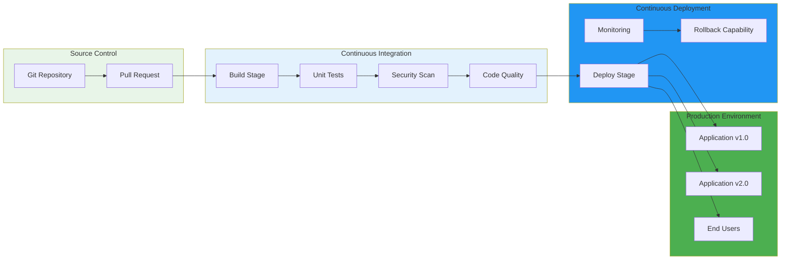
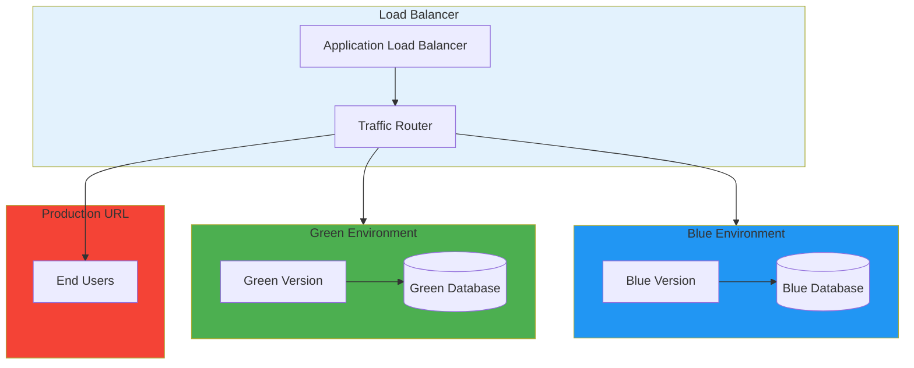
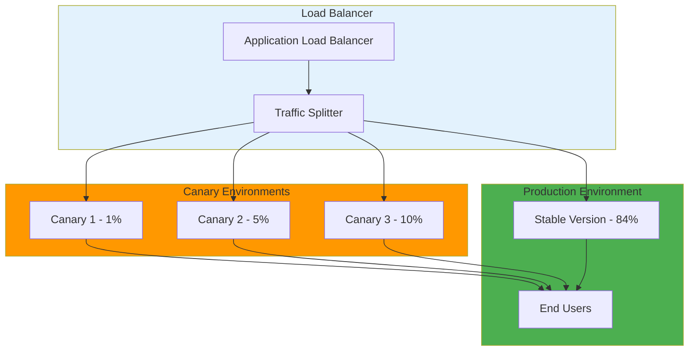
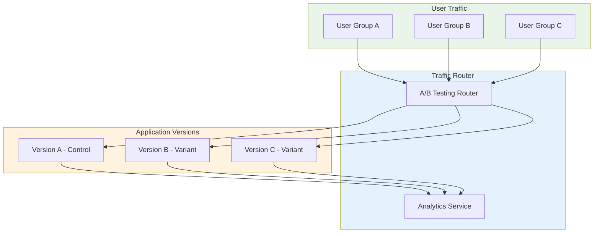

# 🚀 CI/CD Pipelines

A comprehensive guide to advanced deployment strategies including Blue/Green and Canary deployments, with practical examples and best practices for modern software delivery.

---

## 🗺️ Table of Contents
1. [CI/CD Overview](#1-cicd-overview)
2. [Blue/Green Deployment](#2-bluegreen-deployment)
3. [Canary Deployment](#3-canary-deployment)
4. [Advanced Strategies](#4-advanced-strategies)
5. [Pipeline Implementation](#5-pipeline-implementation)
6. [Best Practices](#6-best-practices)

---

## 1. CI/CD Overview

### **What is CI/CD?**
Continuous Integration and Continuous Deployment/Delivery practices that automate the software delivery pipeline from code commit to production deployment.

### **Key Benefits**
- **Faster Delivery**: Automated testing and deployment
- **Reduced Risk**: Gradual rollout with immediate rollback capability
- **Quality Assurance**: Automated testing at each stage
- **Consistency**: Standardized deployment processes
- **Visibility**: Complete audit trail and monitoring

### **Pipeline Stages**


---

## 2. Blue/Green Deployment

### **Architecture Overview**


### **Blue/Green Implementation**

#### **Infrastructure Setup**
```yaml
# kubernetes/namespace.yaml
apiVersion: v1
kind: Namespace
metadata:
  name: production
  labels:
    environment: production
    app: my-application

---
# kubernetes/blue-deployment.yaml
apiVersion: apps/v1
kind: Deployment
metadata:
  name: my-app-blue
  namespace: production
  labels:
    app: my-app
    version: blue
spec:
  replicas: 3
  selector:
    matchLabels:
      app: my-app
      version: blue
  template:
    metadata:
      labels:
        app: my-app
        version: blue
    spec:
      containers:
      - name: my-app
        image: my-registry/my-app:blue-v1.0.0
        ports:
        - containerPort: 8080
        env:
        - name: ENVIRONMENT
          value: "blue"
        - name: DATABASE_URL
          valueFrom:
            secretKeyRef:
              name: db-credentials-blue
              key: url

---
# kubernetes/green-deployment.yaml
apiVersion: apps/v1
kind: Deployment
metadata:
  name: my-app-green
  namespace: production
  labels:
    app: my-app
    version: green
spec:
  replicas: 3
  selector:
    matchLabels:
      app: my-app
      version: green
  template:
    metadata:
      labels:
        app: my-app
        version: green
    spec:
      containers:
      - name: my-app
        image: my-registry/my-app:green-v1.0.0
        ports:
          - containerPort: 8080
        env:
        - name: ENVIRONMENT
          value: "green"
        - name: DATABASE_URL
          valueFrom:
            secretKeyRef:
              name: db-credentials-green
              key: url

---
# kubernetes/service.yaml
apiVersion: v1
kind: Service
metadata:
  name: my-app-service
  namespace: production
spec:
  selector:
    app: my-app
  ports:
    - port: 80
      targetPort: 8080
  type: ClusterIP
```

#### **CI/CD Pipeline Configuration**
```yaml
# .github/workflows/blue-green-deploy.yml
name: Blue/Green Deployment
on:
  push:
    branches: [main]
  workflow_dispatch:
    inputs:
      environment:
        description: 'Target environment (blue/green)'
        required: true
        default: 'blue'
        type: choice
        options:
        - blue
        - green

jobs:
  test:
    runs-on: ubuntu-latest
    steps:
      - name: Checkout code
        uses: actions/checkout@v3

      - name: Run tests
        run: |
          npm ci
          npm run test:unit
          npm run test:integration

      - name: Build application
        run: |
          docker build -t my-registry/my-app:${{ github.sha }} .

      - name: Push to registry
        run: |
          docker push my-registry/my-app:${{ github.sha }}

  deploy:
    needs: test
    runs-on: ubuntu-latest
    steps:
      - name: Checkout code
        uses: actions/checkout@v3

      - name: Deploy to ${{ github.event.inputs.environment }}
        run: |
          echo "Deploying to ${{ github.event.inputs.environment }} environment"
          kubectl apply -f kubernetes/${{ github.event.inputs.environment }}-deployment.yaml
          kubectl set image deployment/my-app-${{ github.event.inputs.environment }} my-registry/my-app:${{ github.sha }}

      - name: Update load balancer
        run: |
          echo "Updating load balancer to route to ${{ github.event.inputs.environment }}"
          kubectl patch service my-app-service -p '{"spec":{"selector":{"app":"my-app","version":"${{ github.event.inputs.environment }}"}}}'
```

#### **Traffic Switching Script**
```bash
#!/bin/bash
# switch-traffic.sh - Blue/Green traffic management

set -e

ENVIRONMENT=${1:-blue}
NAMESPACE="production"
SERVICE_NAME="my-app-service"

echo "Switching traffic to $ENVIRONMENT environment"

# Update service selector to route traffic to specified environment
kubectl patch service $SERVICE_NAME -n $NAMESPACE -p '{"spec":{"selector":{"app":"my-app","version":"'$ENVIRONMENT'"}}}'

# Wait for deployment to be ready
echo "Waiting for deployment to be ready..."
kubectl rollout status deployment/my-app-$ENVIRONMENT -n $NAMESPACE --timeout=300s

# Verify the switch
echo "Verifying traffic switch..."
kubectl get service $SERVICE_NAME -n $NAMESPACE -o yaml

echo "Traffic switched to $ENVIRONMENT environment successfully!"
```

---

## 3. Canary Deployment

### **Architecture Overview**


### **Canary Implementation**

#### **Infrastructure Setup**
```yaml
# kubernetes/canary-deployment.yaml
apiVersion: argoproj.io/v1alpha1
kind: Rollout
metadata:
  name: my-app-canary
  namespace: production
spec:
  replicas: 1
  strategy:
    canary:
      steps:
      - setWeight: 10
      - setWeight: 30
      - setWeight: 50
      - setWeight: 100
      analysis:
        templates:
        - templateName: success-rate
          templateSpec:
            metrics:
              - name: request-success-rate
              thresholdRange:
                min: 99
                max: 100
        - templateName: latency
          templateSpec:
            metrics:
              - name: request-latency
              thresholdRange:
                min: 0
                max: 500
        args:
          - name: service-name
            value: my-app
          - name: service-name
            value: my-app
  selector:
    matchLabels:
      app: my-app
  template:
    metadata:
      labels:
        app: my-app
        version: canary
    spec:
      containers:
      - name: my-app
        image: my-registry/my-app:canary-v1.1.0
        ports:
          - containerPort: 8080
        env:
        - name: ENVIRONMENT
          value: "canary"
        - name: VERSION
          value: "1.1.0"
        - name: DATABASE_URL
          valueFrom:
            secretKeyRef:
              name: db-credentials-canary
              key: url

---
# kubernetes/analysis-template.yaml
apiVersion: argoproj.io/v1alpha1
kind: AnalysisTemplate
metadata:
  name: success-rate
  namespace: production
spec:
  metrics:
    - name: request-success-rate
      interval: 30s
    args:
      - name: service-name
        value: my-app
  resources:
    - name: success-rate
    provider:
      prometheus:
        address: http://prometheus-server:9090

---
# kubernetes/analysis-template.yaml
apiVersion: argoproj.io/v1alpha1
kind: AnalysisTemplate
metadata:
  name: latency
  namespace: production
spec:
  metrics:
    - name: request-latency
      interval: 30s
  args:
      - name: service-name
        value: my-app
  resources:
    - name: latency
    provider:
      prometheus:
        address: http://prometheus-server:9090
```

#### **Progressive Delivery Pipeline**
```yaml
# .github/workflows/canary-deploy.yml
name: Canary Deployment
on:
  push:
    branches: [main]
  workflow_dispatch:
    inputs:
      canary_version:
        description: 'Canary version to deploy'
        required: true
        default: 'latest'
      traffic_percentage:
        description: 'Traffic percentage for canary'
        required: true
        default: '10'
        type: number

jobs:
  build-and-deploy:
    runs-on: ubuntu-latest
    steps:
      - name: Checkout code
        uses: actions/checkout@v3

      - name: Build canary image
        run: |
          docker build -t my-registry/my-app:canary-${{ github.sha }} .

      - name: Push canary image
        run: |
          docker push my-registry/my-app:canary-${{ github.sha }}

      - name: Deploy canary
        run: |
          echo "Deploying canary version: ${{ github.event.inputs.canary_version }}"
          helm upgrade --install my-app ./charts/my-app \
            --set image.tag=canary-${{ github.sha }} \
            --set environment=canary \
            --set trafficWeight=${{ github.event.inputs.traffic_percentage }}

      - name: Wait for canary analysis
        run: |
          echo "Waiting for canary analysis..."
          sleep 300

      - name: Check canary status
        run: |
          # Check if canary is healthy
          helm status my-app --show-resources | grep canary

      - name: Promote canary
        if: success()
        run: |
          echo "Promoting canary to stable"
          helm upgrade my-app ./charts/my-app \
            --set image.tag=canary-${{ github.sha }} \
            --set environment=stable \
            --set trafficWeight=100
```

---

## 4. Advanced Strategies

### **A/B Testing**


#### **A/B Testing Implementation**
```yaml
# kubernetes/ab-test-deployment.yaml
apiVersion: argoproj.io/v1alpha1
kind: Rollout
metadata:
  name: my-app-ab-test
  namespace: production
spec:
  replicas: 3
  strategy:
    canary:
      steps:
      - setWeight: 50
      - setWeight: 50
      analysis:
        templates:
          - templateName: conversion-rate
            templateSpec:
              metrics:
                - name: conversion-rate
                thresholdRange:
                  min: 0
                  max: 100
        args:
          - name: service-name
            value: my-app
          - name: experiment-name
            value: "ui-redesign-test"
  selector:
    matchLabels:
      app: my-app
  template:
    metadata:
      labels:
        app: my-app
        experiment: ui-redesign-test
    spec:
      containers:
      - name: my-app
        image: my-registry/my-app:ab-test-v1.2.0
        ports:
          - containerPort: 8080
        env:
        - name: EXPERIMENT_NAME
          value: "ui-redesign-test"
        - name: EXPERIMENT_VARIANT
          value: "A"
        - name: DATABASE_URL
          valueFrom:
            secretKeyRef:
              name: db-credentials-ab-test
              key: url
```

### **Feature Flags**
```javascript
// Feature flag management
class FeatureFlagManager {
  constructor() {
    this.flags = new Map();
    this.loadFlags();
  }

  loadFlags() {
    // Load flags from configuration service
    fetch('/api/feature-flags')
      .then(response => response.json())
      .then(flags => {
        flags.forEach(flag => {
          this.flags.set(flag.key, flag.enabled);
        });
      });
  }

  isEnabled(flagName) {
    return this.flags.get(flagName) || false;
  }

  getVariant(flagName) {
    const flag = this.flags.get(flagName);
    return flag ? flag.variant : null;
  }

  // Usage in application
  render() {
    if (this.isEnabled('new-dashboard')) {
      return <NewDashboard />;
    } else {
      return <OldDashboard />;
    }
  }
}

// Usage
const featureFlags = new FeatureFlagManager();

// Check if feature is enabled
if (featureFlags.isEnabled('new-dashboard')) {
  // Show new dashboard
}

// Get specific variant
const variant = featureFlags.getVariant('checkout-flow');
if (variant === 'A') {
  // Use checkout flow A
} else if (variant === 'B') {
  // Use checkout flow B
}
```

### **Multi-Region Deployment**
```yaml
# kubernetes/multi-region-deployment.yaml
apiVersion: v1
kind: ConfigMap
metadata:
  name: region-config
data:
  us-east-1: |
    region: us-east-1
    database: us-east-1-cluster
    cache: us-east-1-redis
  us-west-2: |
    region: us-west-2
    database: us-west-2-cluster
    cache: us-west-2-redis
  eu-west-1: |
    region: eu-west-1
    database: eu-west-1-cluster
    cache: eu-west-1-redis

---
apiVersion: apps/v1
kind: Deployment
metadata:
  name: my-app-multi-region
spec:
  replicas: 2
  selector:
    matchLabels:
      app: my-app
  template:
    metadata:
      labels:
        app: my-app
    spec:
      containers:
      - name: my-app
        image: my-registry/my-app:latest
        ports:
          - containerPort: 8080
        env:
          - name: REGION
            valueFrom:
              configMapKeyRef:
                name: region-config
                key: us-east-1
          - name: DATABASE_URL
            valueFrom:
                secretKeyRef:
                  name: db-credentials-us-east-1
                  key: url
          - name: CACHE_URL
            valueFrom:
                secretKeyRef:
                  name: cache-credentials-us-east-1
                  key: url

---
apiVersion: v1
kind: Service
metadata:
  name: my-app-global
spec:
  type: ExternalName
  externalName: my-app-global-dns
  selector:
    app: my-app
  ports:
    - port: 80
      targetPort: 8080
```

---

## 5. Pipeline Implementation

### **Complete CI/CD Pipeline**
```yaml
# .github/workflows/complete-cicd.yml
name: Complete CI/CD Pipeline
on:
  push:
    branches: [main, develop]
  pull_request:
    branches: [main]
  workflow_dispatch:
    inputs:
      environment:
        description: 'Target environment'
        required: true
        default: 'staging'
        type: choice
        options:
          - staging
          - production
      deployment_strategy:
        description: 'Deployment strategy'
        required: true
        default: 'blue-green'
        type: choice
        options:
          - blue-green
          - canary
          - rolling

jobs:
  test:
    runs-on: ubuntu-latest
    strategy:
      matrix:
        node-version: [14, 16, 18]
    steps:
      - name: Checkout code
        uses: actions/checkout@v3

      - name: Setup Node.js
        uses: actions/setup-node@v3
        with:
          node-version: ${{ matrix.node-version }}

      - name: Install dependencies
        run: |
          npm ci

      - name: Run unit tests
        run: |
          npm run test:unit:coverage

      - name: Run integration tests
        run: |
          npm run test:integration

      - name: Upload coverage
        uses: codecov/codecov-action@v3
        with:
          file: ./coverage/lcov.info

  security-scan:
    runs-on: ubuntu-latest
    steps:
      - name: Checkout code
        uses: actions/checkout@v3

      - name: Run security scan
        run: |
          npm audit --audit-level high
          docker run --rm -v "$PWD":/app -w /sec/scan:rw \
            securecodereview scan: /app src

      - name: Upload security scan results
        uses: actions/upload-artifact@v3
        with:
          name: security-scan-results
          path: /sec/scan

  build:
    needs: [test, security-scan]
    runs-on: ubuntu-latest
    steps:
      - name: Checkout code
        uses: actions/checkout@v3

      - name: Build application
        run: |
          docker build -t my-registry/my-app:${{ github.sha }}-${{ github.event.inputs.environment }} .

      - name: Run security scan on image
        run: |
          docker run --rm my-registry/my-app:${{ github.sha }}-${{ github.event.inputs.environment }} \
            trivy image --exit-code 0 --no-progress

      - name: Push to registry
        run: |
          docker push my-registry/my-app:${{ github.sha }}-${{ github.event.inputs.environment }}

  deploy:
    needs: [build]
    runs-on: ubuntu-latest
    if: github.ref == 'refs/heads/main'
    steps:
      - name: Checkout code
        uses: actions/checkout@v3

      - name: Deploy to ${{ github.event.inputs.environment }}
        run: |
          case "${{ github.event.inputs.deployment_strategy }}" in
            "blue-green")
              ./scripts/deploy-blue-green.sh ${{ github.event.inputs.environment }} ;;
            "canary")
              ./scripts/deploy-canary.sh ${{ github.event.inputs.environment }} ;;
            "rolling")
              ./scripts/deploy-rolling.sh ${{ github.event.inputs.environment }} ;;
            *)
              echo "Unknown deployment strategy: ${{ github.event.inputs.deployment_strategy }}"
              exit 1 ;;
          esac

      - name: Run smoke tests
        run: |
          ./scripts/smoke-tests.sh ${{ github.event.inputs.environment }}

      - name: Notify deployment
        run: |
          ./scripts/notify-deployment.sh ${{ github.event.inputs.environment }} success
```

### **Monitoring and Observability**
```yaml
# monitoring/prometheus-config.yaml
global:
  scrape_interval: 15s
  evaluation_interval: 15s

rule_files:
  - "deployment_rules.yml"

scrape_configs:
  - job_name: 'kubernetes-pods'
    kubernetes_sd_configs:
      - role: pod
    relabel_configs:
      - source_labels: [__meta_kubernetes_pod_label_app]
        regex: (.*)
        target_label: app
        replacement: $1

  - job_name: 'kubernetes-deployments'
    kubernetes_sd_configs:
      - role: deployment
    relabel_configs:
      - source_labels: [__meta_kubernetes_deployment_label_app]
        regex: (.*)
        target_label: app
        replacement: $1

  - job_name: 'application-metrics'
    static_configs:
      - targets:
        - labels:
            app: my-app
        metrics_path: /metrics
        scrape_interval: 5s

---
# monitoring/grafana-dashboard.json
{
  "dashboard": {
    "title": "Application Deployment Dashboard",
    "panels": [
      {
        "title": "Deployment Status",
        "type": "stat",
        "targets": [
          {
            "expr": "kube_deployment_status{deployment=~\"my-app-.*\"}",
            "legendFormat": "{{deployment}}"
          }
        ]
      },
      {
        "title": "Response Time",
        "type": "graph",
        "targets": [
          {
            "expr": "histogram_quantile(0.95, rate(http_request_duration_seconds_bucket[5m]))",
            "legendFormat": "95th percentile"
          }
        ]
      },
      {
        "title": "Error Rate",
        "type": "graph",
        "targets": [
          {
            "expr": "rate(http_requests_total{status=~\"5..\"}[5m])",
            "legendFormat": "Error Rate"
          }
        ]
      }
    ]
  }
}
```

---

## 6. Best Practices

### **Deployment Best Practices**

#### **Infrastructure as Code**
```yaml
# terraform/main.tf
resource "kubernetes_namespace" "production" {
  metadata {
    name = "production"
    labels = {
      environment = "production"
      managed-by = "terraform"
    }
}

resource "kubernetes_deployment" "app" {
  metadata {
    name = "my-app"
    namespace = kubernetes_namespace.production.metadata.0.name
    labels = {
      app = "my-app"
      version = "latest"
      managed-by = "terraform"
    }
    
  spec {
    replicas = var.app_replicas
    
    selector {
      match_labels = {
        app = "my-app"
        version = "latest"
      }
    }
    
    template {
      metadata {
        labels = {
          app = "my-app"
          version = "latest"
          managed-by = "terraform"
        }
      }
      
      spec {
        container {
          name = "my-app"
          image = "${var.docker_registry}/my-app:${var.app_version}"
          
          port {
            container_port = 8080
          }
          
          env {
            name = "ENVIRONMENT"
            value = "production"
            
            name = "DATABASE_URL"
            value_from {
              secret_key_ref {
                name = "db-credentials"
                key = "url"
              }
            }
          }
          
          resources {
            limits = {
              cpu    = "500m"
              memory = "512Mi"
            }
            
            requests = {
              cpu    = "250m"
              memory = "256Mi"
            }
          }
          
          liveness_probe {
            http_get {
              path = "/health"
              port = 8080
            }
            
            initial_delay_seconds = 30
            period_seconds = 10
            timeout_seconds = 5
            failure_threshold = 3
          }
          
          readiness_probe {
            http_get {
              path = "/ready"
              port = 8080
            }
            
            initial_delay_seconds = 5
            period_seconds = 5
            timeout_seconds = 3
            success_threshold = 1
          }
        }
      }
    }
  }
}

variable "app_replicas" {
  description = "Number of application replicas"
  type        = number
  default     = 3
}

variable "docker_registry" {
  description = "Docker registry URL"
  type        = string
  default     = "my-registry.com"
}

variable "app_version" {
  description = "Application version"
  type        = string
  default     = "latest"
}
```

#### **Security Considerations**
```yaml
# security/pod-security-policy.yaml
apiVersion: policy/v1beta1
kind: PodSecurityPolicy
metadata:
  name: my-app-security
spec:
  podSecurityContext:
    runAsNonRoot: true
    runAsUser: 1000
    runAsGroup: 3000
    fsGroup: 2000
  seccompProfile:
      type: RuntimeDefault
  securityContext:
    allowPrivilegeEscalation: false
    readOnlyRootFilesystem: false
    capabilities:
      drop:
        - ALL
      add:
        - NET_BIND_SERVICE
  volumes:
    - configMap:
        - configMap:
            defaultMode: 0644
    - secret:
        - secret:
            defaultMode: 0600
```

#### **Rollback Strategies**
```bash
#!/bin/bash
# rollback.sh - Automated rollback script

set -e

DEPLOYMENT_NAME=${1:-my-app}
NAMESPACE=${2:-production}
BACKUP_VERSION=${3:-}

echo "Starting rollback of $DEPLOYMENT_NAME in $NAMESPACE"

# Get current deployment version
CURRENT_VERSION=$(kubectl get deployment $DEPLOYMENT_NAME -n $NAMESPACE -o jsonpath='{.spec.template.spec.containers[0].image}' | cut -d: '"' -f 4)

echo "Current version: $CURRENT_VERSION"
echo "Rolling back to: $BACKUP_VERSION"

# Backup current version before rollback
kubectl get deployment $DEPLOYMENT_NAME -n $NAMESPACE -o yaml > backup-deployment-$CURRENT_VERSION.yaml

# Perform rollback
kubectl set image deployment/$DEPLOYMENT_NAME my-registry/my-app:$BACKUP_VERSION -n $NAMESPACE

# Wait for rollout to complete
kubectl rollout status deployment/$DEPLOYMENT_NAME -n $NAMESPACE --timeout=300s

# Verify rollback
echo "Verifying rollback..."
kubectl get pods -n $NAMESPACE -l app=$DEPLOYMENT_NAME

echo "Rollback completed successfully!"
```

### **Testing Strategies**
```yaml
# tests/integration-test.yml
apiVersion: v1
kind: Pod
metadata:
  name: integration-test
spec:
  containers:
    - name: integration-test
      image: curlimages/curl
      command: ["/bin/sh", "-c"]
      args:
        - |
          # Test API endpoints
          curl -f http://my-app-service/health
          curl -f http://my-app-service/api/users
          curl -f http://my-app-service/api/orders
          
          # Test database connectivity
          curl -f $DATABASE_URL/api/health
          
          # Test external services
          curl -f https://external-api.com/health
      restartPolicy: OnFailure
```

---

## 🚀 Getting Started

### **Implementation Roadmap**
1. **Assessment**: Analyze current deployment process and requirements
2. **Strategy Selection**: Choose appropriate deployment strategy
3. **Infrastructure Setup**: Configure Kubernetes and CI/CD tools
4. **Pipeline Development**: Build automated deployment pipeline
5. **Testing**: Implement comprehensive testing strategy
6. **Monitoring**: Set up observability and alerting
7. **Rollback Planning**: Prepare rollback procedures

### **Quick Start Commands**
```bash
# Initialize project
mkdir my-app-cicd
cd my-app-cicd

# Create basic structure
mkdir -p {kubernetes,helm,scripts,tests,monitoring}

# Initialize Helm chart
helm create my-app

# Set up ArgoCD
kubectl apply -f argocd-install.yaml

# Deploy application
helm install my-app ./charts/my-app --namespace production

# Monitor deployment
kubectl get pods -n production -l app=my-app
```

---

## 📚 Further Reading

- [Kubernetes Deployment Strategies](https://kubernetes.io/docs/concepts/workloads/controllers/deployment/)
- [ArgoCD Documentation](https://argoproj.github.io/argo-cd/)
- [Blue/Green Deployment Patterns](https://martinfowler.com/articles/blueGreenDeployments.html)
- [Canary Deployments](https://martinfowler.com/articles/canaryDeployments.html)
- [CI/CD Best Practices](https://docs.github.com/actions)

---

[⬅️ Back to Infrastructure & Ops](../README.md)
