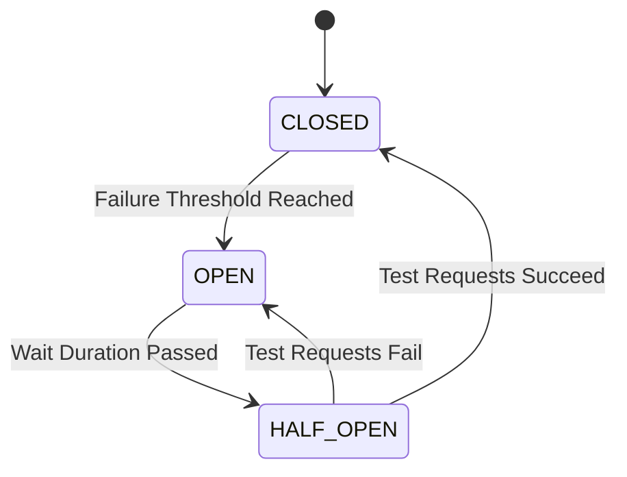

# ⚡ Circuit Breaker Patterns

The Circuit Breaker pattern is a vital resilience mechanism used to prevent a system from repeatedly trying to execute an operation that is likely to fail, thereby preventing cascading failures across multiple services.

---

## 🗺️ Table of Contents
1. [State Machine](#1-state-machine)
2. [Advanced Configurations](#2-advanced-configurations)
3. [Implementation Examples](#3-implementation-examples)

---

## 1. State Machine
A Circuit Breaker operates as a state machine with three primary states:

- **CLOSED**: The circuit is closed, and requests flow through normally. The breaker monitors the responses (successes, failures, timeouts).
- **OPEN**: If the failure rate exceeds a configured threshold, the circuit "trips" and opens. In this state, all requests are immediately rejected (fast failure) without calling the underlying service.
- **HALF-OPEN**: After a configured wait time, the breaker allows a limited number of test requests to pass through to see if the underlying service has recovered. If the test requests succeed, it transitions back to CLOSED. If they fail, it returns to OPEN.



---

## 2. Advanced Configurations

Modern implementations go beyond simple error counting. Key parameters to tune include:

- **Failure Rate Threshold**: The percentage of failures (e.g., 50%) that will trip the breaker.
- **Minimum Number of Calls**: The breaker won't calculate the failure rate until it evaluates a minimum number of requests. (e.g., if set to 10, 9 out of 9 failures won't trip it).
- **Wait Duration in Open State**: How long to wait before transitioning to HALF-OPEN.
- **Slow Call Rate Threshold**: Trips the breaker if too many calls take too long, even if they don't explicitly throw an error. This protects against downstream slowness.
- **Sliding Window**: The breaker evaluates the recent request history using either a count-based window (e.g., the last 100 calls) or a time-based window (e.g., the last 60 seconds).

---

## 3. Implementation Examples

### ☕ Java (Resilience4j)
Resilience4j is the modern standard for resilience in Java, replacing the deprecated Netflix Hystrix.

```java
import io.github.resilience4j.circuitbreaker.CircuitBreaker;
import io.github.resilience4j.circuitbreaker.CircuitBreakerConfig;
import java.time.Duration;

// 1. Configure the Circuit Breaker
CircuitBreakerConfig config = CircuitBreakerConfig.custom()
    .failureRateThreshold(50)
    .waitDurationInOpenState(Duration.ofSeconds(10))
    .permittedNumberOfCallsInHalfOpenState(3)
    .slidingWindowSize(10)
    .minimumNumberOfCalls(5)
    .build();

CircuitBreaker circuitBreaker = CircuitBreaker.of("backendService", config);

// 2. Decorate a method call
Supplier<String> decoratedSupplier = CircuitBreaker.decorateSupplier(circuitBreaker, () -> {
    // Call the external service
    return backendService.fetchData();
});

// 3. Execute with fallback
try {
    String result = decoratedSupplier.get();
} catch (CallNotPermittedException e) {
    // The circuit is OPEN. Execute fallback logic.
    return "Fallback Data";
}
```

### 🐹 Go (gobreaker)
A popular and simple Circuit Breaker implementation in Go.

```go
package main

import (
    "fmt"
    "time"
    "github.com/sony/gobreaker"
)

var cb *gobreaker.CircuitBreaker

func init() {
    var st gobreaker.Settings
    st.Name = "BackendAPI"
    st.ReadyToTrip = func(counts gobreaker.Counts) bool {
        // Trip if failure ratio is > 60% and we have at least 10 requests
        failureRatio := float64(counts.TotalFailures) / float64(counts.Requests)
        return counts.Requests >= 10 && failureRatio >= 0.6
    }
    st.Timeout = 5 * time.Second // Time in OPEN state
    
    cb = gobreaker.NewCircuitBreaker(st)
}

func main() {
    result, err := cb.Execute(func() (interface{}, error) {
        // Call the external service here
        return FetchData() 
    })

    if err != nil {
        if err == gobreaker.ErrOpenState {
            fmt.Println("Circuit is OPEN. Fast failing.")
        } else {
            fmt.Println("Service returned an error.")
        }
    } else {
        fmt.Println("Success:", result)
    }
}
```

### 🟩 Node.js (opossum)
A full-featured Circuit Breaker for Node.js.

```javascript
const CircuitBreaker = require('opossum');

// The async function that calls the external service
async function fetchData() {
    // e.g., return await axios.get('/api/data');
}

const options = {
  timeout: 3000, // If function takes > 3 seconds, it's a failure
  errorThresholdPercentage: 50, // Trip if > 50% failures
  resetTimeout: 10000 // Wait 10 seconds before HALF-OPEN
};

const breaker = new CircuitBreaker(fetchData, options);

// Define fallback
breaker.fallback(() => "Fallback Data");

// Execute
breaker.fire()
  .then(console.log)
  .catch(console.error);

// Listen to events
breaker.on('open', () => console.warn('Circuit breaker OPENED!'));
breaker.on('halfOpen', () => console.log('Circuit breaker HALF-OPEN'));
breaker.on('close', () => console.log('Circuit breaker CLOSED'));
```

---

[⬅️ Back to Infrastructure & Ops](./README.md)
