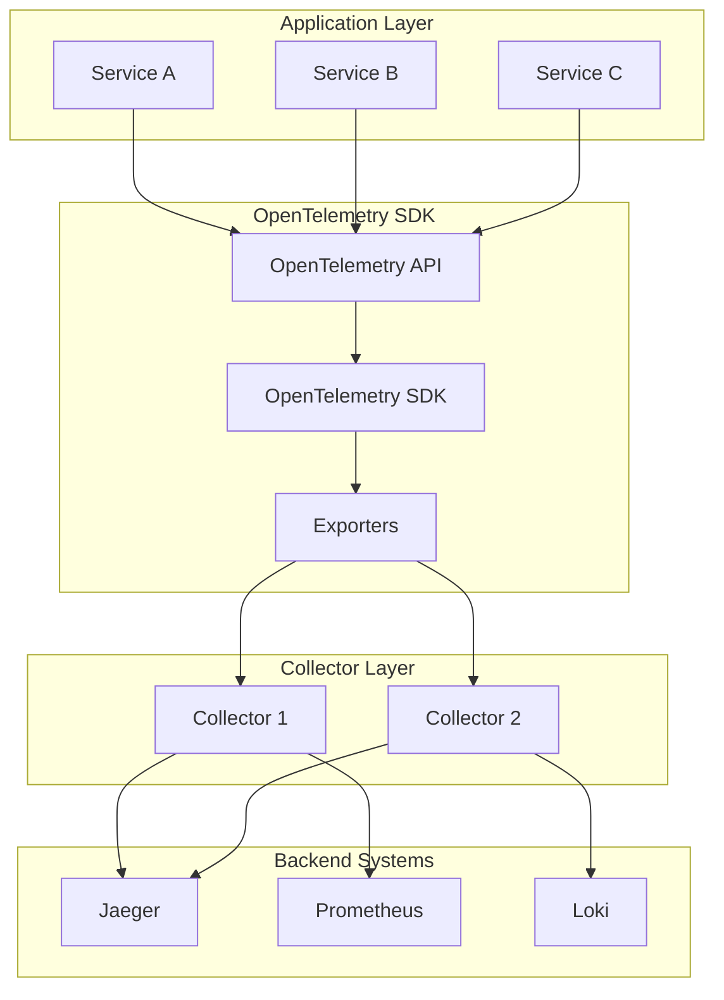
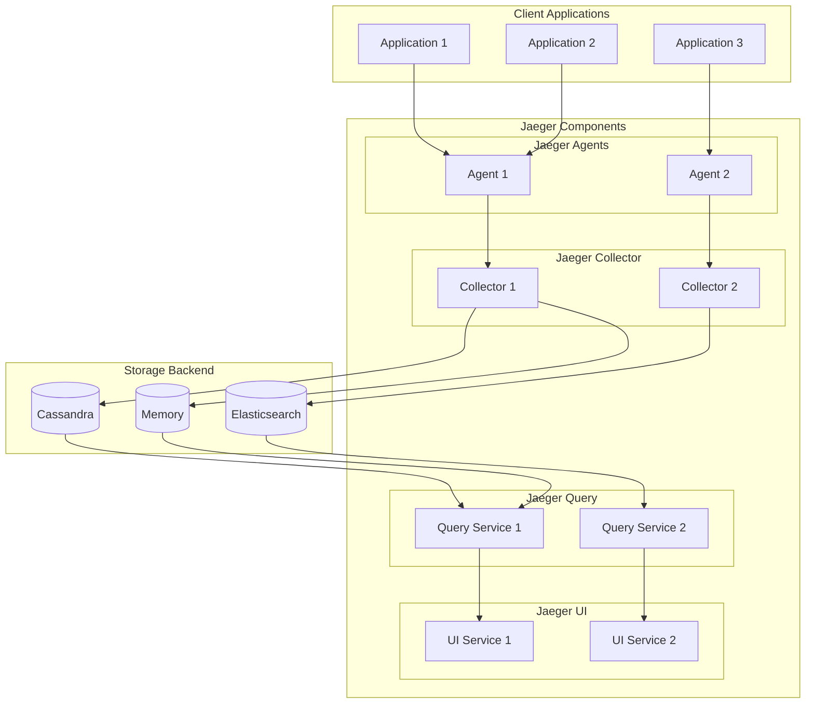
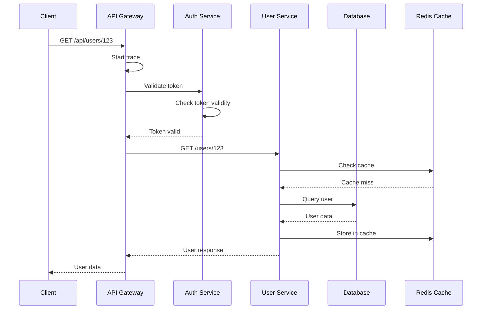
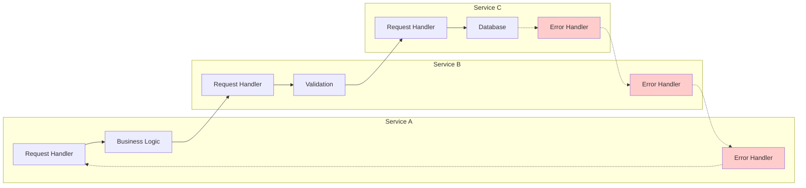
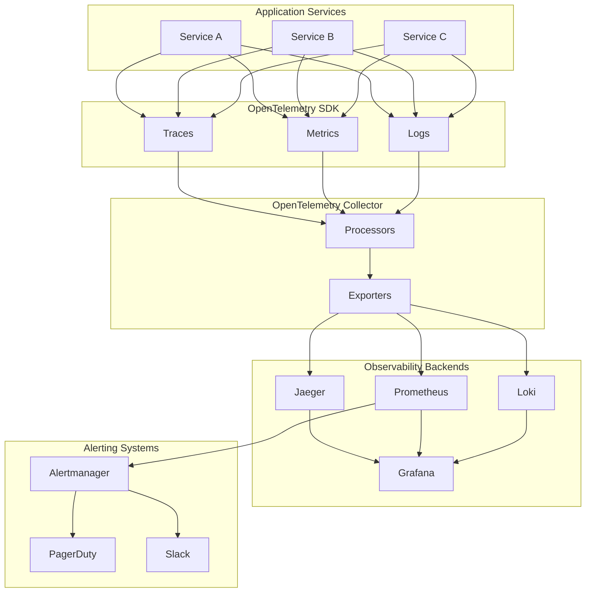

# 🔍 Distributed Tracing (OpenTelemetry, Jaeger)

A comprehensive guide to distributed tracing for observability in microservices architectures. This documentation covers OpenTelemetry instrumentation and Jaeger tracing system for end-to-end request tracking and performance analysis.

---

## 🗺️ Table of Contents
1. [Distributed Tracing Overview](#1-distributed-tracing-overview)
2. [OpenTelemetry Architecture](#2-opentelemetry-architecture)
3. [Jaeger Tracing System](#3-jaeger-tracing-system)
4. [Instrumentation](#4-instrumentation)
5. [Tracing Patterns](#5-tracing-patterns)
6. [Observability Stack Integration](#6-observability-stack-integration)
7. [Best Practices](#7-best-practices)

---

## 1. Distributed Tracing Overview

### **What is Distributed Tracing?**
A method for tracking requests as they flow through distributed systems, providing visibility into the complete lifecycle of operations across multiple services.

### **Core Concepts**
- **Trace**: A single request's journey through the system
- **Span**: A single operation within a trace
- **Context**: Propagation information between services
- **Baggage Items**: Key-value pairs that travel with the trace
- **Sampling**: Strategy for selecting which traces to collect

### **Key Benefits**
- **Performance Analysis**: Identify bottlenecks and latency issues
- **Error Tracking**: Trace errors across service boundaries
- **Dependency Mapping**: Understand service interactions
- **Root Cause Analysis**: Quickly identify failure sources
- **Capacity Planning**: Understand resource utilization patterns

---

## 2. OpenTelemetry Architecture

### **System Architecture**


### **OpenTelemetry Components**

#### **Signal Types**
| Signal | Description | Use Cases |
|--------|-------------|------------|
| **Traces** | Request flow through distributed systems | Performance analysis, error tracking |
| **Metrics** | Numerical measurements over time | Resource utilization, business metrics |
| **Logs** | Structured log events | Debugging, audit trails |

#### **Core Components**
- **API**: Stable interface for applications
- **SDK**: Implementation of the API
- **Instrumentation Libraries**: Auto and manual instrumentation
- **Collector**: Processing and routing component
- **Exporters**: Send data to backends

### **OpenTelemetry Configuration**
```yaml
# otel-collector-config.yaml
receivers:
  otlp:
    protocols:
      grpc:
        endpoint: 0.0.0.0:4317
      http:
        endpoint: 0.0.0.0:4318
  
  prometheus:
    config:
      scrape_configs:
        - job_name: 'otel-collector'
          scrape_interval: 10s
          static_configs:
            - targets: ['0.0.0.0:8888']

processors:
  batch:
    timeout: 1s
    send_batch_size: 1024
  
  memory_limiter:
    limit_mib: 512
  
  resource:
    attributes:
      - key: environment
        value: production
        action: upsert
      - key: service.version
        value: "1.0.0"
        action: upsert

exporters:
  jaeger:
    endpoint: jaeger-collector:14250
    tls:
      insecure: true
  
  prometheus:
    endpoint: "0.0.0.0:8889"
    namespace: "otel"
  
  logging:
    loglevel: info

service:
  pipelines:
    traces:
      receivers: [otlp]
      processors: [memory_limiter, batch, resource]
      exporters: [jaeger]
    
    metrics:
      receivers: [otlp, prometheus]
      processors: [memory_limiter, batch, resource]
      exporters: [prometheus]
    
    logs:
      receivers: [otlp]
      processors: [memory_limiter, batch, resource]
      exporters: [logging]
```

---

## 3. Jaeger Tracing System

### **Jaeger Architecture**


### **Jaeger Components**

#### **Jaeger Agent**
- **Purpose**: Collects spans from applications
- **Features**: UDP receivers, sampling, client-side processing
- **Deployment**: Sidecar or daemonset in Kubernetes

#### **Jaeger Collector**
- **Purpose**: Processes and stores traces
- **Features**: Span validation, transformation, storage
- **Scaling**: Horizontal scaling for high throughput

#### **Jaeger Query**
- **Purpose**: Retrieves and queries stored traces
- **Features**: Trace search, aggregation, filtering
- **API**: GraphQL and HTTP APIs

#### **Jaeger UI**
- **Purpose**: Visual interface for trace exploration
- **Features**: Trace timeline, service map, performance metrics
- **Integration**: Grafana plugin support

### **Jaeger Configuration**
```yaml
# jaeger-deployment.yml
apiVersion: apps/v1
kind: Deployment
metadata:
  name: jaeger
  namespace: observability
spec:
  replicas: 1
  selector:
    matchLabels:
      app: jaeger
  template:
    metadata:
      labels:
        app: jaeger
    spec:
      containers:
      - name: jaeger
        image: jaegertracing/all-in-one:latest
        ports:
        - containerPort: 16686
          name: ui
        - containerPort: 14268
          name: collector-http
        - containerPort: 14250
          name: collector-grpc
        - containerPort: 6831
          name: agent-compact
        - containerPort: 6832
          name: agent-binary
        env:
        - name: SPAN_STORAGE_TYPE
          value: elasticsearch
        - name: ES_SERVER_URLS
          value: http://elasticsearch:9200
        - name: ES_USERNAME
          value: elastic
        - name: ES_PASSWORD
          value: changeme
        - name: COLLECTOR_ZIPKIN_HTTP_PORT
          value: "9411"
```

---

## 4. Instrumentation

### **Go Application**
```go
package main

import (
    "context"
    "net/http"
    "time"
    
    "go.opentelemetry.io/otel"
    "go.opentelemetry.io/otel/exporters/jaeger"
    "go.opentelemetry.io/otel/sdk/resource"
    "go.opentelemetry.io/otel/sdk/trace"
    semconv "go.opentelemetry.io/otel/semconv/v1.4.0"
)

var tracer trace.Tracer

func init() {
    // Create Jaeger exporter
    exporter, err := jaeger.New(jaeger.WithCollectorEndpoint(jaeger.WithEndpoint("http://jaeger:14268/api/traces")))
    if err != nil {
        log.Fatal(err)
    }
    
    // Create trace provider
    tp := trace.NewTracerProvider(
        trace.WithBatcher(exporter),
        trace.WithResource(resource.NewWithAttributes(
            semconv.ServiceNameKey.String("user-service"),
            semconv.ServiceVersionKey.String("1.0.0"),
        )),
    )
    
    otel.SetTracerProvider(tp)
    tracer = tp.Tracer("user-service")
}

func getUserHandler(w http.ResponseWriter, r *http.Request) {
    ctx := r.Context()
    
    // Start a span
    ctx, span := tracer.Start(ctx, "get-user")
    defer span.End()
    
    // Add attributes
    span.SetAttributes(
        attribute.String("user.id", r.URL.Query().Get("id")),
        attribute.String("http.method", r.Method),
        attribute.String("http.url", r.URL.String()),
    )
    
    // Simulate database call
    dbCtx, dbSpan := tracer.Start(ctx, "database-query")
    time.Sleep(50 * time.Millisecond)
    dbSpan.End()
    
    // Simulate cache call
    cacheCtx, cacheSpan := tracer.Start(ctx, "cache-lookup")
    time.Sleep(10 * time.Millisecond)
    cacheSpan.End()
    
    // Add events
    span.AddEvent("user-retrieved", trace.WithAttributes(
        attribute.String("user.status", "active"),
    ))
    
    w.WriteHeader(http.StatusOK)
    w.Write([]byte(`{"id": "123", "name": "John Doe"}`))
}

func main() {
    http.HandleFunc("/user", getUserHandler)
    http.ListenAndServe(":8080", nil)
}
```

### **Java Application (Spring Boot)**
```java
@RestController
@RequestMapping("/api/users")
public class UserController {
    
    private final Tracer tracer;
    
    public UserController(Tracer tracer) {
        this.tracer = tracer;
    }
    
    @GetMapping("/{id}")
    public ResponseEntity<User> getUser(@PathVariable String id) {
        Span span = tracer.nextSpan()
            .name("get-user")
            .tag("user.id", id)
            .tag("service", "user-service")
            .start();
        
        try (Scope scope = tracer.withSpan(span)) {
            // Database operation
            Span dbSpan = tracer.nextSpan()
                .name("database-query")
                .tag("db.operation", "select")
                .tag("db.table", "users")
                .start();
            
            try (Scope dbScope = tracer.withSpan(dbSpan)) {
                User user = userRepository.findById(id);
                dbSpan.tag("user.found", user != null ? "true" : "false");
                
                // Cache operation
                Span cacheSpan = tracer.nextSpan()
                    .name("cache-operation")
                    .tag("cache.action", "get")
                    .tag("cache.key", "user:" + id)
                    .start();
                
                try (Scope cacheScope = tracer.withSpan(cacheSpan)) {
                    cacheManager.get("user:" + id);
                    cacheSpan.tag("cache.hit", "true");
                }
                
                return ResponseEntity.ok(user);
            }
        } catch (Exception e) {
            span.tag("error", "true");
            span.tag("error.message", e.getMessage());
            throw e;
        }
    }
}
```

### **Python Application (FastAPI)**
```python
from fastapi import FastAPI
from opentelemetry import trace
from opentelemetry.exporter.jaeger.thrift import JaegerExporter
from opentelemetry.sdk.trace import TracerProvider
from opentelemetry.sdk.trace.export import BatchSpanProcessor
from opentelemetry.instrumentation.fastapi import FastAPIInstrumentor
from opentelemetry.instrumentation.requests import RequestsInstrumentor
import requests
import time

app = FastAPI()

# Configure OpenTelemetry
jaeger_exporter = JaegerExporter(
    agent_host_name="jaeger",
    agent_port=6831,
)

trace.set_tracer_provider(TracerProvider())
tracer = trace.get_tracer(__name__)

span_processor = BatchSpanProcessor(jaeger_exporter)
trace.get_tracer_provider().add_span_processor(span_processor)

# Instrument FastAPI and requests
FastAPIInstrumentor.instrument_app(app)
RequestsInstrumentor().instrument()

@app.get("/users/{user_id}")
async def get_user(user_id: str):
    with tracer.start_as_current_span("get-user") as span:
        span.set_attribute("user.id", user_id)
        span.set_attribute("service", "user-service")
        
        # Database operation
        with tracer.start_as_current_span("database-query") as db_span:
            db_span.set_attribute("db.operation", "select")
            db_span.set_attribute("db.table", "users")
            
            # Simulate database call
            time.sleep(0.05)
            user_data = {"id": user_id, "name": "John Doe"}
            db_span.set_attribute("user.found", "true")
        
        # External API call
        with tracer.start_as_current_span("external-api-call") as api_span:
            api_span.set_attribute("api.url", "https://api.example.com/validate")
            
            response = requests.get("https://api.example.com/validate")
            api_span.set_attribute("http.status_code", str(response.status_code))
            
            span.add_event("user-validated", {
                "validation.status": "success"
            })
        
        return user_data
```

### **Node.js Application**
```javascript
const express = require('express');
const { NodeTracerProvider } = require('@opentelemetry/sdk-trace-node');
const { SimpleSpanProcessor } = require('@opentelemetry/sdk-trace-base');
const { JaegerExporter } = require('@opentelemetry/exporter-jaeger');
const { registerInstrumentations } = require('@opentelemetry/instrumentation');
const { trace } = require('@opentelemetry/api');

const app = express();

// Initialize OpenTelemetry
const tracerProvider = new NodeTracerProvider();
const jaegerExporter = new JaegerExporter({
    endpoint: 'http://jaeger:14268/api/traces',
});

tracerProvider.addSpanProcessor(new SimpleSpanProcessor(jaegerExporter));
tracerProvider.register();

// Register automatic instrumentations
registerInstrumentations({
    '@opentelemetry/instrumentation-express': { enabled: true },
    '@opentelemetry/instrumentation-http': { enabled: true },
});

const tracer = trace.getTracer('user-service');

app.get('/users/:id', (req, res) => {
    const span = tracer.startSpan('get-user', {
        attributes: {
            'user.id': req.params.id,
            'http.method': req.method,
            'http.url': req.url,
        }
    });
    
    try {
        // Database operation
        const dbSpan = tracer.startSpan('database-query', {
            attributes: {
                'db.operation': 'select',
                'db.table': 'users',
            }
        });
        
        // Simulate database call
        setTimeout(() => {
            dbSpan.setAttributes({
                'user.found': 'true'
            });
            dbSpan.end();
            
            // Add event
            span.addEvent('user-retrieved', {
                'user.status': 'active'
            });
            
            res.json({ id: req.params.id, name: 'John Doe' });
            span.end();
        }, 50);
        
    } catch (error) {
        span.setAttributes({
            'error': 'true',
            'error.message': error.message
        });
        span.end();
        res.status(500).json({ error: 'Internal server error' });
    }
});

app.listen(8080, () => {
    console.log('User service running on port 8080');
});
```

---

## 5. Tracing Patterns

### **Request Flow Tracing**


### **Error Propagation Pattern**


### **Sampling Strategies**

#### **Head-based Sampling**
```go
// Probability-based sampling
sampler := trace.TraceIDRatioBased(0.1) // 10% sampling rate

tp := trace.NewTracerProvider(
    trace.WithSampler(sampler),
    trace.WithBatcher(exporter),
)
```

#### **Tail-based Sampling**
```yaml
# OpenTelemetry Collector configuration
processors:
  tail_sampling:
    decision_wait: 10s
    num_traces: 100
    expected_new_traces_per_sec: 10
    policies:
      - name: errors
        type: status_code
        status_code: {status_codes: [ERROR]}
      - name: slow
        type: latency
        latency: {threshold_ms: 1000}
      - name: random
        type: probabilistic
        probabilistic: {sampling_percentage: 10}
```

---

## 6. Observability Stack Integration

### **Complete Observability Architecture**


### **Correlation Across Signals**
```yaml
# OpenTelemetry Collector configuration for correlation
processors:
  resource:
    attributes:
      - key: trace.id
        from_attribute: trace_id
        action: upsert
      - key: span.id
        from_attribute: span_id
        action: upsert
  
  transform:
    log_statements:
      - context: log
        statements:
          - set(trace_id, resource.attributes["trace_id"])
          - set(span_id, resource.attributes["span_id"])
```

### **Grafana Integration**
```json
{
  "dashboard": {
    "title": "Distributed Tracing Dashboard",
    "panels": [
      {
        "title": "Request Rate",
        "type": "graph",
        "targets": [
          {
            "expr": "rate(jaeger_traces_serviced_latencies_bucket[5m])",
            "legendFormat": "{{service}}"
          }
        ]
      },
      {
        "title": "Error Rate",
        "type": "graph",
        "targets": [
          {
            "expr": "rate(jaeger_traces_serviced_latencies_bucket{le=\"+Inf\",status_code!=\"OK\"}[5m])",
            "legendFormat": "{{service}}"
          }
        ]
      },
      {
        "title": "Service Dependencies",
        "type": "graph",
        "targets": [
          {
            "expr": "jaeger_dependencies",
            "legendFormat": "{{parent}} -> {{child}}"
          }
        ]
      }
    ]
  }
}
```

---

## 7. Best Practices

### **Instrumentation Best Practices**

#### **Span Naming**
- Use consistent naming conventions
- Include operation and resource type
- Examples: `http.get`, `database.query`, `cache.get`

#### **Attribute Standards**
```go
// Use semantic conventions
span.SetAttributes(
    semconv.HTTPMethodKey.String("GET"),
    semconv.HTTPURLKey.String("/api/users/123"),
    semconv.HTTPStatusCodeKey.Int(200),
    semconv.DBSystemKey.String("postgresql"),
    semconv.DBStatementKey.String("SELECT * FROM users WHERE id = $1"),
)
```

#### **Context Propagation**
- Always propagate context across service boundaries
- Use baggage for cross-service data
- Implement proper context extraction/injection

### **Performance Considerations**

#### **Sampling Strategies**
- **Development**: 100% sampling for debugging
- **Staging**: 50% sampling for testing
- **Production**: 1-10% sampling based on volume

#### **Resource Management**
```go
// Configure batch processing for performance
exporter := jaeger.New(
    jaeger.WithCollectorEndpoint(endpoint),
    jaeger.WithProcessors(
        trace.NewBatchSpanProcessor(exporter, trace.WithBatchTimeout(5*time.Second)),
    ),
)
```

### **Security Best Practices**

#### **Data Sanitization**
```go
// Remove sensitive data from spans
span.SetAttributes(
    attribute.String("user.id", hashUserID(userID)),
    attribute.String("request.token", "REDACTED"),
)
```

#### **Access Control**
- Implement proper authentication for tracing UI
- Use RBAC for trace access
- Encrypt trace data in transit

### **Monitoring the Tracing System**

#### **Key Metrics to Monitor**
- **Trace Ingestion Rate**: Spans per second
- **Storage Utilization**: Disk space usage
- **Query Performance**: Trace search latency
- **Collector Health**: Component status

#### **Alerting Rules**
```yaml
# Prometheus alerts for Jaeger
groups:
  - name: jaeger
    rules:
      - alert: JaegerDown
        expr: up{job="jaeger"} == 0
        for: 5m
        labels:
          severity: critical
        annotations:
          summary: "Jaeger is down"
      
      - alert: HighTraceLatency
        expr: jaeger_query_latency_seconds > 1
        for: 10m
        labels:
          severity: warning
        annotations:
          summary: "High trace query latency"
```

---

## 🚀 Getting Started

### **Installation Commands**
```bash
# Install Jaeger
docker run -d \
  --name jaeger \
  -p 16686:16686 \
  -p 14268:14268 \
  jaegertracing/all-in-one:latest

# Install OpenTelemetry Collector
docker run -d \
  --name otel-collector \
  -p 4317:4317 \
  -p 4318:4318 \
  -v $(pwd)/otel-collector-config.yaml:/etc/otel-collector-config.yaml \
  otel/opentelemetry-collector-contrib:latest

# Install with Docker Compose
docker-compose up -d
```

### **Kubernetes Deployment**
```yaml
# observability-stack.yaml
apiVersion: v1
kind: Namespace
metadata:
  name: observability
---
apiVersion: apps/v1
kind: Deployment
metadata:
  name: jaeger
  namespace: observability
spec:
  replicas: 1
  selector:
    matchLabels:
      app: jaeger
  template:
    metadata:
      labels:
        app: jaeger
    spec:
      containers:
      - name: jaeger
        image: jaegertracing/all-in-one:latest
        ports:
        - containerPort: 16686
        - containerPort: 14268
---
apiVersion: apps/v1
kind: Deployment
metadata:
  name: otel-collector
  namespace: observability
spec:
  replicas: 2
  selector:
    matchLabels:
      app: otel-collector
  template:
    metadata:
      labels:
        app: otel-collector
    spec:
      containers:
      - name: otel-collector
        image: otel/opentelemetry-collector-contrib:latest
        ports:
        - containerPort: 4317
        - containerPort: 4318
        volumeMounts:
        - name: config
          mountPath: /etc/otel-collector-config.yaml
          subPath: otel-collector-config.yaml
      volumes:
      - name: config
        configMap:
          name: otel-collector-config
```

---

## 📚 Further Reading

- [OpenTelemetry Documentation](https://opentelemetry.io/docs/)
- [Jaeger Documentation](https://www.jaegertracing.io/docs/)
- [OpenTelemetry Collector](https://github.com/open-telemetry/opentelemetry-collector)
- [Distributed Tracing Best Practices](https://opentelemetry.io/docs/concepts/signals/traces/)
- [Observability Patterns](https://opentelemetry.io/docs/concepts/observability-primer/)

---

[⬅️ Back to Infrastructure & Ops](../README.md)
