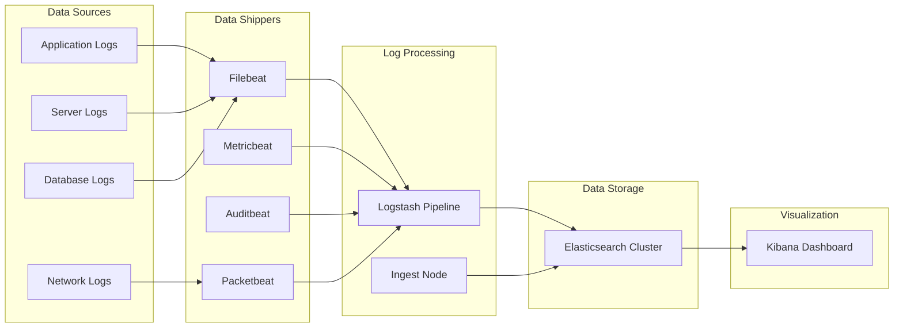
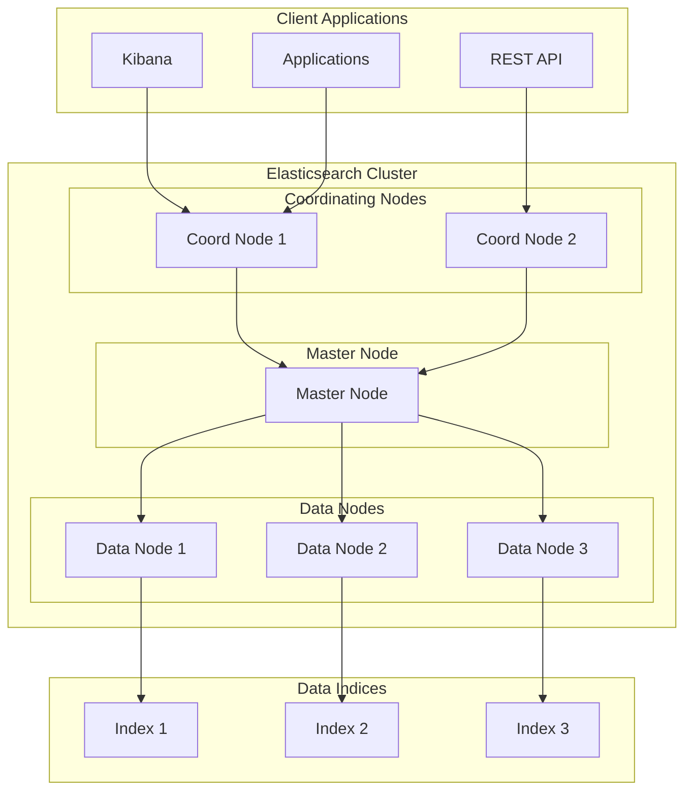
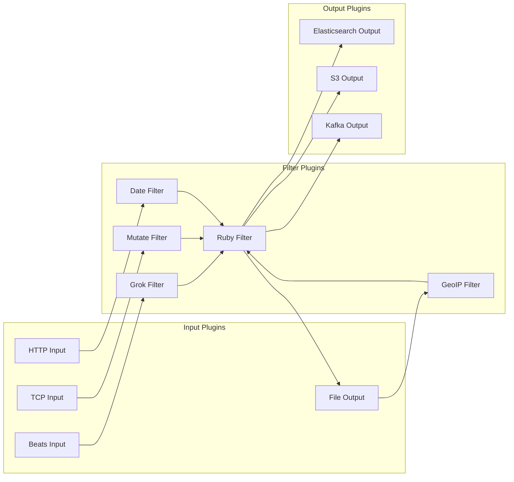
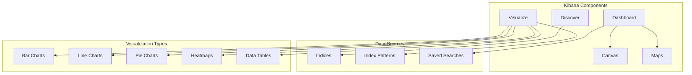
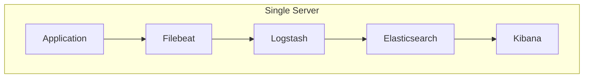
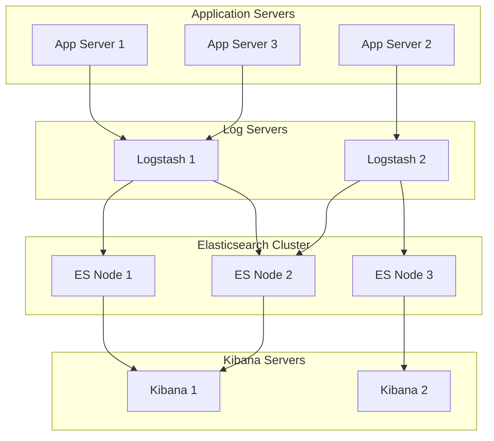
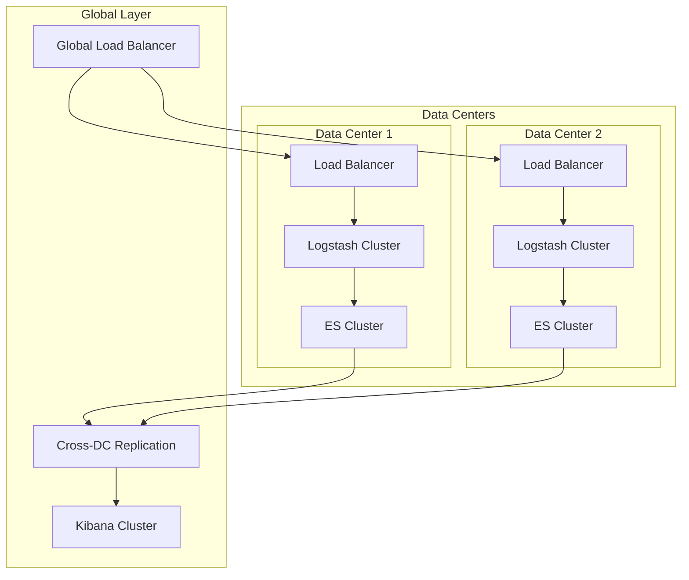

# 📊 Log Aggregation (ELK Stack)

The ELK Stack (Elasticsearch, Logstash, Kibana) is a powerful collection of open-source tools for centralized log management, aggregation, and visualization. It enables organizations to collect, parse, store, and analyze logs from multiple sources in real-time.

---

## 🗺️ Table of Contents
1. [ELK Stack Overview](#1-elk-stack-overview)
2. [Architecture Components](#2-architecture-components)
3. [Elasticsearch](#3-elasticsearch)
4. [Logstash](#4-logstash)
5. [Kibana](#5-kibana)
6. [Data Shippers (Beats)](#6-data-shippers-beats)
7. [Implementation Patterns](#7-implementation-patterns)
8. [Best Practices](#8-best-practices)

---

## 1. ELK Stack Overview

### **What is ELK Stack?**
A comprehensive log management solution consisting of:
- **E**: Elasticsearch - Distributed search and analytics engine
- **L**: Logstash - Data processing pipeline
- **K**: Kibana - Data visualization dashboard

### **Extended Stack (EFK/ELK)**
- **F**: Filebeat - Log shipping agent
- **A**: APM Server - Application Performance Monitoring
- **M**: Metricbeat - Metrics collection

### **Key Benefits**
- **Centralized Logging**: All logs in one place
- **Real-time Processing**: Immediate log analysis
- **Scalable Architecture**: Handles massive data volumes
- **Powerful Search**: Full-text search capabilities
- **Rich Visualizations**: Interactive dashboards and charts
- **Open Source**: No licensing costs

---

## 2. Architecture Components

### **Data Flow Architecture**


### **Component Responsibilities**
| Component | Primary Role | Key Features |
|------------|--------------|--------------|
| **Elasticsearch** | Data Storage & Search | Distributed indexing, full-text search, real-time analytics |
| **Logstash** | Data Processing | Input parsing, transformation, enrichment, output routing |
| **Kibana** | Visualization | Dashboards, visualizations, log exploration |
| **Filebeat** | Log Shipping | Lightweight log forwarding, real-time streaming |
| **Metricbeat** | Metrics Collection | System and application metrics, performance monitoring |

---

## 3. Elasticsearch

### **Core Concepts**
- **Index**: Collection of documents with similar characteristics
- **Document**: Basic unit of information (JSON format)
- **Shard**: Subset of index data for distribution
- **Replica**: Copy of shard for high availability
- **Cluster**: Collection of nodes working together

### **Cluster Architecture**


### **Configuration Best Practices**

#### **Production Settings**
```yaml
# elasticsearch.yml
cluster.name: production-cluster
node.name: es-node-1
node.roles: [master, data, ingest]

# Network
network.host: 0.0.0.0
http.port: 9200

# Discovery
discovery.seed_hosts: ["es-node-1", "es-node-2", "es-node-3"]
cluster.initial_master_nodes: ["es-node-1", "es-node-2"]

# Memory
bootstrap.memory_lock: true

# Path settings
path.data: /var/lib/elasticsearch
path.logs: /var/log/elasticsearch
```

#### **Index Templates**
```json
{
  "index_patterns": ["logs-*"],
  "template": {
    "settings": {
      "number_of_shards": 3,
      "number_of_replicas": 1,
      "index.refresh_interval": "5s",
      "index.lifecycle.name": "logs-policy"
    },
    "mappings": {
      "properties": {
        "@timestamp": {"type": "date"},
        "level": {"type": "keyword"},
        "message": {"type": "text"},
        "service": {"type": "keyword"},
        "host": {"type": "keyword"}
      }
    }
  }
}
```

---

## 4. Logstash

### **Pipeline Architecture**


### **Configuration Example**
```ruby
# logstash.conf
input {
  beats {
    port => 5044
  }
}

filter {
  # Parse log format
  grok {
    match => { 
      "message" => "%{TIMESTAMP_ISO8601:timestamp} %{LOGLEVEL:level} %{GREEDYDATA:msg}"
    }
  }
  
  # Parse timestamp
  date {
    match => [ "timestamp", "ISO8601" ]
  }
  
  # Add fields
  mutate {
    add_field => { "environment" => "production" }
    convert => { "response_time" => "integer" }
  }
  
  # Remove sensitive data
  if [msg] =~ /password|secret|token/ {
    mutate {
      replace => { "msg" => "REDACTED" }
    }
  }
  
  # GeoIP enrichment
  if [client_ip] {
    geoip {
      source => "client_ip"
      target => "geoip"
    }
  }
}

output {
  elasticsearch {
    hosts => ["elasticsearch:9200"]
    index => "logs-%{+YYYY.MM.dd}"
    template_name => "logs"
    template_pattern => "logs-*"
  }
  
  # Debug output
  if [level] == "ERROR" {
    file {
      path => "/var/log/logstash/errors.log"
    }
  }
}
```

### **Common Filter Patterns**

#### **Apache/Nginx Logs**
```ruby
grok {
  match => { 
    "message" => "%{COMBINEDAPACHELOG}" 
  }
}
```

#### **JSON Logs**
```ruby
json {
  source => "message"
  target => "parsed"
}
```

#### **Multi-line Application Logs**
```ruby
multiline {
  pattern => "^%{TIMESTAMP_ISO8601}"
  negate => true
  what => "previous"
}
```

---

## 5. Kibana

### **Dashboard Architecture**


### **Index Pattern Configuration**
```json
{
  "title": "logs-*",
  "timeFieldName": "@timestamp",
  "fields": [
    {
      "name": "@timestamp",
      "type": "date",
      "searchable": true,
      "aggregatable": true
    },
    {
      "name": "level",
      "type": "string",
      "searchable": true,
      "aggregatable": true
    },
    {
      "name": "service",
      "type": "string",
      "searchable": true,
      "aggregatable": true
    }
  ]
}
```

### **Dashboard Examples**

#### **Application Monitoring Dashboard**
- **Log Level Distribution**: Pie chart of ERROR, WARN, INFO, DEBUG
- **Error Rate Timeline**: Line chart showing errors over time
- **Top Error Messages**: Table of most frequent errors
- **Service Health**: Status indicators for each service
- **Response Time Distribution**: Histogram of response times

#### **Security Dashboard**
- **Failed Login Attempts**: Timeline of authentication failures
- **Geographic Distribution**: World map of attack origins
- **Top Attack Sources**: Table of most active IP addresses
- **Security Events**: Real-time security log feed
- **Threat Indicators**: Visual alerts for suspicious activity

---

## 6. Data Shippers (Beats)

### **Filebeat Configuration**
```yaml
# filebeat.yml
filebeat.inputs:
- type: log
  enabled: true
  paths:
    - /var/log/app/*.log
    - /var/log/nginx/*.log
  fields:
    service: webapp
    environment: production
  fields_under_root: true
  multiline.pattern: '^\d{4}-\d{2}-\d{2}'
  multiline.negate: true
  multiline.match: after

output.logstash:
  hosts: ["logstash:5044"]

processors:
  - add_host_metadata:
      when.not.contains.tags: forwarded
  - add_docker_metadata: ~
  - add_kubernetes_metadata: ~
```

### **Metricbeat Configuration**
```yaml
# metricbeat.yml
metricbeat.modules:
- module: system
  metricsets:
    - cpu
    - memory
    - network
    - diskio
    - filesystem
  enabled: true
  period: 10s

- module: docker
  metricsets:
    - container
    - cpu
    - memory
    - network
    - diskio
  enabled: true
  period: 10s

output.elasticsearch:
  hosts: ["elasticsearch:9200"]
  index: "metrics-%{+yyyy.MM.dd}"
```

### **Other Beats**
- **Auditbeat**: Audit data and system monitoring
- **Packetbeat**: Network packet analysis
- **Heartbeat**: Uptime monitoring
- **Winlogbeat**: Windows event logs

---

## 7. Implementation Patterns

### **Small Scale Deployment**


### **Medium Scale Deployment**


### **Large Scale Deployment**


---

## 8. Best Practices

### **Performance Optimization**

#### **Elasticsearch Tuning**
- **Memory Allocation**: 50% of system RAM to heap, max 31GB
- **SSD Storage**: Use SSD for better I/O performance
- **Shard Strategy**: 20-40GB per shard, avoid over-sharding
- **Index Lifecycle**: Automate index management and retention

#### **Logstash Optimization**
- **Pipeline Workers**: Set to number of CPU cores
- **Batch Size**: Optimize batch size for throughput
- **Filter Order**: Place expensive filters last
- **Persistent Queues**: Enable for data reliability

#### **Kibana Performance**
- **Index Pattern Limits**: Limit time ranges for searches
- **Dashboard Optimization**: Use saved searches and aggregations
- **Caching**: Enable query caching for frequent queries

### **Security Best Practices**

#### **Authentication & Authorization**
```yaml
# elasticsearch.yml
xpack.security.enabled: true
xpack.security.transport.ssl.enabled: true
xpack.security.http.ssl.enabled: true
```

#### **Network Security**
- **Firewall Rules**: Restrict access to necessary ports
- **VPN Access**: Use VPN for remote access
- **TLS Encryption**: Encrypt all communication
- **Role-Based Access**: Implement fine-grained permissions

### **Monitoring & Alerting**

#### **Key Metrics to Monitor**
- **Cluster Health**: Green/Yellow/Red status
- **Node Performance**: CPU, memory, disk I/O
- **Index Performance**: Indexing rate, search latency
- **JVM Metrics**: Heap usage, garbage collection

#### **Alert Configuration**
```json
{
  "trigger": {
    "schedule": {
      "interval": "1m"
    }
  },
  "input": {
    "search": {
      "request": {
        "indices": ["logs-*"],
        "body": {
          "query": {
            "bool": {
              "must": [
                {"range": {"@timestamp": {"gte": "now-1m"}}},
                {"term": {"level": "ERROR"}}
              ]
            }
          }
        }
      }
    }
  },
  "condition": {
    "compare": {
      "ctx.payload.hits.total": {
        "gte": 10
      }
    }
  },
  "actions": {
    "email": {
      "email": {
        "to": ["admin@example.com"],
        "subject": "High Error Rate Alert"
      }
    }
  }
}
```

### **Data Retention Strategies**

#### **Index Lifecycle Management (ILM)**
```json
{
  "policy": {
    "phases": {
      "hot": {
        "actions": {
          "rollover": {
            "max_size": "10GB",
            "max_age": "1d"
          }
        }
      },
      "warm": {
        "min_age": "7d",
        "actions": {
          "allocate": {
            "number_of_replicas": 0
          }
        }
      },
      "cold": {
        "min_age": "30d",
        "actions": {
          "allocate": {
            "number_of_replicas": 0
          }
        }
      },
      "delete": {
        "min_age": "90d"
      }
    }
  }
}
```

---

## 🚀 Getting Started

### **Installation Steps**
1. **Install Elasticsearch**: Set up cluster configuration
2. **Install Logstash**: Configure input/output plugins
3. **Install Kibana**: Connect to Elasticsearch cluster
4. **Deploy Beats**: Configure data shippers
5. **Create Index Patterns**: Define data structure
6. **Build Dashboards**: Create visualizations

### **Quick Start Commands**
```bash
# Install Elasticsearch
wget https://artifacts.elastic.co/downloads/elasticsearch/elasticsearch-8.5.0-linux-x86_64.tar.gz
tar -xzf elasticsearch-8.5.0-linux-x86_64.tar.gz
cd elasticsearch-8.5.0/
./bin/elasticsearch

# Install Logstash
wget https://artifacts.elastic.co/downloads/logstash/logstash-8.5.0-linux-x86_64.tar.gz
tar -xzf logstash-8.5.0-linux-x86_64.tar.gz
cd logstash-8.5.0/
./bin/logstash -f my-pipeline.conf

# Install Kibana
wget https://artifacts.elastic.co/downloads/kibana/kibana-8.5.0-linux-x86_64.tar.gz
tar -xzf kibana-8.5.0-linux-x86_64.tar.gz
cd kibana-8.5.0/
./bin/kibana

# Install Filebeat
curl -L -O https://artifacts.elastic.co/downloads/beats/filebeat/filebeat-8.5.0-linux-x86_64.tar.gz
tar -xzf filebeat-8.5.0-linux-x86_64.tar.gz
cd filebeat-8.5.0/
./filebeat -e
```

---

## 📚 Further Reading

- [Elasticsearch Documentation](https://www.elastic.co/guide/en/elasticsearch/reference/current/)
- [Logstash Documentation](https://www.elastic.co/guide/en/logstash/current/index.html)
- [Kibana Documentation](https://www.elastic.co/guide/en/kibana/current/index.html)
- [Elastic Stack Best Practices](https://www.elastic.co/guide/en/elastic-stack-overview/current/elastic-stack-best-practices.html)

---

[⬅️ Back to Infrastructure & Ops](../README.md)
