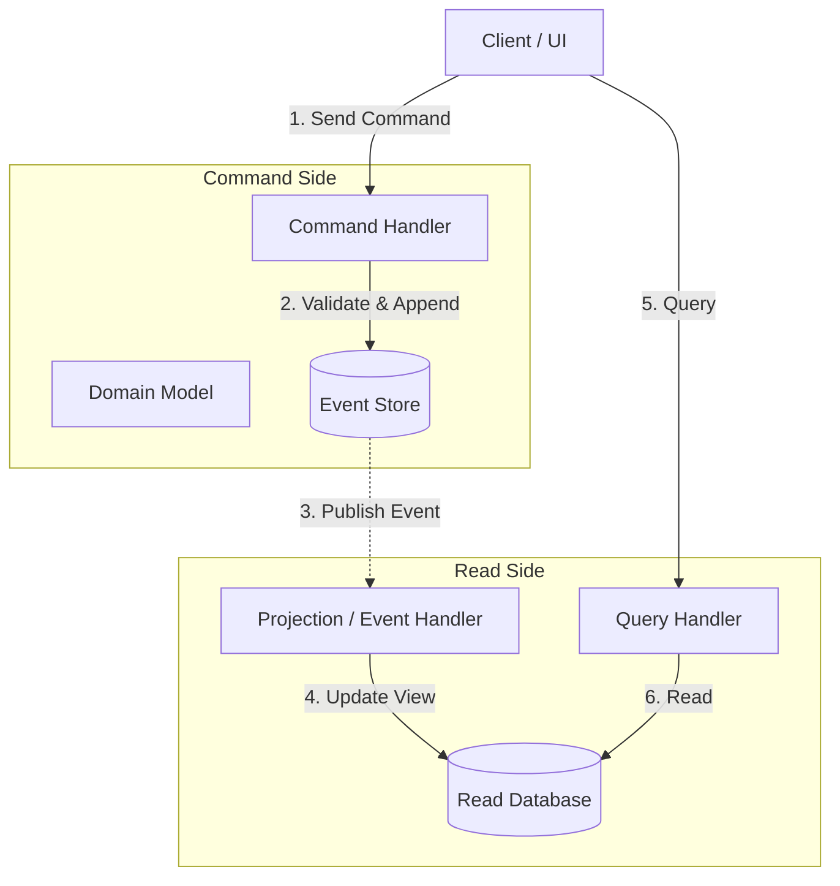

# 🔄 Event Sourcing

Event Sourcing is an architectural pattern in which the state of a system is determined by a sequence of events rather than just the current state. Instead of storing the current state of an entity in a database, you store an append-only log of the events that led to that state.

---

## 🗺️ Table of Contents
1. [Core Concepts](#1-core-concepts)
2. [Event Sourcing & CQRS](#2-event-sourcing--cqrs)
3. [Key Patterns](#3-key-patterns)
4. [Pros and Cons](#4-pros-and-cons)

---

## 1. Core Concepts

### The Event Store
The Event Store is a database optimized for appending events. It is the single source of truth for the system.
- **Append-Only**: Events are immutable and can only be appended. They are never updated or deleted.
- **Replay**: The current state of an entity is reconstructed by replaying all the events associated with it from the beginning of time.

### Example: A Bank Account
Instead of storing `Balance: $150`, you store:
1. `AccountCreated { accountId: "123", initialBalance: 0 }`
2. `MoneyDeposited { amount: 200 }`
3. `MoneyWithdrawn { amount: 50 }`

By replaying these events in order, you arrive at the current balance of $150.

---

## 2. Event Sourcing & CQRS
Event Sourcing is almost always used in conjunction with **CQRS (Command Query Responsibility Segregation)**.

- **Command Side (Write)**: Accepts commands, validates them against the current state (reconstructed from events), and if valid, appends new events to the Event Store.
- **Query Side (Read)**: Since querying an append-only log is highly inefficient, a separate read model is maintained.
- **Projections**: Components listen to the Event Store and update a traditional database (e.g., PostgreSQL, Elasticsearch) that is optimized for specific queries. This process is called "Projection."

> [!NOTE]
> Projections lead to **Eventual Consistency**. There will be a slight delay between an event being appended to the Event Store and the Read Model being updated.

---

## 3. Key Patterns

### 1. Snapshots
Replaying thousands of events to reconstruct a single entity's state is slow. 
- **Solution**: Periodically save the current state of the entity (a snapshot) alongside the event stream (e.g., every 100 events).
- **How it works**: To get the current state, load the most recent snapshot and then replay only the events that occurred *after* the snapshot was taken.

### 2. Event Upcycling (Versioning)
Over time, the structure of your events will change. Since events are immutable, you cannot go back and change old events.
- **Solution**: Handle versioning at the application level.
- **Upcaster**: A function that takes an old version of an event and transforms it into the current version before it reaches the domain logic.

### 3. Saga Pattern (Distributed Transactions)
In microservices, a single business process might span multiple services. Traditional ACID transactions don't work across microservices.
- **Solution**: The Saga pattern manages distributed transactions using a sequence of local transactions.
- **Choreography**: Services publish and listen to events to trigger local transactions.
- **Orchestration**: A central "Saga Orchestrator" service tells other services what local transactions to execute. If a step fails, the Orchestrator fires "compensating transactions" to undo the previous steps.

---

## 4. Pros and Cons

| Pros | Cons |
| :--- | :--- |
| **Auditability**: Complete, immutable history of all changes. | **Complexity**: High learning curve and architectural complexity. |
| **Time Travel**: You can reconstruct the system state at any point in the past. | **Eventual Consistency**: Read models are almost always eventually consistent. |
| **Performance**: Appending to a log is extremely fast (no locking). | **Event Evolution**: Managing schema changes over time requires careful upcasting. |
| **Debugging**: Bugs can be reproduced exactly by replaying events. | **Storage**: Storing every event requires more storage than just the current state. |

---

## 📊 Architecture Diagram

---

[⬅️ Back to Infrastructure & Ops](./README.md)
