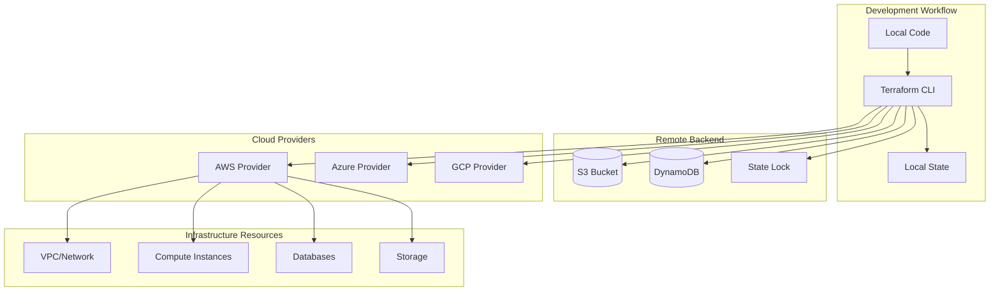
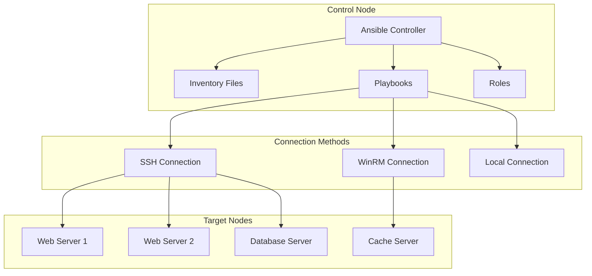
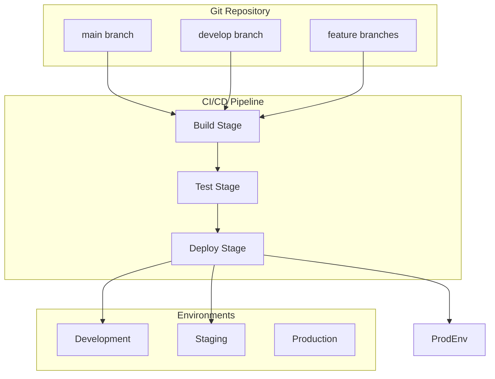

# 🏗️ Infrastructure as Code (IaC)

A comprehensive guide to Infrastructure as Code using Terraform and Ansible for automating infrastructure provisioning and configuration management.

---

## 🗺️ Table of Contents
1. [IaC Overview](#1-iac-overview)
2. [Terraform Patterns](#2-terraform-patterns)
3. [Ansible Automation](#3-ansible-automation)
4. [Multi-Environment Strategies](#4-multi-environment-strategies)
5. [CI/CD Integration](#5-cicd-integration)
6. [Best Practices](#6-best-practices)

---

## 1. IaC Overview

### **What is Infrastructure as Code?**
The practice of managing and provisioning infrastructure through machine-readable definition files rather than physical hardware configuration or interactive configuration tools.

### **Core Benefits**
- **Consistency**: Reproducible environments
- **Version Control**: Track infrastructure changes
- **Automation**: Reduce manual configuration errors
- **Scalability**: Easily provision and scale resources
- **Documentation**: Infrastructure definitions serve as documentation

### **IaC Tools Comparison**
| Tool | Type | Use Case | Language |
|-------|------|-----------|----------|
| **Terraform** | Provisioning | Multi-cloud infrastructure | HCL |
| **Ansible** | Configuration | Server configuration | YAML |
| **Pulumi** | Provisioning | Code-native IaC | Python/Go/JS |
| **CloudFormation** | Provisioning | AWS-specific | YAML/JSON |

---

## 2. Terraform Patterns

### **Terraform Architecture**


### **Module Structure Pattern**
```
terraform/
├── modules/
│   ├── vpc/
│   │   ├── main.tf
│   │   ├── variables.tf
│   │   ├── outputs.tf
│   │   └── README.md
│   ├── ec2/
│   │   ├── main.tf
│   │   ├── variables.tf
│   │   ├── outputs.tf
│   │   └── README.md
│   └── rds/
│       ├── main.tf
│       ├── variables.tf
│       ├── outputs.tf
│       └── README.md
├── environments/
│   ├── dev/
│   │   ├── main.tf
│   │   ├── terraform.tfvars
│   │   └── backend.tf
│   ├── staging/
│   │   ├── main.tf
│   │   ├── terraform.tfvars
│   │   └── backend.tf
│   └── prod/
│       ├── main.tf
│       ├── terraform.tfvars
│       └── backend.tf
├── scripts/
│   ├── init.sh
│   ├── plan.sh
│   └── apply.sh
└── README.md
```

### **Reusable VPC Module**
```hcl
# modules/vpc/main.tf
terraform {
  required_version = ">= 1.0"
  required_providers {
    aws = {
      source  = "hashicorp/aws"
      version = "~> 5.0"
    }
  }
}

provider "aws" {
  region = var.aws_region
}

resource "aws_vpc" "main" {
  cidr_block           = var.vpc_cidr
  enable_dns_hostnames = true
  enable_dns_support   = true

  tags = {
    Name        = var.vpc_name
    Environment = var.environment
    ManagedBy   = "Terraform"
  }
}

resource "aws_internet_gateway" "main" {
  vpc_id = aws_vpc.main.id

  tags = {
    Name        = "${var.vpc_name}-igw"
    Environment = var.environment
    ManagedBy   = "Terraform"
  }
}

resource "aws_subnet" "public" {
  count = length(var.public_subnet_cidrs)

  vpc_id                  = aws_vpc.main.id
  cidr_block              = var.public_subnet_cidrs[count.index]
  availability_zone       = var.availability_zones[count.index]
  map_public_ip_on_launch = true

  tags = {
    Name        = "${var.vpc_name}-public-${count.index + 1}"
    Environment = var.environment
    Type        = "Public"
    ManagedBy   = "Terraform"
  }
}

resource "aws_subnet" "private" {
  count = length(var.private_subnet_cidrs)

  vpc_id            = aws_vpc.main.id
  cidr_block          = var.private_subnet_cidrs[count.index]
  availability_zone   = var.availability_zones[count.index]

  tags = {
    Name        = "${var.vpc_name}-private-${count.index + 1}"
    Environment = var.environment
    Type        = "Private"
    ManagedBy   = "Terraform"
  }
}

resource "aws_route_table" "public" {
  vpc_id = aws_vpc.main.id

  route {
    cidr_block = "0.0.0.0/0"
    gateway_id = aws_internet_gateway.main.id
  }

  tags = {
    Name        = "${var.vpc_name}-public-rt"
    Environment = var.environment
    ManagedBy   = "Terraform"
  }
}

resource "aws_route_table_association" "public" {
  count = length(var.public_subnet_cidrs)

  subnet_id      = aws_subnet.public[count.index].id
  route_table_id = aws_route_table.public.id
}
```

```hcl
# modules/vpc/variables.tf
variable "vpc_name" {
  description = "Name of the VPC"
  type        = string
}

variable "vpc_cidr" {
  description = "CIDR block for VPC"
  type        = string
  default     = "10.0.0.0/16"
}

variable "public_subnet_cidrs" {
  description = "List of public subnet CIDR blocks"
  type        = list(string)
  default     = ["10.0.1.0/24", "10.0.2.0/24"]
}

variable "private_subnet_cidrs" {
  description = "List of private subnet CIDR blocks"
  type        = list(string)
  default     = ["10.0.10.0/24", "10.0.20.0/24"]
}

variable "availability_zones" {
  description = "List of availability zones"
  type        = list(string)
}

variable "aws_region" {
  description = "AWS region"
  type        = string
  default     = "us-west-2"
}

variable "environment" {
  description = "Environment name"
  type        = string
}
```

```hcl
# modules/vpc/outputs.tf
output "vpc_id" {
  description = "ID of the VPC"
  value       = aws_vpc.main.id
}

output "vpc_cidr_block" {
  description = "CIDR block of the VPC"
  value       = aws_vpc.main.cidr_block
}

output "public_subnet_ids" {
  description = "List of public subnet IDs"
  value       = aws_subnet.public[*].id
}

output "private_subnet_ids" {
  description = "List of private subnet IDs"
  value       = aws_subnet.private[*].id
}

output "internet_gateway_id" {
  description = "ID of the Internet Gateway"
  value       = aws_internet_gateway.main.id
}
```

### **Application Load Balancer Module**
```hcl
# modules/alb/main.tf
resource "aws_lb" "main" {
  name               = var.alb_name
  internal           = var.internal
  load_balancer_type = "application"
  security_groups    = var.security_group_ids
  subnets            = var.subnet_ids

  enable_deletion_protection = var.enable_deletion_protection

  tags = {
    Name        = var.alb_name
    Environment = var.environment
    ManagedBy   = "Terraform"
  }
}

resource "aws_lb_target_group" "main" {
  count = length(var.target_groups)

  name     = var.target_groups[count.index].name
  port     = var.target_groups[count.index].port
  protocol = var.target_groups[count.index].protocol
  vpc_id   = var.vpc_id

  health_check {
    enabled             = true
    healthy_threshold   = var.target_groups[count.index].health_check.healthy_threshold
    interval            = var.target_groups[count.index].health_check.interval
    matcher             = var.target_groups[count.index].health_check.matcher
    path                = var.target_groups[count.index].health_check.path
    port                = var.target_groups[count.index].health_check.port
    protocol            = var.target_groups[count.index].health_check.protocol
    timeout             = var.target_groups[count.index].health_check.timeout
    unhealthy_threshold = var.target_groups[count.index].health_check.unhealthy_threshold
  }

  tags = {
    Name        = var.target_groups[count.index].name
    Environment = var.environment
    ManagedBy   = "Terraform"
  }
}

resource "aws_lb_listener" "main" {
  count = length(var.listeners)

  load_balancer_arn = aws_lb.main.arn
  port              = var.listeners[count.index].port
  protocol          = var.listeners[count.index].protocol

  default_action {
    type             = "forward"
    target_group_arn = aws_lb_target_group.main[count.index].arn
  }

  tags = {
    Name        = "${var.alb_name}-listener-${count.index + 1}"
    Environment = var.environment
    ManagedBy   = "Terraform"
  }
}
```

### **Environment Configuration**
```hcl
# environments/prod/main.tf
terraform {
  required_version = ">= 1.0"
  required_providers {
    aws = {
      source  = "hashicorp/aws"
      version = "~> 5.0"
    }
  }

  backend "s3" {
    bucket         = "terraform-state-prod"
    key            = "infrastructure/terraform.tfstate"
    region         = "us-west-2"
    encrypt        = true
    dynamodb_table = "terraform-locks-prod"
  }
}

provider "aws" {
  region = "us-west-2"
}

module "vpc" {
  source = "../../modules/vpc"

  vpc_name                = "prod-vpc"
  vpc_cidr                = "10.0.0.0/16"
  public_subnet_cidrs       = ["10.0.1.0/24", "10.0.2.0/24", "10.0.3.0/24"]
  private_subnet_cidrs      = ["10.0.10.0/24", "10.0.20.0/24", "10.0.30.0/24"]
  availability_zones       = ["us-west-2a", "us-west-2b", "us-west-2c"]
  environment             = "production"
  aws_region             = "us-west-2"
}

module "web_servers" {
  source = "../../modules/ec2"

  name_prefix           = "prod-web"
  instance_count        = 3
  instance_type        = "t3.medium"
  ami_id              = "ami-12345678"
  subnet_ids           = module.vpc.private_subnet_ids
  security_group_ids   = [module.security.web_sg_id]
  key_pair_name       = "prod-key"
  environment         = "production"
  user_data           = filebase64("${path.module}/scripts/web-init.sh")
}

module "alb" {
  source = "../../modules/alb"

  alb_name                   = "prod-alb"
  internal                   = false
  security_group_ids          = [module.security.alb_sg_id]
  subnet_ids                = module.vpc.public_subnet_ids
  vpc_id                   = module.vpc.vpc_id
  enable_deletion_protection = true
  environment               = "production"

  target_groups = [
    {
      name     = "prod-web-tg"
      port     = 80
      protocol = "HTTP"
      health_check = {
        path                = "/health"
        port                = 80
        protocol            = "HTTP"
        healthy_threshold   = 2
        unhealthy_threshold = 3
        timeout             = 5
        interval            = 30
        matcher             = "200"
      }
    }
  ]

  listeners = [
    {
      port     = 80
      protocol = "HTTP"
    }
  ]
}
```

---

## 3. Ansible Automation

### **Ansible Architecture**


### **Project Structure**
```
ansible/
├── inventory/
│   ├── production
│   ├── staging
│   └── development
├── group_vars/
│   ├── all.yml
│   ├── webservers.yml
│   └── databases.yml
├── host_vars/
│   ├── web01.yml
│   └── db01.yml
├── roles/
│   ├── common/
│   │   ├── tasks/
│   │   │   ├── main.yml
│   │   │   ├── install.yml
│   │   │   └── configure.yml
│   │   ├── handlers/
│   │   │   └── main.yml
│   │   ├── templates/
│   │   │   ├── app.conf.j2
│   │   │   └── service.conf.j2
│   │   ├── files/
│   │   │   └── app.properties
│   │   └── vars/
│   │       └── main.yml
│   ├── webserver/
│   │   ├── tasks/
│   │   ├── handlers/
│   │   ├── templates/
│   │   └── vars/
│   └── database/
│       ├── tasks/
│       ├── handlers/
│       ├── templates/
│       └── vars/
├── playbooks/
│   ├── site.yml
│   ├── deploy.yml
│   └── update.yml
├── scripts/
│   └── deploy.sh
└── ansible.cfg
```

### **Web Server Role**
```yaml
# roles/webserver/tasks/main.yml
---
- name: Include OS-specific variables
  include_vars: "{{ ansible_os_family }}.yml"

- name: Install web server packages (Debian/Ubuntu)
  apt:
    name: "{{ web_packages }}"
    state: present
    update_cache: yes
  when: ansible_os_family == "Debian"

- name: Install web server packages (RHEL/CentOS)
  yum:
    name: "{{ web_packages }}"
    state: present
  when: ansible_os_family == "RedHat"

- name: Create web application user
  user:
    name: "{{ app_user }}"
    state: present
    shell: /bin/bash
    home: "/home/{{ app_user }}"
    create_home: yes

- name: Create application directory
  file:
    path: "{{ app_dir }}"
    state: directory
    owner: "{{ app_user }}"
    group: "{{ app_user }}"
    mode: '0755'

- name: Deploy application files
  copy:
    src: files/
    dest: "{{ app_dir }}"
    owner: "{{ app_user }}"
    group: "{{ app_user }}"
    mode: '0644'

- name: Configure web server
  template:
    src: "{{ web_config_template }}"
    dest: "{{ web_config_path }}"
    owner: root
    group: root
    mode: '0644'
  notify: restart web server

- name: Configure virtual host
  template:
    src: vhost.conf.j2
    dest: "{{ web_vhost_path }}"
    owner: root
    group: root
    mode: '0644'
  notify: restart web server

- name: Ensure web service is running
  service:
    name: "{{ web_service_name }}"
    state: started
    enabled: yes
```

```yaml
# roles/webserver/vars/main.yml
---
app_user: webapp
app_dir: /opt/webapp
web_packages:
  - nginx
  - python3
  - python3-pip
web_service_name: nginx
web_config_template: nginx.conf.j2
web_config_path: /etc/nginx/nginx.conf
web_vhost_path: /etc/nginx/sites-available/default
```

```yaml
# roles/webserver/handlers/main.yml
---
- name: restart web server
  service:
    name: "{{ web_service_name }}"
    state: restarted
```

### **Database Role**
```yaml
# roles/database/tasks/main.yml
---
- name: Install database packages
  package:
    name: "{{ db_packages }}"
    state: present

- name: Create database data directory
  file:
    path: "{{ db_data_dir }}"
    state: directory
    owner: postgres
    group: postgres
    mode: '0755'

- name: Configure PostgreSQL
  template:
    src: postgresql.conf.j2
    dest: /etc/postgresql/13/main/postgresql.conf
    owner: postgres
    group: postgres
    mode: '0644'
  notify: restart postgresql

- name: Configure PostgreSQL authentication
  template:
    src: pg_hba.conf.j2
    dest: /etc/postgresql/13/main/pg_hba.conf
    owner: postgres
    group: postgres
    mode: '0640'
  notify: restart postgresql

- name: Create application database
  postgresql_db:
    name: "{{ app_db_name }}"
    owner: "{{ app_db_user }}"
    encoding: UTF8
    lc_collate: en_US.UTF-8
    lc_ctype: en_US.UTF-8
    template: template0

- name: Create application database user
  postgresql_user:
    name: "{{ app_db_user }}"
    password: "{{ app_db_password }}"
    db: "{{ app_db_name }}"
    priv: "ALL"
    encrypted: yes
```

### **Deployment Playbook**
```yaml
# playbooks/deploy.yml
---
- name: Deploy Web Application
  hosts: webservers
  become: yes
  vars:
    app_version: "{{ app_version | default('latest') }}"
    deploy_timestamp: "{{ ansible_date_time.epoch }}"

  tasks:
    - name: Get current running version
      shell: cat /opt/webapp/VERSION
      register: current_version
      failed_when: false
      changed_when: false

    - name: Display deployment information
      debug:
        msg: "Deploying version {{ app_version }} (current: {{ current_version.stdout | default('unknown') }})"

    - name: Backup current version
      shell: |
        if [ -f /opt/webapp/VERSION ]; then
          cp -r /opt/webapp /opt/webapp.backup.{{ deploy_timestamp }}
        fi
      when: current_version.stdout is defined

    - name: Deploy new version
      synchronize:
        src: ../app/
        dest: /opt/webapp/
        delete: yes
        rsync_opts:
          - "--exclude=.git"
          - "--exclude=node_modules"
          - "--exclude=.env"

    - name: Update version file
      copy:
        content: "{{ app_version }}"
        dest: /opt/webapp/VERSION
        owner: webapp
        group: webapp
        mode: '0644'

    - name: Install application dependencies
      pip:
        requirements: /opt/webapp/requirements.txt
        virtualenv: /opt/webapp/venv

    - name: Run database migrations
      shell: |
        cd /opt/webapp
        source venv/bin/activate
        python manage.py migrate
      environment:
        DATABASE_URL: "{{ database_url }}"
      when: run_migrations | default(true)

    - name: Restart web server
      service:
        name: nginx
        state: restarted

    - name: Verify deployment
      uri:
        url: "http://localhost/health"
        method: GET
        status_code: 200
      retries: 5
      delay: 10

  post_tasks:
    - name: Cleanup old backups
      shell: |
        find /opt/webapp.backup.* -maxdepth 0 -mtime +7 -exec rm -rf {} \;
      when: cleanup_backups | default(true)

    - name: Send deployment notification
      slack:
        token: "{{ slack_token }}"
        channel: "#deployments"
        msg: "✅ Successfully deployed {{ app_version }} to {{ inventory_hostname }}"
        color: good
      when: slack_token is defined
```

---

## 4. Multi-Environment Strategies

### **Environment Configuration Pattern**


### **Terraform Workspace Strategy**
```bash
#!/bin/bash
# scripts/manage-workspaces.sh

set -e

ENVIRONMENT=${1:-dev}
REGION=${2:-us-west-2}

echo "Managing Terraform workspace: $ENVIRONMENT"

# Initialize Terraform
terraform init

# Create or select workspace
if ! terraform workspace select $ENVIRONMENT 2>/dev/null; then
    echo "Creating new workspace: $ENVIRONMENT"
    terraform workspace new $ENVIRONMENT
fi

# Set workspace-specific variables
case $ENVIRONMENT in
  "dev")
    export TF_VAR_instance_count=1
    export TF_VAR_instance_type=t3.micro
    export TF_VAR_enable_monitoring=false
    ;;
  "staging")
    export TF_VAR_instance_count=2
    export TF_VAR_instance_type=t3.small
    export TF_VAR_enable_monitoring=true
    ;;
  "prod")
    export TF_VAR_instance_count=3
    export TF_VAR_instance_type=t3.medium
    export TF_VAR_enable_monitoring=true
    ;;
esac

# Plan and apply
terraform plan -var-file="environments/${ENVIRONMENT}/terraform.tfvars"
terraform apply -var-file="environments/${ENVIRONMENT}/terraform.tfvars"
```

### **Ansible Inventory Strategy**
```yaml
# inventory/production
[webservers]
web01 ansible_host=10.0.1.10 ansible_user=ubuntu
web02 ansible_host=10.0.1.11 ansible_user=ubuntu
web03 ansible_host=10.0.1.12 ansible_user=ubuntu

[databases]
db01 ansible_host=10.0.10.10 ansible_user=ubuntu
db02 ansible_host=10.0.10.11 ansible_user=ubuntu

[all:children]
webservers
databases

[all:vars]
ansible_python_interpreter=/usr/bin/python3
ansible_ssh_private_key_file=~/.ssh/prod_key
environment=production
```

```yaml
# inventory/staging
[webservers]
web01 ansible_host=10.1.1.10 ansible_user=ubuntu
web02 ansible_host=10.1.1.11 ansible_user=ubuntu

[databases]
db01 ansible_host=10.1.10.10 ansible_user=ubuntu

[all:children]
webservers
databases

[all:vars]
ansible_python_interpreter=/usr/bin/python3
ansible_ssh_private_key_file=~/.ssh/staging_key
environment=staging
```

---

## 5. CI/CD Integration

### **GitHub Actions Workflow**
```yaml
# .github/workflows/infrastructure.yml
name: Infrastructure Deployment

on:
  push:
    branches: [main, develop]
  pull_request:
    branches: [main]

env:
  TF_VAR_aws_region: us-west-2
  TF_VAR_environment: ${{ github.ref == 'refs/heads/main' && 'production' || 'staging' }}

jobs:
  terraform:
    runs-on: ubuntu-latest
    environment: ${{ github.ref == 'refs/heads/main' && 'production' || 'staging' }}

    steps:
    - name: Checkout code
      uses: actions/checkout@v3

    - name: Setup Terraform
      uses: hashicorp/setup-terraform@v2
      with:
        terraform_version: 1.5.0

    - name: Configure AWS credentials
      uses: aws-actions/configure-aws-credentials@v2
      with:
        aws-access-key-id: ${{ secrets.AWS_ACCESS_KEY_ID }}
        aws-secret-access-key: ${{ secrets.AWS_SECRET_ACCESS_KEY }}
        aws-region: us-west-2

    - name: Initialize Terraform
      run: |
        cd terraform
        terraform init -input=false

    - name: Plan Terraform
      run: |
        cd terraform
        terraform plan -input=false -out=tfplan
      continue-on-error: true

    - name: Apply Terraform
      if: github.ref == 'refs/heads/main' || github.event_name == 'push'
      run: |
        cd terraform
        terraform apply -input=false -auto-approve tfplan

  ansible:
    needs: terraform
    runs-on: ubuntu-latest
    if: github.ref == 'refs/heads/main' || github.event_name == 'push'

    steps:
    - name: Checkout code
      uses: actions/checkout@v3

    - name: Setup Python
      uses: actions/setup-python@v4
      with:
        python-version: '3.9'

    - name: Install Ansible
      run: |
        python -m pip install ansible

    - name: Configure SSH
      run: |
        mkdir -p ~/.ssh
        echo "${{ secrets.SSH_PRIVATE_KEY }}" > ~/.ssh/deploy_key
        chmod 600 ~/.ssh/deploy_key
        echo -e "Host *\n\tStrictHostKeyChecking no\n\tIdentityFile ~/.ssh/deploy_key\n" > ~/.ssh/config

    - name: Run Ansible playbook
      run: |
        cd ansible
        ansible-playbook -i inventory/${{ github.ref == 'refs/heads/main' && 'production' || 'staging' }} playbooks/deploy.yml
```

### **Jenkins Pipeline**
```groovy
// Jenkinsfile
pipeline {
    agent any
    
    environment {
        AWS_ACCESS_KEY_ID = credentials('aws-access-key')
        AWS_SECRET_ACCESS_KEY = credentials('aws-secret-key')
    }
    
    stages {
        stage('Checkout') {
            steps {
                git branch: 'main', url: 'https://github.com/company/infrastructure.git'
            }
        }
        
        stage('Terraform Plan') {
            steps {
                script {
                    dir('terraform') {
                        sh 'terraform init'
                        sh 'terraform plan -out=tfplan'
                    }
                }
            }
        }
        
        stage('Terraform Apply') {
            when {
                branch 'main'
            }
            steps {
                script {
                    dir('terraform') {
                        sh 'terraform apply -auto-approve tfplan'
                    }
                }
            }
        }
        
        stage('Ansible Deploy') {
            when {
                branch 'main'
            }
            steps {
                script {
                    dir('ansible') {
                        sh 'ansible-playbook -i inventory/production playbooks/deploy.yml'
                    }
                }
            }
        }
    }
    
    post {
        always {
            script {
                dir('terraform') {
                    sh 'terraform destroy -auto-approve || true'
                }
            }
        }
    }
}
```

---

## 6. Best Practices

### **Terraform Best Practices**

#### **Code Organization**
- Use modules for reusability
- Implement consistent naming conventions
- Separate environments
- Use remote state storage

#### **Security Practices**
```hcl
# Enable state encryption
terraform {
  backend "s3" {
    bucket         = "terraform-state"
    key            = "infrastructure/terraform.tfstate"
    encrypt        = true
    dynamodb_table = "terraform-locks"
  }
}

# Use least privilege IAM roles
resource "aws_iam_role" "ec2_role" {
  name = "ec2-instance-role"
  
  assume_role_policy = jsonencode({
    Version = "2012-10-17"
    Statement = [
      {
        Action = "sts:AssumeRole"
        Effect = "Allow"
        Principal = {
          Service = "ec2.amazonaws.com"
        }
      }
    ]
  })

  inline_policy {
    name = "ec2-instance-policy"
    policy = jsonencode({
      Version = "2012-10-17"
      Statement = [
        {
          Action   = [
            "s3:GetObject",
            "s3:PutObject"
          ]
          Effect   = "Allow"
          Resource = "${aws_s3_bucket.app_bucket.arn}/*"
        }
      ]
    })
  }
}
```

#### **Cost Optimization**
```hcl
# Use spot instances for non-critical workloads
resource "aws_instance" "web" {
  count = var.environment == "production" ? var.instance_count : 0

  ami           = var.ami_id
  instance_type = var.instance_type
  spot_price    = var.spot_price
  spot_type    = "persistent"

  tags = {
    Name        = "${var.name_prefix}-web-${count.index + 1}"
    Environment = var.environment
    CostCenter  = "engineering"
  }
}

# Use auto-scaling groups
resource "aws_autoscaling_group" "web" {
  name                = "${var.name_prefix}-web-asg"
  vpc_zone_identifier = aws_subnet.public[*].id
  desired_capacity    = var.desired_capacity
  max_size           = var.max_size
  min_size           = var.min_size

  launch_template {
    id = aws_launch_template.web.id
  }

  tag {
    key                 = "Name"
    value               = "${var.name_prefix}-web"
    propagate_at_launch = true
  }
}
```

### **Ansible Best Practices**

#### **Idempotency**
```yaml
# Always check state before making changes
- name: Check if package is installed
  package_facts:
    manager: auto

- name: Install package
  package:
    name: nginx
    state: present
  when: "'nginx' not in ansible_facts.packages"
```

#### **Security**
```yaml
# Use ansible-vault for secrets
- name: Retrieve database credentials
  ansible.builtin.vault:
    path: secret/data/database
    register: db_creds

- name: Configure application with secrets
  template:
    src: app.conf.j2
    dest: /etc/app/app.conf
    mode: '0600'
  vars:
    db_host: "{{ db_creds.data.data.host }}"
    db_user: "{{ db_creds.data.data.username }}"
    db_pass: "{{ db_creds.data.data.password }}"
```

#### **Error Handling**
```yaml
# Use block/rescue for error handling
- block:
    - name: Deploy application
      synchronize:
        src: ../app/
        dest: /opt/app/
        delete: yes

  rescue:
    - name: Deployment failed - rollback
      shell: |
        if [ -d /opt/app.backup ]; then
          rm -rf /opt/app
          mv /opt/app.backup /opt/app
        fi

    - name: Send failure notification
      slack:
        token: "{{ slack_token }}"
        channel: "#alerts"
        msg: "❌ Deployment failed on {{ inventory_hostname }}"
        color: danger
```

### **Testing Strategies**

#### **Terratest Example**
```go
package test

import (
    "testing"
    "github.com/gruntwork-io/terratest/modules/terraform"
    "github.com/stretchr/testify/assert"
)

func TestTerraformInfrastructure(t *testing.T) {
    t.Parallel()

    terraformOptions := &terraform.Options{
        TerraformDir: "../examples/terraform",
        Vars: map[string]interface{}{
            "instance_count": 2,
            "instance_type": "t3.micro",
        },
    }

    defer terraform.Destroy(t, terraformOptions)
    terraform.InitAndApply(t, terraformOptions)

    // Test VPC creation
    vpcID := terraform.Output(t, terraformOptions, "vpc_id")
    assert.NotEmpty(t, vpcID)

    // Test subnet creation
    publicSubnetIDs := terraform.OutputList(t, terraformOptions, "public_subnet_ids")
    assert.Equal(t, 2, len(publicSubnetIDs))

    // Test instance creation
    instanceIDs := terraform.OutputList(t, terraformOptions, "instance_ids")
    assert.Equal(t, 2, len(instanceIDs))
}
```

---

## 🚀 Getting Started

### **Installation Commands**
```bash
# Install Terraform
curl -fsSL https://apt.releases.hashicorp.com/gpg | gpg --dearmor -o /usr/share/keyrings/hashicorp-archive.gpg
echo "deb [signed-by=/usr/share/keyrings/hashicorp-archive.gpg] https://apt.releases.hashicorp.com $(lsb_release -cs) main" | tee /etc/apt/sources.list.d/hashicorp.list
apt-get update && apt-get install terraform

# Install Ansible
pip install ansible

# Install Ansible collections
ansible-galaxy collection install community.aws
ansible-galaxy collection install community.general
```

### **Project Setup**
```bash
# Initialize new Terraform project
mkdir my-infrastructure
cd my-infrastructure
mkdir -p {modules,environments,scripts}
terraform init

# Initialize new Ansible project
mkdir my-automation
cd my-automation
mkdir -p {inventory,roles,playbooks}
ansible-galaxy init
```

---

## 📚 Further Reading

- [Terraform Documentation](https://www.terraform.io/docs/)
- [Ansible Documentation](https://docs.ansible.com/)
- [Terraform Best Practices](https://www.terraform.io/docs/cli/index.html)
- [Ansible Best Practices](https://docs.ansible.com/ansible/latest/user_guide/playbooks_best_practices.html)
- [Infrastructure as Code Patterns](https://docs.microsoft.com/en-us/azure/architecture/framework/devops/infrastructure-as-code)

---

[⬅️ Back to Infrastructure & Ops](../README.md)
