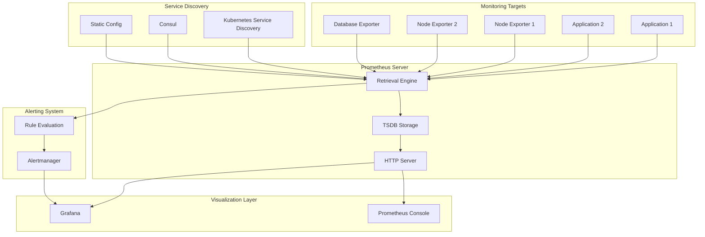
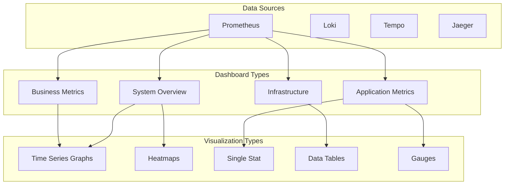
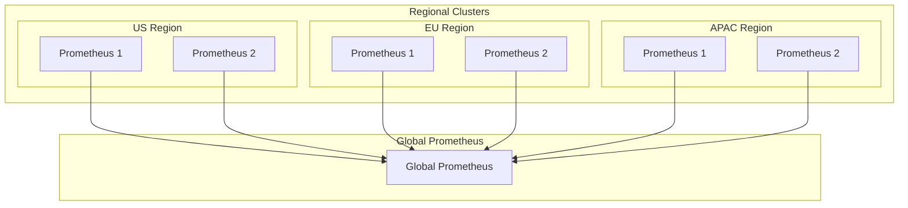

# 📊 Metrics and Monitoring (Prometheus, Grafana)

A comprehensive guide to monitoring infrastructure using Prometheus for metrics collection and Grafana for visualization. This stack provides powerful observability capabilities for modern distributed systems.

---

## 🗺️ Table of Contents
1. [Monitoring Stack Overview](#1-monitoring-stack-overview)
2. [Prometheus Architecture](#2-prometheus-architecture)
3. [Prometheus Configuration](#3-prometheus-configuration)
4. [Grafana Dashboards](#4-grafana-dashboards)
5. [Exporters and Instrumentation](#5-exporters-and-instrumentation)
6. [Alerting and Notifications](#6-alerting-and-notifications)
7. [Best Practices](#7-best-practices)

---

## 1. Monitoring Stack Overview

### **Core Components**
- **Prometheus**: Time-series database and monitoring system
- **Grafana**: Visualization and dashboarding platform
- **Alertmanager**: Alert routing and management
- **Exporters**: Metrics collection agents
- **Pushgateway**: Short-lived job metrics

### **Key Benefits**
- **Pull-based Architecture**: Efficient metric collection
- **Multi-dimensional Data**: Rich labeling and querying
- **Powerful Querying**: PromQL for complex queries
- **Flexible Visualization**: Extensive dashboard options
- **Reliable Alerting**: Multi-channel notifications
- **Scalable Design**: Horizontal scaling capabilities

---

## 2. Prometheus Architecture

### **System Architecture**


### **Prometheus Data Model**
- **Metrics**: Named time-series data with labels
- **Labels**: Key-value pairs for dimensional data
- **Samples**: Single data point (timestamp, value)
- **Series**: Unique combination of metric name and labels

### **Metric Types**
| Type | Description | Example |
|-------|-------------|----------|
| **Counter** | Monotonically increasing value | `http_requests_total` |
| **Gauge** | Value that can go up or down | `memory_usage_bytes` |
| **Histogram** | Distribution of values | `http_request_duration_seconds` |
| **Summary** | Similar to histogram with quantiles | `rpc_duration_seconds` |

---

## 3. Prometheus Configuration

### **Main Configuration**
```yaml
# prometheus.yml
global:
  scrape_interval: 15s
  evaluation_interval: 15s
  external_labels:
    cluster: 'production'
    region: 'us-west-2'

rule_files:
  - "rules/*.yml"

alerting:
  alertmanagers:
    - static_configs:
        - targets:
          - alertmanager:9093

scrape_configs:
  # Prometheus self-monitoring
  - job_name: 'prometheus'
    static_configs:
      - targets: ['localhost:9090']

  # Node Exporter
  - job_name: 'node-exporter'
    kubernetes_sd_configs:
      - role: endpoints
        namespaces:
          names:
            - monitoring
    relabel_configs:
      - source_labels: [__meta_kubernetes_service_name]
        target_label: service
      - source_labels: [__meta_kubernetes_pod_name]
        target_label: pod

  # Application metrics
  - job_name: 'applications'
    kubernetes_sd_configs:
      - role: pod
        namespaces:
          names:
            - production
    relabel_configs:
      - source_labels: [__meta_kubernetes_pod_annotation_prometheus_io_scrape]
        action: keep
        regex: true
      - source_labels: [__meta_kubernetes_pod_annotation_prometheus_io_path]
        action: replace
        target_label: __metrics_path__
        regex: (.+)

  # External services
  - job_name: 'external-services'
    consul_sd_configs:
      - server: 'consul:8500'
        services: []
    relabel_configs:
      - source_labels: [__meta_consul_tags]
        regex: .*,metrics,.*
        action: keep
```

### **Recording Rules**
```yaml
# rules/recording.yml
groups:
  - name: kubernetes.rules
    rules:
      # High memory usage
      - record: instance:node_memory_utilization:ratio
        expr: |
          (
            node_memory_MemTotal_bytes - node_memory_MemAvailable_bytes
          ) / node_memory_MemTotal_bytes

      # CPU usage
      - record: instance:node_cpu_utilization:rate5m
        expr: |
          100 - (avg by(instance) (irate(node_cpu_seconds_total{mode="idle"}[5m])) * 100)

      # Disk usage
      - record: instance:node_filesystem_usage:ratio
        expr: |
          node_filesystem_size_bytes - node_filesystem_avail_bytes
        ) / node_filesystem_size_bytes

  - name: application.rules
    rules:
      # Request rate
      - record: job:http_requests:rate5m
        expr: |
          sum by(job) (rate(http_requests_total[5m]))

      # Error rate
      - record: job:http_requests_errors:rate5m
        expr: |
          sum by(job) (rate(http_requests_total{status=~"5.."}[5m]))

      # P95 response time
      - record: job:http_request_duration_seconds:p95
        expr: |
          histogram_quantile(0.95, sum by(job, le) (rate(http_request_duration_seconds_bucket[5m])))
```

### **Alerting Rules**
```yaml
# rules/alerting.yml
groups:
  - name: node.rules
    rules:
      - alert: InstanceDown
        expr: up == 0
        for: 5m
        labels:
          severity: critical
        annotations:
          summary: "Instance {{ $labels.instance }} is down"
          description: "{{ $labels.instance }} has been down for more than 5 minutes."

      - alert: HighMemoryUsage
        expr: instance:node_memory_utilization:ratio > 0.9
        for: 10m
        labels:
          severity: warning
        annotations:
          summary: "High memory usage on {{ $labels.instance }}"
          description: "Memory usage is above 90% on {{ $labels.instance }}"

      - alert: HighCPUUsage
        expr: instance:node_cpu_utilization:rate5m > 80
        for: 15m
        labels:
          severity: warning
        annotations:
          summary: "High CPU usage on {{ $labels.instance }}"
          description: "CPU usage is above 80% on {{ $labels.instance }}"

  - name: application.rules
    rules:
      - alert: HighErrorRate
        expr: |
          (
            job:http_requests_errors:rate5m / job:http_requests:rate5m
          ) > 0.05
        for: 5m
        labels:
          severity: critical
        annotations:
          summary: "High error rate for {{ $labels.job }}"
          description: "Error rate is above 5% for {{ $labels.job }}"

      - alert: HighResponseTime
        expr: job:http_request_duration_seconds:p95 > 1
        for: 10m
        labels:
          severity: warning
        annotations:
          summary: "High response time for {{ $labels.job }}"
          description: "95th percentile response time is above 1 second"
```

---

## 4. Grafana Dashboards

### **Dashboard Architecture**


### **Dashboard Configuration**
```json
{
  "dashboard": {
    "id": null,
    "title": "Application Monitoring Dashboard",
    "tags": ["application", "monitoring"],
    "timezone": "browser",
    "panels": [
      {
        "id": 1,
        "title": "Request Rate",
        "type": "graph",
        "targets": [
          {
            "expr": "rate(http_requests_total[5m])",
            "legendFormat": "{{method}} {{status}}"
          }
        ],
        "yAxes": [
          {
            "label": "Requests/sec"
          }
        ]
      },
      {
        "id": 2,
        "title": "Response Time P95",
        "type": "graph",
        "targets": [
          {
            "expr": "histogram_quantile(0.95, rate(http_request_duration_seconds_bucket[5m]))",
            "legendFormat": "P95"
          }
        ],
        "yAxes": [
          {
            "label": "Seconds"
          }
        ]
      },
      {
        "id": 3,
        "title": "Error Rate",
        "type": "singlestat",
        "targets": [
          {
            "expr": "rate(http_requests_total{status=~\"5..\"}[5m]) / rate(http_requests_total[5m]) * 100",
            "legendFormat": "Error %"
          }
        ],
        "valueMaps": [
          {
            "value": null,
            "text": "N/A"
          }
        ],
        "thresholds": "1,5,10"
      },
      {
        "id": 4,
        "title": "Top 10 Slow Endpoints",
        "type": "table",
        "targets": [
          {
            "expr": "topk(10, histogram_quantile(0.95, rate(http_request_duration_seconds_bucket[5m])))",
            "legendFormat": "{{endpoint}}"
          }
        ],
        "transformations": [
          {
            "id": "organize",
            "options": {
              "excludeByName": {
                "Time": true
              }
            }
          }
        ]
      }
    ],
    "time": {
      "from": "now-1h",
      "to": "now"
    },
    "refresh": "5s"
  }
}
```

### **Common Dashboard Templates**

#### **System Overview Dashboard**
- **CPU Usage**: Multi-instance CPU utilization graphs
- **Memory Usage**: Memory consumption and trends
- **Disk Usage**: Filesystem utilization and I/O
- **Network Traffic**: Network interface statistics
- **System Load**: Load average and uptime
- **Process Count**: Running processes by state

#### **Application Performance Dashboard**
- **Request Rate**: Requests per second by endpoint
- **Response Time**: P50, P95, P99 response times
- **Error Rate**: Error percentage and count
- **Throughput**: Data transfer rates
- **Active Connections**: Current connection count
- **Application Health**: Service status indicators

#### **Business Metrics Dashboard**
- **User Activity**: Active users and sessions
- **Revenue Metrics**: Transaction volume and value
- **Conversion Rates**: Funnel conversion percentages
- **Feature Usage**: Feature adoption metrics
- **Performance SLA**: Service level agreement compliance

---

## 5. Exporters and Instrumentation

### **Node Exporter Configuration**
```yaml
# node-exporter deployment
apiVersion: apps/v1
kind: DaemonSet
metadata:
  name: node-exporter
  namespace: monitoring
spec:
  selector:
    matchLabels:
      app: node-exporter
  template:
    metadata:
      labels:
        app: node-exporter
      annotations:
        prometheus.io/scrape: "true"
        prometheus.io/port: "9100"
    spec:
      containers:
      - name: node-exporter
        image: prom/node-exporter:latest
        ports:
        - containerPort: 9100
        hostPort: 9100
        args:
        - --path.procfs=/host/proc
        - --path.sysfs=/host/sys
        - --collector.filesystem
        - --collector.cpu
        - --collector.meminfo
        volumeMounts:
        - name: proc
          mountPath: /host/proc
        - name: sys
          mountPath: /host/sys
      volumes:
      - name: proc
        hostPath:
          path: /proc
      - name: sys
        hostPath:
          path: /sys
```

### **Application Instrumentation**

#### **Go Application**
```go
package main

import (
    "net/http"
    "github.com/prometheus/client_golang/prometheus"
    "github.com/prometheus/client_golang/prometheus/promhttp"
)

var (
    httpRequestsTotal = prometheus.NewCounterVec(
        prometheus.CounterOpts{
            Name: "http_requests_total",
            Help: "Total number of HTTP requests",
        },
        []string{"method", "status", "endpoint"},
    )
    
    httpRequestDuration = prometheus.NewHistogramVec(
        prometheus.HistogramOpts{
            Name: "http_request_duration_seconds",
            Help: "HTTP request duration in seconds",
            Buckets: prometheus.DefBuckets,
        },
        []string{"method", "endpoint"},
    )
)

func init() {
    prometheus.MustRegister(httpRequestsTotal)
    prometheus.MustRegister(httpRequestDuration)
}

func instrumentHandler(next http.Handler) http.Handler {
    return http.HandlerFunc(func(w http.ResponseWriter, r *http.Request) {
        start := time.Now()
        
        // Wrap response writer to capture status code
        rw := &responseWriter{ResponseWriter: w}
        
        // Call the next handler
        next.ServeHTTP(rw, r)
        
        // Record metrics
        duration := time.Since(start).Seconds()
        httpRequestDuration.WithLabelValues(r.Method, r.URL.Path).Observe(duration)
        httpRequestsTotal.WithLabelValues(r.Method, fmt.Sprintf("%d", rw.statusCode), r.URL.Path).Inc()
    })
}

type responseWriter struct {
    http.ResponseWriter
    statusCode int
}

func (rw *responseWriter) WriteHeader(code int) {
    rw.statusCode = code
    rw.ResponseWriter.WriteHeader(code)
}

func main() {
    http.Handle("/metrics", promhttp.Handler())
    http.Handle("/", instrumentHandler(myHandler))
    http.ListenAndServe(":8080", nil)
}
```

#### **Java Application (Micrometer)**
```java
@RestController
public class MetricsController {
    
    private final Counter requestCounter;
    private final Timer requestTimer;
    
    public MetricsController(MeterRegistry meterRegistry) {
        this.requestCounter = Counter.builder("http.requests.total")
            .description("Total HTTP requests")
            .tag("method", "status")
            .register(meterRegistry);
            
        this.requestTimer = Timer.builder("http.request.duration")
            .description("HTTP request duration")
            .register(meterRegistry);
    }
    
    @GetMapping("/api/data")
    public ResponseEntity<?> getData() {
        return Timer.Sample.start(requestTimer)
            .stop(() -> {
                try {
                    // Business logic here
                    return ResponseEntity.ok().build();
                } catch (Exception e) {
                    requestCounter.increment(Tags.of("method", "GET", "status", "500"));
                    throw e;
                }
            });
    }
}
```

### **Custom Exporters**

#### **Business Metrics Exporter**
```python
from prometheus_client import start_http_server, Counter, Histogram, Gauge
import time
import random

# Define metrics
business_transactions = Counter('business_transactions_total', 
                           'Total business transactions', ['type', 'status'])
transaction_amount = Histogram('business_transaction_amount',
                            'Business transaction amount')
active_users = Gauge('business_active_users',
                   'Number of active users')

def process_transaction(transaction_type, amount):
    """Process a business transaction and record metrics"""
    start_time = time.time()
    
    try:
        # Simulate transaction processing
        time.sleep(random.uniform(0.1, 0.5))
        
        # Record successful transaction
        business_transactions.labels(type=transaction_type, status='success').inc()
        transaction_amount.observe(amount)
        
        return True
    except Exception as e:
        # Record failed transaction
        business_transactions.labels(type=transaction_type, status='failed').inc()
        return False

def update_active_users():
    """Update active users metric"""
    # Simulate active users count
    count = random.randint(100, 500)
    active_users.set(count)

if __name__ == '__main__':
    # Start metrics server
    start_http_server(8000)
    
    # Simulate business operations
    while True:
        process_transaction('purchase', random.uniform(10, 1000))
        update_active_users()
        time.sleep(1)
```

---

## 6. Alerting and Notifications

### **Alertmanager Configuration**
```yaml
# alertmanager.yml
global:
  smtp_smarthost: 'smtp.example.com:587'
  smtp_from: 'alerts@example.com'
  smtp_auth_username: 'alerts@example.com'
  smtp_auth_password: 'password'

route:
  group_by: ['alertname', 'cluster', 'service']
  group_wait: 10s
  group_interval: 10s
  repeat_interval: 1h
  receiver: 'default'
  routes:
  - match:
      severity: critical
    receiver: 'critical-alerts'
  - match:
      severity: warning
    receiver: 'warning-alerts'

receivers:
  - name: 'default'
    email_configs:
    - to: 'team@example.com'
      subject: '[Alert] {{ .GroupLabels.alertname }}'
      body: |
        {{ range .Alerts }}
        Alert: {{ .Annotations.summary }}
        Description: {{ .Annotations.description }}
        Labels: {{ range .Labels.SortedPairs }}{{ .Name }}={{ .Value }} {{ end }}
        {{ end }}

  - name: 'critical-alerts'
    email_configs:
    - to: 'oncall@example.com'
      subject: '[CRITICAL] {{ .GroupLabels.alertname }}'
      body: |
        CRITICAL ALERT!
        
        {{ range .Alerts }}
        Alert: {{ .Annotations.summary }}
        Description: {{ .Annotations.description }}
        Runbook: {{ .Annotations.runbook_url }}
        {{ end }}
    slack_configs:
    - api_url: 'https://hooks.slack.com/services/YOUR/SLACK/WEBHOOK'
      channel: '#alerts'
      title: 'Critical Alert: {{ .GroupLabels.alertname }}'
      text: |
        {{ range .Alerts }}
        *Alert:* {{ .Annotations.summary }}
        *Description:* {{ .Annotations.description }}
        {{ end }}

  - name: 'warning-alerts'
    email_configs:
    - to: 'team@example.com'
      subject: '[WARNING] {{ .GroupLabels.alertname }}'
    slack_configs:
    - api_url: 'https://hooks.slack.com/services/YOUR/SLACK/WEBHOOK'
      channel: '#warnings'
      title: 'Warning: {{ .GroupLabels.alertname }}'

inhibit_rules:
  - source_match:
      severity: 'critical'
    target_match:
      severity: 'warning'
    equal: ['alertname', 'instance']
```

### **Alert Templates**
```go
{{/* vim: set filetype=gotextmpl: */ -}}
{{ define "slack.default.title" }}{{ .GroupLabels.alertname }}{{ end }}
{{ define "slack.default.text" }}
{{ range .Alerts }}
*Alert:* {{ .Annotations.summary }}
*Description:* {{ .Annotations.description }}
*Labels:* {{ range .Labels.SortedPairs }}{{ .Name }}={{ .Value }} {{ end }}
{{ end }}
{{ end }}

{{ define "email.default.subject" }}[{{ .Status | toUpper }}] {{ .GroupLabels.alertname }}{{ end }}
{{ define "email.default.body" }}
<!DOCTYPE html>
<html>
<head>
    <title>{{ template "email.default.subject" . }}</title>
</head>
<body>
    <h2>{{ .Status | toUpper }} Alert: {{ .GroupLabels.alertname }}</h2>
    
    {{ range .Alerts }}
    <div style="border: 1px solid #ccc; padding: 10px; margin: 10px 0;">
        <h3>{{ .Annotations.summary }}</h3>
        <p><strong>Description:</strong> {{ .Annotations.description }}</p>
        <p><strong>Severity:</strong> {{ .Labels.severity }}</p>
        <p><strong>Instance:</strong> {{ .Labels.instance }}</p>
        {{ if .Annotations.runbook_url }}
        <p><strong>Runbook:</strong> <a href="{{ .Annotations.runbook_url }}">View Runbook</a></p>
        {{ end }}
    </div>
    {{ end }}
</body>
</html>
{{ end }}
```

---

## 7. Best Practices

### **Performance Optimization**

#### **Prometheus Configuration**
- **Scrape Interval**: Balance between granularity and performance
- **Storage Optimization**: Configure retention periods and compression
- **Remote Write**: Use for long-term storage and federation
- **Resource Limits**: Set appropriate memory and CPU limits

#### **Grafana Optimization**
- **Query Optimization**: Use efficient PromQL queries
- **Dashboard Caching**: Enable dashboard caching
- **Data Source Limits**: Configure query timeouts
- **Panel Optimization**: Limit number of panels per dashboard

### **Security Best Practices**

#### **Authentication & Authorization**
```yaml
# prometheus.yml with basic auth
basic_auth_users:
  admin: $2y$12$LxvJ8Rd5Qr5Qr5Qr5Qr5Q

# TLS configuration
tls_server_config:
  cert_file: /etc/prometheus/cert.pem
  key_file: /etc/prometheus/key.pem
```

#### **Network Security**
- **Firewall Rules**: Restrict access to monitoring ports
- **VPN Access**: Use VPN for remote access
- **RBAC**: Implement role-based access control
- **Secrets Management**: Use Kubernetes secrets or vault

### **Monitoring Strategy**

#### **Golden Signals**
1. **Latency**: Request/response time
2. **Traffic**: Request volume per second
3. **Errors**: Rate of failed requests
4. **Saturation**: Resource utilization

#### **RED Method**
- **Rate**: Request rate per second
- **Errors**: Number of errors per second
- **Duration**: Request duration distribution

#### **USE Method**
- **Utilization**: Percentage of time resource is busy
- **Saturation**: How much work is queued
- **Errors**: Rate of errors

### **Scalability Patterns**

#### **Federation Architecture**


#### **High Availability Setup**
```yaml
# High availability Prometheus configuration
global:
  external_labels:
    cluster: 'production'
    replica: 'prometheus-1'

scrape_configs:
  - job_name: 'federate'
    scrape_interval: 15s
    honor_labels: true
    metrics_path: /federate
    params:
      'match[]':
        - '{job="kubernetes-apiservers"}'
        - '{__name__=~"job:.*"}'
    static_configs:
      - targets: ['prometheus-2:9090']
```

---

## 🚀 Getting Started

### **Installation Commands**
```bash
# Install Prometheus
docker run -d \
  --name prometheus \
  -p 9090:9090 \
  -v /path/to/prometheus.yml:/etc/prometheus/prometheus.yml \
  prom/prometheus:latest

# Install Grafana
docker run -d \
  --name grafana \
  -p 3000:3000 \
  -e "GF_SECURITY_ADMIN_PASSWORD=admin" \
  grafana/grafana:latest

# Install Node Exporter
docker run -d \
  --name node-exporter \
  -p 9100:9100 \
  -v "/:/host:ro,rslave" \
  prom/node-exporter:latest \
  --path.rootfs=/host

# Install Alertmanager
docker run -d \
  --name alertmanager \
  -p 9093:9093 \
  -v /path/to/alertmanager.yml:/etc/alertmanager/alertmanager.yml \
  prom/alertmanager:latest
```

### **Kubernetes Deployment**
```yaml
# prometheus-operator values.yaml
prometheus:
  prometheusSpec:
    storageSpec:
      volumeClaimTemplate:
        spec:
          storageClassName: fast-ssd
          accessModes: ["ReadWriteOnce"]
          resources:
            requests:
              storage: 50Gi
    retention: 30d
    resources:
      requests:
        memory: 2Gi
        cpu: 1000m
      limits:
        memory: 4Gi
        cpu: 2000m

grafana:
  adminPassword: admin123
  persistence:
    enabled: true
    size: 10Gi
  service:
    type: LoadBalancer
    port: 80
    targetPort: 3000

alertmanager:
  alertmanagerSpec:
    storage:
      volumeClaimTemplate:
        spec:
          storageClassName: fast-ssd
          accessModes: ["ReadWriteOnce"]
          resources:
            requests:
              storage: 10Gi
```

---

## 📚 Further Reading

- [Prometheus Documentation](https://prometheus.io/docs/)
- [Grafana Documentation](https://grafana.com/docs/)
- [Prometheus Best Practices](https://prometheus.io/docs/practices/)
- [Grafana Dashboards](https://grafana.com/grafana/dashboards/)
- [Alertmanager Configuration](https://prometheus.io/docs/alerting/latest/alertmanager/)

---

[⬅️ Back to Infrastructure & Ops](../README.md)
