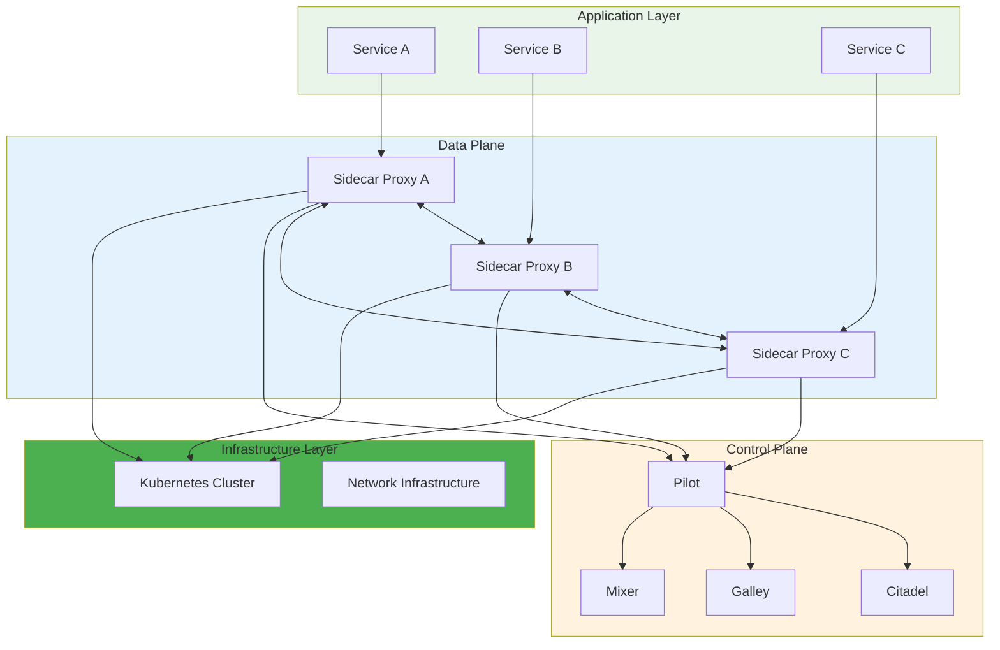
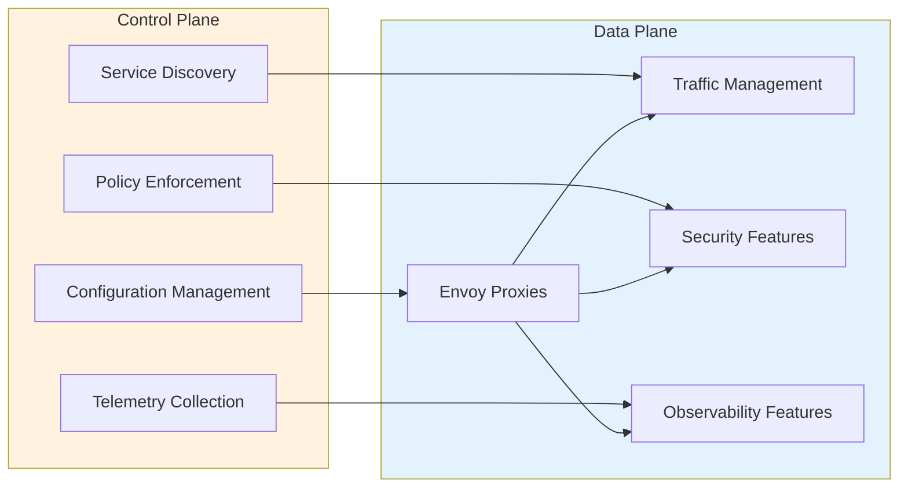

# 🔗 Service Mesh

A comprehensive guide to service mesh architecture, implementation, and best practices with detailed examples for Istio and Linkerd.

---

## 🗺️ Table of Contents
1. [Service Mesh Overview](#1-service-mesh-overview)
2. [Architecture Components](#2-architecture-components)
3. [Istio Implementation](#3-istio-implementation)
4. [Linkerd Implementation](#4-linkerd-implementation)
5. [Comparison & Selection](#5-comparison--selection)
6. [Best Practices](#6-best-practices)

---

## 1. Service Mesh Overview

### **What is a Service Mesh?**
A service mesh is a dedicated infrastructure layer for handling service-to-service communication in microservices architectures. It provides features like traffic management, security, observability, and reliability without requiring changes to application code.

### **Key Benefits**
- **Traffic Management**: Load balancing, traffic splitting, and routing
- **Security**: mTLS encryption, authentication, and authorization
- **Observability**: Metrics, logs, and distributed tracing
- **Reliability**: Retries, circuit breakers, and timeouts
- **Policy Enforcement**: Access control and compliance

### **Core Concepts**
- **Data Plane**: Handles network communication between services
- **Control Plane**: Manages and configures the data plane
- **Sidecar Proxy**: Intercept and manage service traffic
- **Service Discovery**: Dynamic service registration and discovery
- **Configuration Management**: Centralized policy and rule management

---

## 2. Architecture Components

### **Service Mesh Architecture**


### **Data Plane vs Control Plane**


---

## 3. Istio Implementation

### **Istio Overview**
Istio is an open-source service mesh that provides a uniform way to connect, manage, and secure microservices. It uses Envoy as its sidecar proxy and provides a powerful control plane for managing service interactions.

### **Installation**
```bash
# Download Istio
curl -L https://istio.io/downloadIstio | sh -
cd istio-*

# Add istioctl to PATH
export PATH=$PWD/bin:$PATH

# Install Istio
istioctl install --set profile=demo -y

# Verify installation
istioctl verify-install
```

### **Core Components**

#### **1. Pilot**
```yaml
# Pilot configuration example
apiVersion: v1
kind: ConfigMap
metadata:
  name: istio
  namespace: istio-system
data:
  mesh: |-
    enableAutoMtls: true
    enablePrometheusMerge: true
    defaultConfig:
      proxyStatsMatcher:
        inclusionRegexps:
          - ".*"
```

#### **2. Citadel**
```yaml
# Citadel (Certificate Authority) configuration
apiVersion: security.istio.io/v1beta1
kind: PeerAuthentication
metadata:
  name: default
  namespace: istio-system
spec:
  mtls:
    mode: STRICT
```

#### **3. Galley**
```yaml
# Galley configuration validation
apiVersion: v1
kind: ConfigMap
metadata:
  name: istio-galley
  namespace: istio-system
data:
  config: |-
    validation:
      webhook:
        timeout: 30s
```

### **Traffic Management**

#### **Virtual Service**
```yaml
apiVersion: networking.istio.io/v1alpha3
kind: VirtualService
metadata:
  name: reviews
  namespace: default
spec:
  hosts:
    - reviews
  http:
    - match:
        - headers:
            end-user:
              exact: jason
      route:
        - destination:
            host: reviews
            subset: v2
    - route:
        - destination:
            host: reviews
            subset: v1
```

#### **Destination Rule**
```yaml
apiVersion: networking.istio.io/v1alpha3
kind: DestinationRule
metadata:
  name: reviews
  namespace: default
spec:
  host: reviews
  subsets:
    - name: v1
      labels:
        version: v1
    - name: v2
      labels:
        version: v2
  trafficPolicy:
    loadBalancer:
      simple: ROUND_ROBIN
```

#### **Gateway**
```yaml
apiVersion: networking.istio.io/v1alpha3
kind: Gateway
metadata:
  name: bookinfo-gateway
  namespace: default
spec:
  selector:
    istio: ingressgateway
  servers:
    - port:
        number: 80
        name: http
        protocol: HTTP
      hosts:
        - "*"
```

### **Security Configuration**

#### **mTLS Configuration**
```yaml
apiVersion: security.istio.io/v1beta1
kind: PeerAuthentication
metadata:
  name: default
  namespace: default
spec:
  mtls:
    mode: STRICT
---
apiVersion: security.istio.io/v1beta1
kind: RequestAuthentication
metadata:
  name: jwt-example
  namespace: default
spec:
  jwtRules:
    - issuer: "testing@secure.istio.io"
      jwksUri: "https://raw.githubusercontent.com/istio/istio/release-1.13/tests/jwt/jwks.json"
```

#### **Authorization Policy**
```yaml
apiVersion: security.istio.io/v1beta1
kind: AuthorizationPolicy
metadata:
  name: allow-viewer
  namespace: default
spec:
  selector:
    matchLabels:
      app: productpage
  action: ALLOW
  rules:
    - from:
        - source:
            principals: ["cluster.local/ns/default/sa/bookinfo-reviewer"]
      to:
        - operation:
            methods: ["GET"]
```

### **Observability**

#### **Metrics Configuration**
```yaml
apiVersion: install.istio.io/v1alpha1
kind: IstioOperator
metadata:
  name: istio-config
  namespace: istio-system
spec:
  components:
    pilot:
      k8s:
        env:
          - name: PILOT_ENABLE_WORKLOAD_ENTRY_AUTOREGISTRATION
            value: "true"
  values:
    telemetry:
      v2:
        prometheus:
          configOverride:
            inboundSidecar:
              match:
                - context: inbound
              statPrefix: inbound
              metrics:
                - name: requests_total
                  dimensions:
                    source_cluster: source.cluster
                    target_cluster: target.cluster
```

#### **Distributed Tracing**
```yaml
apiVersion: install.istio.io/v1alpha1
kind: IstioOperator
metadata:
  name: istio-config
  namespace: istio-system
spec:
  values:
    tracing:
      enabled: true
      provider: jaeger
      jaeger:
        # Jaeger configuration
        agent:
          enabled: true
```

### **Resilience Features**

#### **Circuit Breaker**
```yaml
apiVersion: networking.istio.io/v1alpha3
kind: DestinationRule
metadata:
  name: httpbin
  namespace: default
spec:
  host: httpbin
  trafficPolicy:
    connectionPool:
      tcp:
        maxConnections: 10
      http:
        http1MaxPendingRequests: 10
        maxRequestsPerConnection: 2
    outlierDetection:
      consecutiveErrors: 3
      interval: 30s
      baseEjectionTime: 30s
      maxEjectionPercent: 100
```

#### **Retry Policy**
```yaml
apiVersion: networking.istio.io/v1alpha3
kind: VirtualService
metadata:
  name: httpbin
  namespace: default
spec:
  hosts:
    - httpbin
  http:
    - route:
        - destination:
            host: httpbin
      retries:
        attempts: 3
        retryOn: 5xx
        perTryTimeout: 2s
```

#### **Timeout Configuration**
```yaml
apiVersion: networking.istio.io/v1alpha3
kind: VirtualService
metadata:
  name: httpbin
  namespace: default
spec:
  hosts:
    - httpbin
  http:
    - route:
        - destination:
            host: httpbin
      timeout: 5s
```

---

## 4. Linkerd Implementation

### **Linkerd Overview**
Linkerd is a lightweight, ultra-fast service mesh for Kubernetes. It focuses on simplicity and performance, using Rust-based proxies and providing automatic mTLS, observability, and reliability features.

### **Installation**
```bash
# Install Linkerd CLI
curl --proto '=https' --tlsv1.2 -sSfL https://run.linkerd.io/install | sh

# Add linkerd to PATH
export PATH=$PATH:$HOME/.linkerd2/bin

# Verify installation
linkerd check --pre

# Install Linkerd
linkerd install | kubectl apply -f -

# Verify installation
linkerd check

# Install extensions
linkerd viz install | kubectl apply -f -
```

### **Core Components**

#### **1. Control Plane**
```yaml
# Linkerd control plane configuration
apiVersion: v1
kind: ConfigMap
metadata:
  name: linkerd-config
  namespace: linkerd
data:
  global:
    proxy:
      image:
        version: stable-2.12.0
      cpu:
        target: 0.1
      memory:
        limit: 2Gi
      logLevel: info
```

#### **2. Data Plane**
```yaml
# Service profile for traffic management
apiVersion: linkerd.io/v1alpha2
kind: ServiceProfile
metadata:
  name: webapp-svc
  namespace: default
spec:
  routes:
    - condition:
        method: GET
        pathRegex: /api/.*
      name: api
      isRetryable: true
      timeout: 100ms
  retryBudget:
    retryRatio: 0.2
    minRetriesPerSecond: 10
    ttl: 10s
```

### **Traffic Management**

#### **Traffic Split**
```yaml
apiVersion: split.smi-spec.io/v1alpha2
kind: TrafficSplit
metadata:
  name: webapp-split
  namespace: default
spec:
  service: webapp-svc
  backends:
    - service: webapp-v1
      weight: 90
    - service: webapp-v2
      weight: 10
```

#### **HTTPRoute**
```yaml
apiVersion: specs.smi-spec.io/v1alpha3
kind: HTTPRouteGroup
metadata:
  name: webapp-routes
  namespace: default
spec:
  matches:
    - name: api
      pathRegex: /api/.*
      methods:
        - GET
        - POST
```

### **Security Configuration**

#### **mTLS Configuration**
```yaml
# Enable mTLS for namespace
apiVersion: policy.linkerd.io/v1beta1
kind: ServerPolicy
metadata:
  name: webapp-policy
  namespace: default
spec:
  podSelector:
    matchLabels:
      app: webapp
  port: 8080
  server:
    mTLS:
      mode: strict
```

#### **Service Authentication**
```yaml
apiVersion: policy.linkerd.io/v1beta1
kind: NetworkAuthentication
metadata:
  name: webapp-auth
  namespace: default
spec:
  identities:
    - webapp.default.serviceaccount.identity.linkerd.cluster.local
  authenticatedRoutes:
    - name: api
      resource:
        kind: HTTPRouteGroup
        name: webapp-routes
```

### **Observability**

#### **Metrics Configuration**
```yaml
# Linkerd Viz configuration
apiVersion: v1
kind: ConfigMap
metadata:
  name: linkerd-viz-config
  namespace: linkerd-viz
data:
  prometheus:
    retention: 6h
    scrapeInterval: 10s
```

#### **Tap for Request Inspection**
```bash
# Tap live requests
linkerd viz tap deploy/webapp

# Tap specific routes
linkerd viz tap deploy/webapp --to webapp-svc -m GET

# Tap with filters
linkerd viz tap deploy/webapp -m GET -l 'method="GET" && path="/api/.*"'
```

### **Resilience Features**

#### **Retry Budget**
```yaml
apiVersion: linkerd.io/v1alpha2
kind: ServiceProfile
metadata:
  name: webapp-svc
  namespace: default
spec:
  retryBudget:
    retryRatio: 0.2
    minRetriesPerSecond: 10
    ttl: 10s
```

#### **Timeout Configuration**
```yaml
apiVersion: linkerd.io/v1alpha2
kind: ServiceProfile
metadata:
  name: webapp-svc
  namespace: default
spec:
  routes:
    - condition:
        method: POST
        pathRegex: /api/.*
      name: api
      timeout: 500ms
```

---

## 5. Comparison & Selection

### **Istio vs Linkerd Comparison**

| Feature | Istio | Linkerd |
|---------|-------|--------|
| **Complexity** | High | Low |
| **Performance** | Good | Excellent |
| **Resource Usage** | Higher | Lower |
| **Learning Curve** | Steep | Gentle |
| **Feature Set** | Comprehensive | Focused |
| **Community** | Large | Growing |
| **Proxy** | Envoy | Rust-based |
| **Kubernetes Native** | Yes | Yes |
| **Multi-Cluster** | Yes | Limited |
| **Traffic Splitting** | Advanced | Basic |
| **Observability** | Rich | Simple |

### **Selection Criteria**

#### **Choose Istio When:**
- You need advanced traffic management features
- You require multi-cluster support
- You want comprehensive observability
- You have complex routing requirements
- You need extensive customization options

#### **Choose Linkerd When:**
- You prioritize simplicity and performance
- You want minimal resource overhead
- You need quick setup and deployment
- You prefer a focused feature set
- You want automatic mTLS with minimal configuration

---

## 6. Best Practices

### **Implementation Guidelines**

#### **1. Gradual Rollout**
```bash
# Start with a single namespace
kubectl label namespace default istio-injection=enabled

# Gradually enable for more namespaces
kubectl label namespace staging istio-injection=enabled
kubectl label namespace production istio-injection=enabled
```

#### **2. Resource Management**
```yaml
# Resource limits for sidecar proxies
apiVersion: v1
kind: Pod
metadata:
  name: webapp
spec:
  containers:
    - name: webapp
      image: webapp:latest
      resources:
        requests:
          cpu: 100m
          memory: 128Mi
        limits:
          cpu: 500m
          memory: 512Mi
```

#### **3. Monitoring and Alerting**
```yaml
# Prometheus alerting rules
groups:
  - name: service_mesh_alerts
    rules:
      - alert: HighErrorRate
        expr: istio_requests_total{response_code=~"5.."} / istio_requests_total > 0.05
        for: 5m
        annotations:
          summary: High error rate detected
```

#### **4. Security Best Practices**
```yaml
# Enable mTLS by default
apiVersion: security.istio.io/v1beta1
kind: PeerAuthentication
metadata:
  name: default
  namespace: default
spec:
  mtls:
    mode: STRICT

# Implement least privilege access
apiVersion: security.istio.io/v1beta1
kind: AuthorizationPolicy
metadata:
  name: deny-all
  namespace: default
spec:
  selector:
    matchLabels:
      app: webapp
  action: DENY
```

### **Performance Optimization**

#### **1. Proxy Configuration**
```yaml
# Optimize Envoy proxy performance
apiVersion: v1
kind: ConfigMap
metadata:
  name: istio-sidecar-injector
  namespace: istio-system
data:
  values: |
    proxy:
      cpu:
        target: 0.1
      memory:
        limit: 2Gi
```

#### **2. Connection Pooling**
```yaml
apiVersion: networking.istio.io/v1alpha3
kind: DestinationRule
metadata:
  name: webapp
  namespace: default
spec:
  host: webapp
  trafficPolicy:
    connectionPool:
      tcp:
        maxConnections: 100
      http:
        http2MaxRequests: 100
        maxRequestsPerConnection: 10
```

### **Troubleshooting**

#### **Common Issues**
```bash
# Check proxy status
istioctl proxy-status

# Check proxy configuration
istioctl proxy-config routes <pod-name>

# Check service mesh health
linkerd check

# View proxy logs
kubectl logs -n istio-system -l app=istio-proxy

# Debug traffic routing
istioctl proxy-config bootstrap <pod-name> -o json
```

---

## 🚀 Getting Started

### **Quick Start with Istio**
```bash
# Install Istio
curl -L https://istio.io/downloadIstio | sh -
cd istio-*
export PATH=$PWD/bin:$PATH
istioctl install --set profile=demo -y

# Enable automatic sidecar injection
kubectl label namespace default istio-injection=enabled

# Deploy sample application
kubectl apply -f samples/bookinfo/platform/kube/bookinfo.yaml

# Verify installation
kubectl get pods -n istio-system
```

### **Quick Start with Linkerd**
```bash
# Install Linkerd
curl --proto '=https' --tlsv1.2 -sSfL https://run.linkerd.io/install | sh
export PATH=$PATH:$HOME/.linkerd2/bin
linkerd check --pre
linkerd install | kubectl apply -f -

# Install dashboard
linkerd viz install | kubectl apply -f -

# Enable automatic sidecar injection
kubectl get deploy -o yaml | linkerd inject - | kubectl apply -f -

# Verify installation
linkerd check
```

---

## 📚 Further Reading

- [Istio Documentation](https://istio.io/latest/docs/)
- [Linkerd Documentation](https://linkerd.io/)
- [Service Mesh Patterns](https://servicemesh.es/)
- [CNCF Service Mesh Working Group](https://www.cncf.io/projects/)
- [Kubernetes Service Mesh Guide](https://kubernetes.io/docs/concepts/cluster-administration/system-metrics/)

---

[⬅️ Back to Infrastructure & Ops](../README.md)
