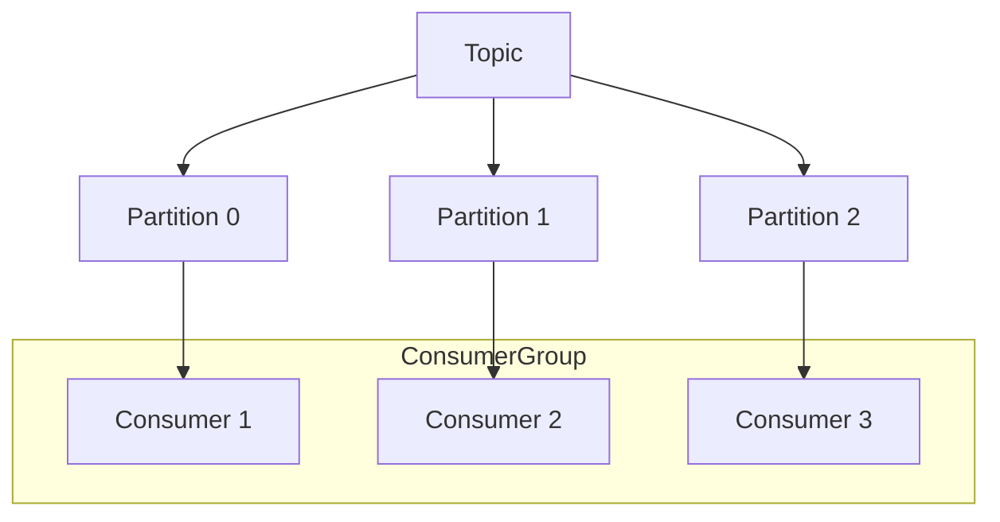

# 🎡 Apache Kafka Architecture Patterns

Apache Kafka is a distributed event streaming platform used by thousands of companies for high-performance data pipelines, streaming analytics, and data integration.

---

## 🗺️ Table of Contents
1. [Core Concepts](#1-core-concepts)
2. [Messaging Patterns](#2-messaging-patterns)
3. [Reliability Patterns](#3-reliability-patterns)
4. [Advanced Patterns](#4-advanced-patterns)
5. [Performance & Throughput Tuning](#5-performance--throughput-tuning)

---

## 1. Core Concepts
- **Topics**: Categories or feed names to which records are published.
- **Partitions**: Topics are divided into partitions for scalability and parallelism.
- **Producers**: Publish data to topics.
- **Consumers**: Subscribe to topics and process the feed of published messages.
- **Consumer Groups**: Allow a pool of consumers to divide the work of consuming and processing data.

---

## 2. Messaging Patterns

### Point-to-Point (Queue)
A single consumer group where each message is processed by only one consumer instance.

### Publish-Subscribe
Multiple consumer groups where each group receives its own copy of the message.

### Event Streaming
Processing events in real-time as they occur, often using Kafka Streams or ksqlDB.

---

## 3. Reliability Patterns

### Idempotent Producer
Ensures that messages are delivered exactly once to a particular topic partition during a single producer session, even if the producer sends the same message multiple times due to retries.

- **The Problem**: If a producer sends a message and the network fails before receiving an ACK, the producer may retry, leading to duplicate messages in Kafka.
- **The Solution**: Set `enable.idempotence=true`.
- **How it Works**:
    - **PID (Producer ID)**: Each producer is assigned a unique ID by the broker.
    - **Sequence Number**: The producer attaches a monotonically increasing sequence number to every message sent.
    - **Deduplication**: The broker tracks the last processed sequence number for each PID+Partition. If it receives a sequence number it has already seen, it rejects the duplicate.
- **Prerequisites**: For idempotency to work, the producer must also have:
    - `acks=all`
    - `retries > 0`
    - `max.in.flight.requests.per.connection <= 5`

### Transactional Producer (Exactly-Once Semantics)
Allows a producer to send a batch of messages to multiple partitions such that either all messages are successfully delivered or none are.

### Dead Letter Queue (DLQ)
A specialized topic that handles messages that cannot be processed successfully after multiple retries. It stores these "poison pills" to prevent them from blocking the rest of the stream.

- **The Workflow**:
    1. **Processing Failure**: A consumer encounters an error (e.g., deserialization error, business logic violation).
    2. **Retries**: The message is retried based on a retry policy (e.g., exponential backoff).
    3. **Routing to DLQ**: If retries are exhausted, the consumer publishes the message to a `.DLQ` topic and commits the original offset.
- **Metadata Headers**: When sending to a DLQ, it is best practice to add custom Kafka headers containing:
    - `x-dead-letter-reason`: The exception message or error code.
    - `x-original-topic`: Where the message came from.
    - `x-original-partition`: The partition it belonged to.
    - `x-exception-stacktrace`: For debugging.
- **Monitoring**: Alerting should be set up on the DLQ topic. A spike in DLQ messages usually indicates a bug in a new deployment or a breaking change in an upstream producer's schema.

---

## 4. Advanced Patterns

### Transactional Outbox Pattern
Ensures atomicity between database updates and publishing events to Kafka.
1. Save the event in an `OUTBOX` table in the same DB transaction as the business entity.
2. A separate process (e.g., Debezium CDC or a Polling Publisher) reads from the `OUTBOX` table and publishes to Kafka.

### Change Data Capture (CDC)
Automatically captures changes made to a database and streams them into Kafka. Commonly used for database synchronization and cache invalidation.

### Log Compaction
Ensures that Kafka retains at least the last known value for each message key within the log of data for a single topic partition. Useful for restoring state after a crash.

---

## 5. Performance & Throughput Tuning

To handle millions of messages per second, Kafka requires careful tuning of producers, consumers, and brokers.

### Batching (Producer)
- **`batch.size`**: Group multiple records together into a single request to reduce network overhead.
- **`linger.ms`**: Wait for a specified time before sending a batch, allowing more records to be included in the same request.

### Compression
- **`compression.type`**: Using algorithms like **Snappy**, **LZ4**, or **Zstd** significantly reduces network bandwidth and storage usage with minimal CPU overhead.

### Parallelism
- **Partition Count**: Increase the number of partitions to allow more concurrent consumers in a consumer group.
- **Goal**: One partition per consumer instance for maximum throughput.

### Acknowledgments (`acks`)
- **`acks=0`**: Fire and forget. Highest throughput, lowest reliability.
- **`acks=1`**: Wait for leader acknowledgment. Balanced.
- **`acks=all`**: Wait for all replicas. Highest reliability, lowest throughput.

### Consumer Tuning
- **`fetch.min.bytes`**: Minimum amount of data the broker should return for a fetch request.
- **`fetch.max.wait.ms`**: Maximum time the broker will wait to reach `fetch.min.bytes`.

---

## 📊 Kafka Scaling with Partitions


---

## 💻 Implementation Snippets

### Producer Implementation

<details>
<summary>☕ Java (Spring Kafka)</summary>

```java
@Service
public class MessageProducer {
    @Autowired
    private KafkaTemplate<String, String> kafkaTemplate;

    public void sendMessage(String topic, String key, String message) {
        kafkaTemplate.send(topic, key, message);
    }
}
```
</details>

<details>
<summary>🐹 Go (Confluent Kafka)</summary>

```go
func Produce(topic string, message string) {
    p, _ := kafka.NewProducer(&kafka.ConfigMap{"bootstrap.servers": "localhost"})
    defer p.Close()

    deliveryChan := make(chan kafka.Event)

    p.Produce(&kafka.Message{
        TopicPartition: kafka.TopicPartition{Topic: &topic, Partition: kafka.PartitionAny},
        Value:          []byte(message),
    }, deliveryChan)

    e := <-deliveryChan
    m := e.(*kafka.Message)
    if m.TopicPartition.Error != nil {
        fmt.Printf("Delivery failed: %v\n", m.TopicPartition.Error)
    }
}
```
</details>

### Consumer Implementation

<details>
<summary>☕ Java (Spring Kafka)</summary>

```java
@Service
public class MessageConsumer {
    @KafkaListener(topics = "my-topic", groupId = "my-group")
    public void listen(String message) {
        System.out.println("Received: " + message);
    }
}
```
</details>

<details>
<summary>🐹 Go (Confluent Kafka)</summary>

```go
func Consume(topic string) {
    c, _ := kafka.NewConsumer(&kafka.ConfigMap{
        "bootstrap.servers": "localhost",
        "group.id":          "myGroup",
        "auto.offset.reset": "earliest",
    })
    defer c.Close()

    c.SubscribeTopics([]string{topic}, nil)

    for {
        msg, err := c.ReadMessage(-1)
        if err == nil {
            fmt.Printf("Message on %s: %s\n", msg.TopicPartition, string(msg.Value))
        } else {
            fmt.Printf("Consumer error: %v (%v)\n", err, msg)
        }
    }
}
```
</details>
