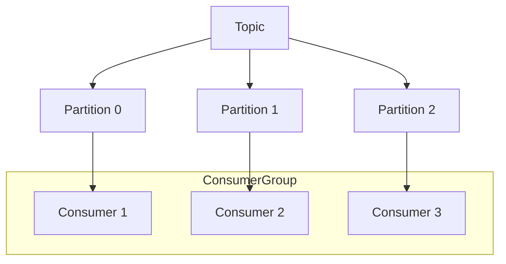

# 🎡 Apache Kafka Architecture Patterns

Apache Kafka is a distributed event streaming platform used by thousands of companies for high-performance data pipelines, streaming analytics, and data integration.

---

## 🗺️ Table of Contents
1. [Core Concepts](#1-core-concepts)
2. [Messaging Patterns](#2-messaging-patterns)
3. [Reliability Patterns](#3-reliability-patterns)
4. [Advanced Patterns](#4-advanced-patterns)

---

## 1. Core Concepts
- **Topics**: Categories or feed names to which records are published.
- **Partitions**: Topics are divided into partitions for scalability and parallelism.
- **Producers**: Publish data to topics.
- **Consumers**: Subscribe to topics and process the feed of published messages.
- **Consumer Groups**: Allow a pool of consumers to divide the work of consuming and processing data.

---

## 2. Messaging Patterns

### Point-to-Point (Queue)
A single consumer group where each message is processed by only one consumer instance.

### Publish-Subscribe
Multiple consumer groups where each group receives its own copy of the message.

### Event Streaming
Processing events in real-time as they occur, often using Kafka Streams or ksqlDB.

---

## 3. Reliability Patterns

### Idempotent Producer
Ensures that messages are delivered exactly once to a particular topic partition during a single producer session.

### Transactional Producer (Exactly-Once Semantics)
Allows a producer to send a batch of messages to multiple partitions such that either all messages are successfully delivered or none are.

### Dead Letter Queue (DLQ)
A service that handles messages that cannot be processed successfully after multiple retries. It stores these "poison pills" for manual inspection.

---

## 4. Advanced Patterns

### Transactional Outbox Pattern
Ensures atomicity between database updates and publishing events to Kafka.
1. Save the event in an `OUTBOX` table in the same DB transaction as the business entity.
2. A separate process (e.g., Debezium CDC or a Polling Publisher) reads from the `OUTBOX` table and publishes to Kafka.

### Change Data Capture (CDC)
Automatically captures changes made to a database and streams them into Kafka. Commonly used for database synchronization and cache invalidation.

### Log Compaction
Ensures that Kafka retains at least the last known value for each message key within the log of data for a single topic partition. Useful for restoring state after a crash.

---

## 📊 Kafka Scaling with Partitions

