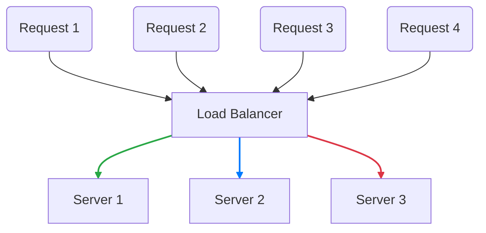

# ⚖️ Load Balancing Algorithms

Load balancing is the process of distributing network traffic across multiple servers. This ensures no single server bears too much demand, improving responsiveness and increasing availability of applications.

---

## 🗺️ Table of Contents
1. [Static Algorithms](#1-static-algorithms)
2. [Dynamic Algorithms](#2-dynamic-algorithms)
3. [Choosing the Right Algorithm](#3-choosing-the-right-algorithm)

---

## 1. Static Algorithms
These algorithms do not take the current state of the servers into account.

### Round Robin
Requests are distributed across the group of servers sequentially.
- **Best for**: Servers with similar specifications and short-lived requests.

### Weighted Round Robin
Similar to Round Robin, but each server is assigned a weight based on its capacity. Servers with higher weights receive more requests.
- **Best for**: Heterogeneous server clusters (different CPU/RAM).

### IP Hash
The client's IP address is used to determine which server receives the request. This ensures that a specific client consistently reaches the same server.
- **Best for**: Applications requiring session persistence (Sticky Sessions).

---

## 2. Dynamic Algorithms
These algorithms consider the real-time status of the servers before routing a request.

### Least Connections
Requests are sent to the server with the fewest active connections.
- **Best for**: Sessions that vary in length and intensity.

### Least Response Time
Combines the number of active connections and the lowest average response time.
- **Best for**: Optimizing for the fastest user experience.

### Least Bandwidth
Directs traffic to the server currently serving the least amount of traffic (measured in Mbps).

---

## 3. Choosing the Right Algorithm

| Algorithm | Complexity | State-Aware | Best Use Case |
| :--- | :--- | :--- | :--- |
| **Round Robin** | Low | No | Identical servers, simple tasks. |
| **Weighted RR** | Low | No | Servers with different capacities. |
| **IP Hash** | Medium | No | Session-aware applications. |
| **Least Connections** | Medium | Yes | Long-lived connections (e.g., streaming). |
| **Least Resp. Time** | High | Yes | Performance-critical applications. |

---

## 📊 Round Robin Visualization

