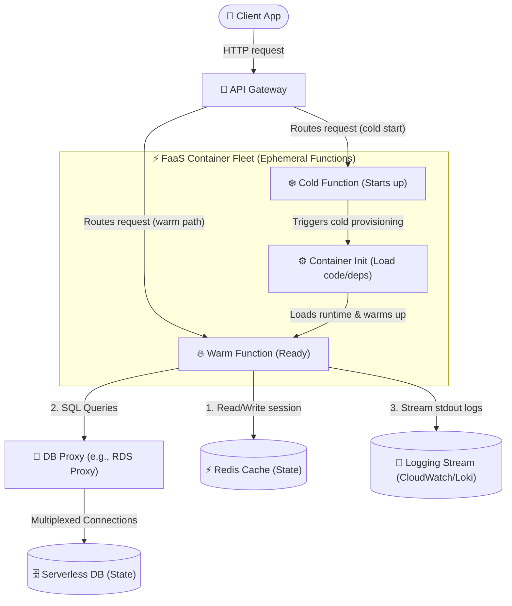

# ☁️ Modern Cloud Methodologies

Modern cloud methodologies define the standards, architectures, and design principles required to build scalable, resilient, and highly available Software-as-a-Service (SaaS) applications. This section explores the **Twelve-Factor App** design methodology and **Serverless (FaaS) Architectures**.

---

## 🗺️ Table of Contents
1. [12-Factor App Methodology](#1-12-factor-app-methodology)
2. [Serverless Architecture](#2-serverless-architecture)
   - [The FaaS Cold Start Lifecycle](#the-faas-cold-start-lifecycle)
   - [State Management & Database Connection Challenges](#state-management--database-connection-challenges)
   - [Serverless Architecture Flowchart](#serverless-architecture-flowchart)

---

## 1. 12-Factor App Methodology

The **Twelve-Factor App** methodology is a set of twelve core principles designed to guide developers in building modern, cloud-native applications that are resilient, easily deployed, and highly scalable.

| # | Factor | Architectural Principle | Modern Cloud Implementation |
| :--- | :--- | :--- | :--- |
| **I** | **Codebase** | One codebase tracked in revision control, many deploys. | Git repositories (GitHub/GitLab), where a single branch setup triggers multiple env deploys. |
| **II** | **Dependencies** | Explicitly declare and isolate dependencies. | Package managers (`npm`, `go.mod`, `Maven`, `pip`) bundled into isolated **Docker containers** to prevent environmental leakages. |
| **III** | **Config** | Store configuration in the environment. | Storing config/secrets outside the codebase. Using **Kubernetes ConfigMaps/Secrets**, **Vault**, or environment variables (`process.env`). |
| **IV** | **Backing Services** | Treat backing services as attached resources. | Databases, queues, and caches are referenced via connection strings/URLs, allowing easy swaps without changing application code. |
| **V** | **Build, Release, Run** | Strictly separate build and run stages. | **CI/CD pipelines** (e.g., GitHub Actions):<br>1. *Build*: Code compiled & containerized.<br>2. *Release*: Container combined with config.<br>3. *Run*: Deployed to K8s/ECS. |
| **VI** | **Processes** | Execute the app as one or more stateless processes. | Applications share nothing and are stateless. State is delegated to persistent stores (PostgreSQL, Redis, DynamoDB). |
| **VII** | **Port Binding** | Export services via port binding. | The application is entirely self-contained and binds to a specific port (e.g., `8080`) to listen for HTTP requests. |
| **VIII** | **Concurrency** | Scale out via the process model. | Horizontal scaling. Instead of making a single process larger (vertical), add more independent container instances (horizontal). |
| **IX** | **Disposability** | Maximize robustness with fast startup and graceful shutdown. | Fast startup times for rapid scaling. Intercepting **SIGTERM** signals to finish active requests, close DB pools, and exit cleanly. |
| **X** | **Dev/Prod Parity** | Keep development, staging, and production as similar as possible. | Avoid "it works on my machine". Use identical backing service versions in development (via LocalStack/Docker Compose) as production. |
| **XI** | **Logs** | Treat logs as event streams. | Write logs directly to `stdout` and `stderr`. Use an aggregator (e.g., **Fluentd**, **Grafana Loki**, **ELK**) to capture and index them. |
| **XII** | **Admin Processes** | Run admin/management tasks as one-off processes. | Database migrations or maintenance scripts run in the identical execution environment as the app processes, utilizing the same build. |

---

## 2. Serverless Architecture

Serverless architecture is a cloud-native development model that allows developers to build and run applications without having to manage servers. Computing resources are provisioned on-demand via **Function as a Service (FaaS)** (e.g., AWS Lambda, Google Cloud Functions).

### The FaaS Cold Start Lifecycle
Because FaaS compute resources are ephemeral and scale to zero to save costs, functions are instantiated on-demand. When an event triggers a function that is not currently running in a warmed container, a **Cold Start** occurs.

```
       [ Cold Path ]                                     [ Warm Path ]
┌─────────────────────────┐     ┌─────────────────────┐     ┌───────────────────────┐
│     1. Provisioning     │ ──> │  2. Initialization  │ ──> │     3. Execution      │
├─────────────────────────┤     ├─────────────────────┤     ├───────────────────────┤
│ • Spin up container/VM  │     │ • Initialize runtime│     │ • Run handler code    │
│ • Download function code│     │ • Load dependencies │     │ • Process request/ev  │
│ • Allocate memory/vCPU  │     │ • Run global setup  │     │ • Return response     │
└─────────────────────────┘     └─────────────────────┘     └───────────────────────┘
```

#### Cold Start Mitigation Strategies
1. **Provisioned Concurrency**: Pre-warms a designated number of container instances, keeping them initialized and ready to execute immediately (eliminating steps 1 and 2 of the lifecycle).
2. **Runtime Language Optimization**: Compiled languages like **Go** and **Rust** have minimal initialization footprints, starting in milliseconds. Interpreted languages like **Python** and **Node.js** also boot quickly. Heavy JVM-based runtimes (**Java**, Scala) require class-loading overhead, making them prone to multi-second cold starts.
3. **Payload Minimization**: Keep package dependency sizes small. Eliminate unused library imports and tree-shake code bundles to speed up the container download and initialization phases.
4. **Keep-Alive Pings**: Set up scheduled cron rules (e.g., triggering a function every 5 minutes) to keep a baseline of containers warmed.

---

### State Management & Database Connection Challenges

Because FaaS instances are entirely stateless and ephemeral, two key architectural bottlenecks occur:

#### 1. Managing Session and Shared State
FaaS functions cannot store persistent in-memory variables between invocations since different requests route to different container instances.
- **Solution**: Delegate state to high-throughput, external state engines. Use **Redis** for fast session stores, **DynamoDB** or serverless SQL for transactional state, and **AWS Step Functions** or **Durable Functions** to coordinate long-running state machines across multiple function steps.

#### 2. Database Connection Pooling Exhaustion
Traditional applications use a persistent connection pool (like HikariCP) connected directly to the database. In a serverless model, because functions scale out rapidly and concurrently (potentially launching thousands of independent container instances in parallel), each FaaS instance opens its own database connection. This quickly exhausts the database's maximum allowed connection limit.
- **Solution: Connection Proxy Layer**: Place a high-performance connection multiplexer proxy (e.g., **AWS RDS Proxy**, **PgBouncer**, or **Prisma Accelerate**) between the FaaS fleet and the database. The proxy pool handles connection queuing, pooling, and multiplexing, allowing thousands of ephemeral functions to safely share a small pool of database connections.

---

### Serverless Architecture Flowchart

The following diagram illustrates a modern serverless application handling both cold-start and warm-path requests:


