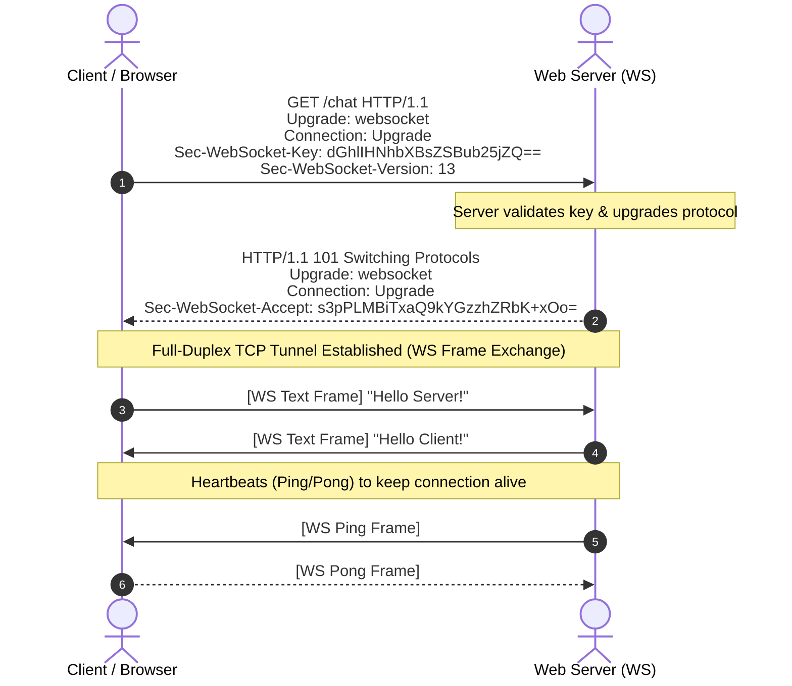
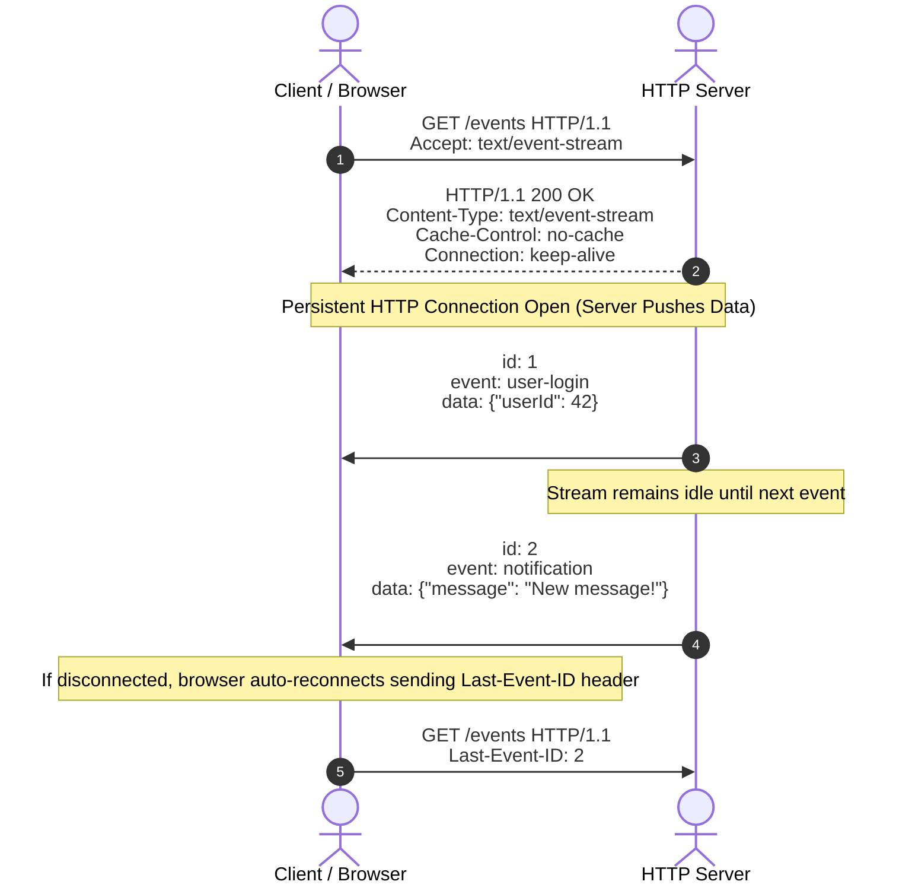
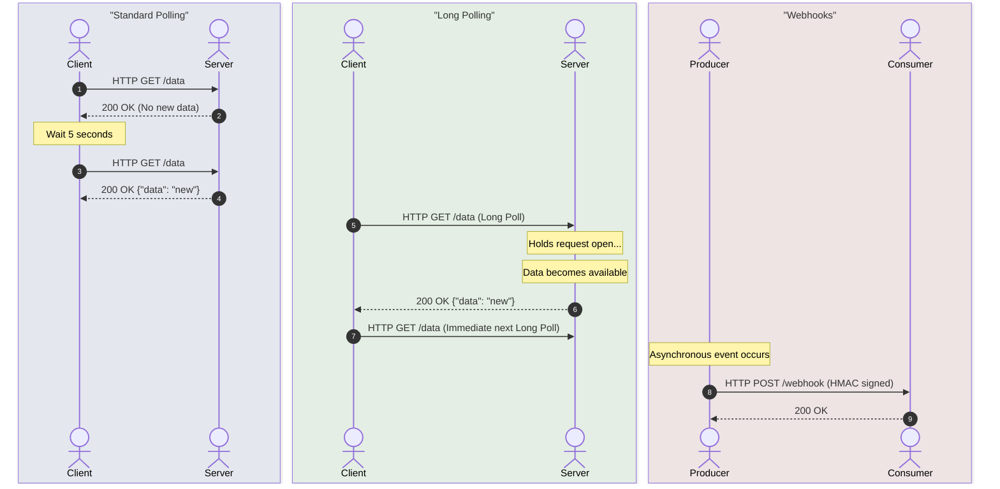

# 📡 Real-Time Communication

Real-time communication is a foundational pillar of modern web architectures. It shifts applications from the traditional request-response model (where the client must repeatedly request data) to an event-driven model where updates are pushed to clients instantly as they occur.

---

## 🗺️ Table of Contents
1. [WebSockets](#1-websockets)
   - [Targeting Specific Clients (Registry Pattern)](#targeting-specific-clients)
2. [Server-Sent Events (SSE)](#2-server-sent-events-sse)
3. [Long Polling & Webhooks](#3-long-polling--webhooks)
4. [Paradigms Comparison](#4-paradigms-comparison)

---

## 1. WebSockets

WebSockets provide a persistent, bidirectional, full-duplex communication channel over a single TCP connection. WebSockets operate over TCP port `80` (WS) or `443` (WSS, secured) and allow standard HTTP traffic and WebSocket traffic to share the same infrastructure.

### The Protocol Handshake
A WebSocket connection begins as a standard HTTP/1.1 request which is upgraded to a persistent TCP tunnel.



### Key Architectural Challenges & Solutions

#### 1. Heartbeats & Keep-Alives (Ping/Pong)
Intermediate proxies, firewalls, and load balancers often close idle TCP connections. To keep a WebSocket active:
- **Ping/Pong Frames**: The server regularly sends a ping frame (typically every 30 seconds). The client (browser or application) must reply immediately with a pong frame. If a pong is not received within a timeout period, the connection is considered dead and closed.

#### 2. Reconnection with Exponential Backoff and Jitter
When a client loses connection, naive immediate reconnection attempts can result in a **thundering herd problem** (thousands of clients flooding the server simultaneously).
- **Exponential Backoff**: Increase the delay between reconnection attempts (e.g., 1s, 2s, 4s, 8s, up to a maximum limit).
- **Jitter (Randomization)**: Add a random variance (e.g., +/- 200ms) to prevent synchronization between different clients.

#### 3. Horizontal Scaling & Pub/Sub
Because WebSockets are stateful and keep a persistent TCP connection to a *specific* server instance, scaling horizontally requires a coordination layer. If Client A is connected to Server 1 and Client B is connected to Server 2, Server 1 cannot directly send a message to Client B.
- **Shared Pub/Sub Adapter**: Use a message broker (e.g., **Redis**, **RabbitMQ**, or **Kafka**) to broadcast messages across all server instances. When a message is sent, the handling server publishes it to the broker, which replicates it to all other servers, which then deliver it to their locally connected clients.

<a id="targeting-specific-clients"></a>
### 🎯 Targeting Specific Clients (Registry Pattern)

In standard HTTP, communication is stateless and request-driven. With WebSockets, the persistent nature of TCP tunnels allows the server to push events directly to specific clients. To target a specific client/user, servers implement the **Registry Pattern**.

1. **Authentication & Identification**: Upon connection initialization, the server authenticates the client (e.g., via JWT or query parameters) to resolve a unique identifier, such as a `userId`.
2. **Stateful Connection Mapping**: The server registers the active socket connection in a thread-safe registry (a Map or Dictionary) using the `userId` as the key.
3. **Targeted Delivery**: When an event occurs for that user, the server retrieves their socket connection from the registry and sends the payload.

#### Multi-Language Registry Implementations

##### Node.js
```javascript
// Map to index connections by userId
const activeConnections = new Map();

wss.on('connection', (ws, req) => {
  const url = new URL(req.url, 'http://localhost');
  const userId = url.searchParams.get('userId');
  
  if (userId) {
    activeConnections.set(userId, ws);
  }

  ws.on('close', () => {
    activeConnections.delete(userId);
  });
});

function sendToUser(targetUserId, eventName, payload) {
  const ws = activeConnections.get(targetUserId);
  if (ws && ws.readyState === ws.OPEN) {
    ws.send(JSON.stringify({ event: eventName, data: payload }));
  }
}
```

##### Go
```go
import (
	"fmt"
	"sync"
	"github.com/gorilla/websocket"
)

type ConnectionRegistry struct {
	sync.RWMutex
	connections map[string]*websocket.Conn
}

var registry = ConnectionRegistry{
	connections: make(map[string]*websocket.Conn),
}

func (r *ConnectionRegistry) Register(userId string, conn *websocket.Conn) {
	r.Lock()
	defer r.Unlock()
	r.connections[userId] = conn
}

func (r *ConnectionRegistry) Unregister(userId string) {
	r.Lock()
	defer r.Unlock()
	delete(r.connections, userId)
}

func (r *ConnectionRegistry) SendToUser(userId string, message interface{}) error {
	r.RLock()
	conn, exists := r.connections[userId]
	r.RUnlock()

	if !exists {
		return fmt.Errorf("user %s offline", userId)
	}
	return conn.WriteJSON(message)
}
```

##### Java (Spring Boot)
```java
import java.io.IOException;
import java.util.concurrent.ConcurrentHashMap;
import org.springframework.web.socket.TextMessage;
import org.springframework.web.socket.WebSocketSession;
import org.springframework.web.socket.handler.TextWebSocketHandler;

public class MyWebSocketHandler extends TextWebSocketHandler {

    private static final ConcurrentHashMap<String, WebSocketSession> userSessions = new ConcurrentHashMap<>();

    @Override
    public void afterConnectionEstablished(WebSocketSession session) {
        String query = session.getUri().getQuery();
        String userId = query.split("=")[1];
        userSessions.put(userId, session);
    }

    public void sendToUser(String userId, String messagePayload) throws IOException {
        WebSocketSession session = userSessions.get(userId);
        if (session != null && session.isOpen()) {
            session.sendMessage(new TextMessage(messagePayload));
        }
    }

    @Override
    public void afterConnectionClosed(WebSocketSession session, org.springframework.web.socket.CloseStatus status) {
        userSessions.values().remove(session);
    }
}
```

#### 🌐 Scaling Across Distributed Servers
When scaling horizontally, a client is only connected to a single server instance. If Server A wants to emit to `user_123` but `user_123` is connected to Server B, the message must be dispatched across the fleet:
- **Pub/Sub Broker Dispatch**: Senders publish the target user and payload to a shared Redis Pub/Sub channel (e.g., `ws_dispatch`). All server instances receive the message; only the instance holding `user_123` in its local registry maps and transmits the message over TCP, while the other servers discard it.

### 📝 Code Examples

> [!NOTE]
> The browser-native JavaScript client works seamlessly with all three backend server implementations (Node.js, Go, and Java Spring Boot).

#### 1. Node.js Server (`ws` package)
```javascript
const { WebSocketServer } = require('ws');
const http = require('http');

const server = http.createServer();
const wss = new WebSocketServer({ server });

wss.on('connection', (ws) => {
  console.log('Client connected');
  ws.isAlive = true;

  ws.on('pong', () => { ws.isAlive = true; });

  // RECEIVING: Listen for message frames from the client
  ws.on('message', (rawData) => {
    try {
      // Decode and parse the structured incoming JSON message
      const parsed = JSON.parse(rawData);
      console.log(`Received Event [${parsed.event}]:`, parsed.data);
      
      // SENDING: Construct a structured JSON reply and send it back
      const response = JSON.stringify({
        event: 'reply',
        data: { 
          text: `Echo: ${parsed.data.text}`, 
          timestamp: new Date().toISOString() 
        }
      });
      ws.send(response);
    } catch (err) {
      console.error('Failed to parse incoming JSON frame');
    }
  });

  ws.on('close', () => {
    console.log('Client disconnected');
  });
});

const interval = setInterval(() => {
  wss.clients.forEach((ws) => {
    if (ws.isAlive === false) return ws.terminate();
    ws.isAlive = false;
    ws.ping();
  });
}, 30000);

wss.on('close', () => clearInterval(interval));
server.listen(8080, () => console.log('WebSocket Server running on port 8080'));
```

#### 2. Go Server (`gorilla/websocket`)
```go
package main

import (
	"fmt"
	"log"
	"net/http"
	"time"

	"github.com/gorilla/websocket"
)

var upgrader = websocket.Upgrader{
	ReadBufferSize:  1024,
	WriteBufferSize: 1024,
	CheckOrigin: func(r *http.Request) bool {
		return true // Allow all origins for this example
	},
}

// Represent structured communication payload
type WebSocketMessage struct {
	Event string                 `json:"event"`
	Data  map[string]interface{} `json:"data"`
}

func handleWebSocket(w http.ResponseWriter, r *http.Request) {
	conn, err := upgrader.Upgrade(w, r, nil)
	if err != nil {
		log.Printf("Failed to upgrade connection: %v", err)
		return
	}
	defer conn.Close()
	log.Println("Client connected")

	conn.SetPongHandler(func(string) error {
		return nil
	})

	go func() {
		ticker := time.NewTicker(30 * time.Second)
		defer ticker.Stop()
		for range ticker.C {
			if err := conn.WriteMessage(websocket.PingMessage, nil); err != nil {
				return
			}
		}
	}()

	for {
		var msg WebSocketMessage
		// RECEIVING: Directly read and unmarshal JSON message frame
		if err := conn.ReadJSON(&msg); err != nil {
			log.Printf("Connection closed or read error: %v", err)
			break
		}
		log.Printf("Received Event [%s]: %v", msg.Event, msg.Data)

		// SENDING: Serialize and write structured JSON response frame
		response := WebSocketMessage{
			Event: "reply",
			Data: map[string]interface{}{
				"text":      fmt.Sprintf("Echo: %v", msg.Data["text"]),
				"timestamp": time.Now().Format(time.RFC3339),
			},
		}
		if err := conn.WriteJSON(&response); err != nil {
			log.Printf("Write error: %v", err)
			break
		}
	}
}

func main() {
	http.HandleFunc("/ws", handleWebSocket)
	log.Println("WebSocket server starting on :8080...")
	log.Fatal(http.ListenAndServe(":8080", nil))
}
```

#### 3. Java Spring Boot Server
```java
// 1. WebSocket Handler class
package com.example.realtime;

import com.fasterxml.jackson.databind.ObjectMapper;
import com.fasterxml.jackson.databind.node.ObjectNode;
import org.springframework.web.socket.TextMessage;
import org.springframework.web.socket.WebSocketSession;
import org.springframework.web.socket.handler.TextWebSocketHandler;
import java.io.IOException;

public class MyWebSocketHandler extends TextWebSocketHandler {

    // Pre-configured JSON Mapper (standard in Spring Boot)
    private final ObjectMapper mapper = new ObjectMapper();

    @Override
    public void afterConnectionEstablished(WebSocketSession session) {
        System.out.println("Client connected: " + session.getId());
    }

    // RECEIVING: Intercept and process incoming message frames
    @Override
    protected void handleTextMessage(WebSocketSession session, TextMessage message) throws IOException {
        String payload = message.getPayload();
        try {
            // Parse raw JSON text
            ObjectNode incomingJson = (ObjectNode) mapper.readTree(payload);
            String eventName = incomingJson.get("event").asText();
            String text = incomingJson.get("data").get("text").asText();
            System.out.println("Received Event [" + eventName + "]: " + text);

            // SENDING: Construct a structured JSON reply Node
            ObjectNode responseData = mapper.createObjectNode();
            responseData.put("text", "Echo: " + text);
            responseData.put("timestamp", java.time.Instant.now().toString());

            ObjectNode responseJson = mapper.createObjectNode();
            responseJson.put("event", "reply");
            responseJson.set("data", responseData);

            // Transmit frame back to client
            session.sendMessage(new TextMessage(mapper.writeValueAsString(responseJson)));
        } catch (Exception e) {
            System.err.println("JSON parse error: " + e.getMessage());
        }
    }

    @Override
    public void afterConnectionClosed(WebSocketSession session, org.springframework.web.socket.CloseStatus status) {
        System.out.println("Client disconnected: " + session.getId());
    }
}

// 2. WebSocket Configuration class
package com.example.realtime;

import org.springframework.context.annotation.Configuration;
import org.springframework.web.socket.config.annotation.EnableWebSocket;
import org.springframework.web.socket.config.annotation.WebSocketConfigurer;
import org.springframework.web.socket.config.annotation.WebSocketHandlerRegistry;

@Configuration
@EnableWebSocket
public class WebSocketConfig implements WebSocketConfigurer {

    @Override
    public void registerWebSocketHandlers(WebSocketHandlerRegistry registry) {
        registry.addHandler(new MyWebSocketHandler(), "/ws")
                .setAllowedOrigins("*");
    }
}
```

#### 4. Browser Client (Native JS with Reconnection & Backoff)
```javascript
let reconnectInterval = 1000;
const maxReconnectInterval = 30000;

function connect() {
  const ws = new WebSocket('ws://localhost:8080/ws');

  ws.onopen = () => {
    console.log('Connected to server');
    reconnectInterval = 1000; 

    // SENDING: Transmit a structured JSON message frame
    const payload = JSON.stringify({
      event: 'chat',
      data: { text: 'Hello Server!' }
    });
    ws.send(payload);
  };

  // RECEIVING: Process the incoming message frame
  ws.onmessage = (event) => {
    try {
      const response = JSON.parse(event.data);
      console.log(`Received Event [${response.event}]:`, response.data);
    } catch (err) {
      console.log('Raw text message received:', event.data);
    }
  };

  ws.onclose = () => {
    console.log('Connection closed. Reconnecting...');
    const jitter = Math.random() * 200;
    setTimeout(() => {
      reconnectInterval = Math.min(reconnectInterval * 2, maxReconnectInterval);
      connect();
    }, reconnectInterval + jitter);
  };

  ws.onerror = (error) => {
    console.error('WebSocket Error:', error);
    ws.close();
  };
}

connect();
```

---

## 2. Server-Sent Events (SSE)

Server-Sent Events (SSE) is an HTTP-based standard that allows servers to push unidirectional real-time updates to clients over a single, persistent HTTP/HTTPS connection.

Unlike WebSockets, SSE runs entirely over standard HTTP/1.1 and HTTP/2, does not require a custom protocol upgrade, and works natively in browsers via the `EventSource` API.

### Protocol Details
A persistent connection is maintained by setting specific HTTP response headers:
- `Content-Type: text/event-stream`
- `Cache-Control: no-cache`
- `Connection: keep-alive`

### Stream Payload Format
Events are sent as UTF-8 plain text block chunks separated by double newlines (`\n\n`). Each line follows a field-value format:
- `data:` - The event payload. Multi-line payloads use consecutive `data:` fields.
- `event:` - An optional custom event name (allows categorizing events on the client).
- `id:` - An optional unique event identifier. The client browser tracks this; if disconnected, it automatically sends the last seen ID in the `Last-Event-ID` header upon reconnecting to resume the stream seamlessly.
- `retry:` - An optional client reconnection timeout value in milliseconds.



### 📝 Code Examples

> [!NOTE]
> The browser-native JavaScript client works seamlessly with all three backend server implementations (Node.js, Go, and Java Spring Boot).

#### 1. Node.js Server (Express)
```javascript
const express = require('express');
const app = express();

app.get('/events', (req, res) => {
  // Establish text/event-stream connection
  res.writeHead(200, {
    'Content-Type': 'text/event-stream',
    'Cache-Control': 'no-cache',
    'Connection': 'keep-alive',
    'Access-Control-Allow-Origin': '*' // CORS allowance
  });

  // Client sent Last-Event-ID during reconnect
  const lastEventId = req.headers['last-event-id'];
  console.log(`Client connected. Last event seen: ${lastEventId || 'None'}`);

  // Send initial heartbeat
  res.write(': heartbeat\n\n');

  // Push an event every 5 seconds
  let eventCounter = lastEventId ? parseInt(lastEventId, 10) + 1 : 1;
  const intervalId = setInterval(() => {
    res.write(`id: ${eventCounter}\n`);
    res.write(`event: update\n`);
    res.write(`data: ${JSON.stringify({ time: new Date().toISOString(), value: Math.random() })}\n\n`);
    eventCounter++;
  }, 5000);

  req.on('close', () => {
    console.log('Client closed connection');
    clearInterval(intervalId);
  });
});

app.listen(3000, () => console.log('SSE Server running on port 3000'));
```

#### 2. Go Server (Standard Library)
```go
package main

import (
	"fmt"
	"log"
	"math/rand"
	"net/http"
	"time"
)

func handleSSE(w http.ResponseWriter, r *http.Request) {
	// Set standard headers for SSE
	w.Header().Set("Content-Type", "text/event-stream")
	w.Header().Set("Cache-Control", "no-cache")
	w.Header().Set("Connection", "keep-alive")
	w.Header().Set("Access-Control-Allow-Origin", "*")

	flusher, ok := w.(http.Flusher)
	if !ok {
		http.Error(w, "Streaming unsupported", http.StatusInternalServerError)
		return
	}

	// Send initial heartbeat comment to establish connection
	fmt.Fprintf(w, ": heartbeat\n\n")
	flusher.Flush()

	// Check if client sent Last-Event-ID header
	lastEventID := r.Header.Get("Last-Event-ID")
	log.Printf("Client connected. Last event seen: %s", lastEventID)

	ticker := time.NewTicker(5 * time.Second)
	defer ticker.Stop()

	eventCounter := 1
	for {
		select {
		case <-r.Context().Done():
			log.Println("Client closed connection")
			return
		case <-ticker.C:
			// Push structured event payload
			fmt.Fprintf(w, "id: %d\n", eventCounter)
			fmt.Fprintf(w, "event: update\n")
			fmt.Fprintf(w, "data: {\"time\":\"%s\",\"value\":%f}\n\n", time.Now().Format(time.RFC3339), rand.Float64())
			flusher.Flush()
			eventCounter++
		}
	}
}

func main() {
	http.HandleFunc("/events", handleSSE)
	log.Println("SSE server starting on :3000...")
	log.Fatal(http.ListenAndServe(":3000", nil))
}
```

#### 3. Java Spring Boot Server
```java
package com.example.realtime;

import org.springframework.http.MediaType;
import org.springframework.web.bind.annotation.GetMapping;
import org.springframework.web.bind.annotation.RequestHeader;
import org.springframework.web.bind.annotation.RestController;
import org.springframework.web.servlet.mvc.method.annotation.SseEmitter;
import java.io.IOException;
import java.time.LocalTime;
import java.util.concurrent.ExecutorService;
import java.util.concurrent.Executors;

@RestController
public class SseController {

    private final ExecutorService executor = Executors.newCachedThreadPool();

    @GetMapping(value = "/events", produces = MediaType.TEXT_EVENT_STREAM_VALUE)
    public SseEmitter streamEvents(@RequestHeader(value = "Last-Event-ID", required = false) String lastEventId) {
        // Create emitter with no timeout
        SseEmitter emitter = new SseEmitter(Long.MAX_VALUE);
        System.out.println("Client connected. Last event seen: " + lastEventId);

        executor.execute(() -> {
            try {
                int eventCounter = lastEventId != null ? Integer.parseInt(lastEventId) + 1 : 1;
                while (true) {
                    SseEmitter.SseEventBuilder event = SseEmitter.event()
                            .id(String.valueOf(eventCounter))
                            .name("update")
                            .data("{\"time\":\"" + LocalTime.now().toString() + "\",\"value\":" + Math.random() + "}");
                    
                    emitter.send(event);
                    eventCounter++;
                    Thread.sleep(5000);
                }
            } catch (IOException | InterruptedException e) {
                emitter.completeWithError(e);
            }
        });

        emitter.onCompletion(() -> System.out.println("SSE Connection completed"));
        emitter.onTimeout(() -> System.out.println("SSE Connection timed out"));
        
        return emitter;
    }
}
```

#### 4. Browser Client (Native EventSource)
```javascript
// Native EventSource automatically handles connection issues, retries, and Last-Event-ID headers
const eventSource = new EventSource('http://localhost:3000/events');

eventSource.onopen = () => {
  console.log('SSE Connection opened');
};

// Handle default/unnamed events
eventSource.onmessage = (event) => {
  console.log('Received generic message:', event.data);
};

// Handle named 'update' events specifically
eventSource.addEventListener('update', (event) => {
  const data = JSON.parse(event.data);
  console.log('Received update event:', data);
});

eventSource.onerror = (error) => {
  console.error('SSE Error occurred:', error);
  if (eventSource.readyState === EventSource.CLOSED) {
    console.log('Connection closed permanently');
  }
};
```

---

## 3. Long Polling & Webhooks

### Long Polling
Long Polling is a legacy technique that emulates real-time updates over classic request-response HTTP.
1. The client sends a standard HTTP request to the server.
2. The server does not respond immediately if no new data is available. Instead, it blocks/holds the request open until a change occurs or a timeout is reached.
3. As soon as new data is available, the server responds.
4. The client receives the response, handles the data, and immediately sends a new request to start the cycle again.

### Webhooks
Webhooks are unidirectional, server-to-server HTTP POST callbacks that allow applications to send automated event notifications to other services as they occur. Unlike Polling, WebSockets, or SSE, which focus on Client-Server communication, Webhooks are the primary standard for **Service-to-Service** asynchronous communication.

### Architectural Best Practices for Webhooks

#### 1. Cryptographic Signature Verification (Security)
Because webhook endpoints are public URLs, attackers can spoof event payloads. To protect webhook receivers:
- **HMAC Signatures**: The sender signs the request payload using a shared secret key (using algorithms like HMAC SHA-256) and sends the signature in a header (e.g., `X-Signature` or `Stripe-Signature`).
- **Receiver Validation**: The receiver computes the HMAC SHA-256 hash of the raw request body with the pre-shared secret and checks if it matches the header signature.

#### 2. Idempotency (Reliability)
Network glitches can cause webhook events to be sent multiple times.
- **Idempotency Keys / Event IDs**: Every webhook payload should contain a unique event ID (`id` or `event_id`). The receiver must record successfully processed IDs in an atomic storage layer (like Redis or a DB unique constraint). If a webhook is received with an already-processed ID, the receiver skips execution and returns a `200 OK` response to prevent duplicate business operations (e.g., double billing).

#### 3. Delivery Retries & Exponential Backoff
If the receiving service is down, the sender must retry delivery.
- **Backoff Policies**: Naive immediate retries will overwhelm a recovering service. Senders should implement exponential backoff (e.g., retry after 5m, 15m, 1h, 6h, 12h, 24h) before failing permanently.

### 🗺️ Polling vs. Long Polling vs. Webhooks



---

## 4. Paradigms Comparison

| Metric | WebSockets | Server-Sent Events (SSE) | Long Polling | Webhooks |
| :--- | :--- | :--- | :--- | :--- |
| **Protocol** | Custom (`ws://`, `wss://`) | HTTP/1.1 or HTTP/2 | HTTP/1.1 or HTTP/2 | HTTP/1.1 or HTTP/2 |
| **Direction** | 🔄 Bidirectional | ➡️ Unidirectional (Server to Client) | ➡️ Unidirectional (Server to Client) | ➡️ Unidirectional (Server to Server) |
| **Connection Style** | Persistent, TCP tunnel | Persistent, HTTP stream | Semi-persistent, short-lived HTTP | Ephemeral HTTP POST requests |
| **Latency** | ⚡ Minimal (Sub-millisecond) | ⚡ Minimal (Sub-millisecond) | ⏳ Medium (Roundtrip overhead) | ⚡ Low (Near instant event push) |
| **Resource Overhead** | High (Persistent TCP connection per client) | Medium (Fewer sockets than WS, utilizes HTTP/2 multiplexing) | High (Continuous request/response creation overhead) | Low (No persistent connections) |
| **Complexity** | High (Stateful, custom routing, custom heartbeat/reconnection) | Low (Uses standard HTTP, auto-reconnection, native browser support) | High (Complex server thread management, client loop tracking) | Medium (Requires HMAC setup, retry logic, public endpoints) |
| **Browser Support** | ✅ Universal (IE10+) | ✅ Universal (Except Internet Explorer/Edge legacy) | ✅ Universal | ❌ N/A (Server-to-Server) |
| **Ideal Use Cases** | Multiplayer games, real-time collaborative editing, chat apps, trading portals. | Live dashboards, stock updates, real-time logs, news feeds. | Legacy browsers, environments where WebSockets/SSE are blocked by proxy policies. | Payment processors (Stripe), OAuth integrations, CI/CD pipeline triggers (GitHub). |
