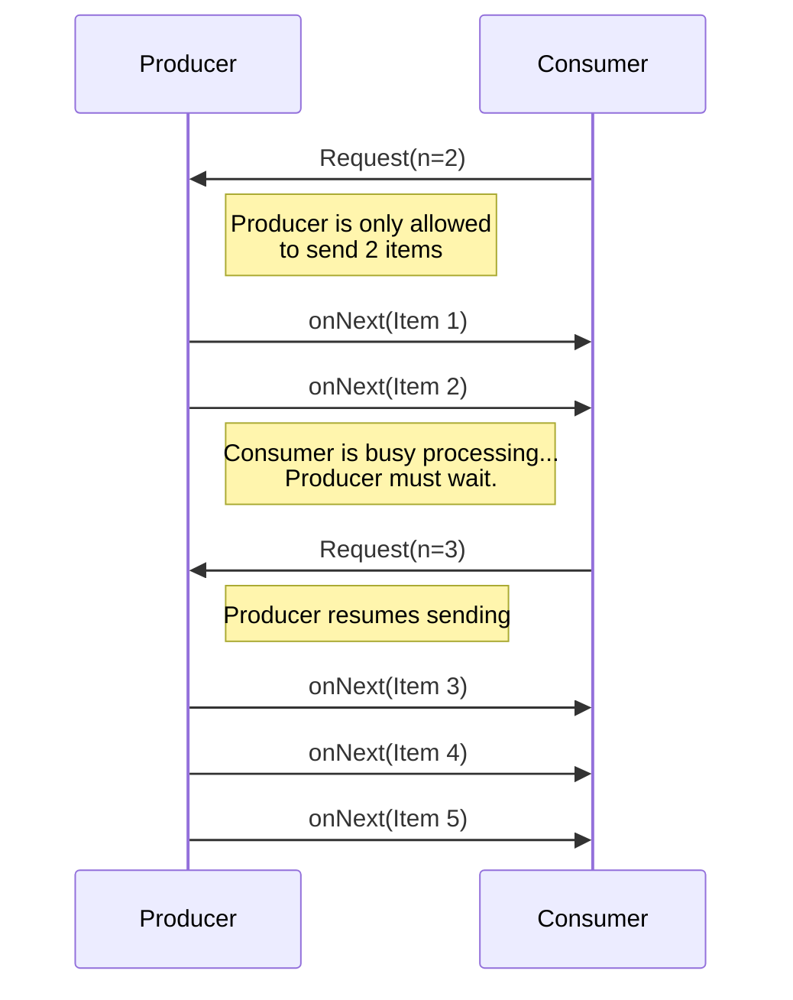

# 🛡️ Resilience & Fault Tolerance Patterns

Resilience is the ability of a system to handle and recover from failures. Fault tolerance is the property that enables a system to continue operating properly in the event of the failure of some of its components.

---

## 🗺️ Table of Contents
1. [Circuit Breaker](#1-circuit-breaker)
2. [Bulkhead Pattern](#2-bulkhead-pattern)
3. [Retry Pattern](#3-retry-pattern)
4. [Timeout Pattern](#4-timeout-pattern)
5. [Rate Limiting & Throttling](#5-rate-limiting--throttling)
6. [Fallback Pattern](#6-fallback-pattern)
7. [Backpressure Pattern](#7-backpressure-pattern)

---

## 1. Circuit Breaker
Prevents a system from repeatedly trying to execute an operation that's likely to fail.
- **Closed**: Requests flow normally.
- **Open**: Requests fail immediately without calling the service.
- **Half-Open**: A limited number of test requests are allowed to check if the service has recovered.

> [!TIP]
> [Read the full guide on Circuit Breaker Patterns](../infrastructure-ops/circuit-breaker-patterns.md)

---

## 2. Bulkhead Pattern
Isolates elements of an application into pools so that if one fails, the others will continue to function. Named after the sectioned partitions of a ship's hull.
- **Benefit**: Prevents a failure in one component from consuming all system resources (like thread pools) and causing a total system failure.

---

## 3. Retry Pattern
Enables an application to handle transient failures by transparently retrying a failed operation. This is only safe for **idempotent operations**.

### Backoff Strategies
1. **Immediate Retry**: Retry immediately. Best for very brief glitches.
2. **Fixed Delay**: Wait a set amount of time between each retry (e.g., 2 seconds).
3. **Exponential Backoff**: Increase the wait time exponentially after each failure (e.g., 1s, 2s, 4s, 8s). This helps avoid overwhelming a struggling service.

### Jitter (Adding Randomness)
Jitter adds a random amount of time to the backoff interval.
- **Why?**: Without jitter, multiple clients failing at the same time will all retry at exactly the same moment, causing a "Thundering Herd" effect that can crash the service again.
- **Goal**: Spread the retries over a time window to smooth out the load.

### Best Practices
- **Maximum Retries**: Always define a limit to avoid infinite loops.
- **Idempotency**: Only retry operations that can safely be repeated (e.g., `GET`, `PUT`, `DELETE`).
- **Logging**: Track retries to identify persistent issues.

---

## 4. Timeout Pattern
Sets a maximum time limit for a request to complete. If the limit is reached, the request is aborted.
- **Benefit**: Prevents requests from hanging indefinitely and tying up resources.

---

## 5. Rate Limiting & Throttling
Controls the rate of traffic sent by a client or received by a service to protect the system from being overwhelmed.
> [!TIP]
> [Read the full guide on Rate Limiting Algorithms](./rate-limiting.md)

---

## 6. Fallback Pattern
Defines an alternative path or response to take when a service call fails.
- **Example**: If a recommendation service is down, the application returns a static list of popular items instead of an error.

---

## 7. Backpressure Pattern
A mechanism that allows a system receiving data to push back and signal the sender to slow down when the receiver is overwhelmed. This is a crucial resilience pattern in asynchronous and reactive microservices.

### Why use Backpressure?
- **Prevents Out-of-Memory (OOM) Errors**: If a fast producer sends data faster than a slow consumer can process it, queues fill up and crash the consumer.
- **Improves System Stability**: It ensures systems fail gracefully instead of catastrophically under extreme load.

### Implementation Strategies
1. **Dropping Data**: The consumer drops new requests or messages when overwhelmed (e.g., shedding load).
2. **Buffering**: Temporarily store spikes in traffic in a bounded queue (can only absorb short bursts).
3. **Reactive Pull (Push-Pull)**: The consumer explicitly requests a specific number of items from the producer only when it has the capacity to process them (e.g., Reactive Streams, gRPC).

### Backpressure (Reactive Pull) Diagram

---

## ⚖️ Summary of Resilience Strategies

| Pattern | Purpose |
| :--- | :--- |
| **Circuit Breaker** | Prevent cascading failures. |
| **Bulkhead** | Isolate failures to specific components. |
| **Retry** | Handle temporary, transient failures. |
| **Timeout** | Release resources from stuck requests. |
| **Rate Limiting** | Protect system from being overwhelmed. |
| **Fallback** | Provide a "graceful degradation" experience. |
| **Backpressure** | Signal producers to slow down to avoid overwhelming consumers. |
