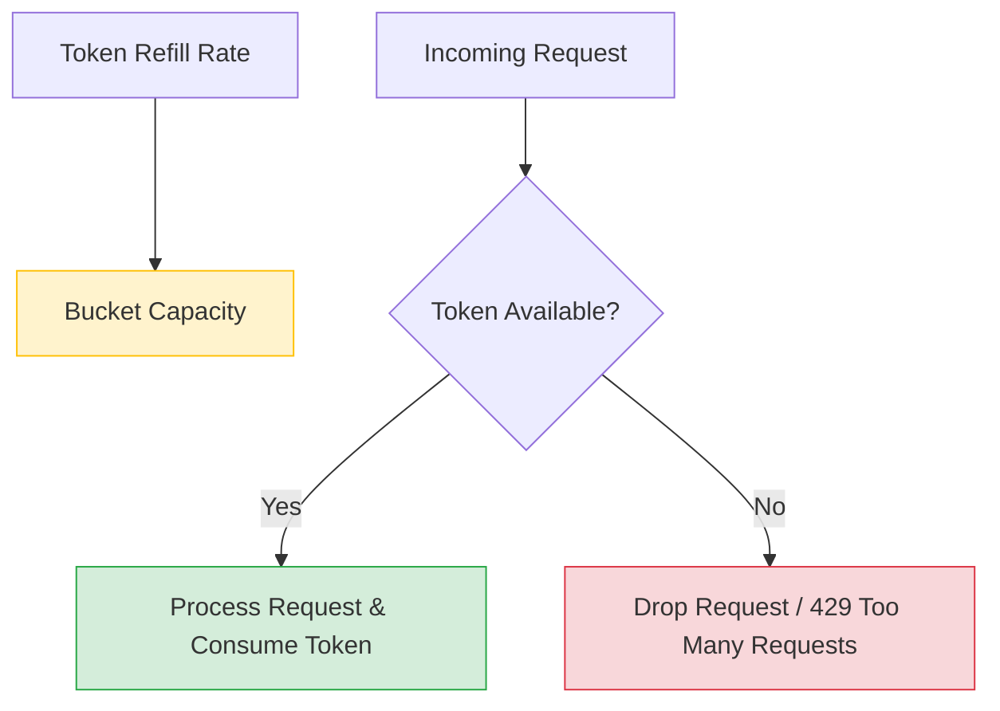

# ⏱️ Rate Limiting Algorithms

Rate limiting is a strategy for limiting network traffic. It puts a cap on how often someone can repeat an action within a certain timeframe – for instance, trying to log in to an account.

---

## 🗺️ Table of Contents
1. [Fixed Window Counter](#1-fixed-window-counter)
2. [Sliding Window Counter](#2-sliding-window-counter)
3. [Sliding Window Log](#3-sliding-window-log)
4. [Token Bucket](#4-token-bucket)
5. [Leaky Bucket](#5-leaky-bucket)

---

## 1. Fixed Window Counter
Divides time into fixed intervals (e.g., 1 minute) and keeps a counter for each window.
- **Pros**: Simple and memory-efficient.
- **Cons**: Traffic spikes at the edges of windows can allow double the rate (the "boundary problem").

---

## 2. Sliding Window Counter
A hybrid approach that combines the fixed window counter and the sliding window log. It calculates the rate based on the current window and the weighted percentage of the previous window.
- **Pros**: Smoother than fixed window, less memory than sliding window log.

---

## 3. Sliding Window Log
Tracks a timestamp for every single request. When a new request comes in, it removes all timestamps outside the current window and checks the log size.
- **Pros**: Very accurate.
- **Cons**: High memory usage as it stores every request timestamp.

---

## 4. Token Bucket
A "bucket" holds a certain number of tokens. Each request consumes one token. Tokens are added back to the bucket at a fixed rate. If the bucket is empty, requests are rejected.
- **Pros**: Allows for **bursts** of traffic while maintaining a steady average rate.
- **Cons**: Can be complex to tune the bucket size and refill rate.

---

## 5. Leaky Bucket
Similar to a bucket with a small hole at the bottom. Requests enter the bucket at any rate but "leak" out (are processed) at a constant, fixed rate.
- **Pros**: Ensures a **smooth and constant** output rate, regardless of input bursts.
- **Cons**: Bursty traffic can fill the bucket quickly, leading to dropped requests.

---

## ⚖️ Algorithm Comparison

| Algorithm | Allows Bursts | Smoothness | Memory Usage |
| :--- | :--- | :--- | :--- |
| **Fixed Window** | No | Low | ⚡ Very Low |
| **Sliding Window Counter** | No | Medium | ⚡ Very Low |
| **Sliding Window Log** | No | High | 🐢 High |
| **Token Bucket** | ✅ Yes | Medium | ⚡ Low |
| **Leaky Bucket** | No | ✅ High | ⚡ Low |

---

## 📊 Token Bucket Visualization

