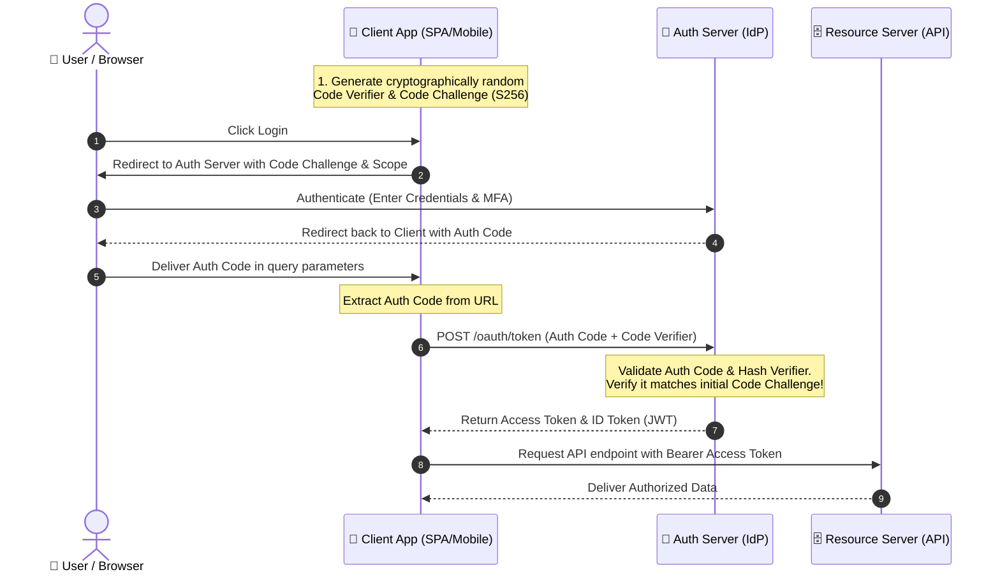
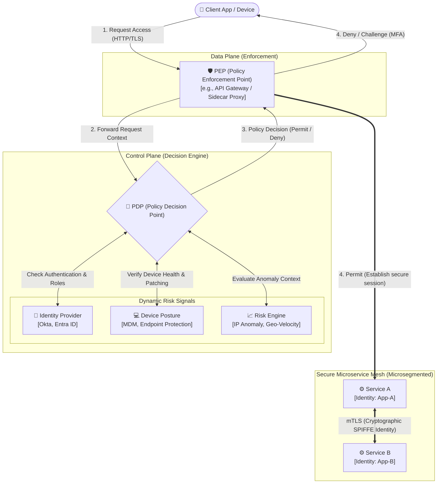

# 🔒 Security Patterns

Security must be a first-class citizen in software architecture, integrated from day one rather than treated as a peripheral layer. A secure system relies on rigorous identity verification, robust token management, and defensive architectural principles.

---

## 🗺️ Table of Contents
1. [Authentication vs Authorization](#1-authentication-vs-authorization)
2. [OAuth2 and OpenID Connect](#2-oauth2-and-openid-connect)
   - [OAuth2 Grant Types Comparison](#oauth2-grant-types-comparison)
   - [Authorization Code Flow with PKCE](#authorization-code-flow-with-pkce)
   - [OIDC: The Identity Layer](#oidc-the-identity-layer)
3. [JWT (JSON Web Tokens) Best Practices](#3-jwt-json-web-tokens-best-practices)
   - [JWT Anatomy](#jwt-anatomy)
   - [Signing vs Encryption (JWS vs JWE)](#signing-vs-encryption-jws-vs-jwe)
   - [Token Storage: Cookies vs LocalStorage](#token-storage-cookies-vs-localstorage)
   - [Lifecycle, Revocation, and Refresh Token Rotation (RTR)](#lifecycle-revocation-and-refresh-token-rotation-rtr)
4. [Zero Trust Architecture](#4-zero-trust-architecture)
   - [Core Principles](#core-principles)
   - [PDP vs PEP Architectural Components](#pdp-vs-pep-architectural-components)
   - [mTLS & Microsegmentation](#mtls--microsegmentation)
   - [Zero Trust Access Flow](#zero-trust-access-flow)
5. [OWASP Top 10](#5-owasp-top-10)

---

## 1. Authentication vs Authorization

The distinction between verification of identity and validation of permissions is fundamental to all secure architectures:

- **Authentication (AuthN - *Identity*)**: Answers the question **"Who are you?"** It verifies that a user or system is who they claim to be. Examples include:
  - Username and password credentials.
  - Multi-Factor Authentication (MFA) via TOTP, SMS, or FIDO2/WebAuthn.
  - Federated logins (SAML 2.0, OpenID Connect).
- **Authorization (AuthZ - *Permissions*)**: Answers the question **"What are you allowed to do?"** It determines if an authenticated entity has the rights to perform a specific action on a resource. Implementation strategies include:
  - **RBAC (Role-Based Access Control)**: Permissions mapped to static roles (e.g., `ROLE_ADMIN`, `ROLE_USER`).
  - **ABAC (Attribute-Based Access Control)**: Fine-grained permissions evaluated dynamically based on attributes (e.g., *Allow user X to read resource Y if user department is HR and time is between 9 AM and 5 PM*).

---

## 2. OAuth2 and OpenID Connect

**OAuth 2.0** is an industry-standard delegation framework that allows a third-party application (the Client) to obtain limited access to a HTTP service (the Resource Server) on behalf of a resource owner. **OpenID Connect (OIDC)** is an identity layer built on top of OAuth 2.0 to provide authentication.

### OAuth2 Grant Types Comparison

Selecting the correct OAuth2 flow is critical. Modern specifications explicitly deprecate legacy, insecure flows in favor of highly secure, authorization-code-based flows.

| Grant Type / Flow | Target Client Type | Security Profile | Modern Status | Use Case |
| :--- | :--- | :--- | :--- | :--- |
| **Authorization Code with PKCE** | SPAs (React, Vue), Mobile Apps, Server-side Apps | 🟢 High (Mitigates interception attacks) | **Recommended (Gold Standard)** | All client-side, mobile, and server-side web applications accessing APIs. |
| **Client Credentials** | Server-to-Server (M2M) | 🟢 High (Uses secure client secrets) | **Recommended** | Backend cron jobs, microservices syncing data, or background daemons. |
| **Authorization Code (Standard)** | Traditional Web Apps (Secure Backend) | 🟡 Medium-High (Requires secure client secret storage) | **Approved** | Backend-rendered applications (Next.js, Spring Boot MVC) with secure server environments. |
| **Implicit Flow** | SPAs (Legacy) | 🔴 Low (Tokens leaked in browser history / URLs) | **DEPRECATED** | Legacy frontends. *Do not use in modern architectures.* |
| **Resource Owner Password Credentials** | Trust-owned clients | 🔴 Low (Forces clients to handle raw user passwords) | **DEPRECATED** | Legacy migrative scenarios. *Do not use in modern architectures.* |

---

### Authorization Code Flow with PKCE

**PKCE (Proof Key for Code Exchange, pronounced "pixie")** was designed to secure Single Page Applications and Mobile apps where a client secret cannot be kept confidential. It replaces static secrets with dynamically generated cryptographic proofs.

#### The PKCE Mechanics:
1. **Code Verifier**: The client generates a high-entropy cryptographically random string ($V$).
2. **Code Challenge**: The client hashes the verifier using SHA-256 and Base64URL encodes it ($C = \text{Base64URL}(\text{SHA256}(V))$).
3. **Authorization Request**: The client redirects the user to the Authorization Server, sending the `code_challenge` ($C$) and `code_challenge_method=S256`.
4. **Authorization Code**: The server logs the user in, stores the challenge, and redirects back to the client with an ephemeral `code` (auth code).
5. **Token Exchange**: The client sends the ephemeral `code` and the original plain `code_verifier` ($V$) to the server's token endpoint.
6. **Verification**: The server hashes $V$ using the same S256 method. If the result matches the stored challenge ($C$), it issues the tokens (`access_token`, `refresh_token`, `id_token`). This prevents an attacker who intercepted the auth code from exchanging it because they lack the `code_verifier`.



---

### OIDC: The Identity Layer

OAuth 2.0 is designed purely for **authorization** (delivering an access token that acts like a valet key). It does not tell the application *who* the user is. 

**OpenID Connect (OIDC)** extends OAuth 2.0 by introducing the concept of an **Identity Token (ID Token)**:

- **ID Token (`id_token`)**: A JWT containing structured claims about the identity of the authenticated user (e.g., `sub` (unique user ID), `name`, `email`, `auth_time`). It is intended to be parsed and consumed by the *Client Application* to establish user sessions.
- **Access Token (`access_token`)**: An opaque or structured token intended for the *Resource Server (API)* to authorize API requests. The client application should treat it as opaque and not parse it.
- **UserInfo Endpoint**: A standardized endpoint (`/userinfo`) on the Identity Provider where clients can send the `access_token` to fetch additional profile information.

---

## 3. JWT (JSON Web Tokens) Best Practices

JSON Web Tokens (JWT) are an open standard (RFC 7519) that defines a compact, self-contained way for securely transmitting information between parties.

### JWT Anatomy

A standard JWT consists of three parts separated by dots (`.`):

$$\underbrace{\text{eyJhbGciOiJIUzI1NiIsInR5cCI6IkpXVCJ9}}_{\text{Header}}.\underbrace{\text{eyJzdWIiOiIxMjM0NTY3ODkwIiwibmFtZSI6IkpvaG4gRG9lIiwiYWRtaW4iOnRydWV9}}_{\text{Payload}}.\underbrace{\text{TJVA95OrM7E2cBab30RMHrHDcEfxjoYZgeFONFh7HgQ}}_{\text{Signature}}$$

1. **Header**: Contains the metadata, primarily the token type (`JWT`) and the signing algorithm (e.g., `RS256`, `HS256`).
2. **Payload**: Contains the claims—statements about the user and additional metadata (e.g., standard claims like `iss`, `sub`, `exp`, `aud`).
3. **Signature**: Cryptographic proof generated by signing the base64url-encoded Header and Payload using a secret or a private key.

---

### Signing vs Encryption (JWS vs JWE)

Architects must understand that a standard signed JWT (**JWS - JSON Web Signature**) is **not encrypted**. The payload is merely Base64URL-encoded and is fully readable by anyone who obtains the token.

- **JWS (Signed Tokens)**:
  - **Symmetric (`HS256`)**: Signed and verified using a shared secret key. *Risk*: Every service that needs to verify the token must have the secret. If one microservice is compromised, an attacker can forge tokens for the entire ecosystem.
  - **Asymmetric (`RS256` or `ES256`)**: Signed with a private key (held exclusively by the Identity Provider) and verified using a public key (distributed to all microservices via a JWKS - JSON Web Key Set endpoint). *Best Practice*: Highly recommended for decoupled microservice architectures.
- **JWE (Encrypted Tokens)**:
  - Encrypts the payload so it is unreadable to anyone except the intended recipient who holds the decryption key. Used when tokens must carry sensitive, confidential data (e.g., PII or internal system attributes) directly in the client session.

---

### Token Storage: Cookies vs LocalStorage

How and where access/refresh tokens are stored in client applications represents a critical security battleground:

| Storage Type | Mechanism | XSS Vulnerability | CSRF Vulnerability | Architectural Verdict / Best Practice |
| :--- | :--- | :--- | :--- | :--- |
| **LocalStorage / SessionStorage** | Simple JS API (`localStorage.setItem()`) | 🔴 **High**: Any malicious script injected into the application can access and exfiltrate all tokens. | 🟢 **None**: Browsers do not automatically attach local storage keys to cross-origin HTTP requests. | **Highly Discouraged**: Vulnerable to token theft via third-party scripts or NPM package dependencies (supply-chain XSS). |
| **Secure Cookies** | Server-set HTTP Header (`Set-Cookie`) with **`HttpOnly`**, **`Secure`**, and **`SameSite`** flags. | 🟢 **None**: The browser forbids JavaScript from reading the cookie, making token theft via XSS impossible. | 🟡 **Medium**: Vulnerable to Cross-Site Request Forgery (CSRF) unless mitigation is configured. | **Recommended (Gold Standard)**: Protects critical tokens. CSRF is mitigated easily using modern `SameSite=Strict` (or `SameSite=Lax`) combined with anti-CSRF headers or double-submit cookies. |

---

### Claims Verification Checklist

To prevent token spoofing, replay attacks, or scope escalation, resource servers **must** run these dynamic verifications on every incoming token *before* executing business logic:

- [ ] **Signature Verification**: Validate the cryptographic signature against the active public keys (JWKS).
- [ ] **Expiration (`exp`)**: Ensure the current system time is strictly before the time designated in the `exp` claim.
- [ ] **Not Before (`nbf`)**: Ensure the current system time is strictly after the time designated in the `nbf` claim.
- [ ] **Issuer (`iss`)**: Verify the token's issuer matches the exact URL of your trusted Identity Provider.
- [ ] **Audience (`aud`)**: Confirm that the target audience claim matches your specific API's identifier (prevents token reuse on other APIs).
- [ ] **Subject (`sub`)**: Ensure the subject identifier is present and not empty.

---

### Lifecycle, Revocation, and Refresh Token Rotation (RTR)

Because JWTs are stateless, they cannot be easily revoked before their expiration time without introducing a database query—which defeats the purpose of stateless tokens. To build a highly resilient session model:

#### 1. Token Lifespan Strategy
- **Access Tokens**: Short-lived (e.g., 5 to 15 minutes) to minimize the window of opportunity if a token is leaked.
- **Refresh Tokens**: Long-lived (e.g., 7 to 30 days) and stored securely (e.g., in a strict, path-restricted `HttpOnly` cookie). Used solely to request new access tokens when they expire.

#### 2. Refresh Token Rotation (RTR)
To prevent replay attacks and detect stolen refresh tokens in untrusted environments (like browsers), implement **Refresh Token Rotation**:
1. Every time a client sends a refresh token ($RT_1$) to get a new access token, the Authorization Server invalidates $RT_1$ and issues both a new access token ($AT_2$) and a *new refresh token* ($RT_2$).
2. The Authorization Server maintains a record of token families (grouping refresh tokens created from an initial authentication).
3. **Breach Detection**: If an attacker steals $RT_1$ and attempts to replay it after the legitimate client has already exchanged it for $RT_2$, the server detects that an invalidated refresh token is being reused.
4. **Immediate Revocation**: The server immediately revokes the **entire family** of tokens. The active session is killed, forcing both the legitimate user and the attacker to re-authenticate.

```
Legitimate Flow:
[ Client ] ──(Sends RT-1)──> [ Auth Server ] ──(Issues RT-2 + AT-2 & Invalidates RT-1)──> [ Client ]

Breach/Attack Flow (Replaying RT-1):
[ Attacker ] ──(Sends RT-1)──> [ Auth Server ] ──(Detects RT-1 Reuse!) ──> [ Revokes RT-2 and ALL Family Tokens! ]
```

---

## 4. Zero Trust Architecture

Traditional network security relies on a **"castle-and-moat"** strategy, where everything inside the internal network perimeter is trusted by default. **Zero Trust Architecture (ZTA)** eliminates this perimeter trust, operating under the baseline assumption that the network is hostile and threats exist everywhere.

### Core Principles

Zero Trust is defined by three fundamental guiding principles:

1. **Verify Explicitly**: Always authenticate and authorize based on all available data points, including user identity, geographic location, device health and posture, service/workload identity, and anomaly detection signals.
2. **Use Least Privilege Access**: Restrict access using **Just-In-Time (JIT)** and **Just-Enough-Access (JEA)** protocols, adaptive risk-based policies, and data protection schemes to limit data exposure and access.
3. **Assume Breach**: Minimize the blast radius by dividing the network and infrastructure into microsegments. Encrypt all sessions end-to-end, employ continuous diagnostics, and leverage real-time analytics to improve threat visibility and response.

---

### PDP vs PEP Architectural Components

A robust Zero Trust system separates the system that decides access (the control plane) from the gateway that enforces those decisions (the data plane):

- **Policy Decision Point (PDP)**: The brains of the Zero Trust system. It is a centralized service that ingests real-time signals (user credentials, MFA verification, device security health, location data, historical request patterns) and evaluates them against declarative access policies. It decides whether to grant, deny, or limit access.
- **Policy Enforcement Point (PEP)**: The gatekeeper. A decentralized layer (e.g., an API Gateway, an Identity-Aware Proxy, or a Service Mesh sidecar proxy) that intercepts, inspects, and terminates connections. The PEP calls the PDP for a policy decision and strictly enforces the outcome.

---

### mTLS & Microsegmentation

To prevent lateral movement inside a network if one service is compromised, architects utilize **Microsegmentation** combined with **Mutual TLS (mTLS)**:

- **mTLS (Mutual TLS)**: Unlike standard TLS where only the server proves its identity to the client, mTLS requires *both* the client and server to present and verify cryptographic X.509 certificates. This establishes a highly secure, encrypted channel where both sides are verified.
- **Cryptographic Workload Identity**: Services are assigned cryptographic identities (e.g., utilizing **SPIFFE/SPIRE** standard). Certificates are ephemeral and rotated automatically (e.g., every few hours) by local agents, completely eliminating the need for hardcoded, static database credentials or API keys.
- **Microsegmentation**: By combining mTLS with application layer policies (such as Istio Authorization Policies), you can enforce strict, granular network boundaries. For instance, you can state: *Service B can receive POST requests from Service A, but all traffic from Service C must be blocked.*

---

### Zero Trust Access Flow

The following diagram illustrates a Zero Trust request evaluation flow, where the PEP intercepts a client request and queries the PDP, which dynamically aggregates multiple security factors before allowing mTLS access to the backend microservice mesh.



---

## 5. OWASP Top 10

The Open Web Application Security Project (OWASP) Top 10 lists the most critical security risks facing web applications. Architects must understand these risks and integrate countermeasures (such as input validation, parameterized queries, and robust access controls) directly into their designs:

1. **Broken Access Control**: Failure to enforce authorization rules, allowing users to access resources outside their intended permissions.
2. **Cryptographic Failures**: Vulnerabilities relating to cryptography, leading to sensitive data exposure (e.g., storing passwords in plain text or using outdated hashing algorithms).
3. **Injection**: SQL, NoSQL, OS, or LDAP injection where untrusted data is sent to an interpreter as part of a command or query.
4. **Insecure Design**: Architectural flaws that cannot be fixed by implementation alone (requires "secure by design" practices).
5. **Security Misconfiguration**: Improperly configured servers, default passwords, or overly detailed error messages exposing system details.
6. **Vulnerable and Outdated Components**: Utilizing libraries or components that have known, unpatched vulnerabilities.
7. **Identification and Authentication Failures**: Weak password requirements, missing multi-factor authentication, or improper session timeout configurations.
8. **Software and Data Integrity Failures**: Code or infrastructure updates implemented without verifying integrity (e.g., untrusted CI/CD pipelines or deserializing untrusted data).
9. **Security Logging and Monitoring Failures**: Inadequate logging and monitoring, which prevents security teams from detecting or responding to active breaches.
10. **Server-Side Request Forgery (SSRF)**: Vulnerabilities where a web application fetches a remote resource without validating the user-supplied URI, allowing attackers to access internal-only services.
