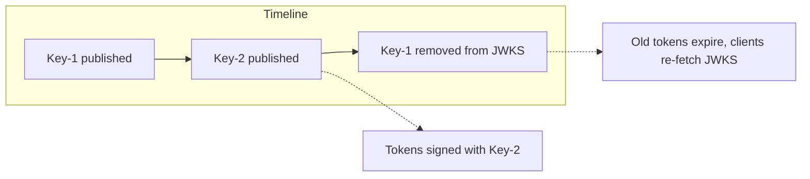
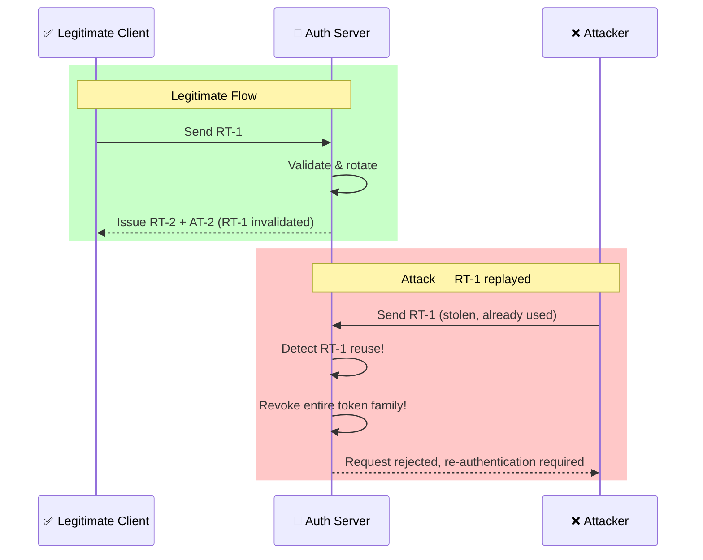

# JWT Best Practices

JSON Web Tokens (JWT) are an open standard (RFC 7519) that defines a compact, self-contained way for securely transmitting information between parties.

---

## JWT Anatomy

A standard JWT consists of three parts separated by dots (`.`):

$$\underbrace{\text{eyJhbGciOiJIUzI1NiIsInR5cCI6IkpXVCJ9}}_{\text{Header}}.\underbrace{\text{eyJzdWIiOiIxMjM0NTY3ODkwIiwibmFtZSI6IkpvaG4gRG9lIiwiYWRtaW4iOnRydWV9}}_{\text{Payload}}.\underbrace{\text{TJVA95OrM7E2cBab30RMHrHDcEfxjoYZgeFONFh7HgQ}}_{\text{Signature}}$$

1. **Header**: Contains the metadata, primarily the token type (`JWT`) and the signing algorithm (e.g., `RS256`, `HS256`).
2. **Payload**: Contains the claims — statements about the user and additional metadata (e.g., standard claims like `iss`, `sub`, `exp`, `aud`).
3. **Signature**: Cryptographic proof generated by signing the base64url-encoded Header and Payload using a secret or a private key.

---

## Signing vs Encryption (JWS vs JWE)

Architects must understand that a standard signed JWT (**JWS — JSON Web Signature**) is **not encrypted**. The payload is merely Base64URL-encoded and is fully readable by anyone who obtains the token.

### JWS (Signed Tokens)

| Algorithm | Type | Key Management | Best For |
|---|---|---|---|
| `HS256` | Symmetric | Shared secret | Not recommended — every verifier holds the signing key |
| `RS256` | Asymmetric | RSA key pair | General purpose — widely supported |
| `ES256` / `ES384` | Asymmetric | ECDSA key pair | Compact keys, high security — recommended for modern apps |
| `EdDSA` | Asymmetric | Ed25519 key pair | Fastest asymmetric option — used in passkeys |

**Best Practice**: Prefer asymmetric algorithms (`RS256`, `ES256`) over symmetric (`HS256`). With symmetric signatures, every microservice that verifies tokens must hold the shared secret — if one service is compromised, the attacker can forge tokens for the entire ecosystem.

### JWE (Encrypted Tokens)

Encrypts the payload so it is unreadable to anyone except the intended recipient who holds the decryption key. Used when tokens must carry sensitive, confidential data (e.g., PII or internal system attributes) directly in the client session.

JWE uses a two-layer approach:
- **Content Encryption Key (CEK)**: A random symmetric key used to encrypt the payload
- **Key Encryption**: The CEK is encrypted using the recipient's public key (RSA or ECDH)

---

## Token Storage: Cookies vs LocalStorage

| Storage Type | Mechanism | XSS Vulnerability | CSRF Vulnerability | Verdict |
|---|---|---|---|---|
| **LocalStorage / SessionStorage** | `localStorage.setItem()` | 🔴 **High**: Any XSS can exfiltrate all tokens | 🟢 None | **Highly Discouraged** |
| **Secure Cookies** | `Set-Cookie` with `HttpOnly`, `Secure`, `SameSite` | 🟢 None (JS cannot read) | 🟡 Medium (mitigated by `SameSite=Strict` + CSRF tokens) | **Gold Standard** |

Modern guidance: Use `SameSite=Strict` (or `Lax`) cookies for refresh tokens. Access tokens can be short-lived (5-15 min) in memory.

---

## Claims Verification Checklist

Resource Servers **must** run these verifications on every incoming token before executing business logic:

- [ ] **Signature Verification**: Validate the cryptographic signature against the active public keys (JWKS).
- [ ] **Expiration (`exp`)**: Current time must be strictly before `exp`.
- [ ] **Not Before (`nbf`)**: Current time must be strictly after `nbf`.
- [ ] **Issuer (`iss`)**: Must match the exact URL of your trusted Identity Provider.
- [ ] **Audience (`aud`)**: Must match your specific API's identifier — prevents token reuse across APIs.
- [ ] **Subject (`sub`)**: Must be present and not empty.
- [ ] **Authorized Party (`azp`)**: If present, must match the expected client ID (prevents token swapping).
- [ ] **Algorithm** (`alg` in header): Must be in an allowlist — reject `none` algorithm and unexpected algorithms.

---

## JWKS Key Rotation

The Identity Provider should rotate signing keys periodically to limit the impact of key compromise.

### Rotation Strategy

1. **Grace period overlap**: Publish the new key alongside the current key in the JWKS endpoint
2. **Dual-key window**: Tokens signed with the old key remain valid for a configurable period (e.g., until `exp`)
3. **Retire old key**: Remove the old key from JWKS once all tokens signed with it have expired
4. **Cache-aware clients**: Clients should cache JWKS with TTL and re-fetch on signature validation failure



### Automated Rotation

- Rotate keys monthly or quarterly
- Use short-lived keys with automated rotation (e.g., via HashiCorp Vault or cloud KMS)
- Monitor JWKS fetch failures as an alerting metric

---

## Algorithm Confusion Attack

A critical vulnerability where the attacker changes the `alg` header in a JWT from `RS256` (asymmetric) to `HS256` (symmetric), causing the verifier to use the public key (which is often accessible via JWKS) as the HMAC secret.

### Prevention

```java
// BAD — accepts algorithm from the token header
JWT.parser().setSigningKey(publicKey).parse(token);

// GOOD — explicitly enforce the expected algorithm
JWT.parser()
  .setSigningKey(publicKey)
  .requireAlgorithm("RS256")  // Reject 'none', 'HS256', etc.
  .parse(token);
```

- Always specify an `alg` allowlist in your JWT library
- Never use the token's `alg` header to decide verification logic
- Reject `alg: none` tokens immediately

---

## Token Lifecycle

| Token | Typical Lifespan | Storage | Purpose |
|---|---|---|---|
| **Access Token** | 5-15 minutes | Memory (in-app variable) | Authorize API requests |
| **Refresh Token** | 7-30 days | HttpOnly cookie (path-restricted) | Obtain new access tokens |
| **ID Token** | Hours (single session) | Memory | Establish user session |

### Refresh Token Rotation (RTR)

To prevent replay attacks and detect stolen refresh tokens:

1. Every time a client sends a refresh token ($RT_1$) to get a new access token, the Authorization Server invalidates $RT_1$ and issues both a new access token ($AT_2$) and a *new refresh token* ($RT_2$).
2. The server maintains token families (grouping refresh tokens from the same initial authentication).
3. If an attacker replays $RT_1$ after the legitimate client already exchanged it, the server detects reuse and revokes the **entire family** — forcing re-authentication.



---

[⬅️ Back to Security Patterns](./README.md)
