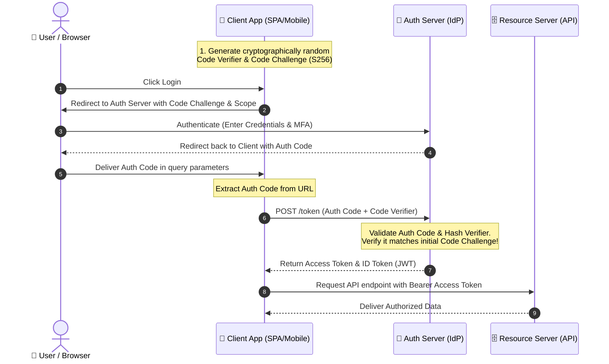

# OAuth 2.0

OAuth 2.0 is an industry-standard delegation framework that allows a third-party application (the Client) to obtain limited access to an HTTP service (the Resource Server) on behalf of a resource owner.

---

## Grant Types Comparison

Selecting the correct OAuth2 flow is critical. Modern specifications explicitly deprecate legacy, insecure flows in favor of highly secure, authorization-code-based flows.

| Grant Type / Flow | Target Client Type | Security Profile | Modern Status | Use Case |
| :--- | :--- | :--- | :--- | :--- |
| **Authorization Code with PKCE** | SPAs (React, Vue), Mobile Apps, Server-side Apps | 🟢 High (Mitigates interception attacks) | **Recommended (Gold Standard)** | All client-side, mobile, and server-side web applications accessing APIs. |
| **Client Credentials** | Server-to-Server (M2M) | 🟢 High (Uses secure client secrets) | **Recommended** | Backend cron jobs, microservices syncing data, or background daemons. |
| **Authorization Code (Standard)** | Traditional Web Apps (Secure Backend) | 🟡 Medium-High (Requires secure client secret storage) | **Approved** | Backend-rendered applications (Next.js, Spring Boot MVC) with secure server environments. |
| **Implicit Flow** | SPAs (Legacy) | 🔴 Low (Tokens leaked in browser history / URLs) | **DEPRECATED** | Legacy frontends. *Do not use in modern architectures.* |
| **Resource Owner Password Credentials** | Trust-owned clients | 🔴 Low (Forces clients to handle raw user passwords) | **DEPRECATED** | Legacy migrative scenarios. *Do not use in modern architectures.* |
| **Device Authorization Grant** | Input-constrained devices | 🟢 High (User authorizes on separate device) | **Recommended** | Smart TVs, CLI tools, IoT devices. |

---

## Authorization Code Flow with PKCE

**PKCE (Proof Key for Code Exchange, pronounced "pixie")** was designed to secure Single Page Applications and Mobile apps where a client secret cannot be kept confidential.

### The PKCE Mechanics

1. **Code Verifier**: The client generates a high-entropy cryptographically random string ($V$).
2. **Code Challenge**: The client hashes the verifier using SHA-256 and Base64URL encodes it ($C = \text{Base64URL}(\text{SHA256}(V))$).
3. **Authorization Request**: The client redirects the user to the Authorization Server, sending the `code_challenge` ($C$) and `code_challenge_method=S256`.
4. **Authorization Code**: The server logs the user in, stores the challenge, and redirects back to the client with an ephemeral `code` (auth code).
5. **Token Exchange**: The client sends the ephemeral `code` and the original plain `code_verifier` ($V$) to the server's token endpoint.
6. **Verification**: The server hashes $V$ using the same S256 method. If the result matches the stored challenge ($C$), it issues the tokens (`access_token`, `refresh_token`, `id_token`).



---

## Client Credentials (M2M)

The simplest OAuth2 flow — used for server-to-server communication where no user is involved.

```
POST /token
grant_type=client_credentials
client_id=<id>
client_secret=<secret>
scope=<scopes>

Response: { access_token, token_type, expires_in }
```

### Client Authentication Methods

| Method | Security | Description |
|---|---|---|
| `client_secret_basic` | Medium | Send secret in HTTP Basic Auth header |
| `client_secret_post` | Medium | Send secret in request body |
| `client_secret_jwt` | High | Client creates a self-signed JWT assertion |
| `private_key_jwt` | Highest | Client signs a JWT with its private key; IdP verifies with registered public key |

### private_key_jwt Assertion

```json
{
  "iss": "client_id",
  "sub": "client_id",
  "aud": "https://idp.example.com/token",
  "jti": "unique-identifier",
  "exp": 1700000000,
  "iat": 1699999999
}
```

This assertion is signed with the client's private key and sent as the `client_assertion` parameter. Recommended for production M2M communication as it eliminates shared secrets.

---

## Device Authorization Grant (RFC 8628)

For devices without a browser or with limited input (smart TVs, CLI tools, IoT).

```
Client                 Auth Server                 User's Browser
  |                         |                           |
  |-- POST /device          |                           |
  |   device_code,          |                           |
  |   user_code,            |                           |
  |   verification_uri      |                           |
  |<------------------------|                           |
  |                         |                           |
  |-- (polling) POST /token |-- User visits URI         |
  |   device_code           |   enters user_code        |
  |                         |   authenticates           |
  |<-- access_token --------|                           |
```

The client polls the token endpoint until the user completes authorization or the code expires.

---

## Token Revocation (RFC 7009)

Clients can revoke tokens explicitly (e.g., on user logout).

```
POST /revoke
token=<access_token_or_refresh_token>
token_type_hint=access_token
client_id=<id>
client_secret=<secret>
```

The Authorization Server must respond with HTTP 200 regardless of whether the token was valid (to prevent enumeration).

---

## Token Introspection (RFC 7662)

Resource Servers can validate opaque tokens by calling the introspection endpoint.

```
POST /introspect
token=<opaque_token>
token_type_hint=access_token
client_id=<id>
client_secret=<secret>

Response:
{
  "active": true,
  "sub": "user123",
  "scope": "read write",
  "client_id": "my-client",
  "exp": 1700000000,
  "iss": "https://idp.example.com"
}
```

---

## Token Exchange (RFC 8693)

Exchange one token for another, enabling delegation and impersonation patterns.

```
POST /token
grant_type=urn:ietf:params:oauth:grant-type:token-exchange
subject_token=<current_token>
subject_token_type=urn:ietf:params:oauth:token-type:access_token
requested_token_type=urn:ietf:params:oauth:token-type:access_token
audience=https://api.downstream.example.com
scope=<downstream_scopes>
```

Used for:
- **Act-as**: A service acts on behalf of a user in a downstream service
- **Delegation**: Narrow a token's scope for a specific downstream operation
- **Impersonation**: Elevate privileges temporarily with audit trail

---

## DPoP (Demonstration of Proof-of-Possession, RFC 9449)

Binds an access token to a specific client's public key, making stolen tokens useless to attackers.

```
Client generates a key pair → sends public key (via JWK Thumbprint) in the auth request
→ Auth Server bakes the thumbprint into the access token ("cnf" claim)
→ Client signs each API request with a DPoP Proof JWT
→ Resource Server verifies the proof matches the token's bound key
```

- Prevents token replay across different clients
- No need for client secrets in SPAs
- Recommended as a replacement for bearer tokens in high-security contexts

---

## PAR (Pushed Authorization Requests, RFC 9126)

Moves the authorization request payload from the front channel (browser redirect) to the back channel (direct POST to the server). The browser only sends a short `request_uri`.

```
POST /par
client_id=<id>
redirect_uri=https://client.example/cb
scope=openid profile
code_challenge=<S256>

Response: { request_uri: "urn:ietf:params:oauth:request_uri:abc123" }

→ Then redirect browser to /authorize?request_uri=urn:ietf:params:oauth:request_uri:abc123
```

Benefits:
- Large authorization payloads don't fit in URLs
- Sensitive parameters are not exposed in the browser URL
- Prevents authorization request tampering

---

## Consent Management

The authorization server must present a consent screen to the resource owner before issuing tokens.

### Consent Strategies

| Strategy | Description | Best For |
|---|---|---|
| **Per-request consent** | User consents every time | High-security operations |
| **Remembered consent** | IdP stores consent decision per client+scope | Consumer apps |
| **Admin-consent** | Tenant admin pre-approves scopes for all users | Enterprise (B2B) |
| **Progressive consent** | Request minimal scopes first, ask for more later | Phased onboarding |

### Consent Screen Requirements

- Clear language (not legalese)
- List of requested scopes/explicit permissions
- Identity of the requesting client
- "Deny" must be as easy as "Accept"

---

[⬅️ Back to Security Patterns](./README.md)
