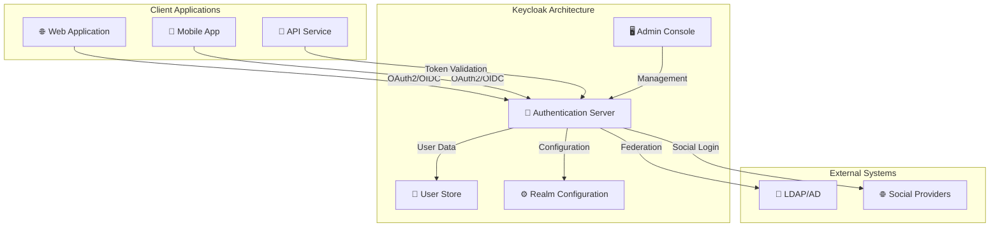
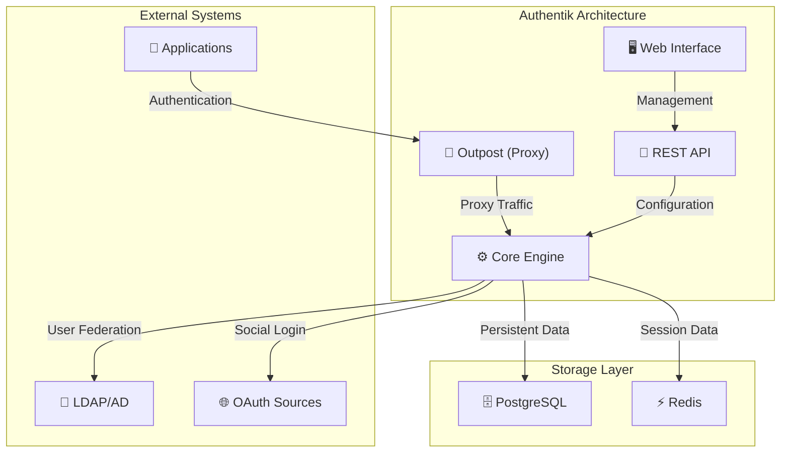
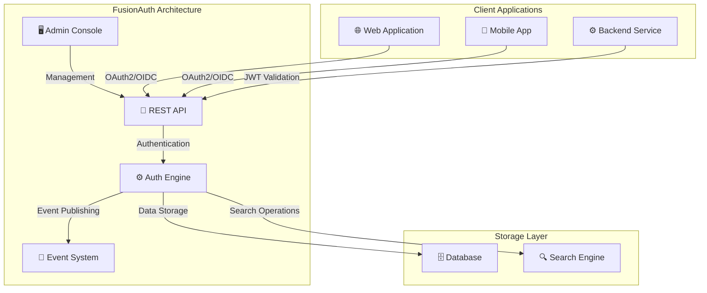
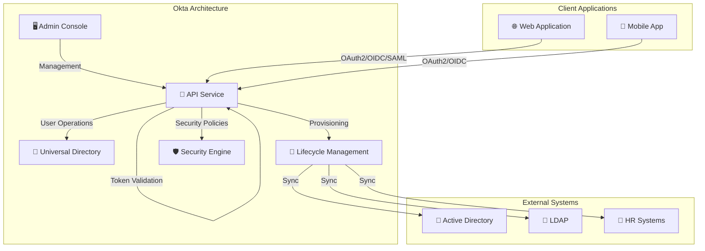

# Authentication Providers

Authentication providers (Identity Providers or IdPs) are centralized services that handle user authentication, identity management, and authorization. They implement OAuth2, OpenID Connect, and SAML protocols to provide secure authentication for applications.

---

## Keycloak

**Keycloak** is an open-source identity and access management solution focused on modern applications and services.

### Key Features
- **Open Source**: Free and open-source with active community support
- **Protocol Support**: OAuth2, OpenID Connect, SAML 2.0
- **Multi-Factor Authentication**: TOTP, WebAuthn, SMS, email
- **User Federation**: LDAP, Active Directory, Kerberos, social logins
- **Custom Themes**: Extensive theming and branding capabilities
- **Admin Console**: Rich web-based administration interface
- **REST API**: Comprehensive API for automation and integration
- **High Availability**: Cluster support for production deployments

### Architecture

### Documentation
- [Keycloak Documentation](https://www.keycloak.org/documentation)
- [Keycloak Server Administration Guide](https://www.keycloak.org/server/admin)
- [Keycloak Authentication Services Guide](https://www.keycloak.org/latest/securing_apps/index.html)

### Use Cases
- Enterprise applications requiring custom authentication flows
- Multi-tenant SaaS applications
- Applications needing extensive customization
- Organizations with existing LDAP/AD infrastructure

---

## Authentik

**Authentik** is an open-source identity provider focused on flexibility and modern authentication methods.

### Key Features
- **Open Source**: AGPL-licensed with community edition available
- **Modern UI**: Clean, responsive web interface
- **Protocol Support**: OAuth2, OpenID Connect, SAML 2.0
- **Authentication Methods**: Password, MFA, SSO, LDAP, OAuth sources
- **Application Integration**: Proxy provider for existing applications
- **Policy Engine**: Flexible policy-based access control
- **Audit Logging**: Comprehensive audit trail
- **Docker-First**: Easy deployment with Docker and Kubernetes

### Architecture

### Documentation
- [Authentik Documentation](https://docs.goauthentik.io/)
- [Authentik Provider Documentation](https://docs.goauthentik.io/docs/providers/)
- [Authentik Application Setup](https://docs.goauthentik.io/docs/providers/oauth2/)

### Use Cases
- Modern web applications requiring clean UI
- Organizations needing flexible authentication policies
- Applications requiring proxy-based authentication
- Development teams wanting easy deployment

---

## FusionAuth

**FusionAuth** provides enterprise-grade authentication and authorization features with both open-source and commercial editions.

### Key Features
- **Dual Licensing**: Community edition (open-source) and commercial edition
- **Protocol Support**: OAuth2, OpenID Connect, SAML 2.0, JWT
- **Multi-Factor Authentication**: TOTP, SMS, email, WebAuthn
- **User Management**: Comprehensive user profile and group management
- **Theme Customization**: Extensive branding and theming capabilities
- **API-First Design**: RESTful API for all operations
- **Event System**: Webhook-based event notifications
- **High Performance**: Optimized for high-traffic applications

### Architecture

### Documentation
- [FusionAuth Documentation](https://fusionauth.io/docs/v1/tech/)
- [FusionAuth OAuth Guide](https://fusionauth.io/docs/v1/tech/oauth/)
- [FusionAuth Application Configuration](https://fusionauth.io/docs/v1/tech/applications/)

### Use Cases
- Enterprise applications requiring advanced features
- Applications needing comprehensive event system
- Organizations requiring commercial support
- High-traffic applications requiring performance optimization

---

## Okta

**Okta** is a commercial identity and access management platform with extensive integration capabilities.

### Key Features
- **Commercial Platform**: Subscription-based with enterprise support
- **Protocol Support**: OAuth2, OpenID Connect, SAML 2.0, WS-Federation
- **Multi-Factor Authentication**: Comprehensive MFA options
- **Universal Directory**: Centralized user and group management
- **Lifecycle Management**: Automated user provisioning and deprovisioning
- **API Access Management**: Fine-grained API security
- **Adaptive MFA**: Risk-based authentication
- **Extensive Integrations**: Pre-built integrations with hundreds of applications
- **Advanced Security**: Threat detection, anomaly detection, behavioral analytics

### Architecture

### Documentation
- [Okta Documentation](https://developer.okta.com/docs/)
- [Okta OAuth 2.0 Guide](https://developer.okta.com/docs/guides/implement-oauth-for-okta/)
- [Okta Application Setup](https://developer.okta.com/docs/guides/add-oidc-app/)

### Use Cases
- Enterprise organizations requiring commercial support
- Applications needing extensive pre-built integrations
- Organizations with complex compliance requirements
- Applications requiring advanced security features

---

## Provider Comparison

| Feature | Keycloak | Authentik | FusionAuth | Okta |
|---|---|---|---|---|
| **License** | Open Source (Apache 2.0) | Open Source (AGPL) | Dual (Community/Commercial) | Commercial |
| **Cost** | Free | Free | Free/Commercial | Subscription |
| **Protocol Support** | OAuth2, OIDC, SAML | OAuth2, OIDC, SAML | OAuth2, OIDC, SAML, JWT | OAuth2, OIDC, SAML, WS-Fed |
| **MFA Support** | TOTP, WebAuthn, SMS | TOTP, WebAuthn, SMS | TOTP, SMS, Email, WebAuthn | Comprehensive MFA |
| **User Federation** | LDAP, AD, Kerberos | LDAP, AD, OAuth | LDAP, AD, SAML | LDAP, AD, HR Systems |
| **Customization** | Extensive | Moderate | Extensive | Limited |
| **API Quality** | Good | Good | Excellent | Excellent |
| **Enterprise Support** | Community | Community | Commercial Available | Enterprise |
| **Learning Curve** | Steep | Moderate | Moderate | Gentle |
| **Deployment** | Self-hosted | Self-hosted | Self-hosted/Cloud | Cloud |
| **Best For** | Custom enterprise apps | Modern web apps | High-performance apps | Enterprise organizations |

---

[⬅️ Back to Security Patterns](./README.md)
