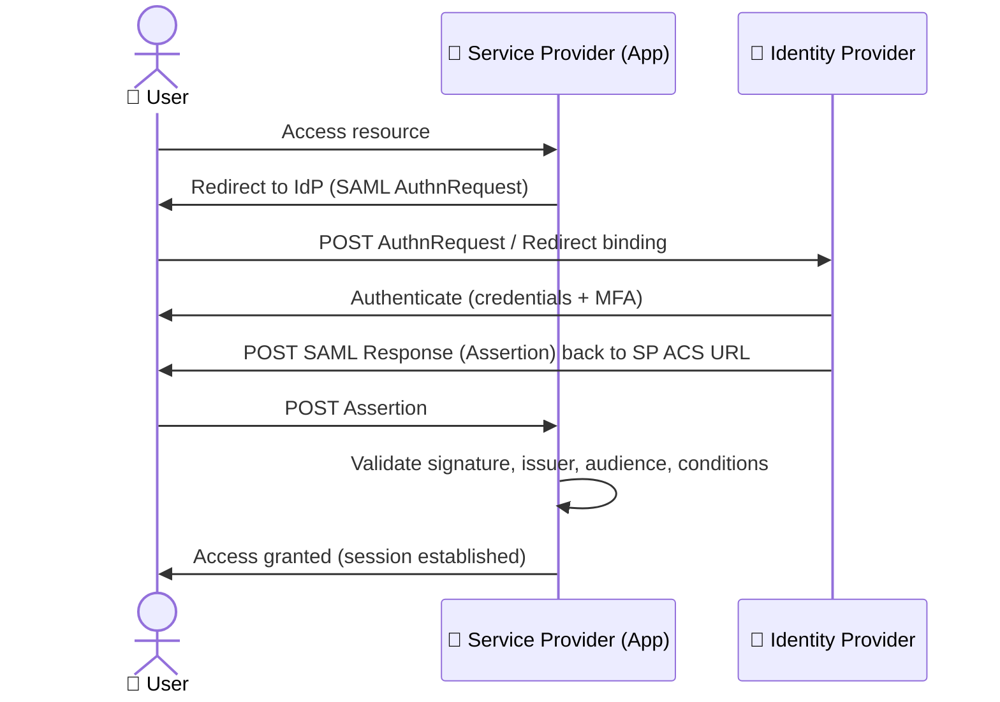

# SAML 2.0

Security Assertion Markup Language (SAML) 2.0 is an XML-based federated identity standard for exchanging authentication and authorization data between an Identity Provider (IdP) and a Service Provider (SP).

---

## SAML vs OIDC at a Glance

| Aspect | SAML 2.0 | OIDC / OAuth 2.0 |
|---|---|---|
| **Format** | XML (verbose, signed) | JSON (compact, lightweight) |
| **Transport** | Browser Redirect/POST bindings | RESTful HTTP (JSON) |
| **Primary Use** | Enterprise SSO (ADFS, Okta, Azure AD) | Consumer apps, mobile, SPAs |
| **Token type** | Assertion (SAML Response) | JWT (ID Token + Access Token) |
| **User identity** | NameID, attributes | `sub` claim, UserInfo endpoint |
| **Logout** | Single Logout (SLO) profile | RP-Initiated + Backchannel logout |
| **Metadata** | XML metadata (certs, endpoints) | JSON Discovery document |
| **Mobile support** | Poor (XML parsing, HTTP-Redirect) | Excellent (PKCE, native apps) |

---

## Architecture



---

## SAML Assertion

A SAML Assertion is the XML token that carries identity and attribute information. Three types:

| Type | Content |
|---|---|
| **Authentication Assertion** | Proof that the user authenticated (method, timestamp, session index) |
| **Attribute Assertion** | User attributes (email, groups, department, role) |
| **Authorization Decision Assertion** | Whether the user is permitted to access a resource |

### Example Assertion (simplified)

```xml
<saml:Assertion
  xmlns:saml="urn:oasis:names:tc:SAML:2.0:assertion"
  ID="_abc123"
  IssueInstant="2025-01-01T00:00:00Z"
  Version="2.0">
  
  <saml:Issuer>https://idp.example.com</saml:Issuer>
  
  <ds:Signature xmlns:ds="http://www.w3.org/2000/09/xmldsig#">
    <!-- XML Signature covering Assertion -->
  </ds:Signature>
  
  <saml:Subject>
    <saml:NameID Format="urn:oasis:names:tc:SAML:1.1:nameid-format:emailAddress">
      jane@example.com
    </saml:NameID>
    <saml:SubjectConfirmation Method="urn:oasis:names:tc:SAML:2.0:cm:bearer">
      <saml:SubjectConfirmationData
        NotOnOrAfter="2025-01-01T00:10:00Z"
        Recipient="https://sp.example.com/acs"/>
    </saml:SubjectConfirmation>
  </saml:Subject>
  
  <saml:Conditions
    NotBefore="2025-01-01T00:00:00Z"
    NotOnOrAfter="2025-01-01T00:10:00Z">
    <saml:AudienceRestriction>
      <saml:Audience>https://sp.example.com</saml:Audience>
    </saml:AudienceRestriction>
  </saml:Conditions>
  
  <saml:AuthnStatement AuthnInstant="2025-01-01T00:00:00Z"
    SessionIndex="session-123">
    <saml:AuthnContext>
      <saml:AuthnContextClassRef>
        urn:oasis:names:tc:SAML:2.0:ac:classes:PasswordProtectedTransport
      </saml:AuthnContextClassRef>
    </saml:AuthnContext>
  </saml:AuthnStatement>
  
  <saml:AttributeStatement>
    <saml:Attribute Name="email">
      <saml:AttributeValue>jane@example.com</saml:AttributeValue>
    </saml:Attribute>
    <saml:Attribute Name="role">
      <saml:AttributeValue>admin</saml:AttributeValue>
    </saml:Attribute>
  </saml:AttributeStatement>
</saml:Assertion>
```

---

## Bindings

Bindings define how SAML messages are transported over standard protocols.

| Binding | Direction | Description |
|---|---|---|
| **HTTP-Redirect** | SP → IdP | AuthnRequest sent via URL query parameters (GET). Use `SigAlg` + `Signature` params for integrity. |
| **HTTP-POST** | Both | Messages sent as base64-encoded XML in a hidden form field via POST. Most common for the Assertion response. |
| **HTTP-Artifact** | Both | Instead of sending the full message, a small reference (artifact) is sent via URL. The receiver retrieves the actual message via a direct SOAP back-channel call. |
| **SOAP** | Back-channel | Direct IdP-to-SP or SP-to-IdP communication for Single Logout and Artifact Resolution. |

---

## Metadata

SAML IdP and SP exchange XML metadata to establish trust:

```xml
<EntityDescriptor entityID="https://sp.example.com">
  <SPSSODescriptor protocolSupportEnumeration="urn:oasis:names:tc:SAML:2.0:protocol">
    <KeyDescriptor use="signing">
      <ds:KeyInfo>
        <ds:X509Certificate><!-- SP's public cert --></ds:X509Certificate>
      </ds:KeyInfo>
    </KeyDescriptor>
    <AssertionConsumerService
      Binding="urn:oasis:names:tc:SAML:2.0:bindings:HTTP-POST"
      Location="https://sp.example.com/acs"
      index="0"/>
    <SingleLogoutService
      Binding="urn:oasis:names:tc:SAML:2.0:bindings:HTTP-POST"
      Location="https://sp.example.com/slo"/>
  </SPSSODescriptor>
</EntityDescriptor>
```

Key elements:
- **`KeyDescriptor`**: Public signing and encryption certificates
- **`AssertionConsumerService` (ACS)**: Where the IdP sends the assertion
- **`SingleLogoutService`**: SLO endpoint

---

## Profiles

| Profile | Description |
|---|---|
| **Web Browser SSO** | Most common — SP redirects user to IdP for authentication |
| **IdP-Initiated SSO** | User starts at the IdP, which pushes an assertion to the SP (unsafe — deprecated in favor of SP-initiated) |
| **Single Logout (SLO)** | When a user logs out from one SP, all other SPs and the IdP terminate the session |
| **Artifact Resolution** | Used with HTTP-Artifact binding for large payloads |
| **NameID Management** | Create, modify, or terminate federated name identifiers |

---

[⬅️ Back to Security Patterns](./README.md)
