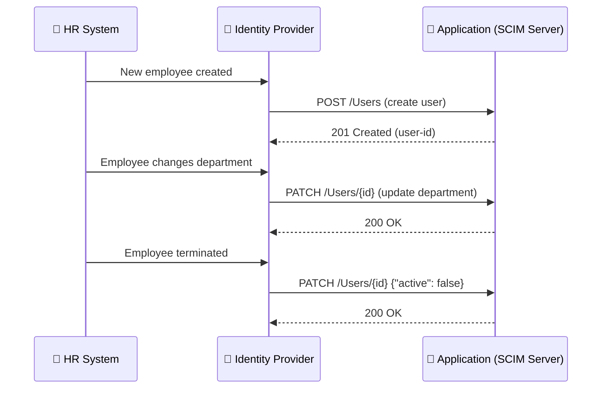

# SCIM 2.0 (System for Cross-domain Identity Management)

SCIM is a RESTful API standard for automating the exchange of user identity data between identity domains — typically between an IdP and an application or HR system. It covers the full user provisioning lifecycle.

---

## Core Resources

### User

```json
{
  "schemas": ["urn:ietf:params:scim:schemas:core:2.0:User"],
  "id": "user-123",
  "userName": "jane.doe@example.com",
  "name": {
    "formatted": "Jane Doe",
    "familyName": "Doe",
    "givenName": "Jane"
  },
  "emails": [
    { "value": "jane@example.com", "type": "work", "primary": true }
  ],
  "active": true,
  "meta": {
    "resourceType": "User",
    "created": "2025-01-01T00:00:00Z",
    "lastModified": "2025-06-15T12:00:00Z"
  }
}
```

### Group

```json
{
  "schemas": ["urn:ietf:params:scim:schemas:core:2.0:Group"],
  "id": "group-456",
  "displayName": "Engineering",
  "members": [
    { "value": "user-123", "$ref": "https://idp.example.com/scim/Users/user-123" }
  ]
}
```

### Enterprise User Extension

```json
{
  "schemas": [
    "urn:ietf:params:scim:schemas:core:2.0:User",
    "urn:ietf:params:scim:schemas:extension:enterprise:2.0:User"
  ],
  "urn:ietf:params:scim:schemas:extension:enterprise:2.0:User": {
    "employeeNumber": "E-12345",
    "department": "Engineering",
    "manager": { "value": "user-456" }
  }
}
```

---

## REST Endpoints

| Method | Endpoint | Description |
|---|---|---|
| `GET` | `/Users` | List/search users with filtering and pagination |
| `POST` | `/Users` | Create user |
| `GET` | `/Users/{id}` | Get user by ID |
| `PUT` | `/Users/{id}` | Replace user (full update) |
| `PATCH` | `/Users/{id}` | Partial update (RFC 7644) |
| `DELETE` | `/Users/{id}` | Deactivate/delete user |
| `GET` | `/Groups` | List/search groups |
| `POST` | `/Groups` | Create group |
| `GET` | `/ServiceProviderConfigs` | Get IdP's SCIM capabilities |

---

## Provisioning Lifecycle



### Create

`POST /Users` with full user payload. IdP includes all attributes (name, email, groups, enterprise extension).

### Update

`PATCH /Users/{id}` with JSON Patch operations or partial resource. Avoid `PUT` unless replacing the entire user.

```
PATCH /Users/user-123
Content-Type: application/scim+json

{
  "schemas": ["urn:ietf:params:scim:api:messages:2.0:PatchOp"],
  "Operations": [
    { "op": "replace", "value": { "active": false } }
  ]
}
```

### Deprovisioning

- Set `active: false` (preferred) — user retains data but cannot log in
- `DELETE` (alternative) — removes user record entirely
- Best practice: Support both; deactivate first, delete after a grace period

---

## Filtering and Pagination

### Filters

```
GET /Users?filter=emails.value eq "jane@example.com"
GET /Users?filter=name.familyName sw "Do"
GET /Users?filter=active eq true and department eq "Engineering"
```

Supported operators: `eq`, `ne`, `co` (contains), `sw` (starts with), `pr` (present), `gt`, `ge`, `lt`, `le`, `and`, `or`, `not`

### Pagination

```
GET /Users?count=50&startIndex=1
```

Response includes `totalResults`, `itemsPerPage`, and `startIndex` for cursor-based iteration.

---

## SCIM vs Manual Provisioning

| Aspect | SCIM 2.0 | Manual (Admin Panel) |
|---|---|---|
| **Speed** | Seconds — automated | Hours/days — human-driven |
| **Accuracy** | Consistent schema mapping | Prone to typos and omissions |
| **Audit trail** | REST logs (who, what, when) | Manual records (incomplete) |
| **Deprovisioning** | Triggered automatically from HR | Often forgotten — security risk |
| **Compliance** | SOC2, SOX audit-ready | Requires manual evidence |
| **Implementation cost** | Medium (integration dev) | Low (no dev) but high operational cost |

---

[⬅️ Back to Security Patterns](./README.md)
