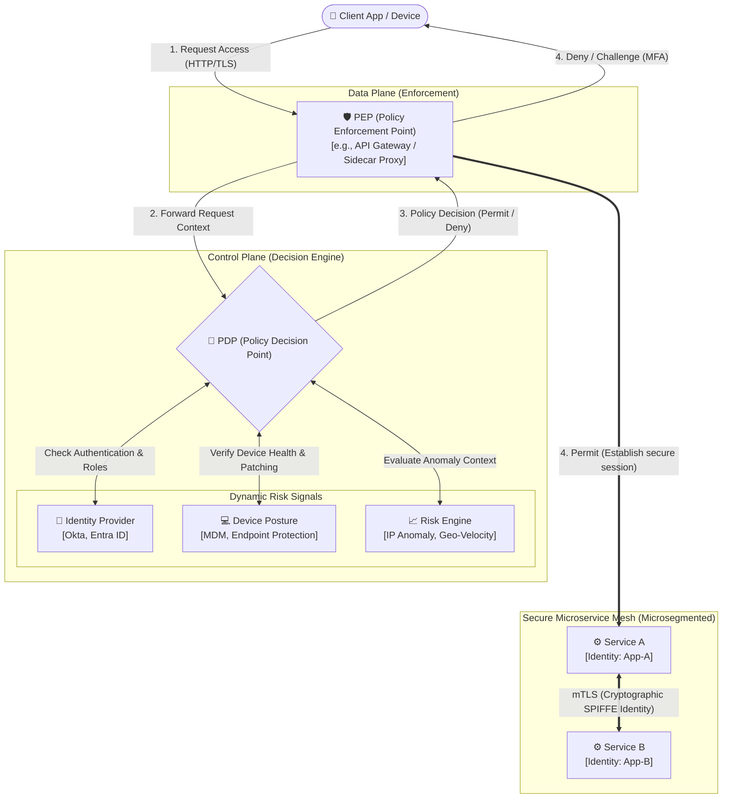

# Zero Trust Architecture

Traditional network security relies on a **"castle-and-moat"** strategy, where everything inside the internal network perimeter is trusted by default. **Zero Trust Architecture (ZTA)** eliminates this perimeter trust, operating under the baseline assumption that the network is hostile and threats exist everywhere.

---

## Core Principles

Zero Trust is defined by three fundamental guiding principles:

1. **Verify Explicitly**: Always authenticate and authorize based on all available data points, including user identity, geographic location, device health and posture, service/workload identity, and anomaly detection signals.
2. **Use Least Privilege Access**: Restrict access using **Just-In-Time (JIT)** and **Just-Enough-Access (JEA)** protocols, adaptive risk-based policies, and data protection schemes to limit data exposure and access.
3. **Assume Breach**: Minimize the blast radius by dividing the network and infrastructure into microsegments. Encrypt all sessions end-to-end, employ continuous diagnostics, and leverage real-time analytics to improve threat visibility and response.

---

## PDP vs PEP Architectural Components

A robust Zero Trust system separates the system that decides access (the control plane) from the gateway that enforces those decisions (the data plane):

- **Policy Decision Point (PDP)**: The brains of the Zero Trust system. It is a centralized service that ingests real-time signals (user credentials, MFA verification, device security health, location data, historical request patterns) and evaluates them against declarative access policies. It decides whether to grant, deny, or limit access.
- **Policy Enforcement Point (PEP)**: The gatekeeper. A decentralized layer (e.g., an API Gateway, an Identity-Aware Proxy, or a Service Mesh sidecar proxy) that intercepts, inspects, and terminates connections. The PEP calls the PDP for a policy decision and strictly enforces the outcome.

---

## mTLS & Microsegmentation

To prevent lateral movement inside a network if one service is compromised, architects utilize **Microsegmentation** combined with **Mutual TLS (mTLS)**:

- **mTLS (Mutual TLS)**: Unlike standard TLS where only the server proves its identity to the client, mTLS requires *both* the client and server to present and verify cryptographic X.509 certificates. This establishes a highly secure, encrypted channel where both sides are verified.
- **Cryptographic Workload Identity**: Services are assigned cryptographic identities (e.g., utilizing **SPIFFE/SPIRE** standard). Certificates are ephemeral and rotated automatically (e.g., every few hours) by local agents, completely eliminating the need for hardcoded, static database credentials or API keys.
  - [SPIFFE Specification](https://github.com/spiffe/spiffe)
  - [SPIRE Project (CNCF)](https://spiffe.io/spire/)
  - [SPIFFE/SPIRE Quickstart](https://spiffe.io/docs/latest/try/getting-started-k8s/)
  - [SPIFFE Standards Overview](https://spiffe.io/docs/latest/spiffe-about/)
- **Microsegmentation**: By combining mTLS with application layer policies (such as Istio Authorization Policies), you can enforce strict, granular network boundaries. For instance, you can state: *Service B can receive POST requests from Service A, but all traffic from Service C must be blocked.*

---

## Zero Trust Access Flow

---

[⬅️ Back to Security Patterns](./README.md)
