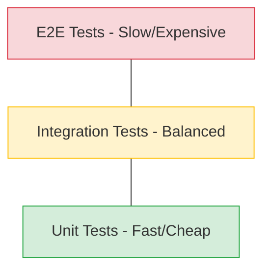

# 🧪 Testing Strategies

Software testing is an investigation conducted to provide stakeholders with information about the quality of the software product or service under test.

---

## 🗺️ Table of Contents
1. [The Testing Pyramid](#1-the-testing-pyramid)
2. [Test Driven Development (TDD)](#2-test-driven-development-tdd)
3. [Behavior Driven Development (BDD)](#3-behavior-driven-development-bdd)
4. [Types of Tests](#4-types-of-tests)
5. [Mocking and Stubbing](#5-mocking-and-stubbing)

---

## 1. The Testing Pyramid
The testing pyramid is a framework that can help both developers and QA create high-quality software. It minimizes the time required for developers to identify if a change they made broke the code.

---

## 2. Test Driven Development (TDD)
TDD is a software development process relying on software requirements being converted to test cases before software is fully developed.

### The Red-Green-Refactor Cycle
1. **Red**: Write a test for a small bit of functionality and watch it fail.
2. **Green**: Write the minimum amount of code to make the test pass.
3. **Refactor**: Clean up the code while ensuring the test still passes.

---

## 3. Behavior Driven Development (BDD)
BDD is an agile software development process that encourages collaboration among developers, QA, and non-technical or business participants in a software project. It uses a specialized domain language (Gherkin).

### Given-When-Then
- **Given**: A specific context or starting state.
- **When**: An action is performed.
- **Then**: A set of observable consequences.

---

## 4. Types of Tests

| Type | Focus | Execution Speed |
| :--- | :--- | :--- |
| **Unit** | Individual functions or classes. | ⚡ Very Fast |
| **Integration** | Communication between modules or services. | 🐢 Moderate |
| **E2E (End-to-End)** | Complete user flows in a real environment. | 🐌 Slow |
| **Sanity/Smoke** | Basic functionality after a build. | ⚡ Fast |
| **Regression** | Ensuring new changes didn't break old features. | 🐢 Moderate |
| **Load/Performance** | System behavior under heavy traffic. | 🐌 Very Slow |

---

## 5. Mocking and Stubbing
To isolate the code under test, we use "Test Doubles":

- **Stub**: Provides canned answers to calls made during the test.
- **Mock**: Objects pre-programmed with expectations which form a specification of the calls they are expected to receive.
- **Spy**: Stubs that also record some information based on how they were called.
- **Fake**: Have working implementations, but usually take some shortcut (e.g., in-memory database).
